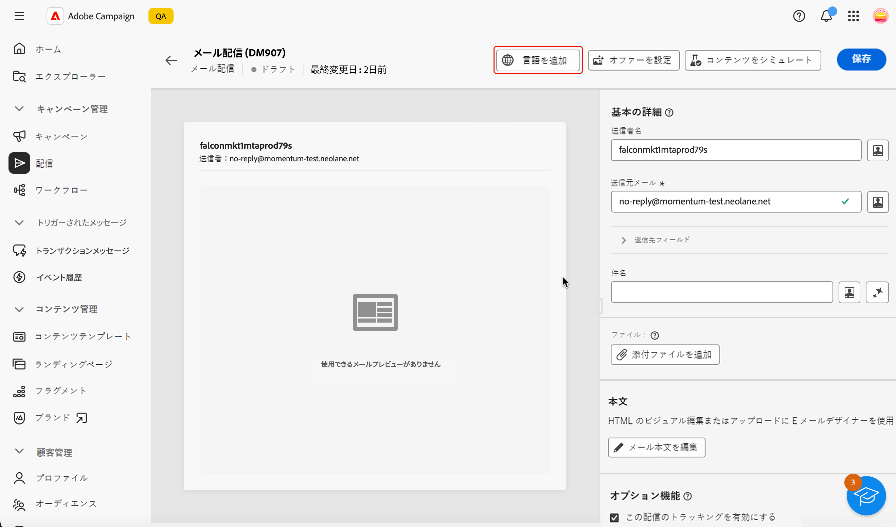
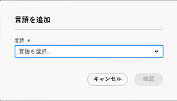
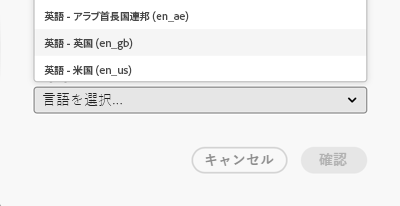
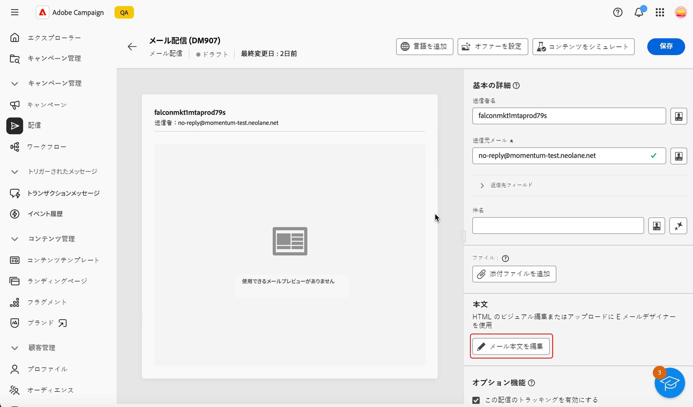
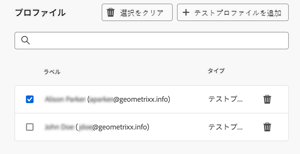
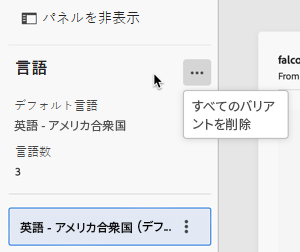

# メールコンテンツの設定 {#edit-content}

>[!CONTEXTUALHELP]
>id="acw_deliveries_email_content"
>title="メールコンテンツを定義"
>abstract="**コンテンツを編集**&#x200B;画面では、送信者アドレスや件名などのメッセージの基本要素を定義し、添付ファイルやオファーの追加などの追加アクションを実行し、E メールデザイナーにアクセスしてメッセージを洗練された外観にすることができます。"

>[!CONTEXTUALHELP]
>id="acw_deliveries_email_header"
>title="メールのプロパティを設定"
>abstract="「**基本の詳細**」セクションでは、送信者のアドレスと返信先アドレスを更新し、式エディターを使用して件名を定義できます。"

>[!CONTEXTUALHELP]
>id="acw_deliveries_email_attachment"
>title="メールにファイルを添付"
>abstract="メッセージに挿入する 1 つ以上のファイルを選択します。パフォーマンスの問題を回避するには、1 つのメールに複数の添付ファイルを含めないことをお勧めします。"

>[!CONTEXTUALHELP]
>id="acw_deliveries_email_options"
>title="トラッキングの編集"
>abstract="デフォルトでは、配信のトラッキングが有効になっています。つまり、メッセージコンテンツに含まれるすべてのリンクが追跡されます。ここからこのオプションを無効にできます。"
>additional-url="https://experienceleague.adobe.com/ja/docs/campaign-web/v8/content/email-design/design-content/message-tracking" text="リンクの追加とメッセージのトラッキング"

>[!CONTEXTUALHELP]
>id="acw_deliveries_email_multilingual"
>title="言語を追加"
>abstract="このタブには、配信を送信する言語のリストがあります。「言語を追加」ボタンをクリックするか、このタブから別の言語を複製して、さらに言語を追加できます。"

メールの&#x200B;**[!UICONTROL コンテンツを編集]**&#x200B;画面では、次の操作を実行できます。

* 送信者のアドレスや件名など、メッセージの基本要素を定義する
* 添付ファイルの追加やオファーの設定など、追加のアクションを実行する
* [E メールデザイナー](get-started-email-designer.md#start-authoring)にアクセスして、適切なメールのコンテンツの作成を開始する
* 配信に言語のバリアントを追加します。

>[!NOTE]
>
>この画面の編集可能なテキストフィールドはすべて、パーソナライゼーションフィールドを使用して入力できます。[コンテンツをパーソナライズする方法を学ぶ](../personalization/personalize.md)

## 配信の設定

メールのコンテンツを設定または編集するには、次の手順に従います。

1. [メール配信ダッシュボード](../email/create-email.md)画面で「**[!UICONTROL コンテンツを編集]**」ボタンをクリックします。

   {zoomable="yes"}

1. メールコンテンツ編集画面が開きます。

   {zoomable="yes"}

   >[!NOTE]
   >
   >新しいメールを設定している場合、「**[!UICONTROL 送信者名]**」フィールドと「**[!UICONTROL 送信元メール]**」フィールドには既に値が入力されています。

1. 「**[!UICONTROL 送信者名]**」フィールドは、メールテンプレートで定義されます。変更する場合は、ブランド名など、受信者が容易に識別できる名前を使用して、配信の開封率を高めます。

   >[!NOTE]
   >
   >受信者のエクスペリエンスの質を高めるには、「Luma（担当：田中）」のように個人名を追加する方法もあります。

1. また、「**[!UICONTROL 送信元メール]**」アドレスフィールドもメールテンプレートで定義されます。アドレスドメインがアドビにデリゲートしたサブドメインと一致していることを確認します。

   >[!NOTE]
   >
   >「@」より前の部分は変更できますが、ドメインアドレスは変更できません。

1. 「**[!UICONTROL 返信先フィールド]**」セクションを展開します。送信者の名前とアドレスは、デフォルトで返信に使用されます。カスタマーケアの代表アドレスなど、実際にある既存のアドレスを使用することをお勧めします。そうすれば、受信者から返信が来た場合に、カスタマーケアチームが対応できます。

   {zoomable="yes"}

1. メールの「**[!UICONTROL 件名]**」を定義します。件名を専用フィールドに直接入力するか、式エディターを開いて、様々な属性、式フラグメントまたはオファーを使用して[パーソナライゼーション](../personalization/personalize.md)を追加します。

1. メールにファイルを添付する場合は、「**[!UICONTROL 添付ファイルを追加]**」ボタンをクリックして、1 つまたは複数のファイルを選択します。

   >[!NOTE]
   >
   >パフォーマンスの問題を回避するには、1 つのメールに複数の添付ファイルを含めないことをお勧めします。

   <!--limitation on size + number of files?-->

1. メールでオファーを送信する場合は、「**[!UICONTROL オファーを設定]**」ボタンを使用して選択します。

   その後、パーソナライゼーションフィールドを使用してメールに挿入できます。[オファーの送信方法を学ぶ](../msg/offers.md)

## メール本文の編集

1. 「**[!UICONTROL メール本文を編集]**」ボタンをクリックし、[ メールDesigner](get-started-email-designer.md#start-authoring) を使用して、メールのコンテンツを構成およびデザインします。

   >[!NOTE]
   >
   >また、メールのプレビューにポインタを合わせて、「**[!UICONTROL E メールデザイナーを開く]**」を選択することもできます。

   メールコンテンツのデザイン方法に関する追加情報については、次の節を参照してください。

   * [新規でのメールの作成](create-email-content.md)
   * [コンテンツのスタイル設定](get-started-email-style.md)

1. デフォルトでは、配信のトラッキングが有効になっています。このオプションは、「**[!UICONTROL オプション機能]**」セクションから無効にすることができます。[リンクを追加してトラッキングを管理する方法を学ぶ](message-tracking.md)

1. メールのコンテンツを定義したら、「**[!UICONTROL コンテンツをシミュレート]**」ボタンを使用して、どのように表示されるかを送信前に確認します。[詳しくは、メールのプレビューとテストの方法を参照してください](../preview-test/preview-test.md)。

## 多言語配信の設定

Campaign web ユーザーインターフェイスでは、メール配信を多言語として設定し、プロファイルの優先言語に基づいてメッセージを送信できます。 環境設定が定義されていない場合、メッセージはデフォルト言語で送信されます。

多言語配信では、言語管理はバリアントに基づいています。 各バリアントは 1 つの言語を表します。

配信の作成時に、メッセージに必要な言語の数に対応するバリアントの数を追加できます。 新しい言語を追加する際に、デフォルト言語を定義することもできます。

### 言語バリアントの追加

言語のバリアントを作成するには、次の手順に従います。

1. メール設定画面の上部にある「**[!UICONTROL 言語を追加]**」ボタンをクリックします。

   >[!IMPORTANT]
   >
   >**[!UICONTROL 言語を追加]** ボタンは、ターゲットディメンションに言語スキーマが含まれている場合にのみ使用できます。 スキーマとターゲットディメンションについて詳しくは、[ 詳細ドキュメント ](https://experienceleague.adobe.com/ja/docs/campaign-web/v8/audiences/targeting-dimensions){target=_blank} を参照してください。

   {zoomable="yes"}

1. 追加する言語を **[!UICONTROL 言語]** ドロップダウンリストで選択します。 第 1 言語を追加するとデフォルトに設定され、現在のコンテンツがデフォルトのコンテンツになります。 新しい言語を追加する場合、コンテンツはデフォルトコンテンツに基づきます。

   >[!NOTE]
   >
   >このリストから使用できる言語は、言語属性で定義された値（system、user、dbenum などの値）によって異なります 列挙の管理について詳しくは、この [ 節 ](https://experienceleague.adobe.com/ja/docs/campaign-web/v8/conf/enumerations){target=_blank} を参照してください。

   {zoomable="yes"}

   例えば、英語（米国）の場合は次のようになります。

   {zoomable="yes"}

1. 他の言語を追加するには、この手順を繰り返します。 **[!UICONTROL 言語]** パネルには、選択した言語のリスト、異なる言語の数およびデフォルトの言語が表示されます。

   例えば、英語、フランス語、スウェーデン語を選択した場合、次の 3 つの言語が表示されます。

   {zoomable="yes"}

   右上隅の「展開」ボタンをクリックすると、すべての言語を削除できます。

### 各バリアントのメールコンテンツを定義します

言語を設定したら、この優先言語でプロファイルに送信されるメールのコンテンツを定義します。

メールコンテンツを定義するには、次の手順に従います。

1. [ メール本文を編集 ](get-started-email-designer.md#start-authoring) ボタンをクリックして **[!UICONTROL メールDesigner]** を開きます。

   >[!NOTE]
   >
   >また、メールのプレビューにポインタを合わせて、「**[!UICONTROL E メールデザイナーを開く]**」を選択することもできます。

   {zoomable="yes"}

1. 「**[!UICONTROL コンテンツをシミュレート]**」ボタンをクリックして配信をプレビューし、メールが表示されるプロファイルと言語を選択できます。

1. コンテンツをシミュレート ウィンドウで、プロファイルを切り替えて、そのプロファイル用に設定した言語に対応するメールのコンテンツをプレビューできます。

   {zoomable="yes"}

### 言語のバリアントを複製または削除

右上隅の「展開」ボタンをクリックし、「**[!UICONTROL すべてのバリアントを削除]**」ボタンをクリックして、すべての言語を削除できます。

{zoomable="yes"}

言語バリアントを削除するには、タブの右側の 3 つのドットをクリックし、「削除」を選択します。

言語バリアントを複製するには、タブの右側の 3 つのドットをクリックし、「複製」を選択します。 デフォルトの言語以外の言語を複製する場合、複製されるコンテンツは、複製を選択した言語に基づきます。

1. メールのコンテンツを定義したら、「**[!UICONTROL コンテンツをシミュレート]**」ボタンを使用して、どのように表示されるかを送信前に確認します。[詳しくは、メールのプレビューとテストの方法を参照してください](../preview-test/preview-test.md)。