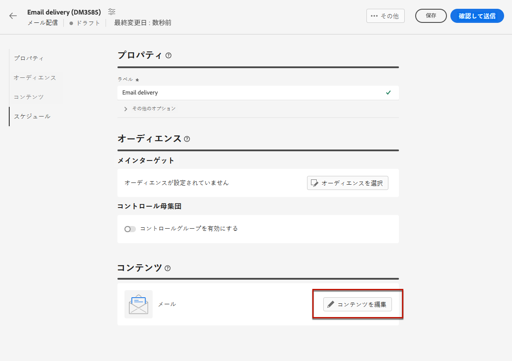
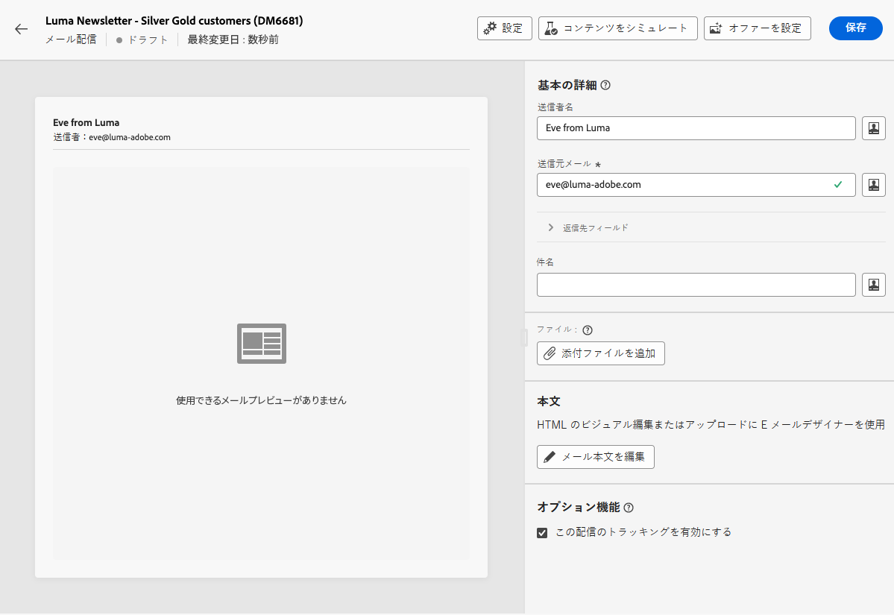
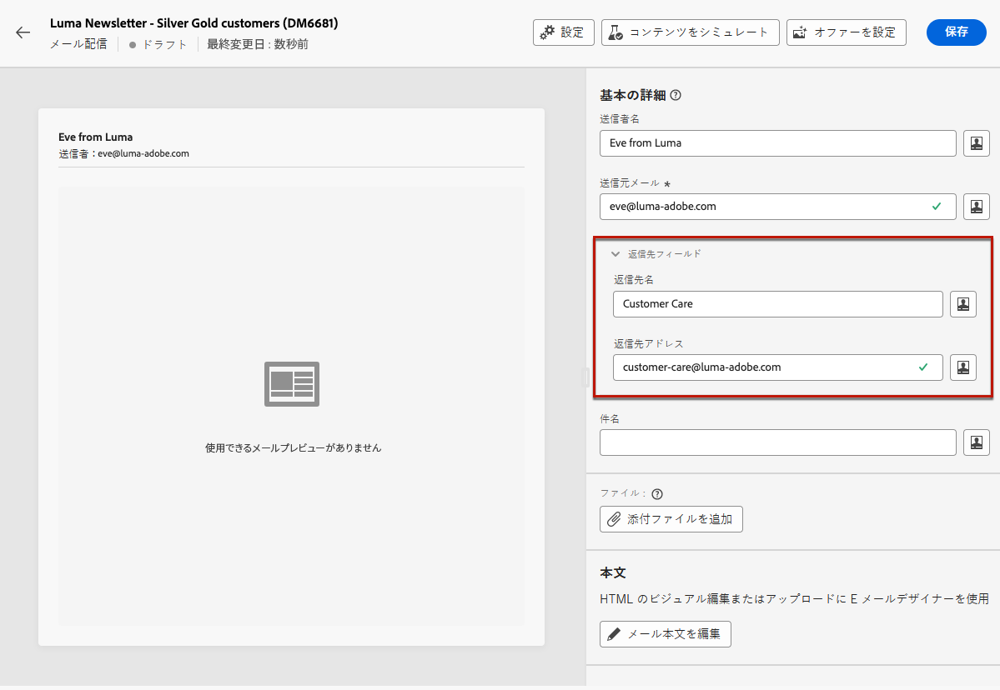

<?xml version="1.0" encoding="UTF-8"?>
<xliff xmlns="urn:oasis:names:tc:xliff:document:1.2" xmlns:okp="okapi-framework:xliff-extensions" xmlns:its="http://www.w3.org/2005/11/its" xmlns:itsxlf="http://www.w3.org/ns/its-xliff/" version="1.2" its:version="2.0">
<file original="help/v8/email/edit-content.md.mdsc" source-language="en-US" target-language="en-XX" datatype="x-text/markdown">
<body>
<trans-unit id="tu1" restype="x-YAML_METADATA_HEADER_VALUE" xml:space="preserve">
<source xml:lang="en-US">Edit the email content</source>
<target xml:lang="en-XX">メールコンテンツを編集する</target>
</trans-unit>
<trans-unit id="tu2" restype="x-YAML_METADATA_HEADER_VALUE" xml:space="preserve">
<source xml:lang="en-US">Learn how to edit the email content in Campaign Web user interface</source>
<target xml:lang="en-XX">Campaign Web ユーザーインターフェイスでメールコンテンツを編集する方法を学ぶ</target>
</trans-unit>
<trans-unit id="tu3" xml:space="preserve">
<source xml:lang="en-US">Configure the email content</source>
<target xml:lang="en-XX">メールコンテンツの設定</target>
</trans-unit>
<trans-unit id="tu4" xml:space="preserve">
<source xml:lang="en-US">Define the email content</source>
<target xml:lang="en-XX">メールコンテンツの定義</target>
</trans-unit>
<trans-unit id="tu5" xml:space="preserve">
<source xml:lang="en-US">The <ph id="1" ctype="x-STRONG_EMPHASIS">**</ph>Edit content<ph id="2" ctype="x-STRONG_EMPHASIS">**</ph> screen allows you to define basic elements of your message, such as the sender address and subject line, perform additional actions like adding attachments or offers, and access the Email Designer to give your message a polished look.</source>
<target xml:lang="en-XX"><ph id="1" ctype="x-STRONG_EMPHASIS">**</ph>コンテンツを編集<ph id="2" ctype="x-STRONG_EMPHASIS">**</ph>画面では、送信者アドレスや件名などのメッセージの基本要素を定義し、添付ファイルやオファーの追加などの追加アクションを実行し、E メールデザイナーにアクセスしてメッセージを洗練された外観にすることができます。</target>
</trans-unit>
<trans-unit id="tu6" xml:space="preserve">
<source xml:lang="en-US">Set the email properties</source>
<target xml:lang="en-XX">メールのプロパティを設定</target>
</trans-unit>
<trans-unit id="tu7" xml:space="preserve">
<source xml:lang="en-US">The <ph id="1" ctype="x-STRONG_EMPHASIS">**</ph>Basic details<ph id="2" ctype="x-STRONG_EMPHASIS">**</ph> section allows you to update the sender's address and reply-to address, and define the subject line using the Expression Editor.</source>
<target xml:lang="en-XX">「<ph id="1" ctype="x-STRONG_EMPHASIS">**</ph>基本の詳細<ph id="2" ctype="x-STRONG_EMPHASIS">**</ph>」セクションでは、送信者のアドレスと返信先アドレスを更新し、式エディターを使用して件名を定義できます。</target>
</trans-unit>
<trans-unit id="tu8" xml:space="preserve">
<source xml:lang="en-US">Attach files to your email</source>
<target xml:lang="en-XX">メールにファイルを添付</target>
</trans-unit>
<trans-unit id="tu9" xml:space="preserve">
<source xml:lang="en-US">Select one or multiple files to insert into your message. To avoid performance issues, it is recommended not to include more than one attachment per email.</source>
<target xml:lang="en-XX">メッセージに挿入する 1 つ以上のファイルを選択します。 パフォーマンスの問題を回避するには、1 つのメールに複数の添付ファイルを含めないことをお勧めします。</target>
</trans-unit>
<trans-unit id="tu10" xml:space="preserve">
<source xml:lang="en-US">Edit tracking</source>
<target xml:lang="en-XX">トラッキングの編集</target>
</trans-unit>
<trans-unit id="tu11" xml:space="preserve">
<source xml:lang="en-US">By default, tracking is enabled for the delivery, meaning all links included in the message content are tracked. You can disable this option from here.</source>
<target xml:lang="en-XX">デフォルトでは、配信のトラッキングが有効になっています。つまり、メッセージコンテンツに含まれるすべてのリンクが追跡されます。 ここからこのオプションを無効にできます。</target>
</trans-unit>
<trans-unit id="tu12" xml:space="preserve">
<source xml:lang="en-US">https://experienceleague.adobe.com/ja/docs/campaign-web/v8/content/email-design/design-content/message-tracking</source>
<target xml:lang="en-XX">https://experienceleague.adobe.com/ja/docs/campaign-web/v8/content/email-design/design-content/message-tracking</target>
</trans-unit>
<trans-unit id="tu13" xml:space="preserve">
<source xml:lang="en-US">Add links and track messages</source>
<target xml:lang="en-XX">リンクの追加とメッセージのトラッキング</target>
</trans-unit>
<trans-unit id="tu14" xml:space="preserve">
<source xml:lang="en-US">The email <ph id="1" ctype="x-STRONG_EMPHASIS">**[!UICONTROL </ph>Edit content<ph id="3" ctype="x-LINK_REF">]**</ph> screen allows you to:</source>
<target xml:lang="en-XX">メールの<ph id="1" ctype="x-STRONG_EMPHASIS">**[!UICONTROL </ph>コンテンツを編集<ph id="3" ctype="x-LINK_REF">]**</ph>画面では、次の操作を実行できます。</target>
</trans-unit>
<trans-unit id="tu15" xml:space="preserve">
<source xml:lang="en-US">Define basic elements of your message such as the sender's address and the subject line</source>
<target xml:lang="en-XX">送信者のアドレスや件名など、メッセージの基本要素を定義する</target>
</trans-unit>
<trans-unit id="tu16" xml:space="preserve">
<source xml:lang="en-US">Perform additional actions such as adding attachments or setting up offers</source>
<target xml:lang="en-XX">添付ファイルの追加やオファーの設定など、追加のアクションを実行する</target>
</trans-unit>
<trans-unit id="tu17" xml:space="preserve">
<source xml:lang="en-US">Access the <ph id="1" ctype="x-LINK">[</ph>Email Designer<ph id="2" ctype="x-LINK">](get-started-email-designer.md#start-authoring)</ph> to start building the proper content of your email</source>
<target xml:lang="en-XX"><ph id="1" ctype="x-LINK">[</ph>E メールデザイナー<ph id="2" ctype="x-LINK">](get-started-email-designer.md#start-authoring)</ph>にアクセスして、適切なメールのコンテンツの作成を開始する</target>
</trans-unit>
<trans-unit id="tu18" xml:space="preserve">
<source xml:lang="en-US">Add language variants to your deliveries. <ph id="1" ctype="x-LINK">[</ph>Read more<ph id="2" ctype="x-LINK">](../msg/multilingual.md)</ph></source>
<target xml:lang="en-XX">配信に言語バリアントを追加します。 <ph id="1" ctype="x-LINK">[</ph>詳細情報<ph id="2" ctype="x-LINK">](../msg/multilingual.md)</ph></target>
</trans-unit>
<trans-unit id="tu19" xml:space="preserve">
<source xml:lang="en-US"><ph id="1" ctype="x-regxph" equiv-text="&lbrack;!NOTE">[!NOTE]</ph></source>
<target xml:lang="en-XX"><ph id="1" ctype="x-regxph" equiv-text="&lbrack;!NOTE">[!NOTE]</ph></target>
</trans-unit>
<trans-unit id="tu20" xml:space="preserve">
<source xml:lang="en-US">All the editable text fields of this screen can be filled in using personalization fields. <ph id="1" ctype="x-LINK">[</ph>Learn how to personalize content<ph id="2" ctype="x-LINK">](../personalization/personalize.md)</ph></source>
<target xml:lang="en-XX">この画面の編集可能なテキストフィールドはすべて、パーソナライゼーションフィールドを使用して入力できます。 <ph id="1" ctype="x-LINK">[</ph>コンテンツをパーソナライズする方法を学ぶ<ph id="2" ctype="x-LINK">](../personalization/personalize.md)</ph></target>
</trans-unit>
<trans-unit id="tu21" xml:space="preserve">
<source xml:lang="en-US">Configure the delivery</source>
<target xml:lang="en-XX">配信の設定</target>
</trans-unit>
<trans-unit id="tu22" xml:space="preserve">
<source xml:lang="en-US">To configure or edit the content of an email, follow the steps below.</source>
<target xml:lang="en-XX">メールのコンテンツを設定または編集するには、次の手順に従います。</target>
</trans-unit>
<trans-unit id="tu23" xml:space="preserve">
<source xml:lang="en-US">Click the <ph id="1" ctype="x-STRONG_EMPHASIS">**[!UICONTROL </ph>Edit content<ph id="3" ctype="x-LINK_REF">]**</ph> button from the <ph id="5" ctype="x-LINK">[</ph>email delivery dashboard<ph id="6" ctype="x-LINK">](../email/create-email.md)</ph> screen.</source>
<target xml:lang="en-XX"><ph id="5" ctype="x-LINK">[</ph>メール配信ダッシュボード<ph id="6" ctype="x-LINK">](../email/create-email.md)</ph>画面で「<ph id="1" ctype="x-STRONG_EMPHASIS">**[!UICONTROL </ph>コンテンツを編集<ph id="3" ctype="x-LINK_REF">]**</ph>」ボタンをクリックします。</target>
</trans-unit>
<trans-unit id="tu24" xml:space="preserve">
<source xml:lang="en-US"><ph id="1" ctype="x-IMAGE">{zoomable="yes"}</ph></source>
<target xml:lang="en-XX"><ph id="1" ctype="x-IMAGE">{zoomable="yes"}</ph></target>
</trans-unit>
<trans-unit id="tu25" xml:space="preserve">
<source xml:lang="en-US">The email content edition screen opens.</source>
<target xml:lang="en-XX">メールコンテンツ編集画面が開きます。</target>
</trans-unit>
<trans-unit id="tu26" xml:space="preserve">
<source xml:lang="en-US"><ph id="1" ctype="x-IMAGE">{zoomable="yes"}</ph></source>
<target xml:lang="en-XX"><ph id="1" ctype="x-IMAGE">{zoomable="yes"}</ph></target>
</trans-unit>
<trans-unit id="tu27" xml:space="preserve">
<source xml:lang="en-US"><ph id="1" ctype="x-regxph" equiv-text="&lbrack;!NOTE">[!NOTE]</ph></source>
<target xml:lang="en-XX"><ph id="1" ctype="x-regxph" equiv-text="&lbrack;!NOTE">[!NOTE]</ph></target>
</trans-unit>
<trans-unit id="tu28" xml:space="preserve">
<source xml:lang="en-US">If you are configuring a new email, the <ph id="1" ctype="x-STRONG_EMPHASIS">**[!UICONTROL </ph>From name<ph id="3" ctype="x-LINK_REF">]**</ph> and <ph id="5" ctype="x-STRONG_EMPHASIS">**[!UICONTROL </ph>From email<ph id="7" ctype="x-LINK_REF">]**</ph> fields are already populated.</source>
<target xml:lang="en-XX">新しいメールを設定している場合、「<ph id="1" ctype="x-STRONG_EMPHASIS">**[!UICONTROL </ph>送信者名<ph id="3" ctype="x-LINK_REF">]**</ph>」フィールドと「<ph id="5" ctype="x-STRONG_EMPHASIS">**[!UICONTROL </ph>送信元メール<ph id="7" ctype="x-LINK_REF">]**</ph>」フィールドには既に値が入力されています。</target>
</trans-unit>
<trans-unit id="tu29" xml:space="preserve">
<source xml:lang="en-US">The <ph id="1" ctype="x-STRONG_EMPHASIS">**[!UICONTROL </ph>From name<ph id="3" ctype="x-LINK_REF">]**</ph> field is defined in the email template. If you want to modify it, use a name that is easily identifiable by the recipients, such as your brand's name, to increase the opening rate of your deliveries.</source>
<target xml:lang="en-XX">「<ph id="1" ctype="x-STRONG_EMPHASIS">**[!UICONTROL </ph>送信者名<ph id="3" ctype="x-LINK_REF">]**</ph>」フィールドは、メールテンプレートで定義されます。 変更する場合は、ブランド名など、受信者が容易に識別できる名前を使用して、配信の開封率を高めます。</target>
</trans-unit>
<trans-unit id="tu30" xml:space="preserve">
<source xml:lang="en-US"><ph id="1" ctype="x-regxph" equiv-text="&lbrack;!NOTE">[!NOTE]</ph></source>
<target xml:lang="en-XX"><ph id="1" ctype="x-regxph" equiv-text="&lbrack;!NOTE">[!NOTE]</ph></target>
</trans-unit>
<trans-unit id="tu31" xml:space="preserve">
<source xml:lang="en-US">To further improve the recipient's experience, you can add a person's name, for example, "Eve from Luma".</source>
<target xml:lang="en-XX">受信者のエクスペリエンスの質を高めるには、「Luma（担当：田中）」のように個人名を追加する方法もあります。</target>
</trans-unit>
<trans-unit id="tu32" xml:space="preserve">
<source xml:lang="en-US">The <ph id="1" ctype="x-STRONG_EMPHASIS">**[!UICONTROL </ph>From email<ph id="3" ctype="x-LINK_REF">]**</ph> address field is also defined in the email template. Make sure the address domain matches the subdomain that you delegated to Adobe.</source>
<target xml:lang="en-XX">また、「<ph id="1" ctype="x-STRONG_EMPHASIS">**[!UICONTROL </ph>送信元メール<ph id="3" ctype="x-LINK_REF">]**</ph>」アドレスフィールドもメールテンプレートで定義されます。 アドレスドメインがアドビにデリゲートしたサブドメインと一致していることを確認します。</target>
</trans-unit>
<trans-unit id="tu33" xml:space="preserve">
<source xml:lang="en-US"><ph id="1" ctype="x-regxph" equiv-text="&lbrack;!NOTE">[!NOTE]</ph></source>
<target xml:lang="en-XX"><ph id="1" ctype="x-regxph" equiv-text="&lbrack;!NOTE">[!NOTE]</ph></target>
</trans-unit>
<trans-unit id="tu34" xml:space="preserve">
<source xml:lang="en-US">You can change the part preceding the '@', but not the domain address.</source>
<target xml:lang="en-XX">「@」より前の部分は変更できますが、ドメインアドレスは変更できません。</target>
</trans-unit>
<trans-unit id="tu35" xml:space="preserve">
<source xml:lang="en-US"><ph id="1" ctype="x-regxph" equiv-text="&lbrack;!NOTE">[!NOTE]</ph></source>
<target xml:lang="en-XX"><ph id="1" ctype="x-regxph" equiv-text="&lbrack;!NOTE">[!NOTE]</ph></target>
</trans-unit>
<trans-unit id="tu36" xml:space="preserve">
<source xml:lang="en-US">Administrators can restrict this field to a predefined list of sender addresses. In this case, you select an address from a dropdown list instead of typing it. <ph id="1" ctype="x-LINK">[</ph>Learn more<ph id="2" ctype="x-LINK">](../administration/options.md#restrict-sender-address)</ph></source>
<target xml:lang="en-XX">管理者は、このフィールドを送信者アドレスの定義済みリストに制限できます。 この場合は、アドレスを入力する代わりに、ドロップダウンリストから選択します。 <ph id="1" ctype="x-LINK">[</ph>詳細情報<ph id="2" ctype="x-LINK">](../administration/options.md#restrict-sender-address)</ph></target>
</trans-unit>
<trans-unit id="tu37" xml:space="preserve">
<source xml:lang="en-US">Expand the <ph id="1" ctype="x-STRONG_EMPHASIS">**[!UICONTROL </ph>Reply-to fields<ph id="3" ctype="x-LINK_REF">]**</ph> section. The sender's name and addresses are used by default for replies. However, Adobe recommends using an existing real address, such as your brand's customer care. In this case, if a recipient sends a reply, the customer care team will be able to handle it.</source>
<target xml:lang="en-XX">「<ph id="1" ctype="x-STRONG_EMPHASIS">**[!UICONTROL </ph>返信先フィールド<ph id="3" ctype="x-LINK_REF">]**</ph>」セクションを展開します。 送信者の名前とアドレスは、デフォルトで返信に使用されます。 カスタマーケアの代表アドレスなど、実際にある既存のアドレスを使用することをお勧めします。 そうすれば、受信者から返信が来た場合に、カスタマーケアチームが対応できます。</target>
</trans-unit>
<trans-unit id="tu38" xml:space="preserve">
<source xml:lang="en-US"><ph id="1" ctype="x-IMAGE">{zoomable="yes"}</ph></source>
<target xml:lang="en-XX"><ph id="1" ctype="x-IMAGE">{zoomable="yes"}</ph></target>
</trans-unit>
<trans-unit id="tu39" xml:space="preserve">
<source xml:lang="en-US">Define the email <ph id="1" ctype="x-STRONG_EMPHASIS">**[!UICONTROL </ph>Subject line<ph id="3" ctype="x-LINK_REF">]**</ph>. Type your subject directly into the dedicated field, or open the Expression Editor to add <ph id="5" ctype="x-LINK">[</ph>personalization<ph id="6" ctype="x-LINK">](../personalization/personalize.md)</ph> using various attributes, expression fragments, or offers.</source>
<target xml:lang="en-XX">メールの「<ph id="1" ctype="x-STRONG_EMPHASIS">**[!UICONTROL </ph>件名<ph id="3" ctype="x-LINK_REF">]**</ph>」を定義します。 件名を専用フィールドに直接入力するか、式エディターを開いて、様々な属性、式フラグメントまたはオファーを使用して<ph id="5" ctype="x-LINK">[</ph>パーソナライゼーション<ph id="6" ctype="x-LINK">](../personalization/personalize.md)</ph>を追加します。</target>
</trans-unit>
<trans-unit id="tu40" xml:space="preserve">
<source xml:lang="en-US">If you want to attach a file to the email, click the <ph id="1" ctype="x-STRONG_EMPHASIS">**[!UICONTROL </ph>Add attachment<ph id="3" ctype="x-LINK_REF">]**</ph> button, then select one or multiple files.</source>
<target xml:lang="en-XX">メールにファイルを添付する場合は、「<ph id="1" ctype="x-STRONG_EMPHASIS">**[!UICONTROL </ph>添付ファイルを追加<ph id="3" ctype="x-LINK_REF">]**</ph>」ボタンをクリックして、1 つまたは複数のファイルを選択します。</target>
</trans-unit>
<trans-unit id="tu41" xml:space="preserve">
<source xml:lang="en-US"><ph id="1" ctype="x-regxph" equiv-text="&lbrack;!NOTE">[!NOTE]</ph></source>
<target xml:lang="en-XX"><ph id="1" ctype="x-regxph" equiv-text="&lbrack;!NOTE">[!NOTE]</ph></target>
</trans-unit>
<trans-unit id="tu42" xml:space="preserve">
<source xml:lang="en-US">To avoid performance issues, it is recommended not to include more than one attachment per email.</source>
<target xml:lang="en-XX">パフォーマンスの問題を回避するには、1 つのメールに複数の添付ファイルを含めないことをお勧めします。</target>
</trans-unit>
<trans-unit id="tu43" xml:space="preserve">
<source xml:lang="en-US">If you want to send offers with your email, select them using the <ph id="1" ctype="x-STRONG_EMPHASIS">**[!UICONTROL </ph>Set up offers<ph id="3" ctype="x-LINK_REF">]**</ph> button.</source>
<target xml:lang="en-XX">メールでオファーを送信する場合は、「<ph id="1" ctype="x-STRONG_EMPHASIS">**[!UICONTROL </ph>オファーを設定<ph id="3" ctype="x-LINK_REF">]**</ph>」ボタンを使用して選択します。</target>
</trans-unit>
<trans-unit id="tu44" xml:space="preserve">
<source xml:lang="en-US">You can then insert them into the email using personalization fields. <ph id="1" ctype="x-LINK">[</ph>Learn how to send offers<ph id="2" ctype="x-LINK">](../msg/offers.md)</ph></source>
<target xml:lang="en-XX">その後、パーソナライゼーションフィールドを使用してメールに挿入できます。 <ph id="1" ctype="x-LINK">[</ph>オファーの送信方法を学ぶ<ph id="2" ctype="x-LINK">](../msg/offers.md)</ph></target>
</trans-unit>
<trans-unit id="tu45" xml:space="preserve">
<source xml:lang="en-US">Edit the email body</source>
<target xml:lang="en-XX">メール本文の編集</target>
</trans-unit>
<trans-unit id="tu46" xml:space="preserve">
<source xml:lang="en-US">Click the <ph id="1" ctype="x-STRONG_EMPHASIS">**[!UICONTROL </ph>Edit email body<ph id="3" ctype="x-LINK_REF">]**</ph> button to structure and design the content of the email using the <ph id="5" ctype="x-LINK">[</ph>Email Designer<ph id="6" ctype="x-LINK">](get-started-email-designer.md#start-authoring)</ph>.</source>
<target xml:lang="en-XX">「<ph id="1" ctype="x-STRONG_EMPHASIS">**[!UICONTROL </ph>メール本文を編集<ph id="3" ctype="x-LINK_REF">]**</ph>」ボタンをクリックし、<ph id="5" ctype="x-LINK">[</ph>E メールデザイナー<ph id="6" ctype="x-LINK">](get-started-email-designer.md#start-authoring)</ph> を使用して、メールのコンテンツを構成およびデザインします。</target>
</trans-unit>
<trans-unit id="tu47" xml:space="preserve">
<source xml:lang="en-US"><ph id="1" ctype="x-regxph" equiv-text="&lbrack;!NOTE">[!NOTE]</ph></source>
<target xml:lang="en-XX"><ph id="1" ctype="x-regxph" equiv-text="&lbrack;!NOTE">[!NOTE]</ph></target>
</trans-unit>
<trans-unit id="tu48" xml:space="preserve">
<source xml:lang="en-US">You can also hover over the email preview and select <ph id="1" ctype="x-STRONG_EMPHASIS">**[!UICONTROL </ph>Open email designer<ph id="3" ctype="x-LINK_REF">]**</ph>.</source>
<target xml:lang="en-XX">また、メールのプレビューにポインタを合わせて、「<ph id="1" ctype="x-STRONG_EMPHASIS">**[!UICONTROL </ph>E メールデザイナーを開く<ph id="3" ctype="x-LINK_REF">]**</ph>」を選択することもできます。</target>
</trans-unit>
<trans-unit id="tu49" xml:space="preserve">
<source xml:lang="en-US">Additional information on how to design email content are available in these sections:</source>
<target xml:lang="en-XX">メールコンテンツのデザイン方法に関する追加情報については、次の節を参照してください。</target>
</trans-unit>
<trans-unit id="tu50" xml:space="preserve">
<source xml:lang="en-US">Author emails from scratch</source>
<target xml:lang="en-XX">新規でのメールの作成</target>
</trans-unit>
<trans-unit id="tu51" xml:space="preserve">
<source xml:lang="en-US">Style your content</source>
<target xml:lang="en-XX">コンテンツのスタイル設定</target>
</trans-unit>
<trans-unit id="tu52" xml:space="preserve">
<source xml:lang="en-US">By default, tracking is enabled for the delivery. You can disable it, or configure open tracking, from the delivery's <ph id="1" ctype="x-STRONG_EMPHASIS">**[!UICONTROL </ph>Settings<ph id="3" ctype="x-LINK_REF">]**</ph> > <ph id="5" ctype="x-STRONG_EMPHASIS">**[!UICONTROL </ph>Tracking<ph id="7" ctype="x-LINK_REF">]**</ph> tab. <ph id="9" ctype="x-LINK">[</ph>Learn more<ph id="10" ctype="x-LINK">](../advanced-settings/delivery-settings.md#tracking-tab)</ph>. <ph id="11" ctype="x-LINK">[</ph>Learn how to add links and manage tracking<ph id="12" ctype="x-LINK">](message-tracking.md)</ph></source>
<target xml:lang="en-XX">デフォルトでは、配信のトラッキングが有効になっています。 配信の<ph id="1" ctype="x-STRONG_EMPHASIS">**[!UICONTROL </ph>設定<ph id="3" ctype="x-LINK_REF">]**</ph>／<ph id="5" ctype="x-STRONG_EMPHASIS">**[!UICONTROL </ph>トラッキング<ph id="7" ctype="x-LINK_REF">]**</ph>タブから、無効にするか、オープントラッキングを設定できます。<ph id="9" ctype="x-LINK">[</ph>詳細情報<ph id="10" ctype="x-LINK">](../advanced-settings/delivery-settings.md#tracking-tab)</ph>。<ph id="11" ctype="x-LINK">[</ph>リンクを追加してトラッキングを管理する方法を学ぶ<ph id="12" ctype="x-LINK">](message-tracking.md)</ph></target>
</trans-unit>
<trans-unit id="tu53" xml:space="preserve">
<source xml:lang="en-US">Once the content of your email has been defined, use the <ph id="1" ctype="x-STRONG_EMPHASIS">**[!UICONTROL </ph>Simulate content<ph id="3" ctype="x-LINK_REF">]**</ph> button to check how it displays before sending it. You can also validate your content quality to assess readability, CTA effectiveness, and overall quality. <ph id="5" ctype="x-LINK">[</ph>Learn more about content quality validation<ph id="6" ctype="x-LINK">](../content/brands-score.md#validate-quality)</ph></source>
<target xml:lang="en-XX">メールのコンテンツを定義したら、「<ph id="1" ctype="x-STRONG_EMPHASIS">**[!UICONTROL </ph>コンテンツをシミュレート<ph id="3" ctype="x-LINK_REF">]**</ph>」ボタンを使用して、どのように表示されるかを送信前に確認します。 また、コンテンツの読みやすさ、CTA 効果、および全体的な品質を評価するために、コンテンツの品質を検証することもできます。 <ph id="5" ctype="x-LINK">[</ph>詳しくは、コンテンツの品質の検証を参照してください<ph id="6" ctype="x-LINK">](../content/brands-score.md#validate-quality)</ph></target>
</trans-unit>
<trans-unit id="tu54" xml:space="preserve">
<source xml:lang="en-US"><ph id="1" ctype="x-LINK">[</ph>Learn how to preview and test your email<ph id="2" ctype="x-LINK">](../preview-test/preview-test.md)</ph>.</source>
<target xml:lang="en-XX"><ph id="1" ctype="x-LINK">[</ph>詳しくは、メールのプレビューとテストの方法を参照してください<ph id="2" ctype="x-LINK">](../preview-test/preview-test.md)</ph>。</target>
</trans-unit>
</body>
</file>
</xliff>