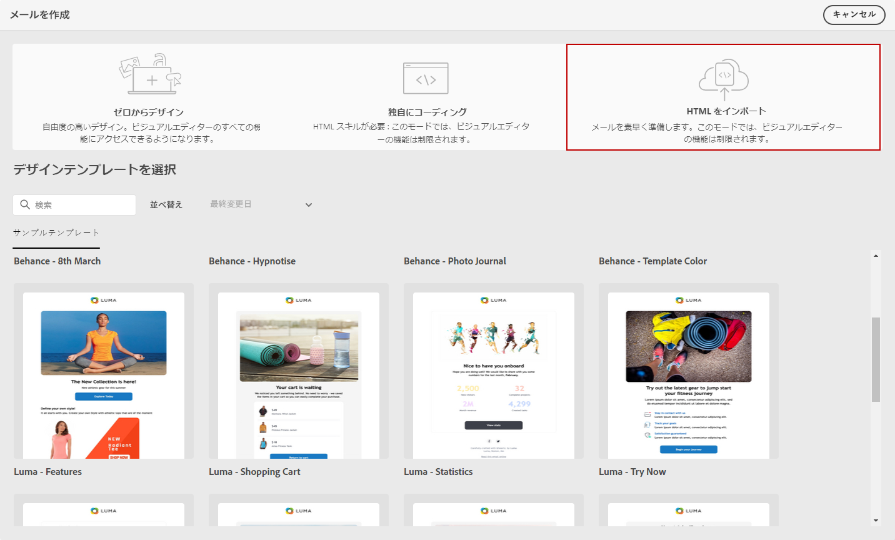
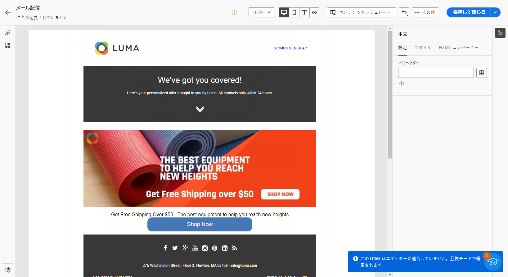
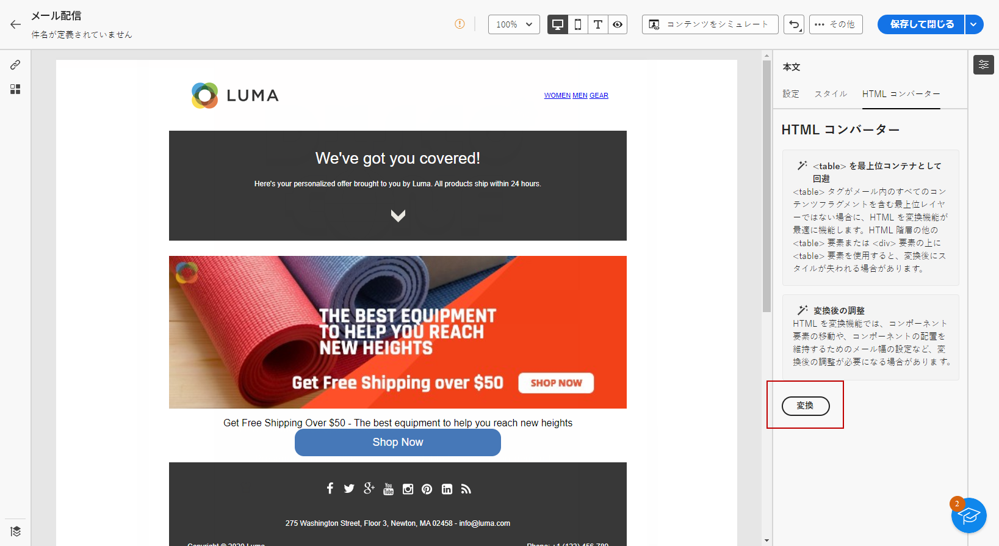

# メールコンテンツの読み込み {#existing-content}

>[!CONTEXTUALHELP]
>id="acw_deliveries_email_import_content"
>title="既存のメールコンテンツの使用"
>abstract="E メールデザイナーを使用すると、既存の HTML コンテンツをインポートできます。このコンテンツは、スタイルシートが組み込まれた HTML ファイルや、HTML ファイル、スタイルシート（.css）および画像を含んだ .zip フォルダーにすることができます。"

メールデザイナーで既存の HTML コンテンツを読み込むことができます。このコンテンツには次のようなものがあります。

* スタイルシートが組み込まれた **HTML ファイル**
* HTML ファイル、スタイルシート（.css）および画像を含んだ **.zip フォルダー**

  >[!NOTE]
  >
  >.zip ファイル構造に制約はありません。 ただし、.zip フォルダーのツリー構造内に合わせて、相対参照を指定する必要があります。

HTML コンテンツを含んだファイルを読み込むには、次の手順に従います。

1. [E メールデザイナー](get-started-email-designer.md)のホームページで、「**[!UICONTROL HTML をインポート]**」を選択します。

   {zoomable=&quot;yes&quot;}

1. HTML コンテンツを含む HTML または .zip ファイルをドラッグ＆ドロップし、「**[!UICONTROL 読み込み]**」をクリックします。

1. HTML コンテンツがアップロードされると、コンテンツは&#x200B;**[!UICONTROL 互換性モード]**&#x200B;になります。

   このモードでは、テキストのパーソナライズ、リンクの追加、コンテンツへのアセットの組み込みのみが可能です。

   {zoomable=&quot;yes&quot;}

1. メールデザイナーのコンテンツコンポーネントを活用するには、「**[!UICONTROL HTML コンバーター]**」タブに移動し、「**[!UICONTROL 変換]**」をクリックします。

   {zoomable=&quot;yes&quot;}

   >[!NOTE]
   >
   > `<table>` タグを HTML ファイルの最初のレイヤーとして使用すると、最上位レイヤータグの背景や幅の設定などのスタイルが失われる場合があります。

1. メールデザイナーの機能を使用して、必要に応じて読み込んだファイルをカスタマイズできるようになりました（[詳細情報](content-components.md)）。

