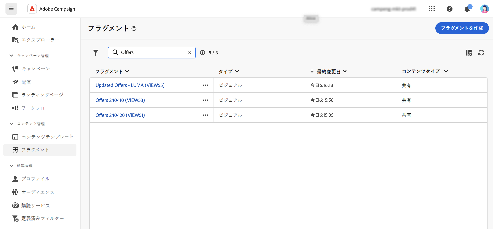
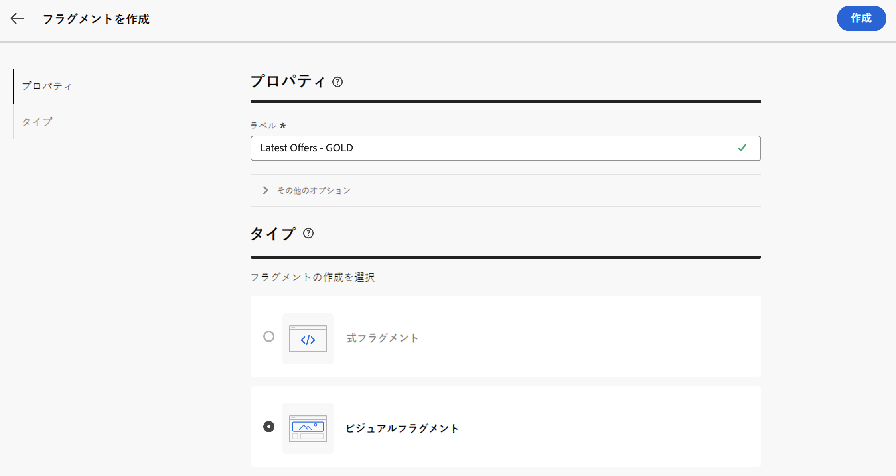
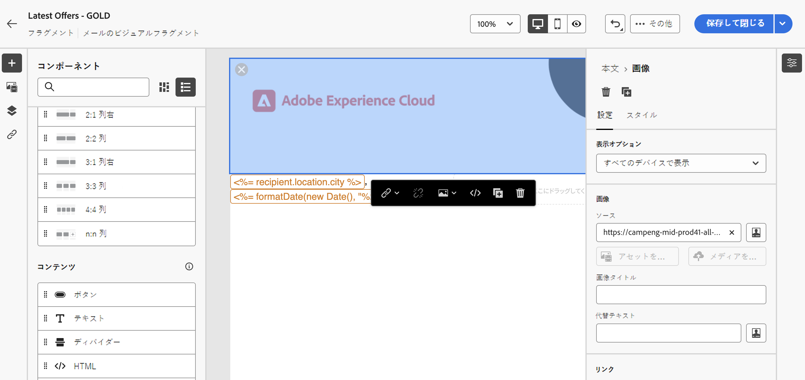
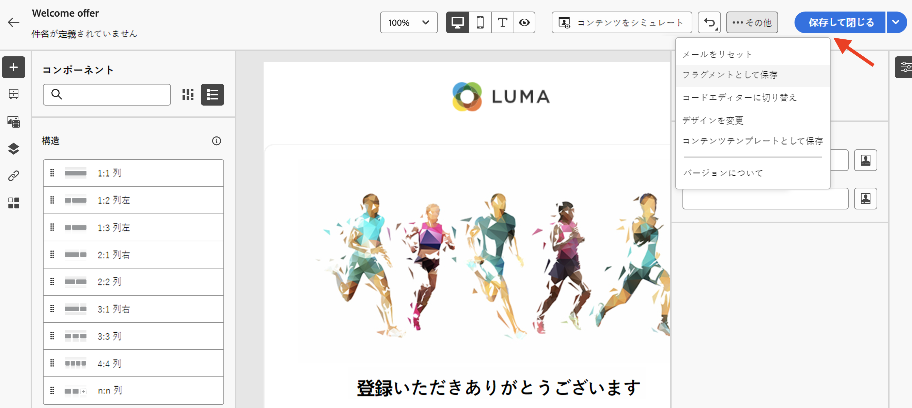
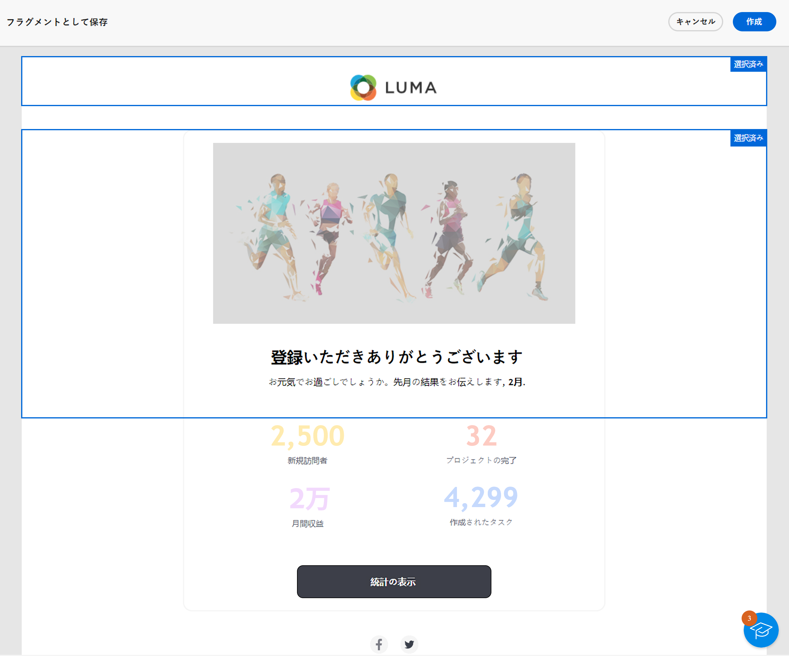
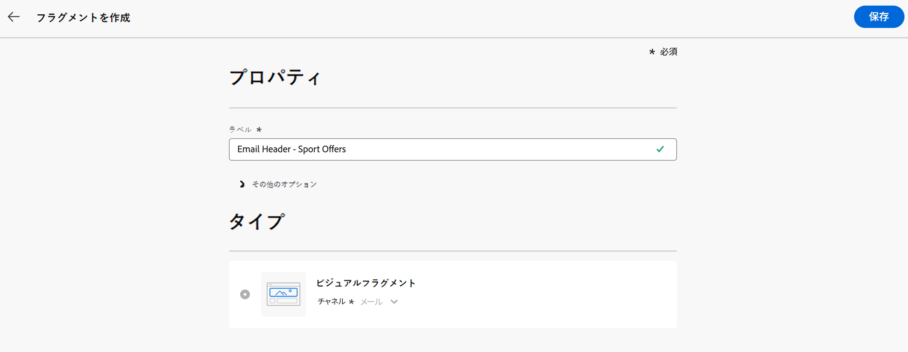
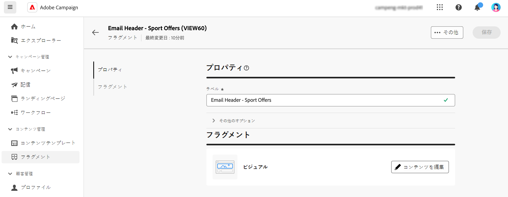
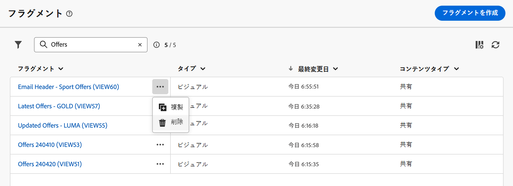

# コンテンツフラグメントの作成 {#fragments}

>[!CONTEXTUALHELP]
>id="acw_fragments_menu"
>title="独自のフラグメントの定義"
>abstract="フラグメントは、キャンペーン全体で 1 つ以上のメールで参照できる再利用可能なコンポーネントです。 この機能を使用すると、マーケティングユーザーが改善されたデザインプロセスでメールコンテンツを迅速に組み立てるために使用できる複数のカスタムコンテンツブロックを事前に作成できます。"

>[!CONTEXTUALHELP]
>id="acw_fragments_save"
>title="フラグメントの保存"
>abstract="フラグメントの保存"

>[!CONTEXTUALHELP]
>id="acw_fragments_create"
>title="独自のフラグメントの定義"
>abstract="フラグメントは、キャンペーン全体で 1 つ以上のメールで参照できる再利用可能なコンポーネントです。"

>[!CONTEXTUALHELP]
>id="acw_fragments_properties"
>title="フラグメントのプロパティ"
>abstract="フラグメントのプロパティ"

>[!CONTEXTUALHELP]
>id="acw_fragments_type"
>title="フラグメントのタイプ"
>abstract="フラグメントのタイプを選択します。 現時点では、メールのビジュアルフラグメントのみを使用できます。"

>[!CONTEXTUALHELP]
>id="acw_fragments_list"
>title="独自のフラグメントの定義"
>abstract="フラグメントは、キャンペーン全体で 1 つ以上のメールで参照できる再利用可能なコンポーネントです。 メールテンプレートでフラグメントを使用することもできます。 現時点では、ビジュアルフラグメントのみを使用できます。"

>[!CONTEXTUALHELP]
>id="acw_fragments_details"
>title="フラグメントの詳細"
>abstract="フラグメントの詳細"

>[!CONTEXTUALHELP]
>id="acw_create_fragment"
>title="独自のフラグメントの定義"
>abstract="フラグメントは、キャンペーン全体で 1 つ以上のメールで参照できる再利用可能なコンポーネントです。"

フラグメントは、キャンペーン全体で 1 つ以上のメールで参照できる再利用可能なコンポーネントです。 フラグメントを変更すると、そのフラグメントを使用するすべてのコンテンツが更新されます。

この機能を使用すると、マーケティングユーザーが改善されたデザインプロセスでメールコンテンツをすばやく組み立てるために使用できる複数のカスタムコンテンツブロックを事前に作成できます。

フラグメントを最大限に活用するには：

* 以下に説明するように、独自のビジュアルフラグメントを作成します。
* 電子メールデザイナーを使用して、コンテンツで必要な回数だけ使用します。 参照： [メールへのビジュアルフラグメントの追加](../email/use-visual-fragments.md).

## ビジュアルフラグメントの作成 {#create-fragments}

フラグメントの作成方法は 2 つあります。

* を使用して、フラグメントを最初から作成します。 **[!UICONTROL フラグメント]** 専用メニュー。 [詳細情報](#create-from-scratch)

* コンテンツをデザインする際は、コンテンツの一部をフラグメントとして保存します。 [詳細情報](#save-as-fragment)

保存すると、フラグメントをメールまたはメールテンプレートで使用できるようになります。 ゼロから作成した場合でも、既存のコンテンツから作成した場合でも、このフラグメントを使用して、Campaign 内でコンテンツを作成できるようになりました。 参照： [ビジュアルフラグメントを追加](../email/use-visual-fragments.md).

### フラグメントを最初から作成する {#create-from-scratch}

フラグメントを最初から作成するには、次の手順に従います。

1. [フラグメントリストへのアクセス](#access-manage-fragments) 経由 **[!UICONTROL コンテンツ管理]** > **[!UICONTROL フラグメント]** 左メニュー。

   

1. を選択 **[!UICONTROL フラグメントを作成]**.

1. フラグメントのラベルを入力します。

   

1. 必要に応じて、フラグメントの内部名、フォルダー、説明など、追加のオプションを定義できます。

   >[!NOTE]
   >
   >現時点で作成できるのは、ビジュアルフラグメントのみです。

1. 「」をクリックします **作成** ボタンをクリックして、フラグメントのコンテンツを設定します。

1. [メールデザイナー](../email/get-started-email-designer.md)が表示されます。キャンペーン内のメールと同じ方法で、必要に応じてコンテンツを編集します。 画像、リンク、パーソナライゼーションフィールド、動的コンテンツを追加できます。

   

1. フラグメントの準備が整ったら、 **[!UICONTROL 保存して閉じる]**. 「」に追加されます [フラグメントリスト](#access-manage-fragments).

このフラグメントは、を作成するときに使用できるようになりました [電子メール](../email/get-started-email-designer.md) または [コンテンツテンプレート](use-email-templates.md) キャンペーン内。 [詳細情報](../email/use-visual-fragments.md)

### コンテンツをフラグメントとして保存 {#save-as-fragment}

後で再利用できるように、すべてのメールコンテンツをフラグメントとして保存できます。 を設計する際 [コンテンツテンプレート](use-email-templates.md) または [電子メール](../email/get-started-email-designer.md) 配信の場合は、コンテンツの一部をビジュアルフラグメントとして保存できます。 これを行うには、次の手順に従います。

1. が含まれる [電子メールデザイナー](../email/get-started-email-designer.md)を選択し、 **詳細** 画面右上のボタン。

1. を選択 **[!UICONTROL フラグメントとして保存]** ドロップダウンメニューから。

   

1. この **[!UICONTROL フラグメントとして保存]** 画面が表示されます。 パーソナライゼーションフィールドや動的コンテンツなど、フラグメントに含める要素を選択します。

   >[!CAUTION]
   >
   >互いに隣接するセクションのみを選択できます。 空の構造や別のフラグメントは選択できません。

   

1. 「**[!UICONTROL 作成]**」をクリックします。フラグメント名を入力して保存します。

   

   このコンテンツは、スタンドアロンのフラグメントになり、に追加されました。 [フラグメントリスト](#manage-fragments)専用メニューからアクセスできます。 このフラグメントは、を作成する際に使用できるようになりました [電子メール](../email/get-started-email-designer.md) または [コンテンツテンプレート](use-email-templates.md) キャンペーン内。 [詳細情報](../email/use-visual-fragments.md)

>[!NOTE]
>
>その新しいフラグメントに対する変更は、送信元のメールまたはテンプレートには生成されません。 同様に、そのメールまたはテンプレート内で元のコンテンツを編集しても、新しいフラグメントは変更されません。

## フラグメントの管理 {#manage-fragments}

フラグメントリストからフラグメントの編集、更新、複製、削除を行うことができます。

### フラグメントの編集と更新 {#edit-fragments}

フラグメントを編集するには、次の手順に従います。

1. 編集するフラグメントの名前をクリックします。 **[!UICONTROL フラグメント]** リスト。
1. 「」をクリックします **コンテンツを編集** ボタンをクリックして、このフラグメントのコンテンツを開きます。

   

1. 必要な変更を加え、変更を保存します。

>[!CAUTION]
>
>フラグメントに対する変更は、それを使用するメール配信またはテンプレートに生成されます。

### フラグメントの削除 {#delete-fragments}

フラグメントを削除するには、次の手順に従います。

1. フラグメントリストを参照し、 **[!UICONTROL その他のアクション]** 削除するフラグメントの横にあるボタン。
1. クリック **削除** そして確認してください。

   

>[!CAUTION]
>
>コンテンツフラグメントを削除すると、それを使用するメール配信とテンプレートが更新されます。フラグメントはメールコンテンツから削除されますが、参照は保持されます。 これらの配信およびテンプレートにフラグメントコンテンツを保持するには、フラグメントを削除する前に継承を解除する必要があります。 [この節で詳しく説明します。](use-visual-fragments.md#break-inheritance).
>

### フラグメントの複製 {#duplicate-fragments}

フラグメントは、簡単に複製して新しいフラグメントを作成できます。 既存のフラグメントを複製するには、次の手順に従います。

1. フラグメントリストを参照し、 **[!UICONTROL その他のアクション]** 削除するフラグメントの横にあるボタン。
1. クリック **複製** そして確認してください。
1. 新しいフラグメントのラベルを入力し、変更を保存します。

   フラグメントがフラグメントのリストに追加されます。 必要に応じて編集および設定できます。
