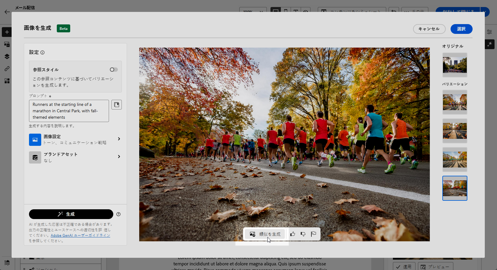

# AI アシスタントを使用したメールの生成 {#generative-content}

>[!BEGINSHADEBOX]

**目次**

* [AI アシスタントの基本を学ぶ](generative-gs.md)
* **[AI アシスタントを使用したメールの生成](generative-content.md)**
* [AI アシスタントを使用した SMS の生成](generative-sms.md)
* [AI アシスタントを使用したプッシュ通知の生成](generative-push.md)

>[!ENDSHADEBOX]

メールを作成してパーソナライズしたら、生成 AI を利用した Campaign の Journey Optimizer AI アシスタントを使用して、コンテンツを次のレベルに引き上げます。

AI アシスタントを使用すると、オーディエンスの共感を呼ぶ可能性の高い様々なコンテンツを提案することで、配信の影響を最適化できます。

>[!NOTE]
>
>この機能の使用を開始する前に、関連する[ガードレールと制限](generative-gs.md#guardrails-and-limitations)のトピックに目を通してください。

## AI アシスタントを使用したコンテンツの生成 {#generative-text}

ここでは、AI アシスタントが魅力的なメールの作成にどのように役立つかを説明します。

* **要約**：情報が長すぎると、メール受信者が過負荷になる可能性があります。 AI アシスタントを使用して、重要なポイントを明確かつ簡潔な要約に要約し、注意を引いてさらに読むよう促します。

* **精巧**:AI アシスタントは、特定のトピックを展開するのに役立ち、理解とエンゲージメントを深めるために追加の詳細を提供します。

* **言語の簡略化**:AI アシスタントを活用して言語を簡素化し、より広いオーディエンスに対して明確なアクセシビリティを確保します。

* **Rephrase**:AI アシスタントは、様々な方法でメッセージのフレーズを変更できるので、書き物を新鮮に保ち、様々なオーディエンスを魅了します。

* **トーンを変更**：メールのトーンは、オーディエンスの共感を呼ぶはずです。 情報を提供する、遊び心がある、説得力がある、のいずれを求めているかに関わらず、AI アシスタントはメッセージを適切に適応させることができます。

次の例では、AI アシスタントを活用して、今後のイベントへのメール招待のコンテンツを強化します。

1. メール配信を作成および設定したら、「**[!UICONTROL コンテンツを編集]**」をクリックします。

   メール配信の設定方法について詳しくは、[こちらのページ](../email/create-email-content.md)を参照してください。

1. 必要に応じてメールをパーソナライズし、 **[!UICONTROL AI アシスタント]** メニュー。

   また、「**[!UICONTROL テキストコンポーネント]**」を選択して、特定のコンテンツのみをターゲットにすることもできます。

   {zoomable=&quot;yes&quot;}

1. を有効にする **[!UICONTROL 元のコンテンツを使用]** 配信、配信名、選択したオーディエンスに基づいて新しいコンテンツをパーソナライズするための AI アシスタントのオプション。

   >[!IMPORTANT]
   >
   > ブランドアセットをアップロードするか、「**[!UICONTROL 現在のコンテンツで拡張]**」オプションを有効にして、プロンプトを常に特定のコンテキストに関連付ける必要があります。

1. 「**[!UICONTROL プロンプト]**」フィールドに生成する内容を記述して、コンテンツを微調整します。

   プロンプトの作成に関するサポートが必要な場合は、配信を改善するための様々なプロンプトのアイデアを提供する&#x200B;**[!UICONTROL プロンプトライブラリ]**&#x200B;にアクセスします。

   {zoomable=&quot;yes&quot;}

1. を切り替えることができます **[!UICONTROL 件名]** または **[!UICONTROL プリヘッダー]** をクリックして、バリアント生成に含めます。

   この機能は、特定のテキスト コンポーネントを選択しなかった場合に使用できます。

1. 「**[!UICONTROL ブランドアセットをアップロード]**」をクリックし、AI アシスタントに追加のコンテキストを提供できるコンテンツを含むブランドアセットを追加します。

   {zoomable=&quot;yes&quot;}

1. 様々なオプションを使用してプロンプトを調整します。

   * **[!UICONTROL コミュニケーション戦略]**：生成テキストに適した通信方法を選択します。
   * **[!UICONTROL 言語]**：バリアントのコンテンツの言語を選択します。
   * **[!UICONTROL トーン]**：テキストがオーディエンスと目的に適していることを確認します。
   * **[!UICONTROL 明るい]**：範囲スライダーを使用して、コンテンツの長さを選択します。 特定のテキスト コンポーネントを選択した場合にのみ使用できます。

   {zoomable=&quot;yes&quot;}

1. プロンプトの準備が整ったら、「**[!UICONTROL 生成]**」をクリックします。

1. 生成されたを参照 **[!UICONTROL バリエーション]** をクリックして、 **[!UICONTROL プレビュー]** 選択したバリエーションのフルスクリーンバージョンを表示します。

1. に移動します。 **[!UICONTROL 調整]** 内のオプション **[!UICONTROL プレビュー]** ウィンドウを開いて追加のカスタマイズ機能にアクセスし、好みに合わせてバリエーションを微調整します。

   適切なコンテンツが見つかったら、「**[!UICONTROL 選択]**」をクリックします。

   {zoomable=&quot;yes&quot;}

1. パーソナライゼーションフィールドを挿入して、プロファイルデータに基づいてメールコンテンツをカスタマイズします。次に、 **[!UICONTROL コンテンツをシミュレート]** ボタンをクリックしてレンダリングを制御し、テストプロファイルでパーソナライゼーション設定を確認します。 [詳細情報](../preview-test/preview-content.md)

   {zoomable=&quot;yes&quot;}

コンテンツ、オーディエンスおよびスケジュールを定義したら、メール配信の準備が整いました。[詳細情報](../monitor/prepare-send.md)

## AI アシスタントを使用した画像の生成 {#generative-image}

AI アシスタントを活用して、メールキャンペーン用にカスタマイズされた多様なビジュアルを生成します。 例えば、次の目的で使用できます。

* **Generate**：メールキャンペーン用に特別に設計された、魅力的な様々な画像を生成します。 カラーパレット、稲妻、コンポジションなどの設定をきめ細かく制御することで、個別のオーディエンスセグメントの共感を呼び、独自のキャンペーン目標を達成できます。

* **類似を生成**:AI アシスタントを使用して、選択したバリアントから類似の画像を生成します。

* **ブランドアセット**：内部のブランドアセットとAdobe Fireflyなどの外部ソースの両方を活用して、メールキャンペーン用の画像の選択を最適化します。

次の例では、AI アシスタントを活用してコンテンツを最適化および改善し、より使いやすいエクスペリエンスを実現する方法を説明します。次の手順に従います。

1. メール配信を作成および設定したら、「**[!UICONTROL コンテンツを編集]**」をクリックします。

   メール配信の設定方法について詳しくは、[こちらのページ](../email/create-email-content.md)を参照してください。

1. 配信の&#x200B;**[!UICONTROL 基本的な詳細]**&#x200B;を入力します。完了したら、「**[!UICONTROL メールコンテンツを編集]**」をクリックします。

1. AI アシスタントを使用して変更するアセットを選択します。

1. 右側のメニューから、「**[!UICONTROL AI アシスタント]**」を選択します。

   {zoomable=&quot;yes&quot;}

1. 「**[!UICONTROL プロンプト]**」フィールドに生成する内容を記述して、コンテンツを微調整します。

   プロンプトの作成に関するサポートが必要な場合は、配信を改善するための様々なプロンプトのアイデアを提供する&#x200B;**[!UICONTROL プロンプトライブラリ]**&#x200B;にアクセスします。

   {zoomable=&quot;yes&quot;}

1. 「**[!UICONTROL ブランドアセットをアップロード]**」をクリックし、AI アシスタントに追加のコンテキストを提供できるコンテンツを含むブランドアセットを追加します。

   >[!IMPORTANT]
   >
   > プロンプトは、常に特定のコンテキストに関連付けられている必要があります。

1. 様々なオプションを使用してプロンプトを調整します。

   * **[!UICONTROL 縦横比]**：アセットの幅と高さを決定します。 16:9、4:3、3:2、1:1 など、一般的な比率から選択することも、カスタムサイズを入力することもできます。
   * **[!UICONTROL カラーとトーン]**：画像内の色の全体的な外観と、それが伝えるムードまたは雰囲気。
   * **[!UICONTROL コンテンツタイプ]**：これにより、視覚要素の性質が分類され、写真、グラフィック、アートなど、様々な視覚的表現が区別されます。
   * **[!UICONTROL 照明]**：これは、画像内に存在する稲妻を指し、大気を形作り、特定の要素を強調表示します。
   * **[!UICONTROL 構成]**：画像のフレーム内の要素の配置を指します

   {zoomable=&quot;yes&quot;}

1. プロンプトの設定が完了したら、「**[!UICONTROL 生成]**」をクリックします。

1. **[!UICONTROL バリエーションの提案]**&#x200B;を参照して、目的のアセットを見つけます。

   「**[!UICONTROL プレビュー]**」をクリックして、選択したバリエーションのフルスクリーンバージョンを表示します。

   {zoomable=&quot;yes&quot;}

1. このバリアントに関連する画像を表示する場合は、「**[!UICONTROL 類似を表示]**」を選択します。

1. 適切なコンテンツが見つかったら、「**[!UICONTROL 選択]**」をクリックします。

   {zoomable=&quot;yes&quot;}

1. メッセージコンテンツを定義したら、「**[!UICONTROL コンテンツをシミュレート]**」ボタンをクリックしてレンダリングを制御し、テストプロファイルでパーソナライゼーション設定を確認します。[詳細情報](../preview-test/preview-content.md)

   {zoomable=&quot;yes&quot;}

1. コンテンツ、オーディエンスおよびスケジュールを定義したら、メール配信の準備が整いました。[詳細情報](../monitor/prepare-send.md)
