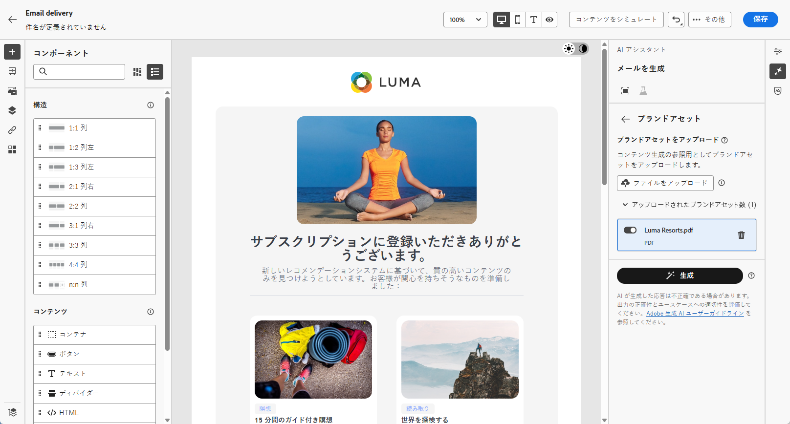
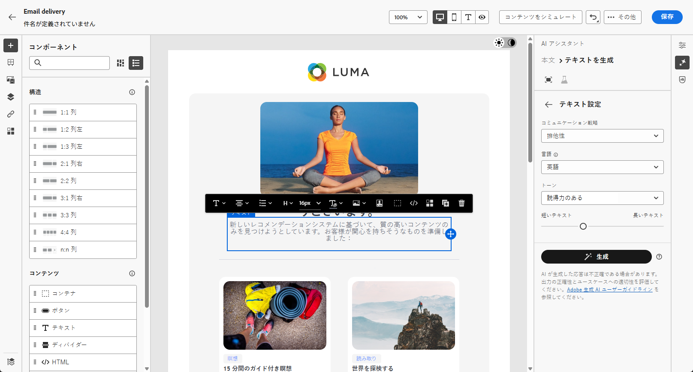

# AI アシスタントによるメール生成 {#generative-content}

>[!IMPORTANT]
>
>この機能の使用を開始する前に、関連する [ ガードレールと制限事項 ](generative-gs.md#generative-guardrails) を参照してください。
> 
>
>Adobe Campaign Web で AI アシスタントを使用するには、[ ユーザー使用許諾契約 ](https://www.adobe.com/jp/legal/licenses-terms/adobe-dx-gen-ai-user-guidelines.html){target="_blank"} に同意する必要があります。 詳しくは、アドビ担当者にお問い合わせください。

メールを作成およびパーソナライズしたら、Adobe Campaign Web の AI アシスタントを使用してコンテンツを強化します。

Adobe Campaign Web の AI アシスタントは、オーディエンスの共感を得られるようにカスタマイズされたメール全体、ターゲットテキストコンテンツ、画像を生成することで、配信の影響を最適化するのに役立ちます。 これにより、メールキャンペーンが改善され、エンゲージメントが向上します。

メールキャンペーンで、AI アシスタントを使用して、完全なメール、テキストまたは画像を生成します。 Adobe Campaign Web での AI アシスタントの使用方法については、以下のタブを参照してください。

>[!BEGINTABS]

>[!TAB 完全なメール生成]

次の例では、Adobe Campaign web で AI アシスタントを活用して既存のメールを調整し、特別なイベント用にカスタマイズします。

1. メール配信を作成および設定したら、「**[!UICONTROL コンテンツを編集]**」をクリックします。

   メール配信の設定について詳しくは、[ このページ ](../email/create-email-content.md) を参照してください。

1. 必要に応じてレイアウトをパーソナライズし、**[!UICONTROL AI アシスタント]** メニューにアクセスします。

   {zoomable="yes"}

1. AI アシスタントで「**[!UICONTROL 元のコンテンツを使用]**」オプションを有効にして、選択したコンテンツに基づいて新しいコンテンツをパーソナライズします。

1. 生成する内容を「**[!UICONTROL プロンプト]**」フィールドで記述して、コンテンツを微調整します。

   プロンプトを作成する際に支援が必要な場合は、**[!UICONTROL プロンプトライブラリ]** にアクセスします。このライブラリは、配信を改善するための様々な迅速なアイデアを提供します。

   {zoomable="yes"}

1. **[!UICONTROL 件名]** または **[!UICONTROL プリヘッダー]** を切り替えて、バリアント生成に含めます。

1. 「**[!UICONTROL テキスト設定]**」オプションを使用してプロンプトを調整します。

   * **[!UICONTROL コミュニケーション戦略]**：生成テキストに最適なコミュニケーションスタイルを選択します。
   * **[!UICONTROL トーン]**：メールのトーンがオーディエンスの共感を呼ぶようにします。 情報に富む、遊び心がある、説得力がある、のいずれを求めているかに関わらず、AI アシスタントはメッセージを適切に調整します。

   {zoomable="yes"}

1. 次の&#x200B;**[!UICONTROL 画像設定]**&#x200B;を選択します。

   * **[!UICONTROL コンテンツタイプ]**：視覚要素の特性を分類し、写真、グラフィック、アートなどの視覚的表現の様々な形式を区別します。
   * **[!UICONTROL 視覚的な強さ]**：画像の強さを調整して、画像の影響を制御します。 低い値（2）を設定するとソフトな外観が作成され、高い値（10）を設定すると画像が鮮明になります。
   * **[!UICONTROL カラー&amp;トーン]**：カラーの全体的な外観と、伝えられるムードや雰囲気を調整します。
   * **[!UICONTROL 照明]**：イメージ内の照明を修正して、雰囲気を形作り、特定の要素をハイライト表示します。
   * **[!UICONTROL 構成]**：画像のフレーム内に要素を配置します。

   {zoomable="yes"}

1. **[!UICONTROL ブランドアセット]** メニューから、「**[!UICONTROL ブランドアセットをアップロード]**」をクリックして、AI アシスタントに追加のコンテキストを提供するブランドアセットを追加するか、以前にアップロードしたものを選択します。

   以前にアップロードしたファイルは、**[!UICONTROL アップロードされたブランドアセット]**&#x200B;ドロップダウンで使用できます。世代に含めるアセットを切り替えます。

1. プロンプトの準備が整ったら、「**[!UICONTROL 生成]**」をクリックします。

1. 生成された **[!UICONTROL バリエーション]** を参照し、**[!UICONTROL プレビュー]** をクリックして、選択したバリエーションのフルスクリーンバージョンを表示します。

1. **[!UICONTROL プレビュー]**&#x200B;ウィンドウ内の「**[!UICONTROL 絞り込み]**」オプションに移動して、追加のカスタマイズ機能にアクセスします。

   * **[!UICONTROL 言い換え]**:AI アシスタントは、さまざまな方法でメッセージの言い換えを行い、多様なオーディエンスに向けて書き物を新鮮で魅力的なものにします。
   * **[!UICONTROL よりシンプルな言語の使用]**：言語を簡素化して、より幅広いオーディエンスに明確でアクセシビリティを提供します。

   また、テキストの&#x200B;**[!UICONTROL トーン]**&#x200B;と&#x200B;**[!UICONTROL コミュニケーション戦略]**&#x200B;を変更することもできます。

   {zoomable="yes"}

1. 適切なコンテンツが見つかったら、「**[!UICONTROL 選択]**」をクリックします。

1. パーソナライゼーションフィールドを挿入して、プロファイルデータに基づいてメールコンテンツをカスタマイズします。 次に、「**[!UICONTROL コンテンツをシミュレート]**」ボタンをクリックしてレンダリングを制御し、テストプロファイルでパーソナライゼーション設定を確認します。 [詳細情報](../preview-test/preview-content.md)

   {zoomable="yes"}

コンテンツ、オーディエンスおよびスケジュールを定義したら、メール配信の準備を行います。 [詳細情報](../monitor/prepare-send.md)

>[!TAB テキストのみの生成]

次の例では、AI アシスタントを活用して、今後のイベントに関するメール招待のコンテンツを強化します。

1. メール配信を作成および設定したら、「**[!UICONTROL コンテンツを編集]**」をクリックします。

   メール配信の設定について詳しくは、[ このページ ](../email/create-email-content.md) を参照してください。

1. **[!UICONTROL テキストコンポーネント]** を選択して特定のコンテンツをターゲットにし、**[!UICONTROL AI アシスタント]** メニューにアクセスします。

   {zoomable="yes"}

1. AI アシスタントで「**[!UICONTROL 元のコンテンツを使用]**」オプションを有効にして、選択したコンテンツに基づいて新しいコンテンツをパーソナライズします。

1. 生成する内容を「**[!UICONTROL プロンプト]**」フィールドで記述して、コンテンツを微調整します。

   プロンプトを作成する際に支援が必要な場合は、**[!UICONTROL プロンプトライブラリ]** にアクセスします。このライブラリは、配信を改善するための様々な迅速なアイデアを提供します。

   {zoomable="yes"}

1. 「**[!UICONTROL テキスト設定]**」オプションを使用してプロンプトを調整します。

   * **[!UICONTROL コミュニケーション戦略]**：生成テキストに最適なコミュニケーションスタイルを選択します。
   * **[!UICONTROL トーン]**：メールのトーンがオーディエンスの共感を呼ぶようにします。 情報に富む、遊び心がある、説得力がある、のいずれを求めているかに関わらず、AI アシスタントはメッセージを適切に調整します。
   * **テキストの長さ**：スライダーを使用して、テキストの目的の長さを選択します。

   {zoomable="yes"}

1. **[!UICONTROL ブランドアセット]** メニューから、「**[!UICONTROL ブランドアセットをアップロード]**」をクリックして、AI アシスタントに追加のコンテキストを提供するブランドアセットを追加するか、以前にアップロードしたものを選択します。

   以前にアップロードしたファイルは、**[!UICONTROL アップロードされたブランドアセット]**&#x200B;ドロップダウンで使用できます。世代に含めるアセットを切り替えます。

1. プロンプトの準備が整ったら、「**[!UICONTROL 生成]**」をクリックします。

1. 生成された **[!UICONTROL バリエーション]** を参照し、**[!UICONTROL プレビュー]** をクリックして、選択したバリエーションのフルスクリーンバージョンを表示します。

1. **[!UICONTROL プレビュー]**&#x200B;ウィンドウ内の「**[!UICONTROL 絞り込み]**」オプションに移動して、追加のカスタマイズ機能にアクセスします。

   * **[!UICONTROL 参照コンテンツとして使用]**：選択したバリアントは、他の結果を生成するための参照コンテンツとして機能します。
   * **[!UICONTROL 精巧]**：特定のトピックを展開し、理解とエンゲージメントを深めるために追加の詳細を提供します。
   * **[!UICONTROL 要約]**：重要なポイントを明確で簡潔な要約に要約して、注意を引き、さらに読むようにします。
   * **[!UICONTROL 再フレーズ]**：様々な方法でメッセージを再フレーズ化して、書き物を新鮮に保ち、様々なオーディエンスを惹き付けます。
   * **[!UICONTROL よりシンプルな言語の使用]**：言語を簡素化して、より幅広いオーディエンスに明確でアクセシビリティを提供します。

   また、テキストの&#x200B;**[!UICONTROL トーン]**&#x200B;と&#x200B;**[!UICONTROL コミュニケーション戦略]**&#x200B;を変更することもできます。

   {zoomable="yes"}

1. 適切なコンテンツが見つかったら、「**[!UICONTROL 選択]**」をクリックします。

1. パーソナライゼーションフィールドを挿入して、プロファイルデータに基づいてメールコンテンツをカスタマイズします。 次に、「**[!UICONTROL コンテンツをシミュレート]**」ボタンをクリックしてレンダリングを制御し、テストプロファイルでパーソナライゼーション設定を確認します。 [詳細情報](../preview-test/preview-content.md)

コンテンツ、オーディエンスおよびスケジュールを定義したら、メール配信の準備を行います。 [詳細情報](../monitor/prepare-send.md)

>[!TAB 画像生成]

以下の例では、AI アシスタントを活用してアセットを最適化および改善し、より使いやすいエクスペリエンスを確保する方法について説明します。

1. メール配信を作成および設定したら、「**[!UICONTROL コンテンツを編集]**」をクリックします。

   メール配信の設定について詳しくは、[ このページ ](../email/create-email-content.md) を参照してください。

1. 配信の&#x200B;**[!UICONTROL 基本的な詳細]**&#x200B;を入力します。完了したら、「**[!UICONTROL メールコンテンツを編集]**」をクリックします。

1. AI アシスタントで変更するアセットを選択します。

1. 右側のメニューから、「**[!UICONTROL AI アシスタント]**」を選択します。

   {zoomable="yes"}

1. AI アシスタントの **[!UICONTROL 参照スタイル]** オプションを有効にして、選択したコンテンツに基づいて新しいコンテンツをパーソナライズします。

1. 生成する内容を「**[!UICONTROL プロンプト]**」フィールドで記述して、コンテンツを微調整します。

   プロンプトを作成する際に支援が必要な場合は、**[!UICONTROL プロンプトライブラリ]** にアクセスします。このライブラリは、配信を改善するための様々な迅速なアイデアを提供します。

   {zoomable="yes"}

1. **[!UICONTROL 画像設定]** オプションを使用してプロンプトを調整します。

   * **[!UICONTROL 縦横比]**：アセットの幅と高さを指定します。 16:9、4:3、3:2、1:1 などの一般的な比率から選択するか、カスタムサイズを入力します。
   * **[!UICONTROL コンテンツタイプ]**：視覚要素の特性を分類し、写真、グラフィック、アートなどの視覚的表現の様々な形式を区別します。
   * **[!UICONTROL 視覚的な強さ]**：画像の強さを調整して、画像の影響を制御します。 低い値（2）を設定するとソフトな外観が作成され、高い値（10）を設定すると画像が鮮明になります。
   * **[!UICONTROL カラー&amp;トーン]**：カラーの全体的な外観と、伝えられるムードや雰囲気を調整します。
   * **[!UICONTROL 照明]**：イメージ内の照明を修正して、雰囲気を形作り、特定の要素をハイライト表示します。
   * **[!UICONTROL 構成]**：画像のフレーム内に要素を配置します。

   {zoomable="yes"}

1. **[!UICONTROL ブランドアセット]** メニューから、「**[!UICONTROL ブランドアセットをアップロード]**」をクリックして、AI アシスタントに追加のコンテキストを提供するブランドアセットを追加するか、以前にアップロードしたものを選択します。

   以前にアップロードしたファイルは、**[!UICONTROL アップロードされたブランドアセット]**&#x200B;ドロップダウンで使用できます。世代に含めるアセットを切り替えます。

1. プロンプトの設定が完了したら、「**[!UICONTROL 生成]**」をクリックします。

1. **[!UICONTROL バリエーションの提案]** を参照し、目的のアセットを見つけます。

   「**[!UICONTROL プレビュー]**」をクリックして、選択したバリエーションのフルスクリーンバージョンを表示します。

   {zoomable="yes"}

1. このバリアントに関連する画像を表示する場合は、「**[!UICONTROL 類似を生成]**」を選択します。

   {zoomable="yes"}

1. 適切なコンテンツが見つかったら、「**[!UICONTROL 選択]**」をクリックします。

1. メッセージコンテンツを定義したら、「**[!UICONTROL コンテンツをシミュレート]**」ボタンをクリックしてレンダリングを制御し、テストプロファイルでパーソナライゼーション設定を確認します。 [詳細情報](../preview-test/preview-content.md)

1. コンテンツ、オーディエンスおよびスケジュールを定義したら、メール配信の準備を行います。 [詳細情報](../monitor/prepare-send.md)

>[!ENDTABS]

## チュートリアルビデオ {#video}

AI アシスタントを使用して、完全なメールコンテンツ、テキスト、画像を生成する方法を説明します。

>[!VIDEO](https://video.tv.adobe.com/v/3428984)