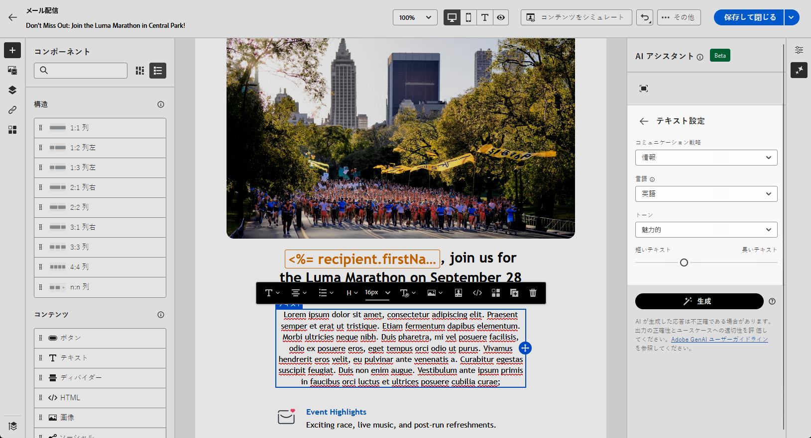

# AI アシスタントを使用した E メールの生成 {#generative-content}

>[!BEGINSHADEBOX]

**目次**

* [AI アシスタントの概要](generative-gs.md)
* **[AI アシスタントを使用した E メールの生成](generative-content.md)**
* [AI アシスタントを使用した SMS の生成](generative-sms.md)
* [AI アシスタントを使用したプッシュ通知の生成](generative-push.md)

>[!ENDSHADEBOX]

E メールを作成し、パーソナライズしたら、Campaign のJourney Optimizer AI Assistant（生成 AI を利用）を使用して、コンテンツを次のレベルに引き上げます。

AI Assistant は、オーディエンスの共感を呼ぶ可能性の高い様々なコンテンツを提案することで、配信の影響を最適化するのに役立ちます。

>[!NOTE]
>
>この機能の使用を開始する前に、関連する[ガードレールと制限](generative-gs.md#guardrails-and-limitations)のトピックに目を通してください。

## AI アシスタントを使用したコンテンツの生成 {#generative-text}

1. メール配信を作成および設定したら、「**[!UICONTROL コンテンツを編集]**」をクリックします。

   メール配信の設定方法について詳しくは、[こちらのページ](../email/create-email-content.md)を参照してください。

1. 配信の&#x200B;**[!UICONTROL 基本的な詳細]**&#x200B;を入力します。完了したら、「 **[!UICONTROL コンテンツを編集]**.

1. 必要に応じて E メールをパーソナライズします。 [詳細情報](content-components.md)

1. 次にアクセス： **[!UICONTROL AI アシスタント]** メニュー。

   また、 **[!UICONTROL テキストコンポーネント]** 特定のコンテンツのみをターゲットにする場合。

   {zoomable=&quot;yes&quot;}

1. コンテンツを微調整するには、 **[!UICONTROL プロンプト]** フィールドに入力します。

   プロンプトの作成に関するサポートを探している場合は、 **[!UICONTROL プロンプトライブラリ]** 配信を改善するための迅速なアイデアの多様な範囲を提供します。

   {zoomable=&quot;yes&quot;}

1. 切り替え **[!UICONTROL 件名]** または **[!UICONTROL プリヘッダー]** を追加して、バリアントの生成に含めます。

1. コンテキストメニューで、 **[!UICONTROL 現在のコンテキストで拡張]** 」オプションを使用します。

   >[!IMPORTANT]
   >
   > プロンプトは、ブランドアセットをアップロードするか、 **[!UICONTROL 現在のコンテンツを拡張]** オプション。

1. クリック **[!UICONTROL ブランドアセットをアップロード]** :AI Assistant に追加のコンテキストを提供できるコンテンツを含むブランドアセットを追加します。

   {zoomable=&quot;yes&quot;}

1. ニーズに最も合う&#x200B;**[!UICONTROL コミュニケーション戦略]**&#x200B;を選択します。これは、生成されるテキストのトーンとスタイルに影響を与えます。

1. 生成されるテキストの&#x200B;**[!UICONTROL 言語]**&#x200B;および&#x200B;**[!UICONTROL トーン]**&#x200B;を選びます。これにより、テキストがオーディエンスと目的に適したものになります。

   {zoomable=&quot;yes&quot;}

1. プロンプトの準備が整ったら、「**[!UICONTROL 生成]**」をクリックします。

1. 生成された&#x200B;**[!UICONTROL バリエーション]**&#x200B;を参照して、適切なコンテンツが見つかったら、「**[!UICONTROL 適用]**」をクリックします。

   「**[!UICONTROL プレビュー]**」をクリックして、選択したバリエーションのフルスクリーンバージョンを表示します。

   {zoomable=&quot;yes&quot;}

1. パーソナライゼーションフィールドを挿入して、プロファイルデータに基づいてメールコンテンツをカスタマイズします。[詳しくは、コンテンツのパーソナライゼーションを参照してください](../personalization/personalize.md)

   {zoomable=&quot;yes&quot;}

1. メッセージコンテンツを定義したら、「**[!UICONTROL コンテンツをシミュレート]**」ボタンをクリックして、レンダリングを制御し、テストプロファイルでパーソナライゼーション設定を確認します。[詳細情報](../preview-test/preview-content.md)

   {zoomable=&quot;yes&quot;}

1. コンテンツ、オーディエンスおよびスケジュールを定義したら、メール配信の準備が整いました。[詳細情報](../monitor/prepare-send.md)

## AI アシスタントを使用した画像の生成 {#generative-image}

以下の例では、AI Assistant を活用してコンテンツを最適化および改善し、より使いやすいエクスペリエンスを実現する方法を説明します。 次の手順に従います。

1. メール配信を作成および設定したら、「**[!UICONTROL コンテンツを編集]**」をクリックします。

   メール配信の設定方法について詳しくは、[こちらのページ](../email/create-email-content.md)を参照してください。

1. 配信の&#x200B;**[!UICONTROL 基本的な詳細]**&#x200B;を入力します。完了したら、「**[!UICONTROL メールコンテンツを編集]**」をクリックします。

1. AI アシスタントで変更するアセットを選択します。

1. 右側のメニューから、「 」を選択します。 **[!UICONTROL AI アシスタント]**.

   {zoomable=&quot;yes&quot;}

1. コンテンツを微調整するには、 **[!UICONTROL プロンプト]** フィールドに入力します。

   プロンプトの作成に関するサポートを探している場合は、 **[!UICONTROL プロンプトライブラリ]** 配信を改善するための迅速なアイデアの多様な範囲を提供します。

   {zoomable=&quot;yes&quot;}

1. クリック **[!UICONTROL ブランドアセットをアップロード]** :AI Assistant に追加のコンテキストを提供できるコンテンツを含むブランドアセットを追加します。

   >[!IMPORTANT]
   >
   > プロンプトは、常に特定のコンテキストに関連付けられている必要があります。

1. アセットの「**[!UICONTROL 縦横比]**」を選択します。これにより、アセットの幅と高さが決まります。

   16:9、4:3、3:2、1:1 など、一般的な比率から選択することも、カスタムサイズを入力することもできます。

1. 「**[!UICONTROL カラーとトーン]**」、「**[!UICONTROL コンテンツタイプ]**」、「**[!UICONTROL 照明]**」および「**[!UICONTROL コンポジション]**」の設定を、目的のアセット特性に合わせてカスタマイズします。

   {zoomable=&quot;yes&quot;}

1. プロンプトの設定が完了したら、「**[!UICONTROL 生成]**」をクリックします。

1. 次を参照： **[!UICONTROL バリエーションの候補]** をクリックして、目的のアセットを検索します。

   「**[!UICONTROL プレビュー]**」をクリックして、選択したバリエーションのフルスクリーンバージョンを表示します。

   {zoomable=&quot;yes&quot;}

1. 選択 **[!UICONTROL 類似を表示]** このバリアントに関連する画像を表示する場合。

1. 適切なコンテンツが見つかったら、「**[!UICONTROL 選択]**」をクリックします。

   {zoomable=&quot;yes&quot;}

1. メッセージコンテンツを定義したら、「**[!UICONTROL コンテンツをシミュレート]**」ボタンをクリックしてレンダリングを制御し、テストプロファイルでパーソナライゼーション設定を確認します。[詳細情報](../preview-test/preview-content.md)

   {zoomable=&quot;yes&quot;}

1. コンテンツ、オーディエンスおよびスケジュールを定義したら、メール配信の準備が整いました。[詳細情報](../monitor/prepare-send.md)
