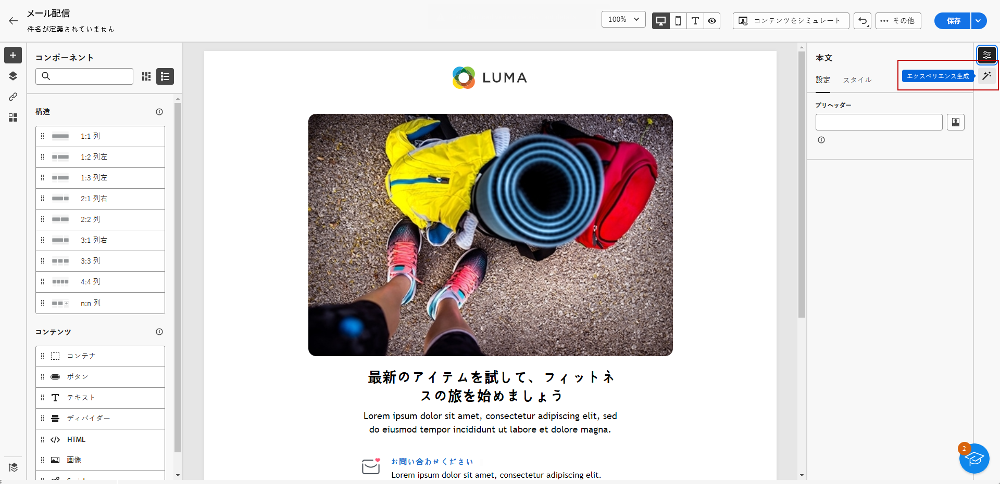
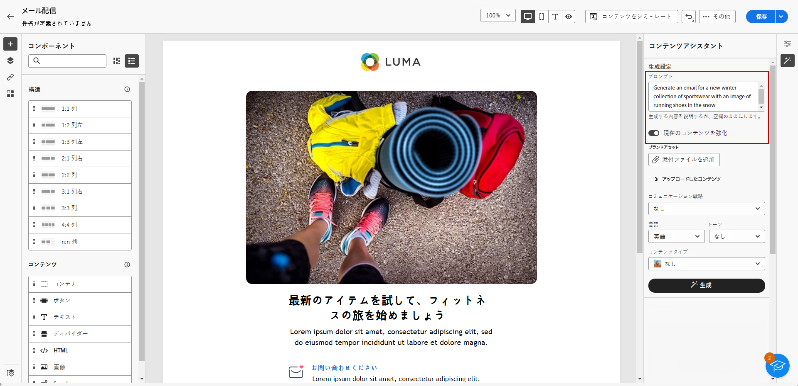
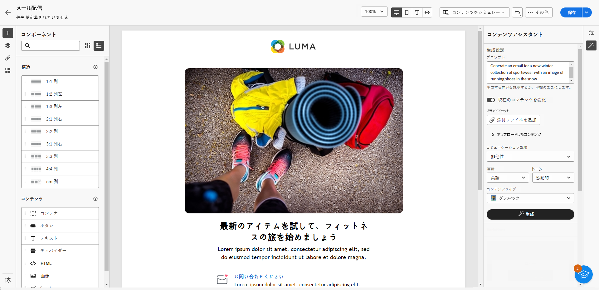
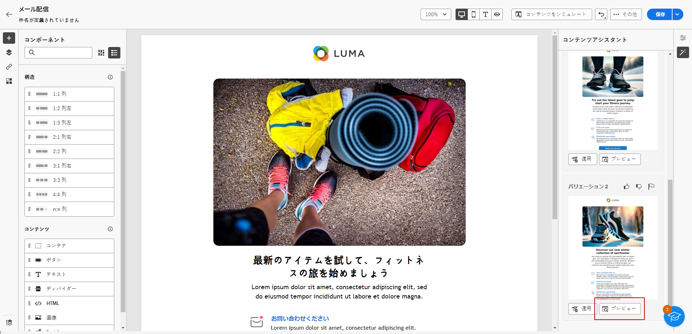
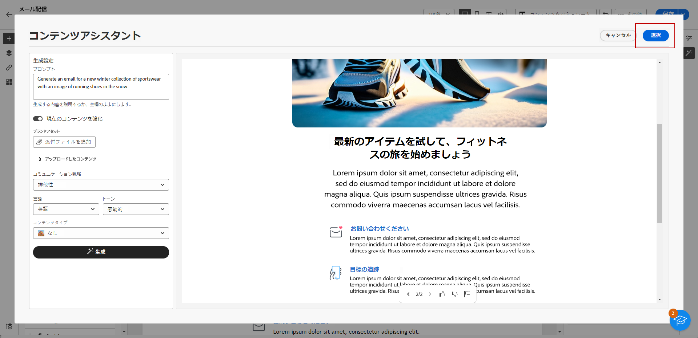
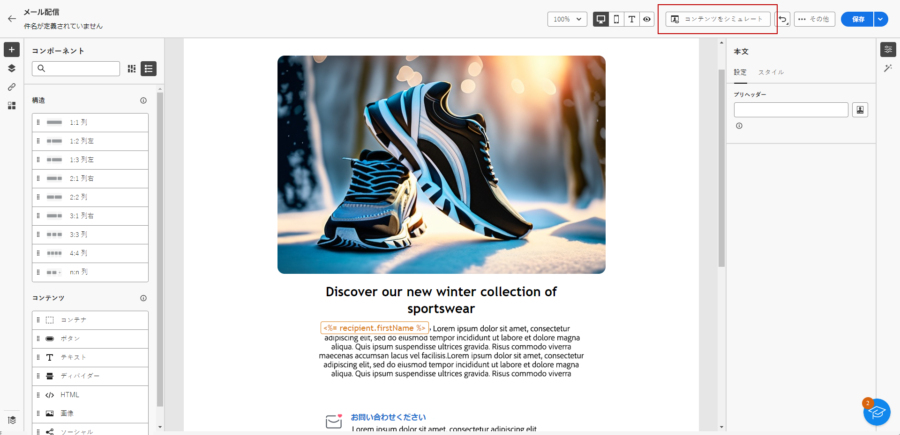

# AI アシスタント付きメールを生成 {#generative-email}

Campaign の AI アシスタントは、完全な E メールコンテンツを自動的に生成し、時間を節約し、品質を一貫させることで、通信の影響を高めます。 生成 AI を使用すると、オーディエンスの共感を呼ぶ魅力的なメールを容易に作成し、コミュニケーションをより効果的かつ効率的に行うことができます。

>[!NOTE]
>
>この機能の使用を開始する前に、関連する[ガードレールと制限](generative-gs.md#guardrails-and-limitations)のトピックに目を通してください。

AI Assistant で E メールコンテンツを生成するには、次の手順に従います。 AI アシスタントを使用して、既存のコンテンツを改善することもできます。詳しくは、 [このページ](generative-content.md).

1. メール配信を作成および設定したら、「**[!UICONTROL コンテンツを作成]**」をクリックします。

   メール配信の設定方法について詳しくは、[こちら](../email/create-email-content.md)を参照してください。

1. 配信の&#x200B;**[!UICONTROL 基本的な詳細]**&#x200B;を入力します。完了したら、「**[!UICONTROL メール本文を編集]**」をクリックします。

1. AI アシスタントが生成した電子メールのベースにするデザインテンプレートを選択します。

   HTML ファイルをインポートすることもできます。

1. 右側のメニューから、「**[!UICONTROL エクスペリエンス生成]**」を選択します。

   {zoomable=&quot;yes&quot;}

1. 生成する内容を記述して、コンテンツを微調整します。

   プロンプトの例を次に示します。

   * ニュースレターの場合：旅行記事、宛先のハイライト、独占的なサブスクライバーオファーなどを特集した月刊ニュースレターを生成します。
   * フィードバックと調査の場合：最近のソフトウェアエクスペリエンスに関するフィードバックを提供したり、製品の改善を目的とした調査に参加したりするよう顧客に勧めるを招待するメールを作成します。
   * 記念日または誕生日のメール：顧客の特別な日を祝い、誕生日の割引を提供する誕生日メールを生成します。

   {zoomable=&quot;yes&quot;}

1. 選択 **[!UICONTROL ファイルをアップロード]** AI アシスタントに追加のコンテキストを提供できるコンテンツを含むブランドアセットを追加する場合。

   また、「**[!UICONTROL アップロードされたコンテンツ]**」をクリックして、以前に更新したファイルを見つけることもできます。アップロードしたコンテンツは、現在のユーザーのみが再利用できることに注意してください。

1. ニーズに最も合う「**[!UICONTROL コミュニケーション戦略]**」を選択します。これは、生成されるメールのトーンとスタイルに影響します。

1. 生成されるテキストの「**[!UICONTROL 言語]**」と「**[!UICONTROL トーン]**」を選びます。これにより、テキストがオーディエンスと目的に適したものになります。

   {zoomable=&quot;yes&quot;}

1. 「**[!UICONTROL コンテンツタイプ]**」アセット設定を、目的のアセット特性に合わせてカスタマイズします。

1. プロンプトの準備が整ったら、「**[!UICONTROL 生成]**」をクリックします。

1. **[!UICONTROL バリエーションの提案]**&#x200B;を参照して、目的のメールを見つけます。「**[!UICONTROL プレビュー]**」をクリックして、選択したバリエーションのフルスクリーンバージョンを表示します。

   {zoomable=&quot;yes&quot;}

1. 適切なコンテンツが見つかったら、「**[!UICONTROL 選択]**」をクリックします。

   {zoomable=&quot;yes&quot;}

1. パーソナライゼーションフィールドを挿入して、プロファイルデータに基づいてメールコンテンツをカスタマイズするか、必要に応じてコンテンツをさらにパーソナライズします。[コンテンツのパーソナライゼーションの詳細情報](../personalization/personalize.md)

1. メールコンテンツを定義したら、「**[!UICONTROL コンテンツをシミュレート]**」ボタンをクリックして、レンダリングを制御し、テストプロファイルでパーソナライゼーション設定を確認します。[詳細情報](../preview-test/preview-content.md)

   {zoomable=&quot;yes&quot;}

1. コンテンツ、オーディエンスおよびスケジュールを定義したら、メール配信の準備が整いました。[詳細情報](../monitor/prepare-send.md)
