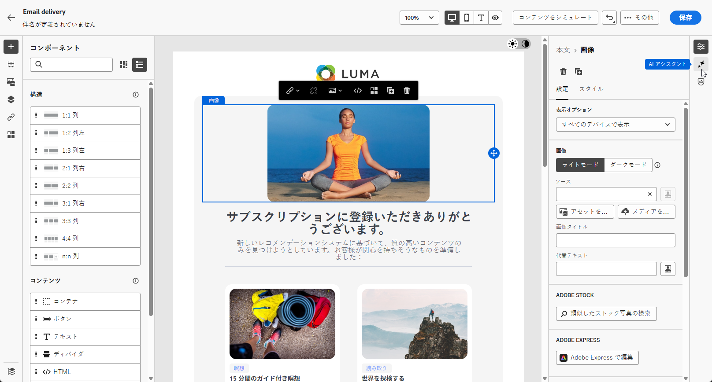

# コンテンツアシスタントを使用した画像生成 {#generative-image}

メールを作成しパーソナライズしたら、生成 AI を活用したコンテンツアシスタントを使用してコンテンツを強化できます。この機能により、パーソナライゼーションとコンテンツ改善のプロセスが簡単になります。

コンテンツアシスタントを使用してメール内の画像を生成したり改善したりするには、次の手順に従います。コンテンツアシスタントを使用して、完全な HTML コンテンツを作成したり（[こちらのページ](generative-email.md)を参照）、テキストコンテンツを生成したり（[こちらのページ](generative-content.md)を参照）することもできます。

>[!NOTE]
>
>この機能の使用を開始する前に、関連する[ガードレールと制限](generative-gs.md#guardrails-and-limitations)のトピックに目を通してください。

次の例では、コンテンツアシスタントを活用してコンテンツを最適化および改善し、より使いやすいエクスペリエンスを実現する方法を説明します。次の手順に従います。

1. メール配信を作成および設定したら、「**[!UICONTROL コンテンツを編集]**」をクリックします。

   メール配信の設定方法について詳しくは、[こちらのページ](../email/create-email-content.md)を参照してください。

1. 配信の&#x200B;**[!UICONTROL 基本的な詳細]**&#x200B;を入力します。完了したら、「**[!UICONTROL メールコンテンツを編集]**」をクリックします。

1. コンテンツアシスタントを使用して変更するアセットを選択します。

1. 右側のメニューから、「**[!UICONTROL エクスペリエンス生成]**」を選択します。

   {zoomable=&quot;yes&quot;}

1. 結果をうまく微調整するためのプロンプトを追加します。

   {zoomable=&quot;yes&quot;}

1. コンテンツアシスタントに追加のコンテキストを提供できるコンテンツを含んだブランドアセットを追加する場合は、「**[!UICONTROL ファイルをアップロード]**」を選択します。

   また、「**[!UICONTROL アップロードされたコンテンツ]**」をクリックして、以前に更新したファイルを見つけることもできます。アップロードしたコンテンツは、現在のユーザーのみが再利用できることに注意してください。

1. アセットの「**[!UICONTROL 縦横比]**」を選択します。これにより、アセットの幅と高さが決まります。

   16:9、4:3、3:2、1:1 など、一般的な比率から選択することも、カスタムサイズを入力することもできます。

1. 「**[!UICONTROL カラーとトーン]**」、「**[!UICONTROL コンテンツタイプ]**」、「**[!UICONTROL 照明]**」および「**[!UICONTROL コンポジション]**」の設定を、目的のアセット特性に合わせてカスタマイズします。

   {zoomable=&quot;yes&quot;}

1. プロンプトの設定が完了したら、「**[!UICONTROL 生成]**」をクリックします。

1. **[!UICONTROL バリエーションの提案]**&#x200B;を参照して、目的のアセットを見つけます。「**[!UICONTROL プレビュー]**」をクリックして、選択したバリエーションのフルスクリーンバージョンを表示します。

   {zoomable=&quot;yes&quot;}

1. 適切なコンテンツが見つかったら、「**[!UICONTROL 選択]**」をクリックします。

   {zoomable=&quot;yes&quot;}

1. メッセージコンテンツを定義したら、「**[!UICONTROL コンテンツをシミュレート]**」ボタンをクリックしてレンダリングを制御し、テストプロファイルでパーソナライゼーション設定を確認します。[詳細情報](../preview-test/preview-content.md)

   {zoomable=&quot;yes&quot;}

1. コンテンツ、オーディエンスおよびスケジュールを定義したら、メール配信の準備が整いました。[詳細情報](../monitor/prepare-send.md)
