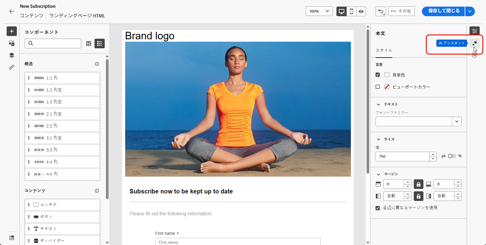
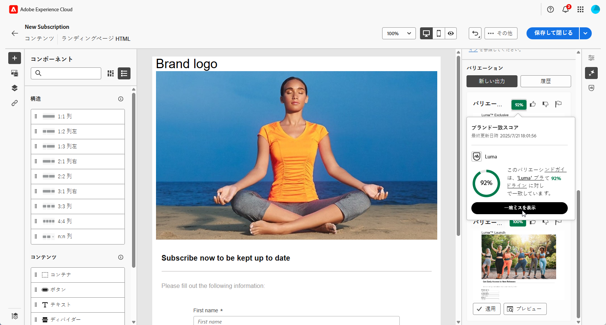
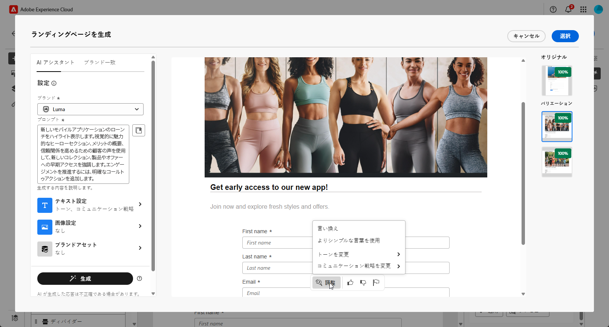
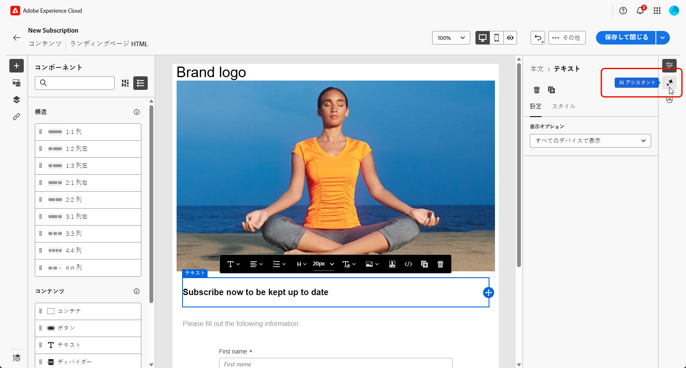
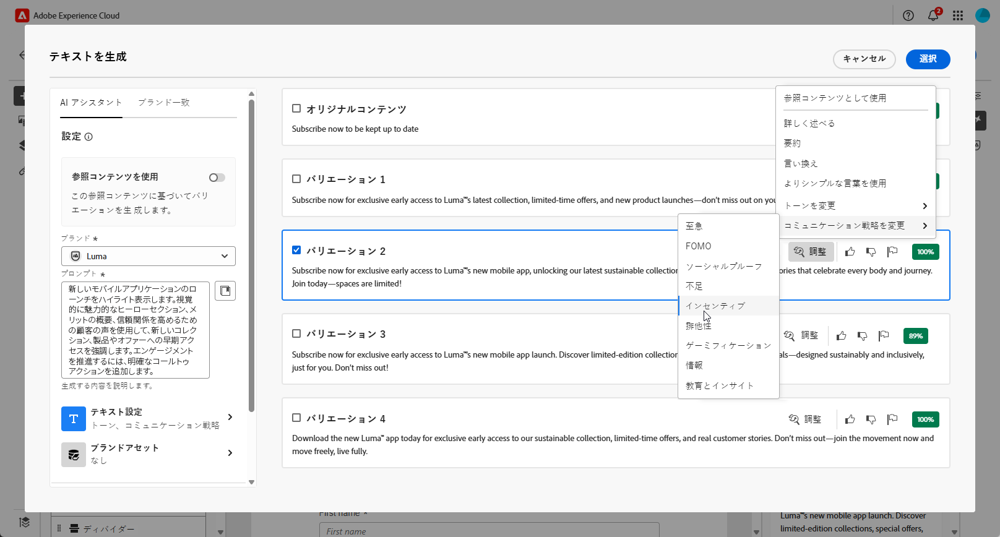
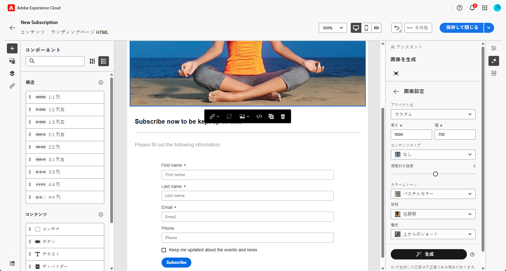

# AI アシスタントを使用したランディングページの生成{#generative-lp}

>[!CONTEXTUALHELP]
>id="acw_homepage_welcome_rn5"
>title="AI を使用したランディングページの生成"
>abstract="AI アシスタントを使用してランディングページ配信を作成できるようになりました。これにより、テキスト、画像または完全なページレイアウトを生成できます。"
>additional-url="https://experienceleague.adobe.com/docs/campaign-web/v8/release-notes/release-notes.html?lang=ja" text="リリースノートを参照してください"

>[!IMPORTANT]
>
>この機能の使用を開始する前に、関連する[ガードレールと制限](generative-gs.md#generative-guardrails)のトピックに目を通してください。
> 
>
>Adobe Campaign web の AI アシスタントを使用する前に、[ユーザー契約](https://www.adobe.com/jp/legal/licenses-terms/adobe-dx-gen-ai-user-guidelines.html)に同意する必要があります。詳しくは、アドビ担当者にお問い合わせください。

生成 AI を活用した Adobe Campaign web の AI アシスタントを使用して、ランディングページを変革します。

完全なページ、調整されたテキストスニペット、オーディエンスの共感を呼び、エンゲージメントとインタラクションを高めるカスタマイズされたビジュアルなど、効果的なコンテンツを簡単に作成できます。

Adobe Campaign web の AI アシスタントを使用する方法について詳しくは、以下のタブを参照してください。

>[!BEGINTABS]

>[!TAB 完全なランディングページの生成]

次の例では、AI アシスタントを活用して、既存のランディングページテンプレートを調整します。

1. ランディングページを作成および設定した後、「**[!UICONTROL コンテンツを編集]**」をクリックします。

   ランディングページの設定方法について詳しくは、[このページ](../landing-pages/create-lp.md)を参照してください。

1. 必要に応じてレイアウトをパーソナライズし、**[!UICONTROL AI アシスタント]**&#x200B;メニューにアクセスします。

   {zoomable="yes"}

1. 「**[!UICONTROL 元のコンテンツを使用]**」オプションを有効にして、AI アシスタントで、選択したコンテンツに基づいて新しいコンテンツをパーソナライズします。

1. 「**[!UICONTROL プロンプト]**」フィールドに生成する内容を記述して、コンテンツを微調整します。

   プロンプトの作成に関するサポートが必要な場合は、ランディングページを改善する様々なプロンプトのアイデアを提供する&#x200B;**[!UICONTROL プロンプトライブラリ]**&#x200B;にアクセスします。

   {zoomable="yes"}

1. 「**[!UICONTROL テキスト設定]**」オプションを使用してプロンプトを調整します。

   * **[!UICONTROL コミュニケーション戦略]**：生成テキストに最適なコミュニケーションスタイルを選択します。
   * **[!UICONTROL トーン]**：ランディングページのトーンは、オーディエンスの共感を呼ぶものでなければなりません。情報を提供する、遊び心がある、説得力がある、のいずれを求めているかに関わらず、AI アシスタントはメッセージを適切に調整できます。

   {zoomable="yes"}

1. 次の&#x200B;**[!UICONTROL 画像設定]**&#x200B;を選択します。

   * **[!UICONTROL コンテンツタイプ]**：これにより、視覚要素の性質が分類され、写真、グラフィック、アートなど、様々な視覚的表現が区別されます。
   * **[!UICONTROL 視覚的な強度]**：画像の強度を調整することで、画像の影響を制御できます。低い値（2）を設定すると、より柔らかく、抑制された外観が作成され、高い値（10）を設定すると、画像はより鮮やかで視覚的に強力になります。
   * **[!UICONTROL カラーとトーン]**：画像内のカラーの全体的な外観と、画像が伝えるムードまたは雰囲気。
   * **[!UICONTROL 照明]**：画像内の稲妻を指し、画像の雰囲気を形成し、特定の要素をハイライト表示します。
   * **[!UICONTROL 構成]**：画像のフレーム内の要素の配置を指します

   {zoomable="yes"}

1. **[!UICONTROL ブランドアセット]**&#x200B;メニューから、「**[!UICONTROL ブランドアセットをアップロード]**」をクリックして、AI アシスタントに追加のコンテキストを提供できるコンテンツを含むブランドアセットを追加するか、以前にアップロードしたものを選択します。

   以前にアップロードしたファイルは、**[!UICONTROL アップロードされたブランドアセット]**&#x200B;ドロップダウンで使用できます。生成に含めるアセットを切り替えるのみです。

   {zoomable="yes"}

1. プロンプトの準備が整ったら、「**[!UICONTROL 生成]**」をクリックします。

1. 生成された&#x200B;**[!UICONTROL バリエーション]**&#x200B;を参照して、「**[!UICONTROL プレビュー]**」をクリックし、選択したバリエーションのフルスクリーンバージョンを表示します。

1. **[!UICONTROL プレビュー]**&#x200B;ウィンドウ内の「**[!UICONTROL 絞り込み]**」オプションに移動して、追加のカスタマイズ機能にアクセスします。

   * **[!UICONTROL 言い換え]**：AI アシスタントは、メッセージを様々な方法で言い換えることができ、ユーザーが作成した文章を新鮮で、多様なオーディエンスを惹きつけるメッセージにします。

   * **[!UICONTROL よりシンプルな言葉を使用]**：AI アシスタントを活用して言語をわかりやすく簡素化し、幅広いオーディエンスがアクセスできるようにします。

   また、テキストの&#x200B;**[!UICONTROL トーン]**&#x200B;と&#x200B;**[!UICONTROL コミュニケーション戦略]**&#x200B;を変更することもできます。

   {zoomable="yes"}

1. 適切なコンテンツが見つかったら、「**[!UICONTROL 選択]**」をクリックします。

1. パーソナライゼーションフィールドを挿入し、プロファイルデータに基づいてランディングページのコンテンツをカスタマイズします。次に「**[!UICONTROL コンテンツをシミュレート]**」ボタンをクリックしてレンダリングを制御し、テストプロファイルでパーソナライゼーション設定を確認します。[詳細情報](../landing-pages/create-lp.md#test-landing-page)

ランディングページの準備が整ったら、公開して、メッセージで使用できるようにします。[詳細情報](../landing-pages/create-lp.md#publish-landing-page)

>[!TAB テキストのみの生成]

次の例では、AI アシスタントを活用して、ランディングページのコンテンツを強化します。

1. ランディングページを作成および設定した後、「**[!UICONTROL コンテンツを編集]**」をクリックします。

   ランディングページの設定方法について詳しくは、[このページ](../landing-pages/create-lp.md)を参照してください。

1. 「**[!UICONTROL テキストコンポーネント]**」を選択して、特定のコンテンツのみをターゲットにします。次に、**[!UICONTROL AI アシスタント]**&#x200B;メニューにアクセスします。

   {zoomable="yes"}

1. AI アシスタントの「**[!UICONTROL 元のコンテンツを使用]**」オプションを有効にして、選択したコンテンツに基づいて新しいコンテンツをパーソナライズします。

1. 「**[!UICONTROL プロンプト]**」フィールドに生成する内容を記述して、コンテンツを微調整します。

   プロンプトの作成に関するサポートが必要な場合は、ランディングページを改善する様々なプロンプトのアイデアを提供する&#x200B;**[!UICONTROL プロンプトライブラリ]**&#x200B;にアクセスします。

   {zoomable="yes"}

1. 「**[!UICONTROL テキスト設定]**」オプションを使用してプロンプトを調整します。

   * **[!UICONTROL コミュニケーション戦略]**：生成テキストに最適なコミュニケーションスタイルを選択します。
   * **[!UICONTROL トーン]**：ランディングページのトーンは、オーディエンスの共感を呼ぶものでなければなりません。情報を提供する、遊び心がある、説得力がある、のいずれを求めているかに関わらず、AI アシスタントはメッセージを適切に調整できます。
   * **テキストの長さ**：スライダーを使用して、テキストの目的の長さを選択します。

   {zoomable="yes"}

1. **[!UICONTROL ブランドアセット]**&#x200B;メニューから、「**[!UICONTROL ブランドアセットをアップロード]**」をクリックして、AI アシスタントに追加のコンテキストを提供できるコンテンツを含むブランドアセットを追加するか、以前にアップロードしたものを選択します。

   以前にアップロードしたファイルは、**[!UICONTROL アップロードされたブランドアセット]**&#x200B;ドロップダウンで使用できます。生成に含めるアセットを切り替えるのみです。

   {zoomable="yes"}

1. プロンプトの準備が整ったら、「**[!UICONTROL 生成]**」をクリックします。

1. 生成された&#x200B;**[!UICONTROL バリエーション]**&#x200B;を参照して、「**[!UICONTROL プレビュー]**」をクリックし、選択したバリエーションのフルスクリーンバージョンを表示します。

1. **[!UICONTROL プレビュー]**&#x200B;ウィンドウ内の「**[!UICONTROL 絞り込み]**」オプションに移動して、追加のカスタマイズ機能にアクセスします。

   * **[!UICONTROL 参照コンテンツとして使用]**：選択したバリアントは、他の結果を生成するための参照コンテンツとして機能します。

   * **[!UICONTROL 詳しく述べる]**：AI アシスタントは、特定のトピックを拡大できるようユーザーをサポートし、理解とエンゲージメントを深められるよう、追加の詳細を提供します。

   * **[!UICONTROL 要約する]**：情報が長すぎると、ランディングページ受信者に負担がかかる可能性があります。AI アシスタントを使用して、重要なポイントを明確かつ簡潔な概要に要約し、注意を引いてさらに読むよう促します。

   * **[!UICONTROL 言い換え]**：AI アシスタントは、メッセージを様々な方法で言い換えることができ、ユーザーが作成した文章を新鮮で、多様なオーディエンスを惹きつけるメッセージにします。

   * **[!UICONTROL よりシンプルな言葉を使用]**：AI アシスタントを活用して言語をわかりやすく簡素化し、幅広いオーディエンスがアクセスできるようにします。

   また、テキストの&#x200B;**[!UICONTROL トーン]**&#x200B;と&#x200B;**[!UICONTROL コミュニケーション戦略]**&#x200B;を変更することもできます。

   {zoomable="yes"}

1. 適切なコンテンツが見つかったら、「**[!UICONTROL 選択]**」をクリックします。

1. パーソナライゼーションフィールドを挿入し、プロファイルデータに基づいてランディングページのコンテンツをカスタマイズします。次に「**[!UICONTROL コンテンツをシミュレート]**」ボタンをクリックしてレンダリングを制御し、テストプロファイルでパーソナライゼーション設定を確認します。[詳細情報](../landing-pages/create-lp.md#test-landing-page)

ランディングページの準備が整ったら、公開して、メッセージで使用できるようにします。[詳細情報](../landing-pages/create-lp.md#publish-landing-page)

>[!TAB 画像のみの生成]

次の例では、AI アシスタントを活用してアセットを最適化および改善し、使いやすいエクスペリエンスを実現する方法を説明します。

1. ランディングページを作成および設定した後、「**[!UICONTROL コンテンツを編集]**」をクリックします。

   ランディングページの設定方法について詳しくは、[このページ](../landing-pages/create-lp.md)を参照してください。

1. AI アシスタントを使用して変更するアセットを選択します。

1. 右側のメニューから、「**[!UICONTROL AI アシスタント]**」を選択します。

   {zoomable="yes"}

1. AI アシスタントの「**[!UICONTROL 参照スタイル]**」オプションを有効にして、参照コンテンツに基づいて新しいコンテンツをパーソナライズします。また、画像をアップロードして、バリエーションにコンテキストを追加することもできます。

1. 「**[!UICONTROL プロンプト]**」フィールドに生成する内容を記述して、コンテンツを微調整します。

   プロンプトの作成に関するサポートが必要な場合は、ランディングページを改善する様々なプロンプトのアイデアを提供する&#x200B;**[!UICONTROL プロンプトライブラリ]**&#x200B;にアクセスします。

   {zoomable="yes"}

1. 「**[!UICONTROL 画像設定]**」オプションを使用してプロンプトを調整します。

   * **[!UICONTROL 縦横比]**：これにより、アセットの幅と高さが決まります。16:9、4:3、3:2、1:1 など、一般的な比率から選択することも、カスタムサイズを入力することもできます。
   * **[!UICONTROL コンテンツタイプ]**：これにより、視覚要素の性質が分類され、写真、グラフィック、アートなど、様々な視覚的表現が区別されます。
   * **[!UICONTROL 視覚的な強度]**：画像の強度を調整することで、画像の影響を制御できます。低い値（2）を設定すると、より柔らかく、抑制された外観が作成され、高い値（10）を設定すると、画像はより鮮やかで視覚的に強力になります。
   * **[!UICONTROL カラーとトーン]**：画像内のカラーの全体的な外観と、画像が伝えるムードまたは雰囲気。
   * **[!UICONTROL 照明]**：画像内の稲妻を指し、画像の雰囲気を形成し、特定の要素をハイライト表示します。
   * **[!UICONTROL 構成]**：画像のフレーム内の要素の配置を指します

   {zoomable="yes"}

1. **[!UICONTROL ブランドアセット]**&#x200B;メニューから、「**[!UICONTROL ブランドアセットをアップロード]**」をクリックして、AI アシスタントに追加のコンテキストを提供できるコンテンツを含むブランドアセットを追加するか、以前にアップロードしたものを選択します。

   以前にアップロードしたファイルは、**[!UICONTROL アップロードされたブランドアセット]**&#x200B;ドロップダウンで使用できます。生成に含めるアセットを切り替えるのみです。

1. プロンプトの設定が完了したら、「**[!UICONTROL 生成]**」をクリックします。

1. **[!UICONTROL バリエーションの提案]**&#x200B;を参照して、目的のアセットを見つけます。

   「**[!UICONTROL プレビュー]**」をクリックして、選択したバリエーションのフルスクリーンバージョンを表示します。

1. このバリアントに関連する画像を表示する場合は、「**[!UICONTROL 類似を生成]**」を選択します。

   {zoomable="yes"}

1. 適切なコンテンツが見つかったら、「**[!UICONTROL 選択]**」をクリックします。

1. メッセージコンテンツを定義したら、「**[!UICONTROL コンテンツをシミュレート]**」ボタンをクリックして、レンダリングを制御し、テストプロファイルでパーソナライゼーション設定を確認します。[詳細情報](../landing-pages/create-lp.md#test-landing-page)

ランディングページの準備が整ったら、公開して、メッセージで使用できるようにします。[詳細情報](../landing-pages/create-lp.md#publish-landing-page)

>[!ENDTABS]
