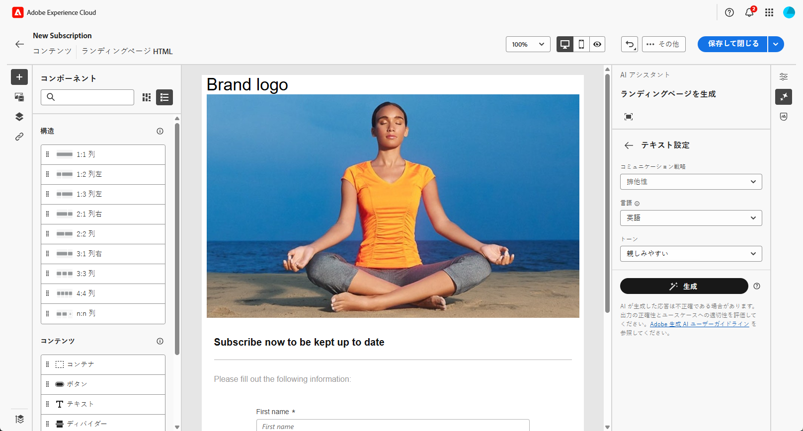
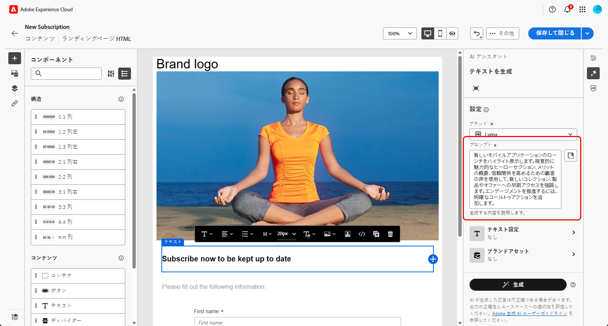

# AI アシスタントによるランディングページの生成{#generative-lp}

>[!CONTEXTUALHELP]
>id="acw_homepage_welcome_rn5"
>title="AI を使用したランディングページの生成"
>abstract="AI アシスタントを使用してランディングページ配信を作成し、テキスト、画像または完全なページレイアウトを生成できるようになりました。"
>additional-url="https://experienceleague.adobe.com/docs/campaign-web/v8/release-notes/release-notes.html?lang=ja" text="リリースノートを参照してください"

>[!IMPORTANT]
>
>この機能の使用を開始する前に、関連する [ ガードレールと制限事項 ](generative-gs.md#generative-guardrails) を参照してください。
> 
>
>Adobe Campaign Web で AI アシスタントを使用するには、[ ユーザー使用許諾契約 ](https://www.adobe.com/jp/legal/licenses-terms/adobe-dx-gen-ai-user-guidelines.html) に同意する必要があります。 詳しくは、アドビ担当者にお問い合わせください。

ジェネレーティブ AI を活用した、Adobe Campaign Web の AI アシスタントでランディングページを変革します。

完全なページ、調整されたテキストスニペット、オーディエンスの共感を呼び、エンゲージメントとインタラクションを高めるカスタマイズされたビジュアルなど、効果的なコンテンツを簡単に作成できます。

Adobe Campaign Web での AI アシスタントの使用方法については、以下のタブを参照してください。

>[!BEGINTABS]

>[!TAB 完全なランディングページの生成]

次の例では、AI アシスタントを活用して既存のランディングページテンプレートを調整する方法を説明します。

1. ランディングページを作成および設定した後、「**[!UICONTROL コンテンツを編集]**」をクリックします。

   ランディングページの設定方法について詳しくは、[このページ](../landing-pages/create-lp.md)を参照してください。

1. 必要に応じてレイアウトをパーソナライズし、**[!UICONTROL AI アシスタント]** メニューにアクセスします。

   {zoomable="yes"}

1. AI アシスタントで「**[!UICONTROL 元のコンテンツを使用]**」オプションを有効にして、選択したコンテンツに基づいて新しいコンテンツをパーソナライズします。

1. 生成する内容を「**[!UICONTROL プロンプト]**」フィールドで記述して、コンテンツを微調整します。

   プロンプトの作成に支援が必要な場合は、**[!UICONTROL プロンプトライブラリ]** にアクセスしてください。これは、ランディングページを改善するための様々なプロンプトのアイデアを提供します。

   {zoomable="yes"}

1. 「**[!UICONTROL テキスト設定]**」オプションを使用してプロンプトを調整します。

   * **[!UICONTROL コミュニケーション戦略]**：生成テキストに最適なコミュニケーションスタイルを選択します。
   * **[!UICONTROL トーン]**：ランディングページのトーンは、オーディエンスの共感を呼ぶものでなければなりません。情報を提供する、遊び心がある、説得力がある、のいずれを求めているかに関わらず、AI アシスタントはメッセージを適切に適応させることができます。

   {zoomable="yes"}

1. 次の&#x200B;**[!UICONTROL 画像設定]**&#x200B;を選択します。

   * **[!UICONTROL コンテンツタイプ]**：視覚要素の特性を分類し、写真、グラフィック、アートなどの視覚的表現の様々な形式を区別します。
   * **[!UICONTROL 視覚的な強さ]**：画像の強さを調整して、画像の影響を制御します。 低い値（2）を設定するとソフトな外観が作成され、高い値（10）を設定すると画像が鮮明になります。
   * **[!UICONTROL カラーとトーン]**：画像内の色の全体的な外観と、それが伝えるムードや雰囲気を調整します。
   * **[!UICONTROL 照明]**：画像内に存在する照明を変更して、雰囲気を形作り、特定の要素をハイライトします。
   * **[!UICONTROL 構成]**：画像のフレーム内の要素を配置します。

   {zoomable="yes"}

1. **[!UICONTROL ブランドアセット]** メニューから、「**[!UICONTROL ブランドアセットをアップロード]**」をクリックして、AI アシスタントに追加のコンテキストを提供するブランドアセットを追加するか、以前にアップロードしたものを選択します。

   以前にアップロードしたファイルは、**[!UICONTROL アップロードされたブランドアセット]**&#x200B;ドロップダウンで使用できます。世代に含めるアセットを切り替えます。

   {zoomable="yes"}

1. プロンプトの準備が整ったら、「**[!UICONTROL 生成]**」をクリックします。

1. 生成された **[!UICONTROL バリエーション]** を参照し、**[!UICONTROL プレビュー]** をクリックして、選択したバリエーションのフルスクリーンバージョンを表示します。

1. **[!UICONTROL プレビュー]**&#x200B;ウィンドウ内の「**[!UICONTROL 絞り込み]**」オプションに移動して、追加のカスタマイズ機能にアクセスします。

   * **[!UICONTROL フレーズ変更]**:AI アシスタントは、さまざまな方法でメッセージをフレーズ変更できるので、多様なオーディエンスにとって魅力的で斬新な文章を維持できます。
   * **[!UICONTROL よりシンプルな言語の使用]**：言語を簡素化して、より幅広いオーディエンスに明確でアクセシビリティを提供します。

   また、テキストの&#x200B;**[!UICONTROL トーン]**&#x200B;と&#x200B;**[!UICONTROL コミュニケーション戦略]**&#x200B;を変更することもできます。

   {zoomable="yes"}

1. 適切なコンテンツが見つかったら、「**[!UICONTROL 選択]**」をクリックします。

1. パーソナライゼーションフィールドを挿入して、プロファイルデータに基づいてランディングページのコンテンツをカスタマイズします。 次に、「**[!UICONTROL コンテンツをシミュレート]**」ボタンをクリックしてレンダリングを制御し、テストプロファイルでパーソナライゼーション設定を確認します。 [詳細情報](../landing-pages/create-lp.md#test-landing-page)。

ランディングページの準備が整ったら、メッセージで使用できるように公開します。 [詳細情報](../landing-pages/create-lp.md#publish-landing-page)。

>[!TAB テキストのみの生成]

次の例では、AI アシスタントを活用してランディングページのコンテンツを強化する方法を説明します。

1. ランディングページを作成および設定した後、「**[!UICONTROL コンテンツを編集]**」をクリックします。

   ランディングページの設定方法について詳しくは、[このページ](../landing-pages/create-lp.md)を参照してください。

1. **[!UICONTROL テキストコンポーネント]** を選択して特定のコンテンツをターゲットにし、**[!UICONTROL AI アシスタント]** メニューにアクセスします。

   {zoomable="yes"}

1. AI アシスタントで「**[!UICONTROL 元のコンテンツを使用]**」オプションを有効にして、選択したコンテンツに基づいて新しいコンテンツをパーソナライズします。

1. 生成する内容を「**[!UICONTROL プロンプト]**」フィールドで記述して、コンテンツを微調整します。

   プロンプトの作成に支援が必要な場合は、**[!UICONTROL プロンプトライブラリ]** にアクセスしてください。このライブラリは、ランディングページを改善するための様々なプロンプトのアイデアを提供します。

   {zoomable="yes"}

1. 「**[!UICONTROL テキスト設定]**」オプションを使用してプロンプトを調整します。

   * **[!UICONTROL コミュニケーション戦略]**：生成テキストに最適なコミュニケーションスタイルを選択します。
   * **[!UICONTROL トーン]**：ランディングページのトーンは、オーディエンスの共感を呼ぶものでなければなりません。情報を提供する、遊び心がある、説得力がある、のいずれを求めているかに関わらず、AI アシスタントはメッセージを適切に適応させることができます。
   * **テキストの長さ**：スライダーを使用して、テキストの目的の長さを選択します。

   {zoomable="yes"}

1. **[!UICONTROL ブランドアセット]** メニューから、「**[!UICONTROL ブランドアセットをアップロード]**」をクリックして、AI アシスタントに追加のコンテキストを提供するブランドアセットを追加するか、以前にアップロードしたものを選択します。

   以前にアップロードしたファイルは、**[!UICONTROL アップロードされたブランドアセット]**&#x200B;ドロップダウンで使用できます。世代に含めるアセットを切り替えます。

   {zoomable="yes"}

1. プロンプトの準備が整ったら、「**[!UICONTROL 生成]**」をクリックします。

1. 生成された **[!UICONTROL バリエーション]** を参照し、**[!UICONTROL プレビュー]** をクリックして、選択したバリエーションのフルスクリーンバージョンを表示します。

1. **[!UICONTROL プレビュー]**&#x200B;ウィンドウ内の「**[!UICONTROL 絞り込み]**」オプションに移動して、追加のカスタマイズ機能にアクセスします。

   * **[!UICONTROL 参照コンテンツとして使用]**：選択したバリアントは、他の結果を生成するための参照コンテンツとして機能します。
   * **[!UICONTROL 精巧]**：特定のトピックを展開し、理解とエンゲージメントを深めるために追加の詳細を提供します。
   * **[!UICONTROL 要約]**：長い情報を明確で簡潔な要約にまとめ、注意を引いてさらに読むようにします。
   * **[!UICONTROL 再フレーズ]**：様々な方法でメッセージを再フレーズ化して、書き物を新鮮に保ち、様々なオーディエンスを惹き付けます。
   * **[!UICONTROL よりシンプルな言語の使用]**：言語を簡素化して、より幅広いオーディエンスに明確でアクセシビリティを提供します。

   また、テキストの&#x200B;**[!UICONTROL トーン]**&#x200B;と&#x200B;**[!UICONTROL コミュニケーション戦略]**&#x200B;を変更することもできます。

   {zoomable="yes"}

1. 適切なコンテンツが見つかったら、「**[!UICONTROL 選択]**」をクリックします。

1. パーソナライゼーションフィールドを挿入して、プロファイルデータに基づいてランディングページのコンテンツをカスタマイズします。 次に、「**[!UICONTROL コンテンツをシミュレート]**」ボタンをクリックしてレンダリングを制御し、テストプロファイルでパーソナライゼーション設定を確認します。 [詳細情報](../landing-pages/create-lp.md#test-landing-page)。

ランディングページの準備が整ったら、メッセージで使用できるように公開します。 [詳細情報](../landing-pages/create-lp.md#publish-landing-page)。

>[!TAB 画像のみの生成]

以下の例では、AI アシスタントを活用してアセットを最適化および改善し、より使いやすいエクスペリエンスを確保する方法について説明します。

1. ランディングページを作成および設定した後、「**[!UICONTROL コンテンツを編集]**」をクリックします。

   ランディングページの設定方法について詳しくは、[このページ](../landing-pages/create-lp.md)を参照してください。

1. AI アシスタントで変更するアセットを選択します。

1. 右側のメニューから、「**[!UICONTROL AI アシスタント]**」を選択します。

   {zoomable="yes"}

1. AI アシスタントの **[!UICONTROL 参照スタイル]** オプションを有効にして、参照コンテンツに基づいて新しいコンテンツをパーソナライズします。 また、画像をアップロードして、バリエーションにコンテキストを追加することもできます。

1. 生成する内容を「**[!UICONTROL プロンプト]**」フィールドで記述して、コンテンツを微調整します。

   プロンプトの作成に支援が必要な場合は、**[!UICONTROL プロンプトライブラリ]** にアクセスしてください。このライブラリは、ランディングページを改善するための様々なプロンプトのアイデアを提供します。

   {zoomable="yes"}

1. 「**[!UICONTROL 画像設定]**」オプションを使用してプロンプトを調整します。

   * **[!UICONTROL 縦横比]**：アセットの幅と高さを指定します。 16:9、4:3、3:2、1:1 などの一般的な比率から選択するか、カスタムサイズを入力します。
   * **[!UICONTROL コンテンツタイプ]**：視覚要素の特性を分類し、写真、グラフィック、アートなどの視覚的表現の様々な形式を区別します。
   * **[!UICONTROL 視覚的な強さ]**：画像の強さを調整して、画像の影響を制御します。 低い値（2）を設定するとソフトな外観が作成され、高い値（10）を設定すると画像が鮮明になります。
   * **[!UICONTROL カラーとトーン]**：画像内の色の全体的な外観と、それが伝えるムードや雰囲気を調整します。
   * **[!UICONTROL 照明]**：画像内に存在する照明を変更して、雰囲気を形作り、特定の要素をハイライトします。
   * **[!UICONTROL 構成]**：画像のフレーム内の要素を配置します。

   {zoomable="yes"}

1. **[!UICONTROL ブランドアセット]** メニューから、「**[!UICONTROL ブランドアセットをアップロード]**」をクリックして、AI アシスタントに追加のコンテキストを提供するブランドアセットを追加するか、以前にアップロードしたものを選択します。

   以前にアップロードしたファイルは、**[!UICONTROL アップロードされたブランドアセット]**&#x200B;ドロップダウンで使用できます。世代に含めるアセットを切り替えます。

1. プロンプトの設定が完了したら、「**[!UICONTROL 生成]**」をクリックします。

1. **[!UICONTROL バリエーションの提案]** を参照し、目的のアセットを見つけます。

   「**[!UICONTROL プレビュー]**」をクリックして、選択したバリエーションのフルスクリーンバージョンを表示します。

1. このバリアントに関連する画像を表示する場合は、「**[!UICONTROL 類似を生成]**」を選択します。

   {zoomable="yes"}

1. 適切なコンテンツが見つかったら、「**[!UICONTROL 選択]**」をクリックします。

1. メッセージコンテンツを定義したら、「**[!UICONTROL コンテンツをシミュレート]**」ボタンをクリックしてレンダリングを制御し、テストプロファイルでパーソナライゼーション設定を確認します。 [詳細情報](../landing-pages/create-lp.md#test-landing-page)。

ランディングページの準備が整ったら、メッセージで使用できるように公開します。 [詳細情報](../landing-pages/create-lp.md#publish-landing-page)。

>[!ENDTABS]