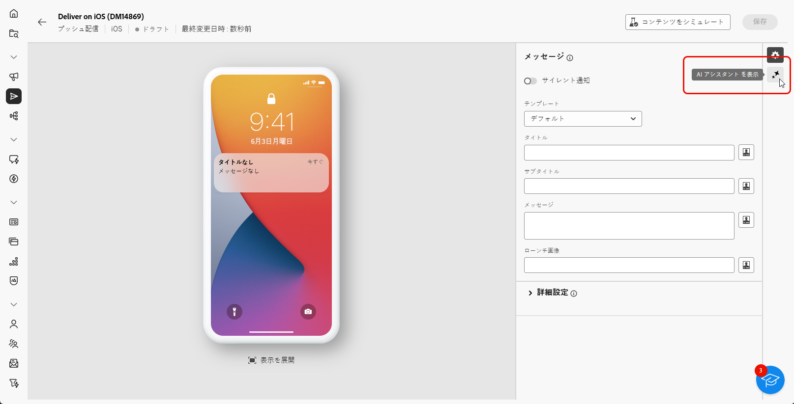
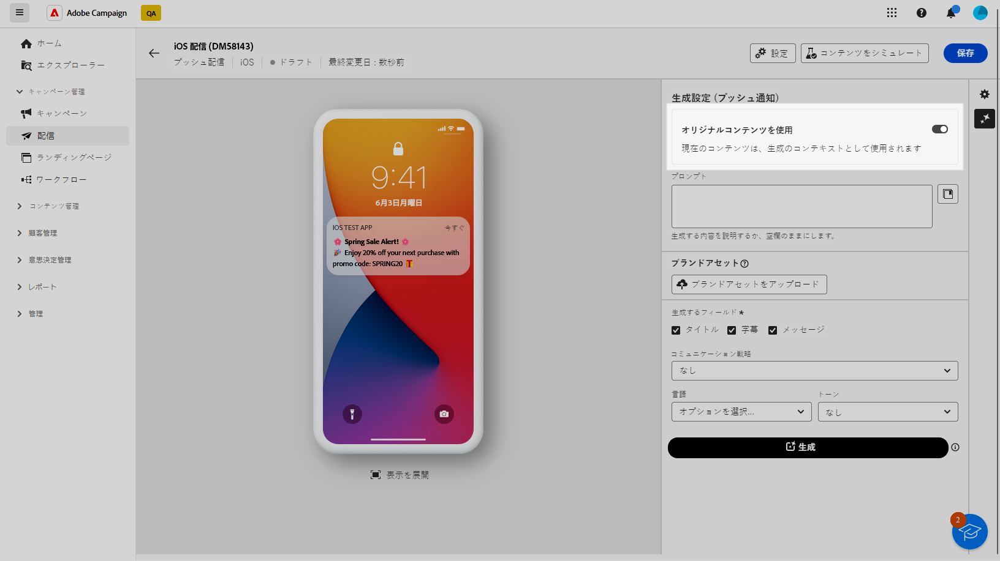
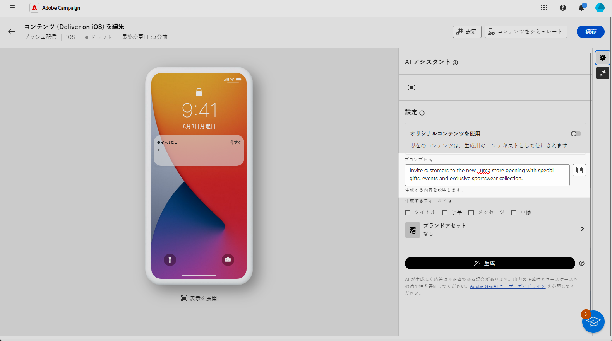
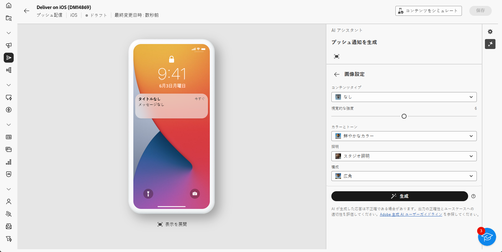
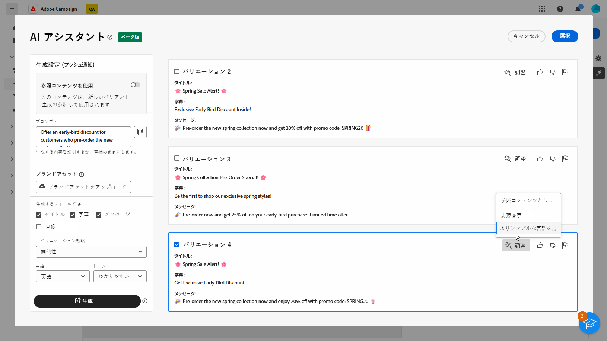
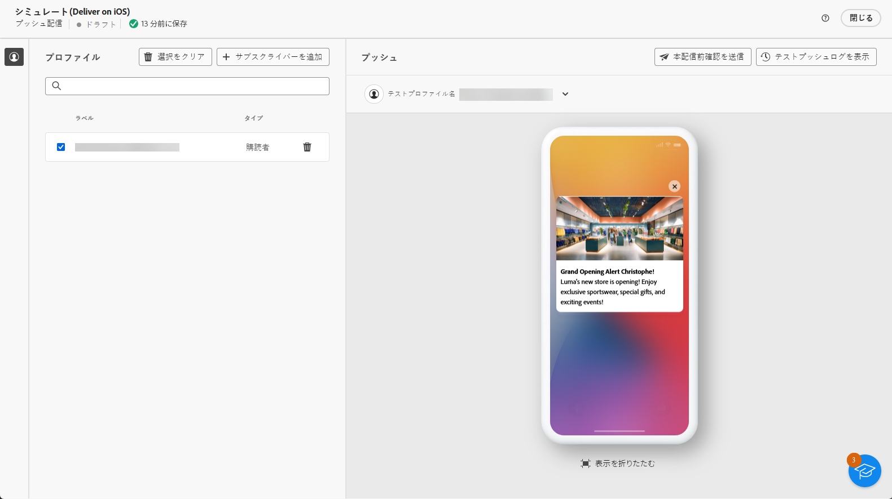

# AI アシスタントを使用したプッシュ通知の生成 {#generative-push}

>[!BEGINSHADEBOX]

**目次**

* [AI アシスタントの基本を学ぶ](generative-gs.md)
* [AI アシスタントを使用したメールの生成](generative-content.md)
* [AI アシスタントを使用した SMS の生成](generative-sms.md)
* AI アシスタントを使用したプッシュ通知の生成

>[!ENDSHADEBOX]

AI アシスタントを使用すると、オーディエンスの共感を呼ぶ可能性の高い様々なコンテンツを提案することで、配信の影響を最適化できます。

>[!NOTE]
>
>この機能の使用を開始する前に、関連する[ガードレールと制限](generative-gs.md#guardrails-and-limitations)のトピックに目を通してください。

次の例では、AI アシスタントを活用して説得力のあるメッセージを作成し、魅力的な顧客体験を作成します。

1. プッシュ通知配信を作成および設定した後、「**[!UICONTROL コンテンツを編集]**」をクリックします。

   プッシュ配信の設定方法について詳しくは、[このページ](../push/create-push.md)を参照してください。

1. 配信の&#x200B;**[!UICONTROL 基本的な詳細]**&#x200B;を入力します。完了したら、「**[!UICONTROL コンテンツを編集]**」をクリックします。

1. 必要に応じて、プッシュ通知をパーソナライズします。[詳細情報](../push/content-push.md)

1. **[!UICONTROL AI アシスタントを表示]**&#x200B;メニューにアクセスします。

   {zoomable=&quot;yes&quot;}

1. 「**[!UICONTROL 元のコンテンツを使用]**」オプションを有効にして、AI アシスタントで、配信、配信名、選択したオーディエンスに基づいて新しいコンテンツをパーソナライズします。

   >[!IMPORTANT]
   >
   > プロンプトは、常に現在のコンテンツに結び付ける必要があります。

   {zoomable=&quot;yes&quot;}

1. 「**[!UICONTROL プロンプト]**」フィールドに生成する内容を記述して、コンテンツを微調整します。

   プロンプトの作成に関するサポートが必要な場合は、配信を改善するための様々なプロンプトのアイデアを提供する&#x200B;**[!UICONTROL プロンプトライブラリ]**&#x200B;にアクセスします。

   {zoomable=&quot;yes&quot;}

1. 「**[!UICONTROL ブランドアセットをアップロード]**」を選択し、AI アシスタントに追加のコンテキストを提供できるコンテンツを含むブランドアセットを追加します。

1. 生成するフィールド（「**[!UICONTROL タイトル]**」、「**[!UICONTROL サブタイトル]**」または「**[!UICONTROL メッセージ]**」）を選択します。

1. 様々なオプションを使用してプロンプトを調整します。

   * **[!UICONTROL コミュニケーション戦略]**：生成テキストに最適なコミュニケーションスタイルを選択します。
   * **[!UICONTROL 言語]**：コンテンツを生成する言語を選択します。
   * **[!UICONTROL トーン]**：メールのトーンは、オーディエンスの共感を呼びます。情報を提供する、遊び心がある、説得力がある、のいずれを求めているかに関わらず、AI アシスタントはメッセージを適切に適応させることができます。

   {zoomable=&quot;yes&quot;}

1. プロンプトの準備が整ったら、「**[!UICONTROL 生成]**」をクリックします。

1. 生成された&#x200B;**[!UICONTROL バリエーション]**&#x200B;を参照して、「**[!UICONTROL プレビュー]**」をクリックし、選択したバリエーションのフルスクリーンバージョンを表示します。

1. **[!UICONTROL プレビュー]**&#x200B;ウィンドウ内の「**[!UICONTROL 絞り込み]**」オプションに移動して、追加のカスタマイズ機能にアクセスします。

   * **[!UICONTROL 参照コンテンツとして使用]**：選択したバリアントは、他の結果を生成するための参照コンテンツとして機能します。

   * **[!UICONTROL 言い換え]**：AI アシスタントは、メッセージを様々な方法で言い換えることができ、ユーザーが作成した文章を新鮮で、多様なオーディエンスを惹きつけるメッセージにします。

   * **[!UICONTROL よりシンプルな言語の使用]**:AI アシスタントを活用して言語を簡素化し、より広いオーディエンスに対して明確なアクセシビリティを確保します。

   {zoomable=&quot;yes&quot;}

1. 適切なコンテンツが見つかったら、「**[!UICONTROL 選択]**」をクリックします。

1. パーソナライゼーションフィールドを挿入し、プロファイルデータに基づいてメールコンテンツをカスタマイズします。次に「**[!UICONTROL コンテンツをシミュレート]**」ボタンをクリックしてレンダリングを制御し、テストプロファイルでパーソナライゼーション設定を確認します。[詳細情報](../preview-test/preview-content.md)

   {zoomable=&quot;yes&quot;}

コンテンツ、オーディエンスおよびスケジュールを定義したら、プッシュ配信の準備が整います。[詳細情報](../monitor/prepare-send.md)

