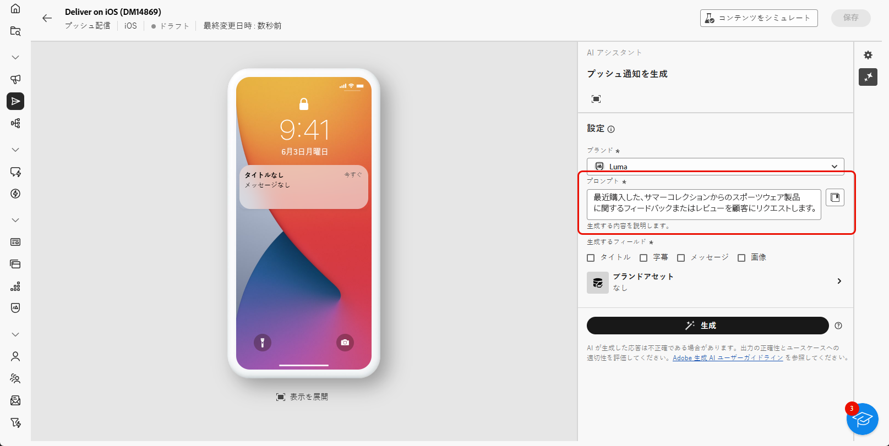

# AI アシスタントを使用したプッシュ通知の生成 {#generative-push}

>[!IMPORTANT]
>
>この機能の使用を開始する前に、関連する [ ガードレールと制限事項 ](generative-gs.md#generative-guardrails) を参照してください。
> 
>
>Adobe Campaign Web で AI アシスタントを使用するには、[ ユーザー使用許諾契約 ](https://www.adobe.com/jp/legal/licenses-terms/adobe-dx-gen-ai-user-guidelines.html) に同意する必要があります。 詳しくは、アドビ担当者にお問い合わせください。

AI アシスタントは、オーディエンスの共感を得られる様々なコンテンツを提案することで、配信の影響を最適化するのに役立ちます。

次の例では、AI アシスタントを活用して、魅力的なメッセージを作成し、より魅力的なカスタマーエクスペリエンスを作成します。

1. プッシュ通知配信を作成して設定したら、「**[!UICONTROL コンテンツを編集]**」をクリックします。

   プッシュ配信の設定について詳しくは、[ このページ ](../push/create-push.md) を参照してください。

1. **[!UICONTROL AI アシスタントを表示]**&#x200B;メニューにアクセスします。

   {zoomable="yes"}

1. 「**[!UICONTROL 元のコンテンツを使用]**」オプションを有効にして、AI アシスタントで、選択したコンテンツに基づいて新しいコンテンツをパーソナライズします。

1. 生成する内容を「**[!UICONTROL プロンプト]**」フィールドで記述して、コンテンツを微調整します。

   プロンプトの作成に支援が必要な場合は、**[!UICONTROL プロンプトライブラリ]** にアクセスします。これは、配信を改善するための様々な迅速なアイデアを提供します。

   {zoomable="yes"}

1. 生成するフィールド（**[!UICONTROL タイトル]**、**[!UICONTROL メッセージ]**、**[!UICONTROL 画像]** を選択します。

1. 「**[!UICONTROL テキスト設定]**」オプションを使用してプロンプトを調整します。

   * **[!UICONTROL コミュニケーション戦略]**：生成テキストに最適なコミュニケーションスタイルを選択します。
   * **[!UICONTROL トーン]**：オーディエンスの共感を得られるようにメールのトーンを調整します。 情報を提供する、遊び心がある、説得力がある、のいずれを求めているかに関わらず、AI アシスタントはメッセージを適切に調整します。

   {zoomable="yes"}

1. 次の&#x200B;**[!UICONTROL 画像設定]**&#x200B;を選択します。

   * **[!UICONTROL コンテンツタイプ]**：視覚要素の特性を分類し、写真、グラフィック、アートなどの視覚的表現の様々な形式を区別します。
   * **[!UICONTROL 視覚的な強さ]**：画像の強さを調整して、画像の影響を制御します。 設定（2）を小さくすると、より柔らかく、より抑制された外観が作成され、設定（10）を大きくすると、画像がより鮮やかになり、視覚的に強力になります。
   * **[!UICONTROL 照明]**：画像内の照明を調整して、雰囲気を形作り、特定の要素をハイライトします。
   * **[!UICONTROL 構成]**：画像のフレーム内に要素を配置します。

   {zoomable="yes"}

1. **[!UICONTROL ブランドアセット]** メニューから、「**[!UICONTROL ブランドアセットをアップロード]**」をクリックして、AI アシスタントに追加のコンテキストを提供するコンテンツを含むブランドアセットを追加するか、以前にアップロードしたものを選択します。

   以前にアップロードしたファイルは、**[!UICONTROL アップロードされたブランドアセット]**&#x200B;ドロップダウンで使用できます。世代に含めるアセットを切り替えます。

1. プロンプトの準備が整ったら、「**[!UICONTROL 生成]**」をクリックします。

1. 生成された&#x200B;**[!UICONTROL バリエーション]**&#x200B;を参照して、「**[!UICONTROL プレビュー]**」をクリックし、選択したバリエーションのフルスクリーンバージョンを表示します。

1. **[!UICONTROL プレビュー]**&#x200B;ウィンドウ内の「**[!UICONTROL 絞り込み]**」オプションに移動して、追加のカスタマイズ機能にアクセスします。

   * **[!UICONTROL 参照コンテンツとして使用]**：他の結果を生成するための参照コンテンツとして、選択したバリアントを使用します。
   * **[!UICONTROL 再フレーズ]**：様々な方法でメッセージを再フレーズ化して、多様なオーディエンスにとって書き物を新鮮で魅力的な状態に保ちます。
   * **[!UICONTROL よりシンプルな言語の使用]**：言語を簡素化して、より幅広いオーディエンスに明確でアクセシビリティを提供します。

   また、テキストの&#x200B;**[!UICONTROL トーン]**&#x200B;と&#x200B;**[!UICONTROL コミュニケーション戦略]**&#x200B;を変更することもできます。

   {zoomable="yes"}

1. 適切なコンテンツが見つかったら、「**[!UICONTROL 選択]**」をクリックします。

1. パーソナライゼーションフィールドを挿入して、プロファイルデータに基づいてメールコンテンツをカスタマイズします。 次に、「**[!UICONTROL コンテンツをシミュレート]**」ボタンをクリックしてレンダリングを制御し、テストプロファイルでパーソナライゼーション設定を確認します。 [詳細情報](../preview-test/preview-content.md)

   {zoomable="yes"}

コンテンツ、オーディエンスおよびスケジュールを定義したら、プッシュ配信を準備します。 [詳細情報](../monitor/prepare-send.md)