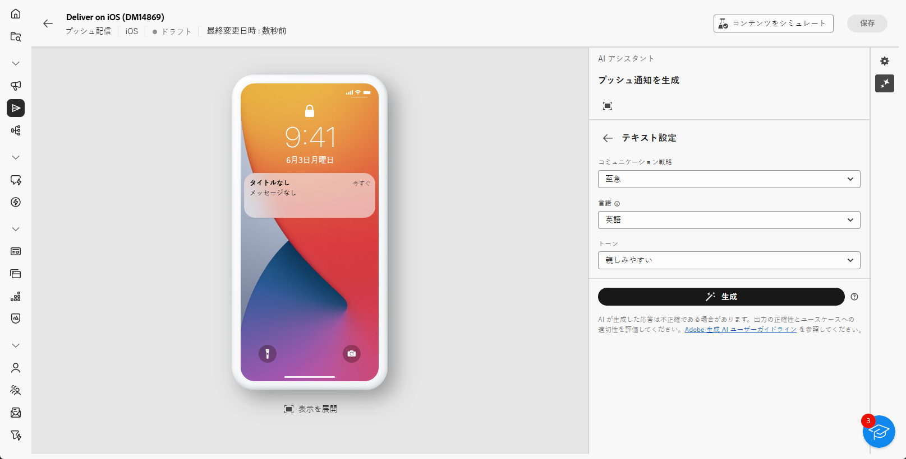

# AI アシスタントを使用したプッシュ通知の生成 {#generative-push}

>[!IMPORTANT]
>
>この機能の使用を開始する前に、関連する[ガードレールと制限](generative-gs.md#generative-guardrails)を参照してください。
>> 
>
>Adobe Campaign web の AI アシスタントを使用する前に、[ユーザー契約](https://www.adobe.com/jp/legal/licenses-terms/adobe-dx-gen-ai-user-guidelines.html)に同意する必要があります。詳しくは、アドビ担当者にお問い合わせください。

AI アシスタントは、オーディエンスの共感を呼ぶ様々なコンテンツを提案することで、配信の影響を最適化するのに役立ちます。

次の例では、AI アシスタントを活用して説得力のあるメッセージを作成し、魅力的な顧客体験を作成します。

1. プッシュ通知配信を作成および設定した後、「**[!UICONTROL コンテンツを編集]**」をクリックします。

   プッシュ配信の設定方法について詳しくは、[このページ](../push/create-push.md)を参照してください。

1. **[!UICONTROL AI アシスタントを表示]**&#x200B;メニューにアクセスします。

   {zoomable="yes"}

1. 「**[!UICONTROL 元のコンテンツを使用]**」オプションを有効にして、AI アシスタントで、選択したコンテンツに基づいて新しいコンテンツをパーソナライズします。

1. 「**[!UICONTROL プロンプト]**」フィールドに生成する内容を記述して、コンテンツを微調整します。

   プロンプトの作成に関するサポートが必要な場合は、配信を改善する様々なプロンプトのアイデアを提供する&#x200B;**[!UICONTROL プロンプトライブラリ]**&#x200B;にアクセスします。

   {zoomable="yes"}

1. 生成するフィールド（「**[!UICONTROL タイトル]**」、「**[!UICONTROL サブタイトル]**」、「**[!UICONTROL メッセージ]**」、「**[!UICONTROL 画像]**」）を選択します。

1. 「**[!UICONTROL テキスト設定]**」オプションを使用してプロンプトを調整します。

   * **[!UICONTROL コミュニケーション戦略]**：生成テキストに最適なコミュニケーションスタイルを選択します。
   * **[!UICONTROL トーン]**：メールのトーンを調整して、オーディエンスの共感を呼びます。情報の提供や遊び心、説得力のいずれを目指している場合であっても、AI アシスタントはメッセージを適切に調整します。

   {zoomable="yes"}

1. **[!UICONTROL 画像設定]**&#x200B;を選択します。

   * **[!UICONTROL コンテンツタイプ]**：視覚要素の性質が分類され、写真、グラフィック、アートなど、様々な視覚的表現が区別されます。
   * **[!UICONTROL 視覚的な強度]**：画像の強度を調整することで、画像の影響を制御します。低い値（2）を設定すると、より柔らかく、抑制された外観が作成され、高い値（10）を設定すると、画像はより鮮やかで視覚的に強力になります。
   * **[!UICONTROL 照明]**：画像の照明を調整して雰囲気を形成し、特定の要素をハイライト表示します。
   * **[!UICONTROL 構成]**：画像のフレーム内に要素を配置します。

   {zoomable="yes"}

1. **[!UICONTROL ブランドアセット]**&#x200B;メニューから、「**[!UICONTROL ブランドアセットをアップロード]**」をクリックして、AI アシスタントに追加のコンテキストを提供するコンテンツを含むブランドアセットを追加するか、以前にアップロードしたものを選択します。

   以前にアップロードしたファイルは、**[!UICONTROL アップロードされたブランドアセット]**&#x200B;ドロップダウンで使用できます。生成に含めるアセットを切り替えます。

1. プロンプトの準備が整ったら、「**[!UICONTROL 生成]**」をクリックします。

1. 生成された&#x200B;**[!UICONTROL バリエーション]**&#x200B;を参照して、「**[!UICONTROL プレビュー]**」をクリックし、選択したバリエーションのフルスクリーンバージョンを表示するか、「**[!UICONTROL 適用]**」をクリックして、現在のコンテンツを置き換えます。

1. パーセンテージアイコンをクリックし、**[!UICONTROL ブランド整合性スコア]**&#x200B;を表示して、ブランドとの不整合を特定します。

   詳しくは、[ブランド整合性スコア](../content/brands-score.md)を参照してください。

   {zoomable="yes"}

1. **[!UICONTROL プレビュー]**&#x200B;ウィンドウ内の「**[!UICONTROL 絞り込み]**」オプションに移動して、追加のカスタマイズ機能にアクセスします。

   * **[!UICONTROL 参照コンテンツとして使用]**：選択したバリアントを、他の結果を生成する参照コンテンツとして使用します。
   * **[!UICONTROL 言い換え]**：メッセージを様々な方法で言い換え、ユーザーが作成した文章を新鮮で、多様なオーディエンスを惹きつけるメッセージにします。
   * **[!UICONTROL シンプルな言葉を使用]**：言語をわかりやすく簡素化し、幅広いオーディエンスがアクセスできるようにします。

   また、テキストの&#x200B;**[!UICONTROL トーン]**&#x200B;と&#x200B;**[!UICONTROL コミュニケーション戦略]**&#x200B;を変更することもできます。

   {zoomable="yes"}

1. 「**[!UICONTROL ブランド整合性]**」タブを開き、コンテンツが[ブランドガイドライン](../content/brands.md)と整合している程度を確認します。

1. 適切なコンテンツが見つかったら、「**[!UICONTROL 選択]**」をクリックします。

1. パーソナライゼーションフィールドを挿入して、プロファイルデータに基づいてメールコンテンツをカスタマイズします。次に「**[!UICONTROL コンテンツをシミュレート]**」ボタンをクリックしてレンダリングを制御し、テストプロファイルでパーソナライゼーション設定を確認します。[詳細情報](../preview-test/preview-content.md)

コンテンツ、オーディエンスおよびスケジュールを定義する際、プッシュ配信の準備を行います。[詳細情報](../monitor/prepare-send.md)