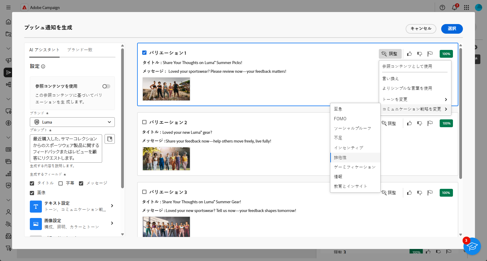
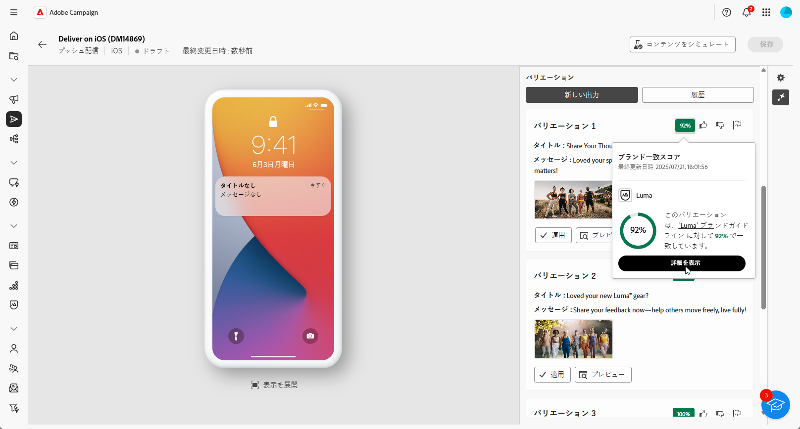

# Journey Optimizerの AI アシスタントによるプッシュ通知の生成 – コンテンツアクセラレーター  {#generative-push}

>[!IMPORTANT]
>
>この機能の使用を開始する前に、関連する[ガードレールと制限](generative-gs.md#generative-guardrails)のトピックに目を通してください。
> 
>
>コンテンツアクセラレーションのためにAdobe Campaign Web で AI アシスタントを使用するには、[ ユーザー使用許諾契約 ](https://www.adobe.com/legal/licenses-terms/adobe-dx-gen-ai-user-guidelines.html) に同意する必要があります。 詳しくは、アドビ担当者にお問い合わせください。

Journey Optimizerのコンテンツ促進用 AI アシスタントを使用すると、オーディエンスの共感を得られる可能性の高い様々なコンテンツを提案することで、配信の影響を最適化するのに役立ちます。

次の例では、AI アシスタントを活用して説得力のあるメッセージを作成し、魅力的な顧客体験を作成します。

1. プッシュ通知配信を作成および設定した後、「**[!UICONTROL コンテンツを編集]**」をクリックします。

   プッシュ配信の設定方法について詳しくは、[このページ](../push/create-push.md)を参照してください。

1. **[!UICONTROL AI アシスタントを表示]**&#x200B;メニューにアクセスします。

   {zoomable="yes"}

1. AI アシスタントの「**[!UICONTROL 元のコンテンツを使用]**」オプションを有効にして、選択したコンテンツに基づいて新しいコンテンツをパーソナライズします。

1. 「**[!UICONTROL プロンプト]**」フィールドに生成する内容を記述して、コンテンツを微調整します。

   プロンプトの作成に関するサポートが必要な場合は、配信を改善するための様々なプロンプトのアイデアを提供する&#x200B;**[!UICONTROL プロンプトライブラリ]**&#x200B;にアクセスします。

   {zoomable="yes"}

1. 生成するフィールド（**[!UICONTROL タイトル]**、**[!UICONTROL メッセージ]**、**[!UICONTROL 画像]** を選択します。

1. 「**[!UICONTROL テキスト設定]**」オプションを使用してプロンプトをカスタマイズします。

   * **[!UICONTROL コミュニケーション戦略]**：生成テキストに最適なコミュニケーションスタイルを選択します。
   * **[!UICONTROL トーン]**：メールのトーンは、オーディエンスの共感を呼びます。情報を提供する、遊び心がある、説得力がある、のいずれを求めているかに関わらず、AI アシスタントはメッセージを適切に適応させることができます。

   {zoomable="yes"}

1. **[!UICONTROL 画像設定]** を選択します。

   * **[!UICONTROL コンテンツタイプ]**：これにより、視覚要素の性質が分類され、写真、グラフィック、アートなど、様々な視覚的表現が区別されます。
   * **[!UICONTROL 視覚的な強さ]**：画像の強さを調整することで、画像の影響を制御できます。 低い値（2）を設定すると、より柔らかく抑制された外観が作成され、高い値（10）を設定すると、画像がより鮮やかで視覚的に強力になります。
   * **[!UICONTROL 照明]**：画像内の稲妻を指し、画像の雰囲気を形成し、特定の要素をハイライト表示します。
   * **[!UICONTROL 構成]**：画像のフレーム内の要素の配置を指します

   {zoomable="yes"}

1. **[!UICONTROL ブランドアセット]** メニューで「**[!UICONTROL ブランドアセットをアップロード]**」をクリックし、AI アシスタントに追加のコンテキストを提供できるコンテンツを含むブランドアセットを追加するか、以前にアップロードしたものを選択します。

   以前にアップロードしたファイルは、**[!UICONTROL アップロードされたブランドアセット]** ドロップダウンで使用できます。 世代に含めるアセットを切り替えるだけです。

1. プロンプトの準備が整ったら、「**[!UICONTROL 生成]**」をクリックします。

1. 生成された&#x200B;**[!UICONTROL バリエーション]**&#x200B;を参照して、「**[!UICONTROL プレビュー]**」をクリックし、選択したバリエーションのフルスクリーンバージョンを表示します。

1. **[!UICONTROL プレビュー]**&#x200B;ウィンドウ内の「**[!UICONTROL 絞り込み]**」オプションに移動して、追加のカスタマイズ機能にアクセスします。

   * **[!UICONTROL 参照コンテンツとして使用]**：選択したバリアントは、他の結果を生成するための参照コンテンツとして機能します。

   * **[!UICONTROL 言い換え]**：AI アシスタントは、メッセージを様々な方法で言い換えることができ、ユーザーが作成した文章を新鮮で、多様なオーディエンスを惹きつけるメッセージにします。

   * **[!UICONTROL よりシンプルな言葉を使用]**：AI アシスタントを活用して言語をわかりやすく簡素化し、幅広いオーディエンスがアクセスできるようにします。

   また、テキストの **[!UICONTROL トーン]** と **[!UICONTROL コミュニケーション戦略]** を変更することもできます。

   {zoomable="yes"}

1. 適切なコンテンツが見つかったら、「**[!UICONTROL 選択]**」をクリックします。

1. パーソナライゼーションフィールドを挿入し、プロファイルデータに基づいてメールコンテンツをカスタマイズします。次に「**[!UICONTROL コンテンツをシミュレート]**」ボタンをクリックしてレンダリングを制御し、テストプロファイルでパーソナライゼーション設定を確認します。[詳細情報](../preview-test/preview-content.md)

   {zoomable="yes"}

コンテンツ、オーディエンスおよびスケジュールを定義したら、プッシュ配信の準備が整います。[詳細情報](../monitor/prepare-send.md)

