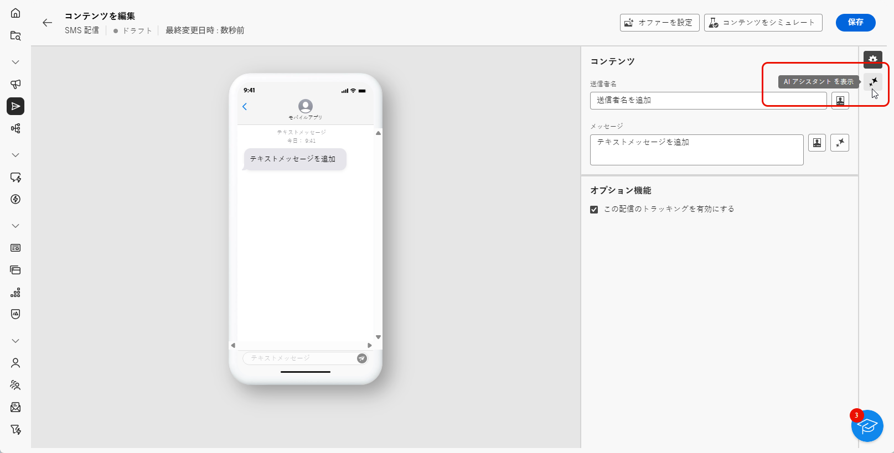

# AI アシスタントを使用した SMS の生成 {#generative-sms}

>[!BEGINSHADEBOX]

**目次**

* [AI アシスタントの基本を学ぶ](generative-gs.md)
* [AI アシスタントを使用したメールの生成](generative-content.md)
* AI アシスタントを使用した SMS の生成
* [AI アシスタントを使用したプッシュ通知の生成](generative-push.md)

>[!ENDSHADEBOX]

SMS メッセージをオーディエンスに合わせて作成してパーソナライズしたら、革新的な AI テクノロジーを利用した Campaign の AI アシスタントを利用して、コミュニケーションを次のレベルに引き上げます。

この便利なツールは、コンテンツを絞り込むためのインテリジェントな提案を提供し、メッセージが効果的に共感を呼び、エンゲージメントを最大化します。

>[!NOTE]
>
>この機能の使用を開始する前に、関連する[ガードレールと制限](generative-gs.md#guardrails-and-limitations)のトピックに目を通してください。

1. SMS 配信を作成および設定した後、「**[!UICONTROL コンテンツを編集]**」をクリックします。

   SMS 配信の設定方法について詳しくは、[このページ](../sms/create-sms.md)を参照してください。

1. 配信の&#x200B;**[!UICONTROL 基本的な詳細]**&#x200B;を入力します。完了したら、「**[!UICONTROL コンテンツを編集]**」をクリックします。

1. 必要に応じて、SMS メッセージをパーソナライズします。[詳細情報](../sms/content-sms.md)

1. **[!UICONTROL AI アシスタントを表示]**&#x200B;メニューにアクセスします。

   {zoomable=&quot;yes&quot;}

1. 「**[!UICONTROL 元のコンテンツを使用]**」オプションを有効にして、AI アシスタントで、配信、配信名、選択したオーディエンスに基づいて新しいコンテンツをパーソナライズします。

   >[!IMPORTANT]
   >
   > プロンプトは、常に現在のコンテンツに結び付ける必要があります。

1. 「**[!UICONTROL プロンプト]**」フィールドに生成する内容を記述して、コンテンツを微調整します。

   プロンプトの作成に関するサポートが必要な場合は、配信を改善するための様々なプロンプトのアイデアを提供する&#x200B;**[!UICONTROL プロンプトライブラリ]**&#x200B;にアクセスします。

   {zoomable=&quot;yes&quot;}

1. 「**[!UICONTROL ブランドアセットをアップロード]**」を選択し、AI アシスタントに追加のコンテキストを提供できるコンテンツを含むブランドアセットを追加します。

1. 様々なオプションを使用してプロンプトを調整します。

   * **[!UICONTROL コミュニケーション戦略]**：生成テキストに適した通信方法を選択します。
   * **[!UICONTROL 言語]**：バリアントのコンテンツの言語を選択します。
   * **[!UICONTROL トーン]**：テキストがオーディエンスと目的に適したものになります。
   * **[!UICONTROL 長さ]**：範囲スライダーを使用して、コンテンツの長さを選択します。

   {zoomable=&quot;yes&quot;}

1. プロンプトの準備が整ったら、「**[!UICONTROL 生成]**」をクリックします。

1. 生成された&#x200B;**[!UICONTROL バリエーション]**&#x200B;を参照して、「**[!UICONTROL プレビュー]**」をクリックし、選択したバリエーションのフルスクリーンバージョンを表示します。

1. **[!UICONTROL プレビュー]**&#x200B;ウィンドウ内の「**[!UICONTROL 絞り込み]**」オプションに移動して、追加のカスタマイズ機能にアクセスし、環境設定に合わせてバリエーションを微調整します。

   * **[!UICONTROL 参照コンテンツとして使用]**：選択したバリアントは、他の結果を生成するための参照コンテンツとして機能します。

   * **[!UICONTROL よりシンプルな言語の使用]**:AI アシスタントは、誰でも理解できる明確で簡潔なメッセージを記述するのに役立ちます。

   * **[!UICONTROL 言い換え]**：AI アシスタントは、メッセージを言い換えて、様々なオーディエンスに魅力的なコンテンツを提供し続けます。

   {zoomable=&quot;yes&quot;}

1. 適切なコンテンツが見つかったら、「**[!UICONTROL 選択]**」をクリックします。

1. パーソナライゼーションフィールドを挿入して、プロファイルデータに基づいて SMS コンテンツをカスタマイズします。[コンテンツのパーソナライゼーションの詳細情報](../personalization/personalize.md)

   {zoomable=&quot;yes&quot;}

1. メッセージコンテンツを定義したら、「**[!UICONTROL コンテンツをシミュレート]**」ボタンをクリックして、レンダリングを制御し、テストプロファイルでパーソナライゼーション設定を確認します。[詳細情報](../preview-test/preview-content.md)

   {zoomable=&quot;yes&quot;}

コンテンツ、オーディエンスおよびスケジュールを定義したら、SMS 配信の準備が整います。[詳細情報](../monitor/prepare-send.md)
