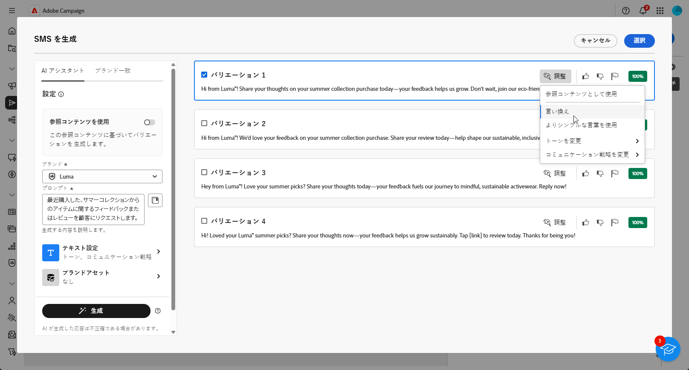

# AI アシスタントコンテンツアクセラレータを使用した SMS の生成 {#generative-sms}

>[!IMPORTANT]
>
>この機能の使用を開始する前に、関連する[ガードレールと制限](generative-gs.md#generative-guardrails)のトピックに目を通してください。
> 
>
>Adobe Campaign Web で AI Assistant コンテンツアクセラレーターを使用するには、[ ユーザー使用許諾契約 ](https://www.adobe.com/legal/licenses-terms/adobe-dx-gen-ai-user-guidelines.html) に同意する必要があります。 詳しくは、アドビ担当者にお問い合わせください。

オーディエンスに合わせて SMS メッセージを作成しパーソナライズしたら、革新的な AI テクノロジーを活用したAdobe Campaign Web の AI Assistant コンテンツアクセラレーターを使用して、コミュニケーションを次のレベルに引き上げます。

この便利なツールは、コンテンツを絞り込むインテリジェントな提案を提供し、メッセージが効果的に共感を呼び、エンゲージメントを最大化します。

>[!BEGINTABS]

>[!TAB 完全な SMS 生成]

1. SMS 配信を作成および設定した後、「**[!UICONTROL コンテンツを編集]**」をクリックします。

   SMS 配信の設定方法について詳しくは、[このページ](../sms/create-sms.md)を参照してください。

1. 配信の&#x200B;**[!UICONTROL 基本的な詳細]**&#x200B;を入力します。完了したら、「**[!UICONTROL コンテンツを編集]**」をクリックします。

1. **[!UICONTROL AI アシスタントを表示]**&#x200B;メニューにアクセスします。

   {zoomable="yes"}

1. 「**[!UICONTROL プロンプト]**」フィールドに生成する内容を記述して、コンテンツを微調整します。

   プロンプトの作成に関するサポートが必要な場合は、配信を改善するための様々なプロンプトのアイデアを提供する&#x200B;**[!UICONTROL プロンプトライブラリ]**&#x200B;にアクセスします。

   {zoomable="yes"}

1. 「**[!UICONTROL テキスト設定]**」オプションを使用してプロンプトを調整します。

   * **[!UICONTROL コミュニケーション戦略]**：生成テキストに最適なコミュニケーションスタイルを選択します。
   * **[!UICONTROL トーン]**：メールのトーンは、オーディエンスの共感を呼びます。情報を提供する、遊び心がある、説得力がある、のいずれを求めているかに関わらず、AI アシスタントはメッセージを適切に適応させることができます。
   * **テキストの長さ**：スライダーを使用して、テキストの目的の長さを選択します。

   {zoomable="yes"}

1. **[!UICONTROL ブランドアセット]**&#x200B;メニューから、「**[!UICONTROL ブランドアセットをアップロード]**」をクリックして、AI アシスタントに追加のコンテキストを提供できるコンテンツを含むブランドアセットを追加するか、以前にアップロードしたものを選択します。

   以前にアップロードしたファイルは、**[!UICONTROL アップロードされたブランドアセット]**&#x200B;ドロップダウンで使用できます。生成に含めるアセットを切り替えるのみです。

1. プロンプトの準備が整ったら、「**[!UICONTROL 生成]**」をクリックします。

1. 生成された&#x200B;**[!UICONTROL バリエーション]**&#x200B;を参照して、「**[!UICONTROL プレビュー]**」をクリックし、選択したバリエーションのフルスクリーンバージョンを表示します。

   {zoomable="yes"}

1. **[!UICONTROL プレビュー]**&#x200B;ウィンドウ内の「**[!UICONTROL 絞り込み]**」オプションに移動して、追加のカスタマイズ機能にアクセスし、環境設定に合わせてバリエーションを微調整します。

   * **[!UICONTROL 参照コンテンツとして使用]**：選択したバリアントは、他の結果を生成する参照コンテンツとして機能します。

   * **[!UICONTROL よりシンプルな言葉を使用]**：AI アシスタントは、誰でも理解できる明確で簡潔なメッセージを記述するのに役立ちます。

   * **[!UICONTROL 言い換え]**：AI アシスタントは、メッセージを言い換えて、様々なオーディエンスに魅力的なコンテンツを提供し続けます。

   また、テキストの&#x200B;**[!UICONTROL トーン]**&#x200B;と&#x200B;**[!UICONTROL コミュニケーション戦略]**&#x200B;を変更することもできます。

   {zoomable="yes"}

1. 適切なコンテンツが見つかったら、「**[!UICONTROL 選択]**」をクリックします。

1. パーソナライゼーションフィールドを挿入して、プロファイルデータに基づいて SMS コンテンツをカスタマイズします。[コンテンツのパーソナライゼーションの詳細情報](../personalization/personalize.md)

   {zoomable="yes"}

1. メッセージコンテンツを定義したら、「**[!UICONTROL コンテンツをシミュレート]**」ボタンをクリックして、レンダリングを制御し、テストプロファイルでパーソナライゼーション設定を確認します。[詳細情報](../preview-test/preview-content.md)

   {zoomable="yes"}

コンテンツ、オーディエンスおよびスケジュールを定義したら、SMS 配信の準備が整います。[詳細情報](../monitor/prepare-send.md)

>[!TAB テキストのみの生成]

1. SMS 配信を作成および設定した後、「**[!UICONTROL コンテンツを編集]**」をクリックします。

   SMS 配信の設定方法について詳しくは、[このページ](../sms/create-sms.md)を参照してください。

1. 配信の&#x200B;**[!UICONTROL 基本的な詳細]**&#x200B;を入力します。完了したら、「**[!UICONTROL コンテンツを編集]**」をクリックします。

1. 必要に応じて、SMS メッセージをパーソナライズします。[詳細情報](../sms/content-sms.md)

1. 「**[!UICONTROL メッセージ]**」フィールドの横にある **[!UICONTROL AI アシスタント]**&#x200B;メニューにアクセスします。

   {zoomable="yes"}

1. AI Assistant コンテンツ アクセラレータの [**[!UICONTROL 参照コンテンツを使用]**] オプションを有効にして、選択したコンテンツに基づいて新しいコンテンツをパーソナライズします。

1. 「**[!UICONTROL プロンプト]**」フィールドに生成する内容を記述して、コンテンツを微調整します。

   プロンプトの作成に関するサポートが必要な場合は、キャンペーンを改善する様々なプロンプトのアイデアを提供する&#x200B;**[!UICONTROL プロンプトライブラリ]**&#x200B;にアクセスします。

   {zoomable="yes"}

1. 「**[!UICONTROL テキスト設定]**」オプションを使用してプロンプトをカスタマイズします。

   * **[!UICONTROL コミュニケーション戦略]**：生成テキストに適した通信方法を選択します。
   * **[!UICONTROL 言語]**：バリアントのコンテンツの言語を選択します。
   * **[!UICONTROL トーン]**：テキストがオーディエンスと目的に適したものになります。
   * **[!UICONTROL 長さ]**：範囲スライダーを使用して、コンテンツの長さを選択します。

   {zoomable="yes"}

1. **[!UICONTROL ブランドアセット]**&#x200B;メニューから、「**[!UICONTROL ブランドアセットをアップロード]**」をクリックして、AI アシスタントに追加のコンテキストを提供できるコンテンツを含むブランドアセットを追加するか、以前にアップロードしたものを選択します。

   以前にアップロードしたファイルは、**[!UICONTROL アップロードされたブランドアセット]**&#x200B;ドロップダウンで使用できます。生成に含めるアセットを切り替えるのみです。

1. プロンプトの準備が整ったら、「**[!UICONTROL 生成]**」をクリックします。

1. 生成された&#x200B;**[!UICONTROL バリエーション]**&#x200B;を参照して、「**[!UICONTROL プレビュー]**」をクリックし、選択したバリエーションのフルスクリーンバージョンを表示します。

1. **[!UICONTROL プレビュー]**&#x200B;ウィンドウ内の「**[!UICONTROL 絞り込み]**」オプションに移動して、追加のカスタマイズ機能にアクセスし、環境設定に合わせてバリエーションを微調整します。

   * **[!UICONTROL 参照コンテンツとして使用]**：選択したバリアントは、他の結果を生成する参照コンテンツとして機能します。

   * **[!UICONTROL 言い換え]**：AI アシスタントは、メッセージを様々な方法で言い換えることができ、ユーザーが作成した文章を新鮮で、多様なオーディエンスを惹きつけるメッセージにします。

   * **[!UICONTROL よりシンプルな言葉を使用]**：AI アシスタントを活用して言語をわかりやすく簡素化し、幅広いオーディエンスがアクセスできるようにします。

   また、テキストの&#x200B;**[!UICONTROL トーン]**&#x200B;と&#x200B;**[!UICONTROL コミュニケーション戦略]**&#x200B;を変更することもできます。

   {zoomable="yes"}

1. 適切なコンテンツが見つかったら、「**[!UICONTROL 選択]**」をクリックします。

1. パーソナライゼーションフィールドを挿入して、プロファイルデータに基づいて SMS コンテンツをカスタマイズします。[コンテンツのパーソナライゼーションの詳細情報](../personalization/personalize.md)

1. メッセージコンテンツを定義したら、「**[!UICONTROL コンテンツをシミュレート]**」ボタンをクリックして、レンダリングを制御し、テストプロファイルでパーソナライゼーション設定を確認します。[詳細情報](../preview-test/preview-content.md)

   {zoomable="yes"}

コンテンツ、オーディエンスおよびスケジュールを定義したら、SMS 配信の準備が整います。[詳細情報](../monitor/prepare-send.md)

>[!ENDTABS]
