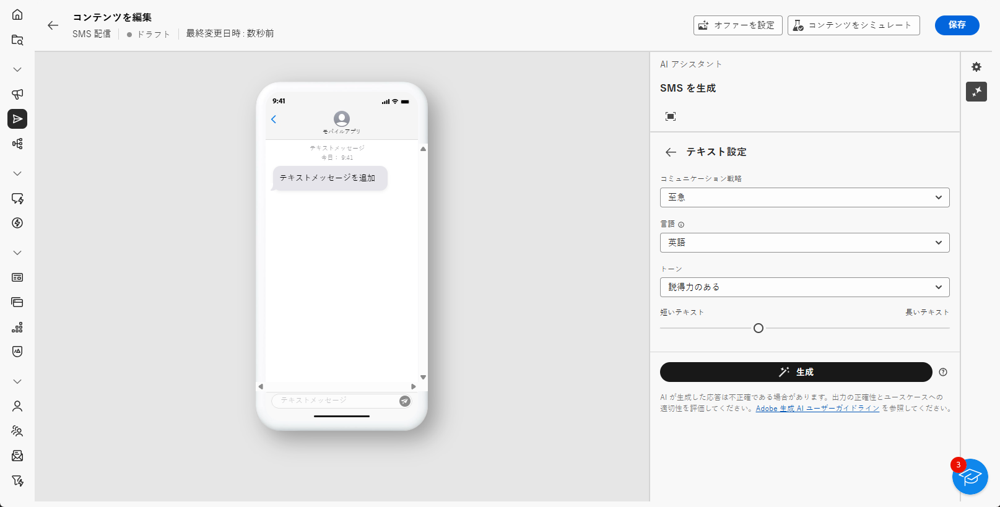

# AI アシスタントによる SMS 生成 {#generative-sms}

>[!BEGINSHADEBOX]

**Table of content**

* [AI アシスタントの基本を学ぶ](generative-gs.md)
* [AI アシスタントによるメール生成](generative-content.md)
* **[AI アシスタントによる SMS 生成](generative-sms.md)**
* [AI アシスタントによるプッシュ通知の生成](generative-push.md)

>[!ENDSHADEBOX]

オーディエンスに合わせて SMS メッセージを作成しパーソナライズしたら、革新的な AI テクノロジーを活用した Campaign の AI アシスタントを活用して、コミュニケーションを次のレベルに引き上げます。

この便利なツールは、コンテンツを調整するためのインテリジェントな提案を提供し、メッセージが効果的に共鳴し、エンゲージメントを最大化できるようにします。

>[!NOTE]
>
>この機能の使用を開始する前に、関連する[ガードレールと制限](generative-gs.md#guardrails-and-limitations)のトピックに目を通してください。

1. SMS 配信を作成および設定したら、 **[!UICONTROL コンテンツを編集]**.

   SMS 配信の設定方法について詳しくは、以下を参照してください。 [このページ](../sms/create-sms.md).

1. 配信の&#x200B;**[!UICONTROL 基本的な詳細]**&#x200B;を入力します。完了したら、 **[!UICONTROL コンテンツを編集]**.

1. 必要に応じて SMS メッセージをパーソナライズします。 [詳細情報](../sms/content-sms.md)

1. へのアクセス **[!UICONTROL AI アシスタントを表示]** メニュー。

   {zoomable=&quot;yes&quot;}

1. で生成する内容を記述して、コンテンツを微調整します **[!UICONTROL プロンプト]** フィールド。

   プロンプトの作成に関する支援を探している場合は、 **[!UICONTROL プロンプトライブラリ]** を使用すると、配信を改善するための様々な迅速なアイデアを利用できます。

   {zoomable=&quot;yes&quot;}

1. を有効にする **[!UICONTROL 現在のコンテキストで拡張]** 配信、配信名、選択したオーディエンスに基づいて新しいコンテンツをパーソナライズするための AI アシスタントのオプション。

   >[!IMPORTANT]
   >
   > プロンプトは、ブランドアセットをアップロードするか、を有効にすることで、常に特定のコンテキストに結び付ける必要があります。 **[!UICONTROL 現在のコンテンツの拡張]** オプション。

1. を選択 **[!UICONTROL ブランドアセットのアップロード]** AI アシスタントに追加のコンテキストを提供できるコンテンツを含むブランドアセットを追加します。

1. ニーズに最も合う&#x200B;**[!UICONTROL コミュニケーション戦略]**&#x200B;を選択します。これは、生成されるテキストのトーンとスタイルに影響を与えます。

1. 生成されるテキストの&#x200B;**[!UICONTROL 言語]**&#x200B;および&#x200B;**[!UICONTROL トーン]**&#x200B;を選びます。これにより、テキストがオーディエンスと目的に適したものになります。

   {zoomable=&quot;yes&quot;}

1. スライダーコントロールを使用して、生成されるテキストの長さを設定します。

1. プロンプトの準備が整ったら、「**[!UICONTROL 生成]**」をクリックします。

1. 生成された&#x200B;**[!UICONTROL バリエーション]**&#x200B;を参照して、適切なコンテンツが見つかったら、「**[!UICONTROL 適用]**」をクリックします。

   「**[!UICONTROL プレビュー]**」をクリックして、選択したバリエーションのフルスクリーンバージョンを表示します。

   {zoomable=&quot;yes&quot;}

1. パーソナライゼーションフィールドを挿入して、プロファイルデータに基づいて SMS コンテンツをカスタマイズします。 [コンテンツのパーソナライゼーションの詳細情報](../personalization/personalize.md)

   {zoomable=&quot;yes&quot;}

1. メッセージコンテンツを定義したら、「**[!UICONTROL コンテンツをシミュレート]**」ボタンをクリックして、レンダリングを制御し、テストプロファイルでパーソナライゼーション設定を確認します。[詳細情報](../preview-test/preview-content.md)

   {zoomable=&quot;yes&quot;}

1. コンテンツ、オーディエンスおよびスケジュールを定義したら、SMS 配信の準備を始めます。 [詳細情報](../monitor/prepare-send.md)
