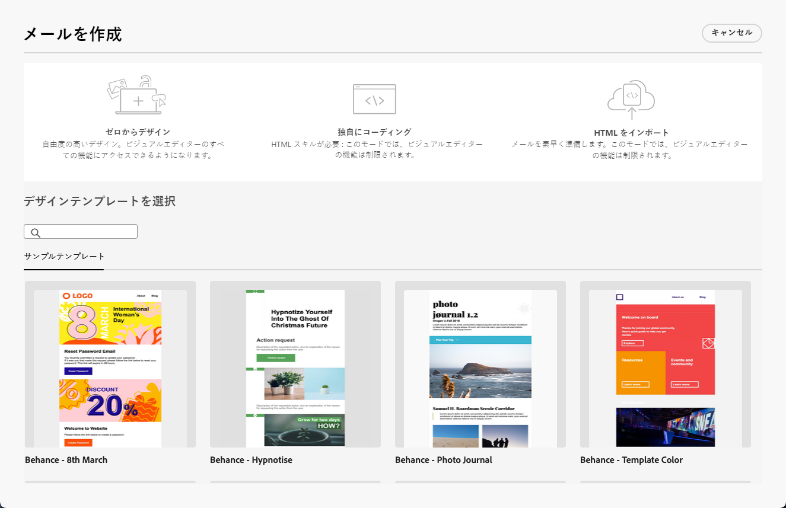

# E メールデザイナーの基本を学ぶ {#get-started-email-designer}

>[!CONTEXTUALHELP]
>id="acw_homepage_rn3"
>title="新しいメールデザイナー"
>abstract="Campaign E メールデザイナーを使用すると、個々にカスタマイズされた魅力的な E メールを、直感的なドラッグ&amp;ドロップインターフェイスで作成できます。 空白のスレートから始める場合でも、既存のコンテンツを読み込む場合でも、既存のテンプレートを活用する場合でも、すべての E メールのすべてのコンテンツをデザインし、調整します。"
>additional-url="https://experienceleague.adobe.com/docs/campaign-web/v8/whats-new.html" text="リリースノートを参照"

Adobe Campaign でメールを作成したら、そのコンテンツを定義する必要があります。

E メールデザイナーを使用すると、直感的なドラッグ＆ドロップインターフェイスを通じて、個別にカスタマイズされた魅力的なメールを作成できます。空白の状態から開始する場合でも、既存のコンテンツをインポートする場合でも、既存のテンプレートを活用する場合でも、プロモーションやトランザクションなど、あらゆるメールコンテンツのデザインと強化に対応します。

<!--Built to deliver HTML optimized for responsive design, the Email Designer allows you to easily define and apply visibility conditions and dynamic content to an email, template, or fragment directly through the user interface. You can seamlessly switch between the drag and drop interface and HTML code at the click of a button.

The Email Designer allows you to create email content and email content templates. It is compatible with simple emails, transactional emails, A/B test emails, multilingual emails, and recurring emails.-->

* [!DNL Campaign] のメールデザイン機能を使用すると、レスポンシブなメールを簡単に作成できます。[詳細情報](create-email-content.md)

* プロファイル属性に基づいてパーソナライズされたものを作成することで、顧客体験を向上させます。[詳細情報](../personalization/personalize.md)

* 条件付きコンテンツフィールドを設定して、受信者のプロファイルに基づいて動的パーソナライゼーションを作成します。[詳細情報](../personalization/conditions.md)

## メールデザインのベストプラクティス {#best-practices}

メールを送信する際は、受信者がメールを転送する可能性があることを考慮することが重要です。これにより、メールのレンダリングで問題が発生する可能性があります。これは、転送に使用されるメールプロバイダーでサポートされていない可能性がある CSS クラスを使用する場合に特に当てはまります。例えば、モバイルデバイスで画像を非表示にするために「is-desktop-hidden」CSS クラスを使用している場合などです。

これらのレンダリングの問題を最小限に抑えるために、メールのデザイン構造をできるだけシンプルにすることをお勧めします。デスクトップとモバイルデバイスの両方で適切に機能する単一のデザインを使用し、すべてのメールクライアントで完全にはサポートされていない可能性がある、複雑な CSS クラスやその他のデザイン要素を使用しないようにします。これらのベストプラクティスに従うことで、受信者が使用しているメールの表示方法や転送方法に関係なく、メールは常に正しく表示されます。

## コンテンツの作成を開始 {#start-authoring}

メール配信ダッシュボードから、[コンテンツを編集](edit-content.md)画面に移動して、E メールデザイナーのホームページを開きます。ここで、次のオプションからメールのデザイン方法を選択します。

* **メールをゼロからデザイン** - E メールデザイナーのインターフェイスを使用します。メールコンテンツのデザイン方法については、[この節](create-email-content.md)を参照してください。

* **Raw HTML をコーディングまたはペースト** - E メールデザイナーで直接行います。独自のコンテンツのコーディング方法については、[この節](code-content.md)を参照してください。

* **既存の HTML コンテンツをインポート** - ファイルまたは .zip フォルダーから行います。メールコンテンツのインポート方法については、[この節](existing-content.md)を参照してください。

* **既存のコンテンツを選択** - 組み込みテンプレートまたはカスタムテンプレートのリストから行います。メールテンプレートの操作方法については、[この節](create-email-templates.md)を参照してください。

  
