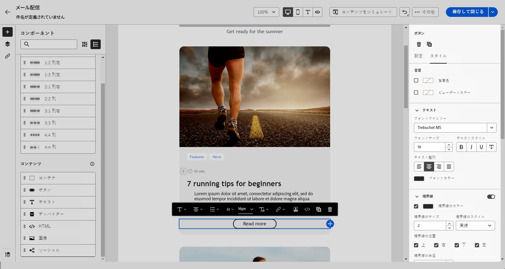

# メールスタイルの基本を学ぶ {#get-started-email-style}

[!DNL Adobe Campaign] でメールコンテンツの作成を開始したら、E メールデザイナーの設定パネルで多数のスタイル設定パラメーターおよび属性を調整できます。

変更内容は、メールの本文、構造コンポーネント、コンテンツコンポーネントのいずれかに適用できます。

{zoomable="yes"}

メールのスタイル設定の一部を調整する方法について詳しくは、以下のリンクを参照してください。

* [メールの背景をパーソナライズ](backgrounds.md)する方法
* [垂直方向の整列とパディングを管理](alignment-and-padding.md)する方法
* [メール内のリンクのスタイルを定義](styling-links.md)する方法
* [インラインスタイル属性をカスタマイズ](inline-styling.md)する方法
