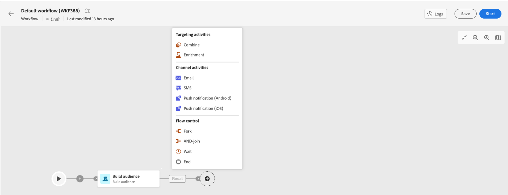

# Campaign Web でのメッセージの基本を学ぶ {#gs-messages}

Adobe Campaignでは、E メール、SMS、プッシュ通知を含むクロスチャネルキャンペーンを送信し、各種の専用レポートを使用してその有効性を評価できます。 これらのメッセージは、デザインし、配信を介して送信します。また、受信者ごとにパーソナライズすることができます。これらの配信は、スタンドアロンでもマーケティングキャンペーンのコンテキストに含めることもできます。

Adobe Campaign v8 には、次の配信チャネルが付属しています。

* **E メールチャネル**：E メール配信では、パーソナライズされた E メールをターゲット母集団に送信できます。で E メールを作成して送信する方法を説明します。 [このページ](../email/create-email.md).

* **SMS チャネル**:モバイルチャネルでの配信により、ターゲット母集団にパーソナライズされた SMS を送信できます。  で SMS を作成して送信する方法を説明します。 [このページ](../sms/create-sms.md).

* **モバイルアプリケーションチャネル**：モバイルアプリ配信では、通知を iOS システムおよび Android システムに送信できます。でプッシュ通知を作成して送信する方法を説明します。 [このページ](../push/gs-push.md).

## 配信の作成

スタンドアロンの配信は、 **配信** 左側のメニューに移動するか、マーケティングキャンペーンのコンテキストで配信を作成する場合は、 **キャンペーン** 左メニュー

>[!BEGINTABS]

>[!TAB スタンドアロン配信の作成]

スタンドアロン配信を作成するには、次の手順に従います。

1. 次を参照： **[!UICONTROL 配信]** 左側のナビゲーションのメニューで、 **[!UICONTROL 配信を作成]** 」ボタンをクリックします。
1. 配信のチャネルを選択します。 配信チャネルと配信コンテンツの定義方法について詳しくは、次の節を参照してください。

   * [メールチャネル](../email/create-email.md)
   * [プッシュ通知チャネル](../push/gs-push.md)
   * [SMS チャネル](../sms/create-sms.md)

1. メインターゲットとコントロール母集団に対する配信オーディエンスを定義します。 オーディエンスの詳細 [この節](../audience/about-audiences.md).
1. メッセージコンテンツの定義.
1. （オプション）配信スケジュールを定義します。 スケジュールを定義していない場合、 **[!UICONTROL 送信]** 」ボタンをクリックします。
1. 次をクリック：  **[!UICONTROL 確認して送信]** ボタンをクリックして設定を確認します。
1. 以下を使用：  **[!UICONTROL コンテンツをシミュレート]** ボタンを使用して配信やパーソナライゼーションの設定をテストします。 メッセージのシミュレーションの詳細については、 [この節](../preview-test/preview-test.md).
1. 次をクリック：  **[!UICONTROL 準備]** ボタンを使用してターゲット母集団を計算し、メッセージを生成します。 準備の手順には数分かかる場合があります。 準備が完了すると、メッセージを送信する準備が整います。 エラーが発生した場合は、 **ログ** アラートと警告を確認するには、次の手順に従います。
1. 結果を確認し、  **[!UICONTROL 送信]** ボタンをクリックして、メッセージの送信を開始します。
1. メッセージが送信されたら、「レポート」セクションを参照して主要指標にアクセスします。 配信レポートについて詳しくは、 [この節](../reporting/reports.md).

>[!TAB キャンペーンでの配信の作成]

キャンペーンで配信を作成するには、次の手順に従います。

1. キャンペーンを作成するか、既存のキャンペーンを開きます。
1. ワークフローを作成するか、既存のワークフローを開きます。
1. の追加と設定 **オーディエンスの構築** 「 」アクティビティを選択し、 `+`」ボタンをクリックします。
   
1. 配信アクティビティを選択します。E メール、SMS、プッシュ通知 (Android) またはプッシュ通知 (iOS)。 配信チャネルと配信コンテンツの定義方法について詳しくは、次の節を参照してください。

   * [メールチャネル](../email/create-email.md)
   * [プッシュ通知チャネル](../push/gs-push.md)
   * [SMS チャネル](../sms/create-sms.md)

1. ワークフローを開始し、ログを確認します。

キャンペーンの設定方法の詳細については、

>[!ENDTABS]

## メッセージの送信方法の選択{#gs-send-msg}

メッセージを作成し、体裁を整えてテストしたら、送信方法を選択できます。 

Campaign は、次の一連の機能を備えています。

* メインターゲットへの手動によるメッセージ送信

* [マーケティングキャンペーン](../campaigns/gs-campaigns.md)に関連付けられたメッセージの送信

* [ワークフロー](../workflows/channel-activities.md)を介したメッセージの送信

## パーソナライゼーションの追加{#personalization}

Adobe Campaignが配信するメッセージは、様々な方法でパーソナライズできます

## 配信とトラッキングログ{#gs-tracking-logs}

送信後に配信を監視することは、マーケティングキャンペーンを効率的に実施し、顧客に働きかけるうえで重要なステップになります。 配信の送信後に監視したり、配信の失敗や強制隔離がどのように管理されているかを把握したりできます。
