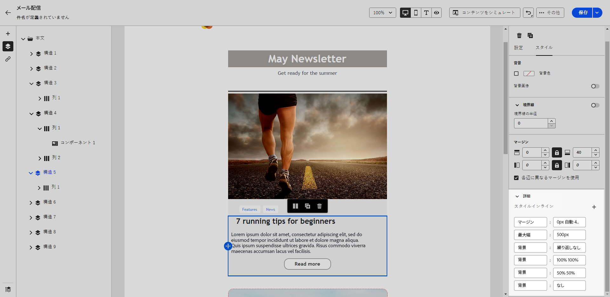

# インラインスタイル属性を追加する {#adding-inline-styling-attributes}

E メールデザイナーインターフェイスで、要素を選択してその設定を右側のパネルに表示する際に、その特定の要素に対するインライン属性と値をカスタマイズします。

1. コンテンツ内で直接コンポーネントを選択するか、または左側のパネルに表示される&#x200B;**[!UICONTROL ナビゲーションツリー]**&#x200B;を使用してコンポーネントを選択します。

1. 「**[!UICONTROL スタイル]**」タブで、**[!UICONTROL 詳細]**&#x200B;ドロップダウンをクリックします。

   {zoomable="yes"}

1. 既存の属性の値を変更します。

1. 「**+**」ボタンを使用して、新しいプロパティを追加します。CSS に準拠している任意の属性と値を追加します。

   {zoomable="yes"}

スタイルが選択した要素に適用されます。

>[!NOTE]
>
>子要素に特定のスタイル属性が定義されていない場合、親要素のスタイル設定が継承されます。