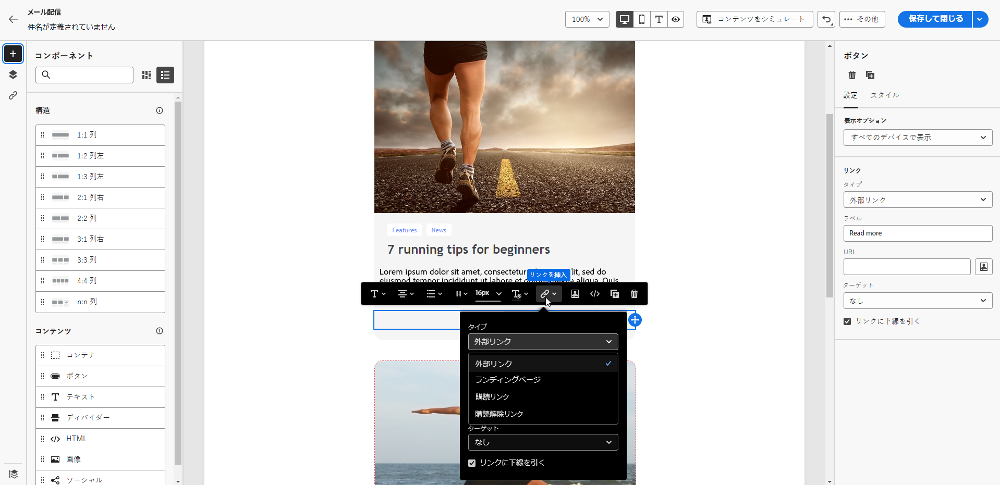

# リンクの追加とメッセージの追跡 {#tracking}

メールDesignerを使用すると、コンテンツにリンクを追加し送信済みメッセージをトラッキングすることで、受信者の行動を監視できます。

## リンクを挿入 {#insert-links}

メッセージをデザインする際に、コンテンツにリンクを追加できます。

>[!NOTE]
>
>トラッキングが有効になっている場合、メッセージコンテンツに含まれるすべてのリンクが追跡されます。

メールコンテンツにリンクを挿入するには、次の手順に従います。

1. 要素を選択し、コンテキストツールバーの **[!UICONTROL リンクを挿入]** をクリックします。

1. 作成するリンクのタイプを選択します。

   {zoomable="yes"}

   * **[!UICONTROL 外部リンク]**：外部 URL へのリンクを挿入します。

     >[!AVAILABILITY]
     >
     >次の機能（リンクは **[!UICONTROL ランディングページ]**、**[!UICONTROL 購読リンク]** および **[!UICONTROL 購読解除リンク]**）は限定提供（LA）です。 これらは、**Adobe Campaign Standard から Adobe Campaign v8** に移行する顧客に限定されており、他の環境にデプロイすることはできません。

   * **[!UICONTROL ランディングページ]**：ランディングページへのリンクを挿入します。動的ランディングページを選択した場合（**[!UICONTROL URL からのサービス]**&#x200B;オプションが選択されている場合）、リストから任意のサービスを選択できます。[詳細情報](../landing-pages/create-lp.md#define-actions-on-form-submission)

     {zoomable="yes"}

   * **[!UICONTROL 購読リンク]**：購読サービスへのリンクを挿入します。ユーザーがリンクをクリックすると、選択したサービスで参照される購読ランディングページに移動します。 [詳細情報](../audience/manage-services.md#create-service)

     {zoomable="yes"}

   * **[!UICONTROL 購読解除リンク]**：購読解除サービスへのリンクを挿入します。購読者がリンクをクリックすると、選択したサービスで参照される購読解除ランディングページに移動します。 [詳細情報](../audience/manage-services.md#create-service)

   <!--* **[!UICONTROL Mirror page]**: Add a link to display the email content in a web browser. [Learn more]-->

1. 対応するフィールドに目的の URL を入力するか、ランディングページまたはサービスを選択して、リンクの設定とスタイルを定義します。

1. **[!UICONTROL ラベル]**&#x200B;と&#x200B;**[!UICONTROL リンク]**&#x200B;を追加します。

1. 変更内容を保存します。

1. リンクを作成したら、必要に応じて「**[!UICONTROL 設定]**」タブから変更します。

   * リンクを編集して、その **[!UICONTROL ターゲット]** を変更します。
   * 対応するオプションをオンにして、リンクに下線を引くかどうかを選択します。

   {zoomable="yes"}

>[!NOTE]
>
>マーケティングタイプのメールメッセージには、オプトアウトリンクを含める必要があります。これはトランザクションメッセージには必要ありません。メッセージカテゴリ（**[!UICONTROL マーケティング]**&#x200B;または&#x200B;**[!UICONTROL トランザクション]**）はチャネルサーフェスレベルでメッセージの作成時に定義されます。

すべてのメールメッセージに、ミラーページへの特定のリンクを含めます。 ミラーページについて詳しくは、[この節](mirror-page.md)を参照してください。

## トラッキングの管理 {#manage-tracking}

[ メールDesigner](create-email-content.md) を使用すると、追跡される URL を管理できます（各リンクのトラッキングタイプの編集など）。

1. 左側のパネルから「**[!UICONTROL リンク]**」アイコンをクリックすると、追跡するコンテンツ内のすべての URL のリストが表示されます。

   このリストは一元化されたビューを提供し、メールコンテンツ内の各 URL を見つけるのに役立ちます。

1. リンクを編集するには、対応する鉛筆アイコンをクリックします。

   {zoomable="yes"}

1. 必要に応じて **[!UICONTROL トラッキングタイプ]** を変更します。

   {zoomable="yes"}

   トラッキングする URL ごとに、トラッキングモードを次のいずれかの値に設定します。

   * **[!UICONTROL トラッキング対象]**：この URL のトラッキングを有効化します。
   * **[!UICONTROL オプトアウト]**：この URL をオプトアウトまたは購読解除 URL としてマークします。
   * **[!UICONTROL ミラーページ]**：この URL をミラーページの URL としてマークします。
   * **[!UICONTROL なし]**：この URL のトラッキングを防ぎます。<!--This information is saved: if the URL appears again in a future message, its tracking is automatically deactivated.-->

1. **[!UICONTROL カテゴリ]** をリンクに追加して、トラッキングされたリンクをグループ化し、「**[!UICONTROL 保存]** をクリックします。

   {zoomable="yes"}

1. 配信を送信したら、配信レポートにアクセスします。 **[!UICONTROL トラッキング]**&#x200B;メニューの下の **[!UICONTROL URL とクリックストリーム]**&#x200B;レポートには、配信で最も訪問回数の多い URL が表示されます。 [詳細情報](../reporting/gs-reports.md)