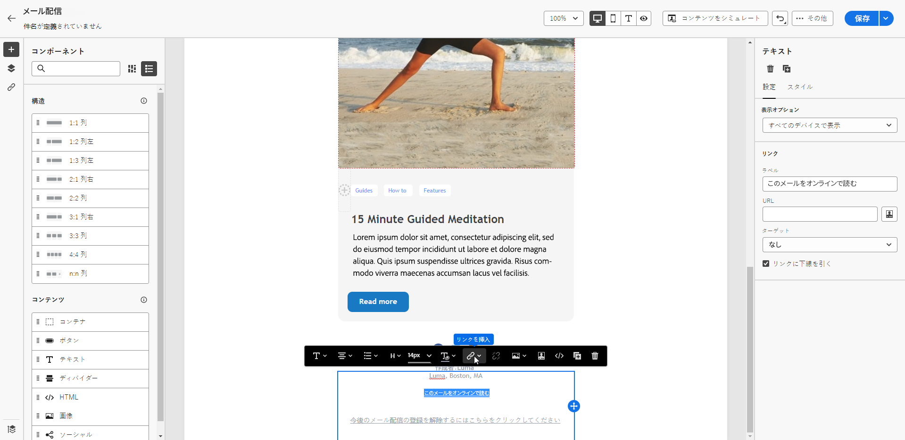
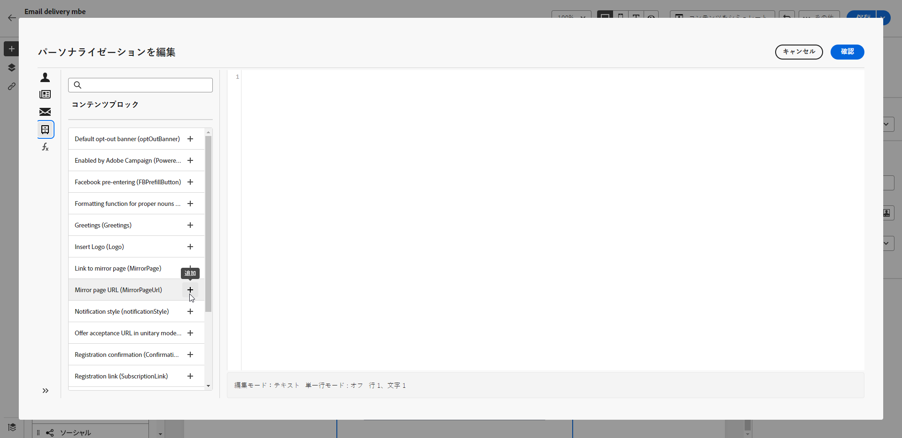

# ミラーページへのリンクの追加{#mirror-page}

ミラーページは、メールのオンラインバージョンです。

ほとんどのメールクライアントは問題なく画像をレンダリングしますが、一部のプリセットではセキュリティ上の理由から画像を表示できない場合があります。ユーザーは、インボックスで表示しようとした際にレンダリングの問題や壊れた画像が発生した場合などに、メールのミラー ページを参照できます。アクセシビリティ上の理由から、またはソーシャル共有を促進するために、オンラインバージョンを提供することもお勧めします。

Adobe Campaign で生成されるミラーページには、すべてのパーソナライゼーションデータが含まれています。

{width="600" align="left"}

## ミラーページへのリンクの追加{#link-to-mirror-page}

ミラーページへのリンクを挿入することをお勧めします。このリンクには、「このメールをブラウザーに表示」や「これをオンラインで読む」などがあります。多くの場合、メールのヘッダーやフッターに配置されています。

Adobe Campaign では、専用の&#x200B;**パーソナライゼーションブロック**&#x200B;を使用して、メールのコンテンツにミラーページへのリンクを挿入できます。組み込みの「**ミラーページへのリンク**」パーソナライゼーションブロックでは、`<%@ include view='MirrorPage' %>` コードをメールのコンテンツに挿入します。

メールにミラー ページへのリンクを追加するには：

1. 要素を選択し、コンテキストツールバーから「**[!UICONTROL リンクを挿入]**」をクリックします。

   

1. 「**[!UICONTROL パーソナライゼーションを追加]**」アイコンを選択して、パーソナライゼーションメニューにアクセスします。

   

1. **[!UICONTROL コンテンツブロック]**&#x200B;メニューから、「**[!UICONTROL ミラーページ URL]**」を選択し、「**[!UICONTROL 追加]**」をクリックします。

   

   カスタムコンテンツブロックの挿入について詳しくは、[この節](../personalization/personalize.md#personalize-emails)を参照してください。

ミラーページが自動的に作成されます。

>[!IMPORTANT]
>
>ミラーページのリンクは自動生成され、編集できません。 これらには、元のメールのレンダリングに必要な、暗号化およびパーソナライズされたデータがすべて含まれています。その結果、値が大きいパーソナライズ属性を使用すると、長いミラーページの URL が生成される可能性があり、URL の長さが最大長の web ブラウザーでリンクが機能しなくなる可能性があります。

メールを送信すると、受信者がミラーページのリンクをクリックした際、メールのコンテンツがデフォルトの web ブラウザーに表示されます。

>[!NOTE]
>
>テストプロファイルに送信されるテストメールでは、ミラーページへのリンクはアクティブになっていません。最終メッセージでのみ有効になります。

デフォルトでは、ミラーページの保持期間は 60 日です。その後は、ミラーページを使用できなくなります。

## ミラーページの生成{#mirror-page-generation}

メールコンテンツが空でない場合や、ミラーページへのリンク（別名ミラーリンク）が含まれている場合、デフォルトでは、Adobe Campaign がミラーページを自動的に生成します。

メールのミラーページの生成モードを制御できます。オプションは配信プロパティで利用できます。[詳細情報](../advanced-settings/delivery-settings.md#mirror)
