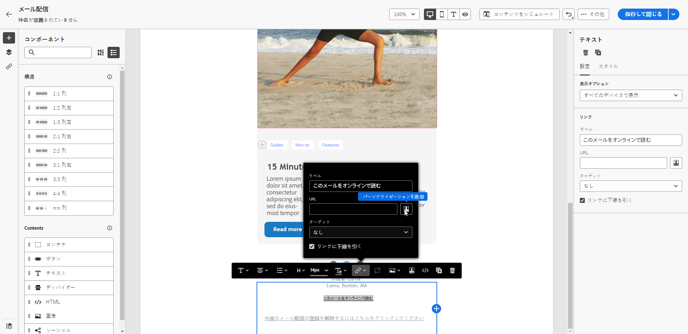
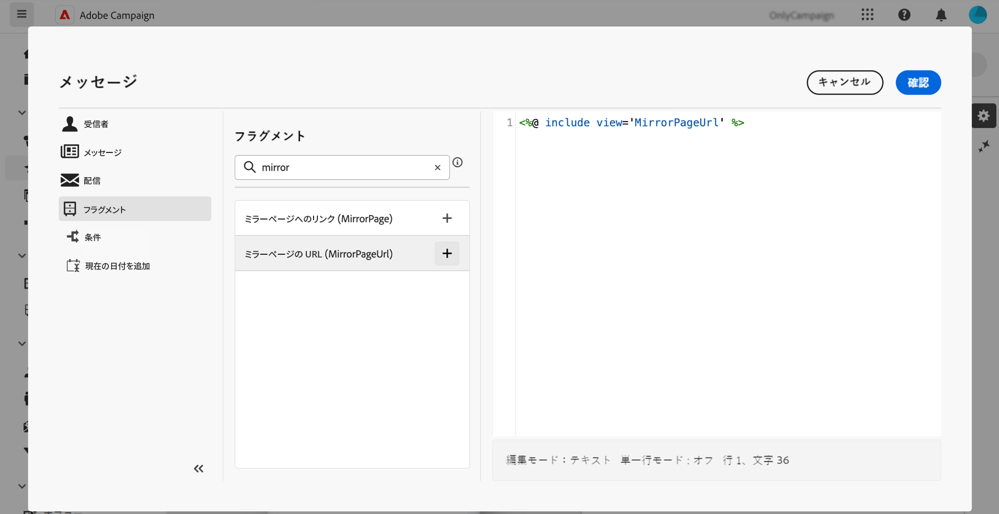

# ミラーページ {#mirror-page}

ミラーページは、メールのオンラインバージョンです。メールマーケティングでは、ミラーページへのリンクを追加することをお勧めします。例えば、インボックスでメールを表示する際にレンダリングの問題や壊れた画像が発生した場合に、ユーザーはメールのミラーページにアクセスできます。アクセシビリティ上の理由から、またはソーシャル共有を促進するために、オンラインバージョンを提供することもお勧めします。

Adobe Campaign で生成されるミラーページには、すべてのパーソナライゼーションデータが含まれています。

{width="600" align="left"}

## ミラーページへのリンクの追加 {#link-to-mirror-page}

Adobe Campaign では、専用の&#x200B;**パーソナライゼーションブロック**&#x200B;を使用して、メールのコンテンツにミラーページへのリンクを挿入します。ビルトインの「**ミラーページへのリンク**」パーソナライゼーションブロックでは、`<%@ include view='MirrorPage' %>` コードをメールのコンテンツに挿入します。

メールにミラーページへのリンクを追加するには、次の手順に従います。

1. 要素（テキストまたは画像）を選択し、コンテキストツールバーから「**[!UICONTROL リンクを挿入]**」をクリックします。

   {zoomable="yes"}

1. 「**[!UICONTROL パーソナライゼーションを追加]**」アイコンを選択して、パーソナライゼーションメニューにアクセスします。

   {zoomable="yes"}

1. **[!UICONTROL フラグメント]**&#x200B;メニューから、「**[!UICONTROL ミラーページ URL]**」を選択し、「**[!UICONTROL 追加]**」をクリックします。[詳しくは、式フラグメントの使用方法を参照してください](../content/use-expression-fragments.md)

   {zoomable="yes"}

ミラーページが自動的に作成されます。

メールを送信すると、ミラーページのリンクをクリックした受信者には、メールのコンテンツがデフォルトの web ブラウザーに表示されます。

デフォルトでは、ミラーページの保持期間は **60 日**&#x200B;です。この期間を過ぎると、ミラーページは使用できなくなります。

>[!CAUTION]
>
>* ミラーページのリンクは自動生成され、編集できません。これらには、元のメールのレンダリングに必要な、暗号化およびパーソナライズされたデータがすべて含まれています。値が大きいパーソナライズ属性を使用すると、長いミラーページの URL が生成される可能性があり、URL の長さが最大長の web ブラウザーでリンクが機能しなくなる可能性があります。
>
>* テストプロファイルに送信される本配信前確認では、ミラーページへのリンクはアクティブになっていません。最終的なメッセージでのみアクティブになります。

## ミラーページの生成 {#mirror-page-generation}

デフォルトでは、メールコンテンツが空でなく、ミラーページへのリンク（ミラーリンクとも呼ばれる）が含まれている場合、Adobe Campaign は自動的にミラーページを生成します。

配信プロパティで使用可能なオプションを通じて、メールのミラーページの生成モードを制御します。[詳細情報](../advanced-settings/delivery-settings.md#mirror)