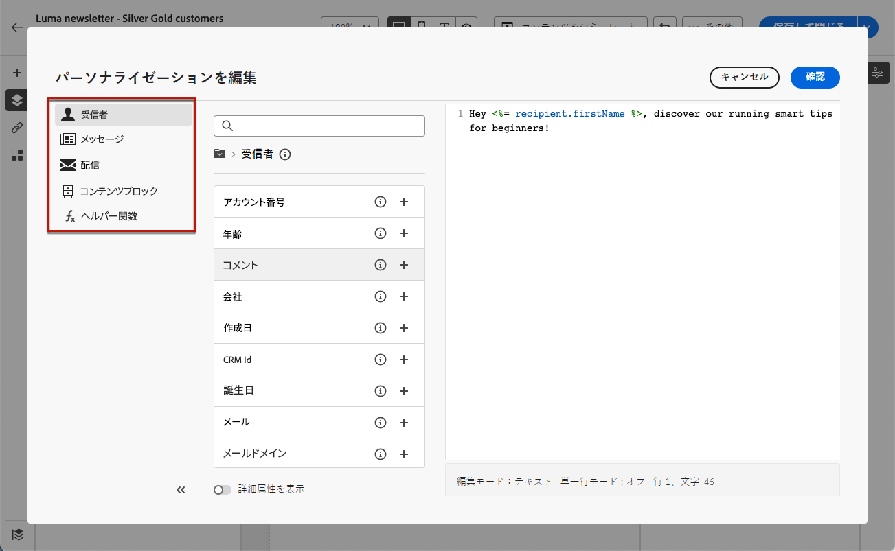

# メールへのプリヘッダーの追加 {#preheader}

>[!CONTEXTUALHELP]
>id="ac_edition_preheader"
>title="プリヘッダーの追加"
>abstract="プリヘッダーは、メールクライアントからメールを表示する際に件名の後に続く短い概要テキストです。多くの場合、メールの短い概要を提供し、通常は 1 文長です。"

プリヘッダーは、主要なメールクライアントからメールを表示する際に件名の後に続く短いテキストです。

多くの場合、コンテンツの短い概要を提供します。通常は 1 文です。

>[!NOTE]
>
>プリヘッダーは、すべてのメールクライアントでサポートされているわけではありません。サポートされていない場合、プリヘッダーは表示されません。

メールのプリヘッダーを定義するには、次の手順に従います。

1. [E メールデザイナー](create-email-content.md)から、少なくとも&#x200B;**[!UICONTROL 構造]**&#x200B;コンポーネントを追加して、メールのデザインを開始します。

1. 左側のパネルから&#x200B;**[!UICONTROL ナビゲーションツリー]**&#x200B;アイコンをクリックし、「**[!UICONTROL 本文]**」を選択します。

   

1. 「**[!UICONTROL 設定]**」タブから、プリヘッダーのテキストを入力します。

1. さらにパーソナライズするには、「**[!UICONTROL プリヘッダー]**」フィールドの左側にある「**[!UICONTROL パーソナライゼーションを追加]**」アイコンをクリックします。

   

1. **[!UICONTROL パーソナライゼーションを編集]**&#x200B;ウィンドウから、左側の専用エントリを使用して、[パーソナライゼーションフィールド](../personalization/personalize.md)、[コンテンツブロック](../personalization/content-blocks.md)および[条件付きコンテンツ](../personalization/conditions.md)を追加できます。

   

1. 「**[!UICONTROL 確認]**」をクリックします。

これで、メールのプリヘッダーが設定されました。
