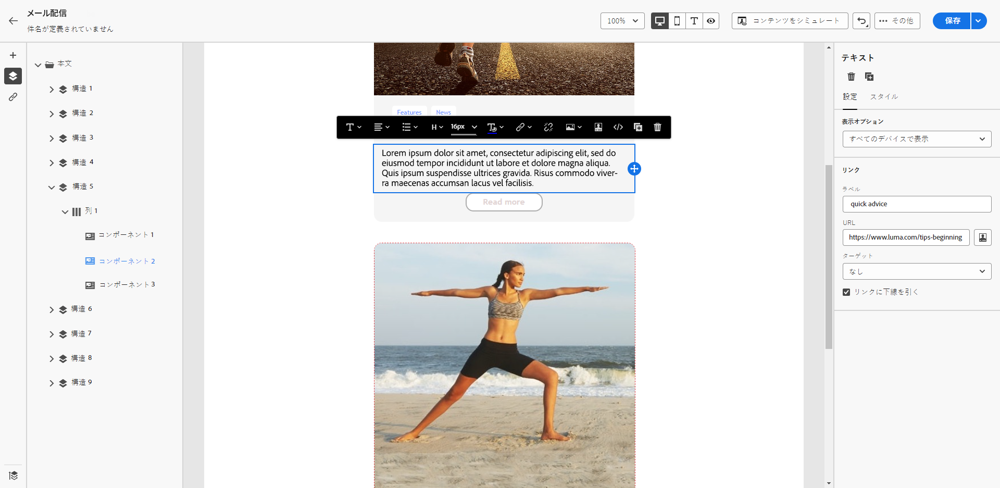
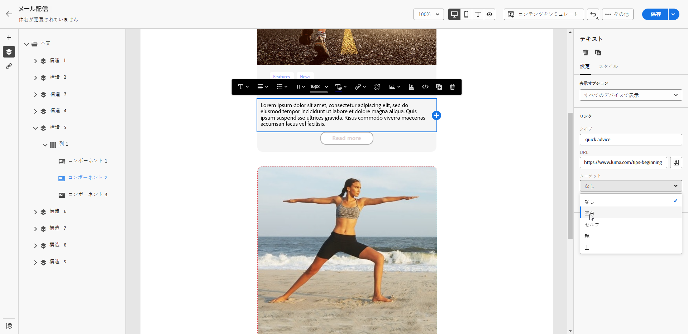
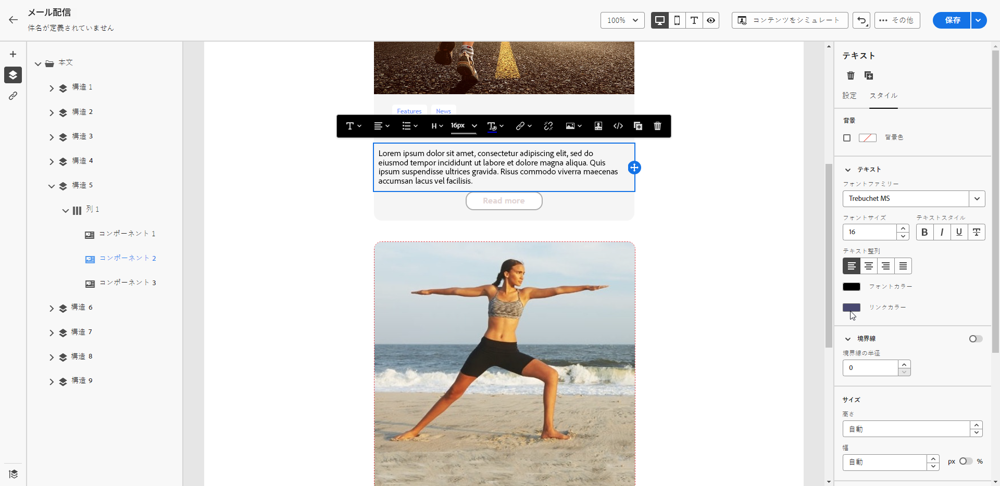

# リンクのスタイルの定義 {#styling-links}

E メールデザイナーでは、リンクに下線を引き、その色とターゲットを選択できます。

1. リンクが挿入された&#x200B;**[!UICONTROL テキスト]**&#x200B;コンポーネントで、リンクを選択します。

1. 「**[!UICONTROL 設定]**」タブで、**[!UICONTROL リンクに下線を引く]**&#x200B;をチェックして、ラベルに下線を引きます。

   {zoomable="yes"}

1. 「**[!UICONTROL ターゲット]**」ドロップダウンで、オーディエンスのリダイレクト方法を選択します。

   * **[!UICONTROL なし]**：クリック時と同じフレームでリンクを開きます（デフォルト設定）。
   * **[!UICONTROL 空白]**：リンクを新しいウィンドウまたはタブで開きます。
   * **[!UICONTROL セルフ]**：クリック時と同じフレームでリンクを開きます。
   * **[!UICONTROL 親]**：親フレームでリンクを開きます。
   * **[!UICONTROL 上]**：ウィンドウの全体でリンクを開きます。

   {zoomable="yes"}

1. リンクの色を変更するには、「**[!UICONTROL スタイル]**」タブから&#x200B;**[!UICONTROL リンクカラー]**&#x200B;をクリックします。

   {zoomable="yes"}

1. 変更内容を保存します。