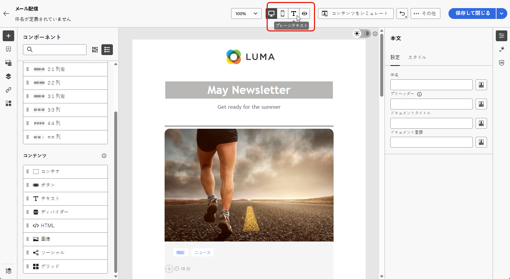
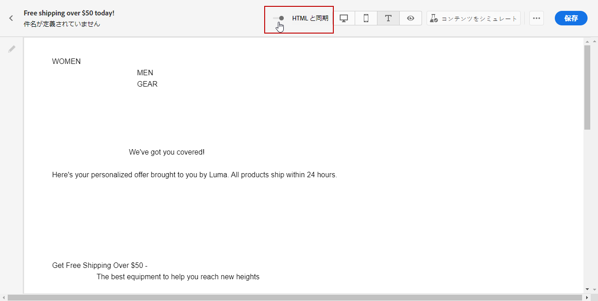
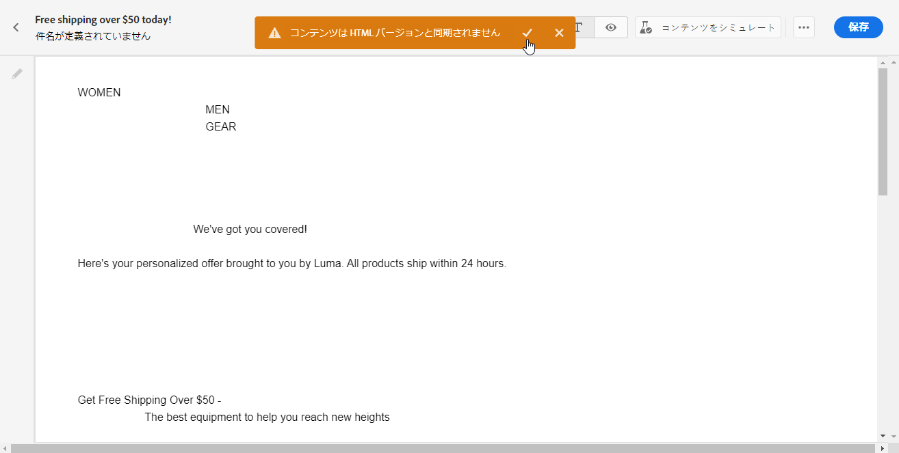

# メールのテキストバージョンを作成 {#text-version-email}

HTML コンテンツを表示できない場合に使用する、テキストバージョンのメール本文を作成することをお勧めします。

デフォルトでは、E メールデザイナーは、パーソナライズフィールドを含む&#x200B;**[!UICONTROL プレーンテキスト]**&#x200B;バージョンのメールを作成します。 このバージョンは自動的に生成され、コンテンツの HTML バージョンと同期されます。

プレーンテキストバージョンに別のコンテンツを使用する場合は、次の手順に従います。

1. メールから、「**[!UICONTROL プレーンテキスト]**」タブを選択します。

   {zoomable="yes"}

1. 「**[!UICONTROL HTML と同期]**」切替スイッチを使用して、同期を無効にします。

   {zoomable="yes"}

1. チェックマークをクリックして、選択内容を確定します。

   {zoomable="yes"}

1. 必要に応じて、プレーンテキストバージョンを編集します。

>[!CAUTION]
>
>* **[!UICONTROL プレーンテキスト]**&#x200B;ビューで行った変更は、HTML ビューには反映されません。
>
>* プレーンテキストコンテンツを更新した後で 「**[!UICONTROL HTML と同期]**」オプションを再度有効にすると、変更内容が失われ、HTML バージョンから生成されたテキストコンテンツに置き換わります。