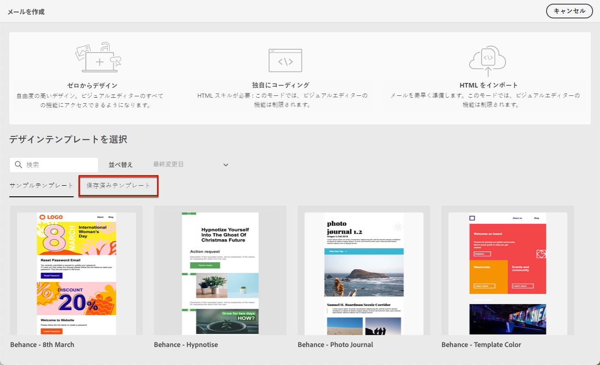
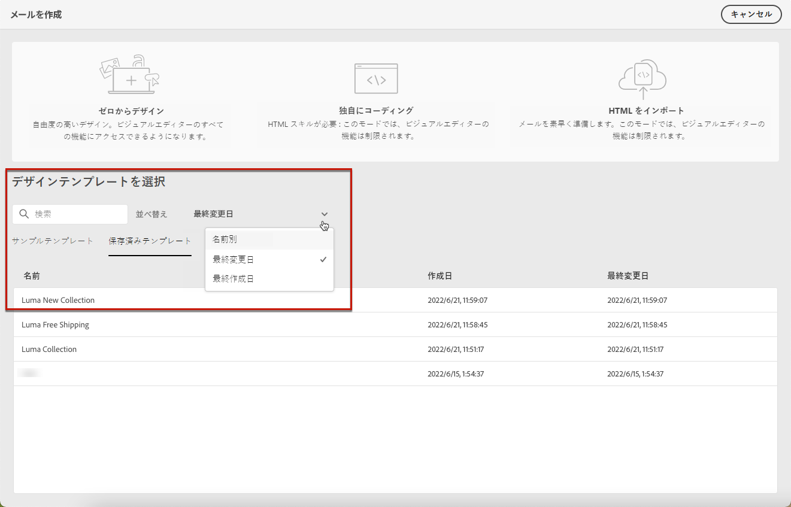
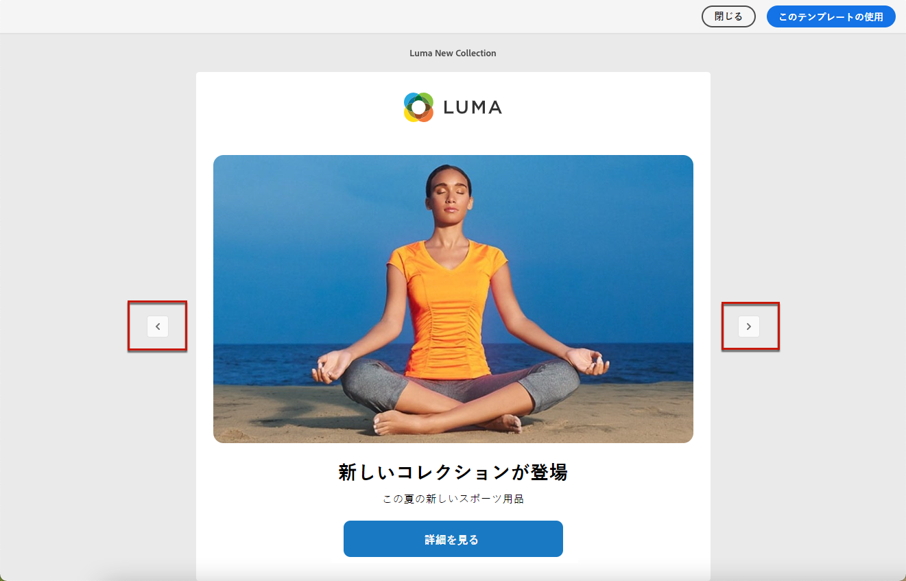

# メールコンテンツテンプレートの使用 {#use-email-templates}

[メールを作成する](../email/create-email.md)際には、**[!UICONTROL メールを作成]**&#x200B;インターフェイスの「**[!UICONTROL デザインテンプレートを選択]**」セクションを使用して、テンプレートからコンテンツの作成を開始できます。

{zoomable=&quot;yes&quot;}

次から選択できます。

* **サンプルテンプレート**。Campaign には、選択可能な一連の組み込みテンプレートが付属しています。

* **保存済みテンプレート**。また、既存のコンテンツからテンプレートとして保存したカスタムテンプレートを使用することもできます。

テンプレートの使用方法と、メールコンテンツをテンプレートとして保存する方法については、以下の節を参照してください。

>[!NOTE]
>
>メールコンテンツテンプレートは、[配信テンプレート](../msg/delivery-template.md)とは異なります。メールコンテンツのみを再利用できます。配信テンプレートでは配信コンテンツだけでなく、タイポロジ、送信者アドレス、オーディエンスなどのすべての配信設定とプロパティも再利用できます。

サンプルまたは保存済みのテンプレートの 1 つを使用してコンテンツの作成を開始するには、次の手順に従います。

1. [E メールデザイナー](create-email-content.md)を開きます。

1. 「**[!UICONTROL メールを作成]**」画面では、「**[!UICONTROL サンプルテンプレート]**」タブがデフォルトで選択されています。

1. 既存のカスタムテンプレートを使用するには、「**[!UICONTROL 保存済みのテンプレート]**」タブを参照します。

   {zoomable=&quot;yes&quot;}

1. すべての[保存済みのテンプレート](#save-as-template)のリストが表示されます。「**[!UICONTROL 名前別]**」、「**[!UICONTROL 最終変更日]**」および「**[!UICONTROL 最終作成日]**」で並べ替えることができます。

   {zoomable=&quot;yes&quot;}

1. リストからテンプレートを選択して、そのコンテンツを表示します。

1. 左右の矢印を使用して、（選択内容に応じてサンプルまたは保存済みの）テンプレート間を移動します。

   {zoomable=&quot;yes&quot;}

1. 画面右上の「**[!UICONTROL このテンプレートを使用]**」をクリックします。

1. E メールデザイナーを使用して、必要に応じてコンテンツを編集します。[詳細情報](create-email-content.md)

