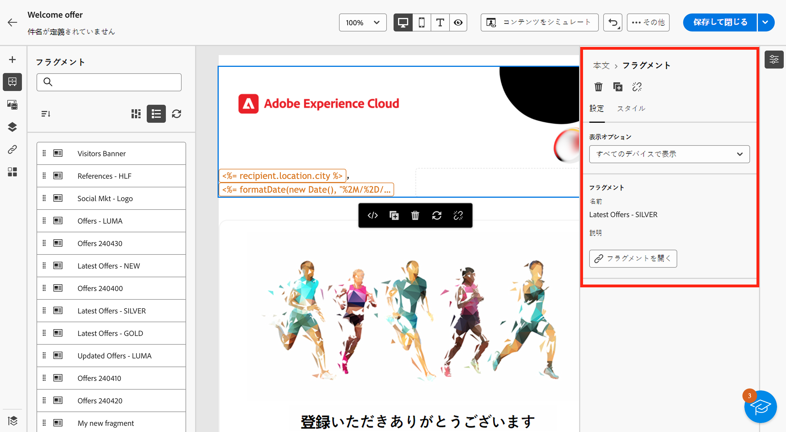
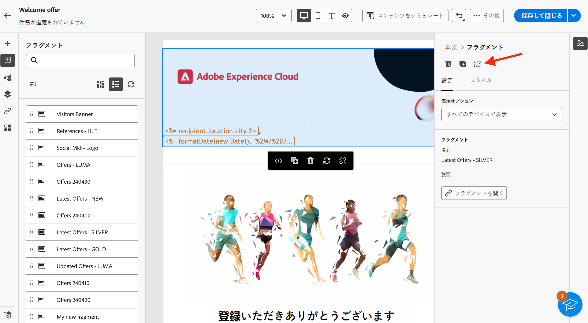

# メールへのビジュアルフラグメントの追加 {#use-visual-fragments}

ビジュアルフラグメントは、[メール配信](get-started-email-designer.md)または[コンテンツテンプレート](use-email-templates.md)で使用できます。手順については、以下で詳しく説明します。フラグメントの作成と管理の方法については、[この節](fragments.md)を参照してください。

>[!AVAILABILITY]
>
>この機能は、限定提供（LA）です。これは、**Adobe Campaign Standard から Adobe Campaign v8** に移行するお客様に限定され、他の環境にはデプロイできません。

## フラグメントの使用 {#use-fragment}

メールコンテンツにフラグメントを挿入するには、次の手順に従います。

1. [E メールデザイナー](get-started-email-designer.md)を使用して、メールまたはテンプレートのコンテンツを開きます。

1. 左側のパネルから&#x200B;**[!UICONTROL フラグメント]**&#x200B;アイコンを選択します。

   

1. 現在のサンドボックスで作成されたすべてのビジュアルフラグメントのリストが表示されます。以下を行うことができます。

   * ラベルの入力を開始して、特定のフラグメントを検索。
   * フラグメントを昇順または降順に並べ替え。
   * フラグメントの表示方法（カード表示またはリスト表示）を変更。

   >[!NOTE]
   >
   >フラグメントは作成日別に並べ替えられ、最近追加されたビジュアルフラグメントがリストの最初に表示されます。

   コンテンツの編集中に一部のフラグメントが変更または追加された場合は、**更新**&#x200B;アイコンをクリックして、最新の変更でリストを更新します。

1. リストからフラグメントを挿入する領域にドラッグ＆ドロップします。他のコンポーネントと同様に、コンテンツ内でフラグメントを移動できます。

1. フラグメントを選択すると、右側のペインにオプションが表示されます。

   

   「**[!UICONTROL 設定]**」タブから、次の操作を実行できます。

   * フラグメントを表示するデバイスを選択します。
   * 「**コンテンツを編集**」ボタンをクリックして、このフラグメントのコンテンツを開きます。[詳細情報](../email/fragments.md#edit-fragments)

     「**[!UICONTROL スタイル]**」タブを使用して、フラグメントをさらにカスタマイズできます。

1. 必要に応じて、元のフラグメントの継承を解除できます。[詳細情報](#break-inheritance)
また、コンテンツからフラグメントを削除したり、複製したりすることもできます。これらのアクションは、フラグメントの上部に表示されるコンテキストメニューから直接実行できます。

1. 必要な数のフラグメントを追加し、変更を「**[!UICONTROL 保存]**」します。

## 継承を解除 {#break-inheritance}

ビジュアルフラグメントを編集すると、変更内容が同期されます。これらは、そのフラグメントを含むすべてのメール配信とコンテンツテンプレートに自動的に反映されます。

メールまたはコンテンツテンプレートに追加すると、フラグメントはデフォルトで同期されます。

ただし、元のフラグメントからの継承を解除することはできます。その場合、フラグメントのコンテンツは現在のデザインにコピーされ、変更内容は同期されなくなります。

継承を解除するには、次の手順に従います。

1. フラグメントを選択します。

1. コンテキストツールバーのロック解除アイコンをクリックします。

   

1. そのフラグメントは、元のフラグメントにリンクされないスタンドアロン要素になります。コンテンツ内の他のコンテンツコンポーネントと同様に編集します。[詳細情報](content-components.md)
