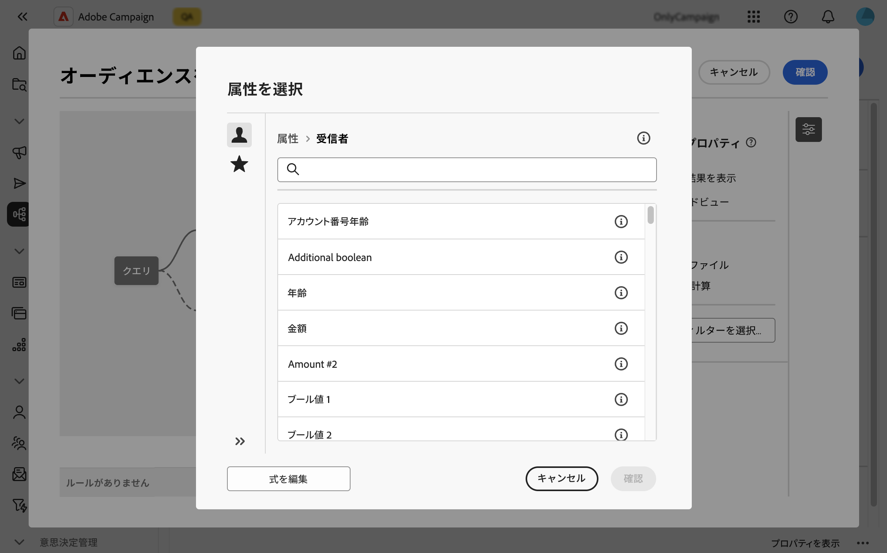
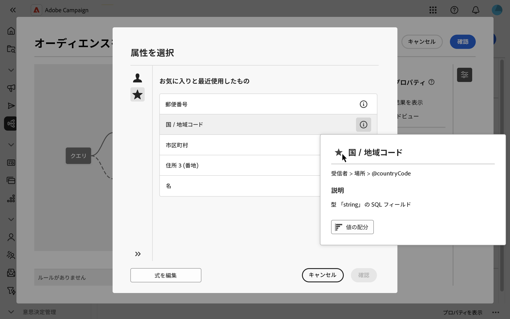
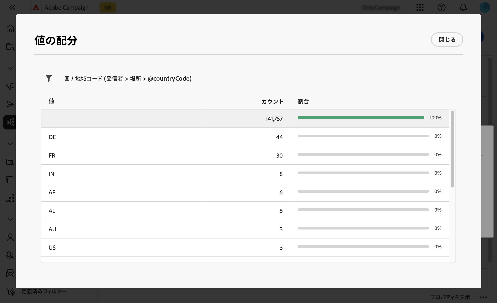

# 属性を選択してお気に入りに追加 {#folders}

Campaign web ユーザーインターフェイスを使用すると、実行するアクションに応じて、様々な場所にあるデータベースから属性を選択できます。例えば、ダイレクトメール配信や抽出するファイルの出力列を定義する際に、属性を選択できます。同様に、クエリモデラーを使用してルール、フィルターまたはオーディエンスを作成する際に、属性を選択できます。

頻繁に使用する属性をすばやく再利用するために、お気に入りに追加できます。これにより、以降のタスクではすばやくアクセスできます。お気に入りに加えて、最近選択した属性を表示したり使用したりすることもできます。

また、このインターフェイスには値の配分ツールも用意されており、これを使用すると、テーブル内の属性の値の配分を視覚化できます。このツールは、値の範囲と頻度を識別し、クエリや式を作成する際にデータの一貫性を確保するのに役立ちます。

## お気に入りと最近の属性 {#favorites}

>[!CONTEXTUALHELP]
>id="acw_attribute_picker_favorites_recents"
>title="お気に入りと最近使用したもの"
>abstract="属性ピッカーの&#x200B;**[!UICONTROL お気に入りと最近使用したもの]**&#x200B;メニューには、お気に入りに追加した属性の整理されたビューと、最近使用した属性のリストが表示されます。お気に入りの属性が最初に表示され、その後に最近使用した属性が表示されるので、必要な属性を簡単に見つけることができます。"

属性ピッカーの&#x200B;**[!UICONTROL お気に入りと最近使用したもの]**&#x200B;メニューには、お気に入りに追加した属性の整理されたビューと、最近使用した属性のリストが表示されます。お気に入りの属性が最初に表示され、その後に最近使用した属性が表示されるので、必要な属性を簡単に見つけることができます。

属性をお気に入りに追加するには、情報ボタンにポインタを合わせて、スターアイコンを選択します。その後、属性はお気に入りリストに自動的に追加されます。属性をお気に入りとして保持する必要がなくなった場合は、スターアイコンをもう一度選択して削除できます。

最大 20 個の属性をお気に入りに追加できます。お気に入りと最近の属性は、組織内の各ユーザーに関連付けられます。つまり、異なるマシンからアクセスできるので、デバイス間でシームレスなエクスペリエンスを確保できます。

## テーブル内の値の配分の識別 {#distribution}

属性の情報パネルにある「**値の配分**」ボタンを使用すると、テーブル内のその属性の値の配分を分析できます。この機能は、使用可能な値、その数および割合を理解するのに特に役立ちます。また、クエリや式の作成時に、大文字と小文字の区別やスペルの不一致などの問題を回避するのにも役立ちます。

多数の値を持つ属性の場合、ツールには最初の 20 個のみが表示されます。このような場合、この制限を示す&#x200B;**[!UICONTROL 部分読み込み]**&#x200B;通知が表示されます。詳細フィルターを適用して、表示される結果を絞り込み、特定の値やデータのサブセットに焦点を当てることができます。フィルターの使用に関するガイダンスについて詳しくは、[こちら](../get-started/work-with-folders.md#filter-the-values)を参照してください。

様々なコンテキストでの値の配分ツールの使用について詳しくは、次の節を参照してください。

- [フォルダー内の値の配分](../get-started/work-with-folders.md##distribution-values-folder)
- [クエリ内の値の配分](../query/build-query.md#distribution-values-query)
