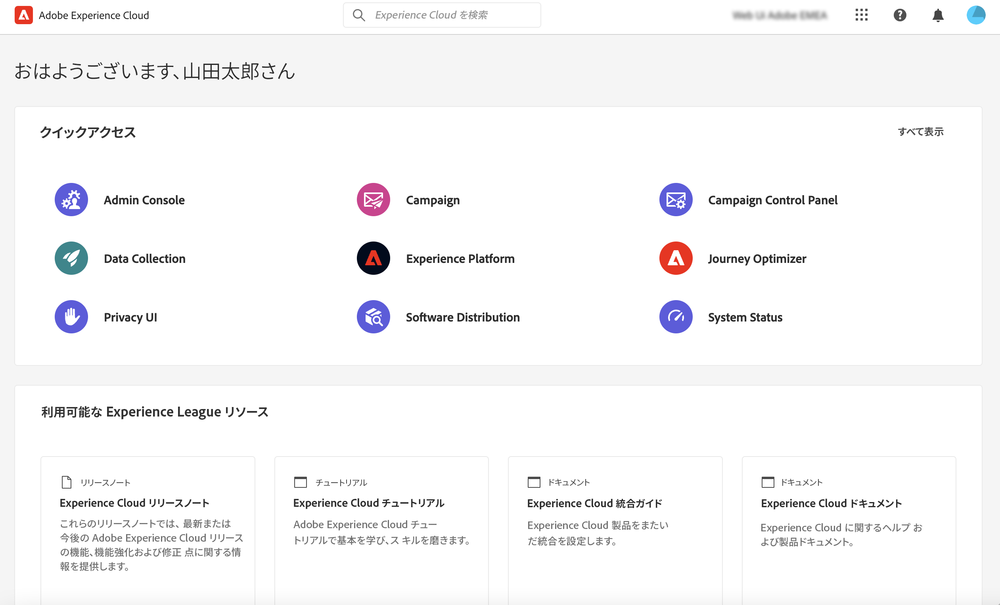

# Adobe Campaign への接続 {#connect-to-campaign}

Experience Cloud は、アドビのデジタルマーケティングアプリケーション、製品、サービスの統合ファミリーです。直感的なインターフェイスから、クラウドアプリケーション、製品機能、サービスにすばやくアクセスできます。Adobe Experience Cloud に接続し、Adobe Campaign Web インターフェイスにアクセスする方法については、このページを参照してください。

## Adobe Experience Cloud にログイン {#sign-in-to-exc}

シングルサインオン（SSO）のみを使用して Campaign に接続できます。通常、Experience Cloud 管理者はアプリケーションやサービスへのアクセスを許可します。Experience Cloud への招待メールに記載されている手順に従います。

Adobe Experience Cloud にログインするための基本的な手順は次のとおりです。

1. [Adobe Experience Cloud](https://experience.adobe.com/) を参照します。

1. Adobe ID または Enterprise ID を使用してログインします。Adobeでの ID タイプについて詳しくは、[ この記事 ](https://helpx.adobe.com/jp/enterprise/using/identity.html) を参照してください。

   Experience Cloud にログインすると、すべてのソリューションやアプリにすばやくアクセスできます。

   

1. 自分が正しい組織に属していることを確認してください。

   

   Adobe Experience Cloudの組織について詳しくは、[ この記事 ](https://experienceleague.adobe.com/docs/core-services/interface/administration/organizations.html?lang=ja) を参照してください。

## Adobe Campaign にアクセス {#access-to-campaign}

Campaign 環境にアクセスするには、Adobe Experience Cloud ホームページの「**クイックアクセス**」セクションから **Campaign** を選択します。

既に別の Adobe Experience Cloud ソリューションに接続している場合は、画面右上のソリューション切り替えボタンから Campaign 環境を参照することもできます。

複数の環境（Campaign コントロールパネルを含む）にアクセスできる場合は、「**起動**」ボタンをクリックして正しいインスタンスを確認します。

Campaign に接続しました。ユーザーインターフェイスの使用を開始する方法については、[このページ](user-interface.md)を参照してください。

### アクセス制御 {#access-control}

>[!CONTEXTUALHELP]
>id="acw_explorer_permissions_create"
>title="権限が必要です"
>abstract="このオブジェクトを作成するには、管理者から権限が付与されている必要があります。"

>[!CONTEXTUALHELP]
>id="acw_audiences_read_only"
>title="このオーディエンスは読み取り専用です"
>abstract="このオーディエンスを編集する権限がありません。必要に応じて、管理者に連絡し、アクセス権の付与を依頼してください。"

>[!CONTEXTUALHELP]
>id="acw_subscription_services_read_only"
>title="このサービスは読み取り専用です"
>abstract="このサービスを編集する権限がありません。必要に応じて、管理者に連絡し、アクセス権の付与を依頼してください。"

>[!CONTEXTUALHELP]
>id="acw_recipients_readonlyprofile"
>title="受信者の読み取り専用プロファイル"
>abstract="このプロファイルを編集する権限がありません。必要に応じて、管理者に連絡し、アクセス権の付与を依頼してください。"

>[!CONTEXTUALHELP]
>id="acw_campaign_read_only"
>title="このキャンペーンは読み取り専用です"
>abstract="このキャンペーンを編集する権限がありません。必要に応じて、管理者に連絡し、アクセス権の付与を依頼してください。"

>[!CONTEXTUALHELP]
>id="acw_deliveries_read_only"
>title="この配信は読み取り専用です"
>abstract="この配信を編集する権限がありません。必要に応じて、管理者に連絡し、アクセス権の付与を依頼してください。"

>[!CONTEXTUALHELP]
>id="acw_wf_read_only"
>title="このワークフローは読み取り専用です"
>abstract="このワークフローを編集する権限がありません。必要に応じて、管理者に連絡し、アクセス権の付与を依頼してください。"

アクセス制御では、配信、受信者、ワークフローなどのメインリストからのオブジェクトやデータへのアクセスを制限できます。また、これらの制限は、エクスプローラーのナビゲーションツリーにも適用されます。さらに、ユーザーインターフェイスからオブジェクトを作成、削除、複製、編集する権限が必要です。

Campaign web のすべての権限は、Campaign クライアントコンソールの権限と同期されます。ユーザー権限を定義および変更できるのは、Campaign 管理者のみです。

Campaign web ユーザーインターフェイスを参照すると、権限に応じてデータ、オブジェクト、機能にアクセスできます。例えば、フォルダーへのアクセス権限がない場合、そのフォルダーは表示されません。また、権限は、オブジェクトとデータの管理にも影響します。特定のフォルダーに対する書き込み権限がないと、ユーザーインターフェイスに配信が表示されていても、そのフォルダーに配信を作成することはできません。

詳しくは、[権限の表示と管理](permissions.md)の方法を参照してください。

## Adobe Experience Cloud の上部ナビゲーション {#top-bar}

インターフェイスの上部バーを参照して、次の操作を実行できます。

* Campaign web ユーザーインターフェイスに関するフィードバックを共有
* 組織を切り替え
* Adobe Experience Cloud ソリューションとアプリを切り替え
* [Adobe Experience League](https://experienceleague.adobe.com/docs/?lang=ja) のヘルプを検索
* 製品通知を確認
* アドビのプロファイルを編集し、[お気に入りの言語を更新](#language-pref)や[ライト／ダークテーマに切り替え](#dark-theme)などの設定を管理

## サポートしているブラウザー {#browsers}

Adobe Campaign Web は、最新バージョンの Google Chrome、Safari および Microsoft Edge で最適に動作するように設計されています。古いバージョンや他のブラウザーでは、特定の機能を使用する際に問題が発生する可能性があります。

## 言語環境設定 {#language-pref}

Adobe Campaign Web は現在、次の言語で利用できます。

* 英語（米国）- EN-US
* フランス語 - FR
* ドイツ語 - DE
* イタリア語 - IT
* スペイン語 - ES
* ポルトガル語（ブラジル）- PTBR
* 日本語 - JP
* 韓国語 - KR
* 簡体字中国語 - CHS
* 繁体字中国語 - CHT

Campaign web のデフォルト言語は、ユーザープロファイルで指定された優先言語によって決まります。Campaign サーバーとクライアントコンソールの言語とは関係ありません。

言語を変更するには：

1. 右上のプロファイルアイコンをクリックし、 「**環境設定**」を選択します。
1. 次に、メールアドレスの下に表示されている言語リンクをクリックします。
1. 優先言語を選択し、「**保存**」をクリックします。使用しているコンポーネントが第一希望の言語にローカライズされていない場合に備えて、第二の言語を選択できます。

## ダークテーマとライトテーマ {#dark-theme}

Adobe Campaign は、ライトテーマとダークテーマで使用できます。デフォルトでは、ユーザーインターフェイスはライトテーマで有効になっています。ダークテーマに切り替えるには、プロファイルアイコンをクリックし、「**ダークテーマ**」切替スイッチを使用して有効／無効にします。

ユーザープロファイル設定とアカウント環境設定について詳しくは、[ この節 ](https://experienceleague.adobe.com/docs/core-services/interface/experience-cloud.html?lang=ja#preferences) を参照してください。

Experience Cloud中央インターフェイスコンポーネントについて詳しくは、[ このドキュメント ](https://experienceleague.adobe.com/docs/core-services/interface/experience-cloud.html?lang=ja) を参照してください。
