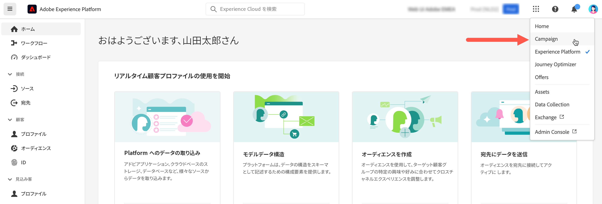

# Adobe Campaign への接続 {#connect-to-campaign}

Experience Cloud は、アドビのデジタルマーケティングアプリケーション、製品、サービスの統合ファミリーです。直感的なインターフェイスから、クラウドアプリケーション、製品機能、サービスにすばやくアクセスできます。Adobe Experience Cloud に接続し、Adobe Campaign Web インターフェイスにアクセスする方法については、このページを参照してください。

## Adobe Experience Cloud にログイン {#sign-in-to-exc}

シングルサインオン（SSO）のみを使用して Campaign に接続できます。通常、Experience Cloud 管理者はアプリケーションやサービスへのアクセスを許可します。Experience Cloud への招待メールに記載されている手順に従います。

Adobe Experience Cloud にログインするための基本的な手順は次のとおりです。

1. [Adobe Experience Cloud](https://experience.adobe.com/){target="_blank"} を参照します。

1. Adobe ID または Enterprise ID を使用してログインします。アドビの ID タイプについて詳しくは、[この記事](https://helpx.adobe.com/jp/enterprise/using/identity.html){target="_blank"}を参照してください。

   Experience Cloud にログインすると、すべてのソリューションやアプリにすばやくアクセスできます。

   {zoomable=&quot;yes&quot;}

1. 自分が正しい組織に属していることを確認してください。

   {zoomable=&quot;yes&quot;}{width="50%" align="left"}

   Adobe Experience Cloud の組織について詳しくは、[この記事](https://experienceleague.adobe.com/docs/core-services/interface/administration/organizations.html?lang=ja){target="_blank"}を参照してください。

## Adobe Campaign にアクセス {#access-to-campaign}

Campaign 環境にアクセスするには、Adobe Experience Cloud ホームページの「**クイックアクセス**」セクションから **Campaign** を選択します。

既に別の Adobe Experience Cloud ソリューションに接続している場合は、画面右上のソリューション切り替えボタンから Campaign 環境を参照することもできます。

{zoomable=&quot;yes&quot;}

複数の環境（Campaign コントロールパネルを含む）にアクセスできる場合は、「**起動**」ボタンをクリックして正しいインスタンスを確認します。

{zoomable=&quot;yes&quot;}

Campaign に接続しました。ユーザーインターフェイスの使用を開始する方法については、[このページ](user-interface.md)を参照してください。

## Adobe Experience Cloud の上部ナビゲーション {#top-bar}

インターフェイスの上部バーを参照して、次の操作を実行できます。

* Campaign web ユーザーインターフェイスに関するフィードバックを共有
* 組織を切り替え
* Adobe Experience Cloud ソリューションとアプリを切り替え
* [Adobe Experience League](https://experienceleague.adobe.com/docs/?lang=ja){target="_blank"} でヘルプを検索
* 製品通知を確認
* アドビのプロファイルを編集し、[お気に入りの言語を更新](#language-pref)や[ライト／ダークテーマに切り替え](#dark-theme)などの設定を管理

{zoomable=&quot;yes&quot;}{width="50%" align="left"}

## サポートしているブラウザー {#browsers}

Adobe Campaign Web は、最新バージョンの Google Chrome、Safari および Microsoft Edge で最適に動作するように設計されています。古いバージョンや他のブラウザーでは、特定の機能を使用する際に問題が発生する可能性があります。

## 言語環境設定 {#language-pref}

Adobe Campaign Web は現在、次の言語で利用できます。

* 英語（米国）- EN-US
* フランス語 - FR
* ドイツ語 - DE
* イタリア語 - IT
* スペイン語 - ES
* ポルトガル語（ブラジル）- PTBR
* 日本語 - JP
* 韓国語 - KR
* 簡体字中国語 - CHS
* 繁体字中国語 - CHT

Campaign web のデフォルト言語は、ユーザープロファイルで指定された優先言語によって決まります。Campaign サーバーとクライアントコンソールの言語とは関係ありません。

言語を変更するには：

1. 右上のプロファイルアイコンをクリックし、 「**環境設定**」を選択します。
1. 次に、メールアドレスの下に表示されている言語リンクをクリックします。
1. 優先言語を選択し、「**保存**」をクリックします。使用しているコンポーネントが第一希望の言語にローカライズされていない場合に備えて、第二の言語を選択できます。

>[!CAUTION]
>
>[AI を活用したコンテキストヘルプ](using-ai.md)機能を使用する場合は、優先言語を英語に設定する必要があります。他の言語はサポートされていません。
>

## ダークテーマとライトテーマ {#dark-theme}

Adobe Campaign は、ライトテーマとダークテーマで使用できます。デフォルトでは、ユーザーインターフェイスはライトテーマで有効になっています。ダークテーマに切り替えるには、プロファイルアイコンをクリックし、「**ダークテーマ**」切替スイッチを使用して有効／無効にします。

ユーザープロファイルの設定とアカウントの環境設定について詳しくは、[この節](https://experienceleague.adobe.com/docs/core-services/interface/experience-cloud.html?lang=ja#preferences){target="_blank"}を参照してください。

Experience Cloud セントラルインターフェイスコンポーネントについて詳しくは、[このドキュメント](https://experienceleague.adobe.com/docs/core-services/interface/experience-cloud.html?lang=ja){target="_blank"}を参照してください。
