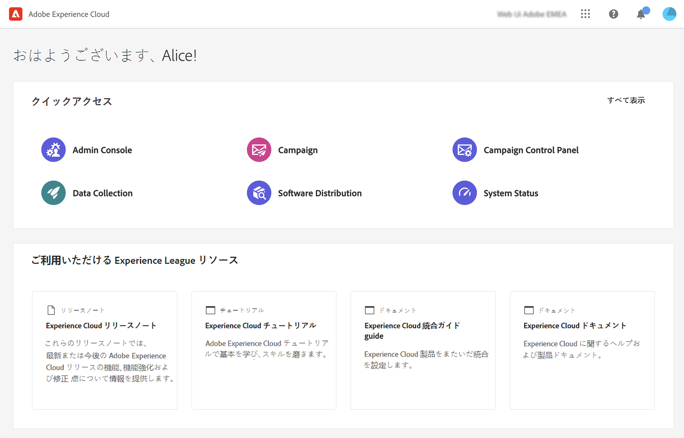

# Campaign web の基本を学ぶ {#get-started}

>[!CONTEXTUALHELP]
>id="acw_homepage_card1"
>title="新機能"
>abstract="Campaign web の新しいユーザーインターフェイス、最新の改善、主な機能をご確認ください。これらを使用して、オーディエンスのクロスチャネルキャンペーンを作成する方法を説明します。Campaign は、使いやすい機能を備えており、パーソナライズされたクロスチャネルキャンペーンの作成プロセスを合理化し、結果を推進し、競争力を高めるのに役立ちます。 "

Adobe Campaign は、クロスチャネルのカスタマーエクスペリエンスを設計するためのプラットフォームと、視覚的なキャンペーンオーケストレーション、リアルタイムのインタラクション管理およびクロスチャネル実行のための環境を提供します。

当初は、機能豊富な[クライアントコンソール](#ac-client)でしか利用できませんでしたが、Campaign で新しい web ユーザーインターフェイス（UI）が提供されるようになりました。これは、より使いやすくなり、アクセシビリティに優れ、デザインが刷新された結果、ユーザーエクスペリエンスが大幅に向上しています。この新しい現代的な UI は、マーケティングキャンペーンのデザインと配信を簡素化し、Adobe Experience Platform などの他のアドビソリューションとの一貫性を保ちます。

この新しい UI は、まず&#x200B;**ビジネス実務担当者**&#x200B;のニーズに対応しています。この最初のバージョンでは代表的な管理タスクはすべて実行できませんが、以降のバージョンで対処される予定です。なお、現在のところ、新しい UI では、クライアントコンソールで利用できる機能やオプションのすべてを使用できるわけではありません。 今後のリリースで、新しいユースケース、オプションおよび機能が利用できるようになります。

Web UI で使用できない Campaign v8 機能にアクセスする必要がある場合は、[クライアントコンソール](#ac-client)を使用してください。

>[!NOTE]
>
>Campaign v8 Web は現在アルファバージョンです。 アクセスは、一部のアルファ顧客に制限されています。製品インターフェイス、機能および使用フローは予告なく変更される場合があることに注意してください。

## Campaign への接続

Adobe Campaign web に接続するには、次の手順に従います。

1. [Adobe Experience Cloud](https://experience.adobe.com){target="_blank"} を参照します。
1. アドビの資格情報を使用してログインします。
1. 「**クイックアクセス**」セクションで、「**Campaign**」をクリックします。

   

1. 次のページで、Campaign インスタンスの「**ローンチ**」ボタンをクリックします。

   Campaign に接続しました。ユーザーインターフェイスの使用を開始する方法については、[このページ](user-interface.md)を参照してください。

既に別の Adobe Experience Cloud ソリューションに接続している場合は、画面右上のソリューション切り替えボタンから Campaign 環境を参照することもできます。

## Campaign クライアントコンソールについて {#ac-client}

Campaign クライアントコンソールは、お使いのシステムにインストールされるブラウザーベースのアプリケーションです。 Web サービス API を使用して、Campaign アプリケーションサーバーに接続します。

Campaign データは、アプリケーションサーバーに保存されます。 クライアントコンソールと web UI の両方からデータを利用できます。 例えば、クライアントコンソールを使用して配信テンプレートを作成した場合、web UI でも使用できます。また、web UI でメール配信を作成した場合、クライアントコンソールからもこの配信にアクセスできます。

一部のオブジェクトは、クライアントコンソールでのみ作成および管理できます。これらは、Campaign web UI で表示および使用できますが、この環境から作成または変更することはできません。すべての Campaign オブジェクトとコンポーネントは、左側のナビゲーションからアクセスできるエクスプローラービューから使用できます。

Campaign v8 の使用方法について詳しくは、 [Campaign v8（クライアントコンソール）ドキュメント](https://experienceleague.adobe.com/docs/campaign/campaign-v8/campaign-home.html?lang=ja){target="_blank"}.
