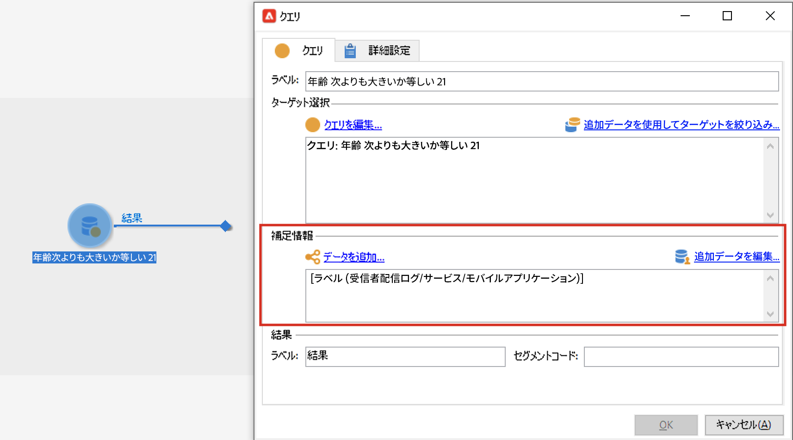

# ガードレールと制限 {#guardrails-limitations}

Campaign クライアントコンソールで作成または変更されたコンポーネントを Campaign Web UI で使用する場合、以下に示すガードレールと制限が適用されます。

## ワークフロー {#wf-guardrails-limitations}

### アクティビティ

Web UI でまだサポートされていないワークフローアクティビティは読み取り専用で、互換性のないアクティビティとして表示されます。 ワークフローの実行、メッセージの送信、ログの確認などを行うことができます。 Web UI とクライアントコンソールの両方で使用できるワークフローアクティビティは編集可能です。

| コンソール | Web UI |
| --- | --- |
| {width="800px" align="left" zoomable="yes"} | {width="800px" align="left" zoomable="yes"} |

Web UI でまだサポートされていないワークフローアクティビティ設定は表示されません。 ただし、ワークフローを実行する際には、これらの設定が適用されます。

| コンソール | Web UI |
| --- | --- |
| {width="800px" align="left" zoomable="yes"} | {width="800px" align="left" zoomable="yes"} |

コンソールで、 **エンリッチメント** アクティビティは、紐付けとエンリッチメントの両方を実行できます。 Web UI では、紐付け機能はまだ使用できません。 を定義済みの場合、コンソールで、紐付け設定を **エンリッチメント** アクティビティの場合、Web UI に互換性のない読み取り専用アクティビティとして表示されます。

| コンソール | Web UI |
| --- | --- |
| {width="800px" align="left" zoomable="yes"} | {width="800px" align="left" zoomable="yes"} |

### カンバス

Web UI で新しいワークフローを作成する場合、キャンバスは 1 つのエントリポイントのみをサポートします。 ただし、複数のエントリポイントを持つワークフローをコンソールで作成した場合は、Web UI で開いて編集できます。

| コンソール | Web UI |
| --- | --- |
| {width="800px" align="left" zoomable="yes"} | {width="800px" align="left" zoomable="yes"} |

ループは、Web UI ではまだ使用できません。 コンソールを使用してループを含むワークフローを作成した場合、Web UI からアクセスできません。 エラーメッセージが表示されます。

| コンソール | Web UI |
| --- | --- |
| {width="800px" align="left" zoomable="yes"} | {width="800px" align="left" zoomable="yes"} |

ノードの配置は、アクティビティが追加または削除されるたびに更新されます。 コンソールでワークフローを作成し、Web UI を使用して変更し、コンソールで再度開くと、小さな配置の問題が発生する場合があります。 これは、ワークフローの

| 最初のワークフロー | 位置の変更 |
| --- | --- |
| {width="800px" align="left" zoomable="yes"} | {width="800px" align="left" zoomable="yes"} |

## 定義済みフィルター {#filters-guardrails-limitations}

配信のオーディエンスを選択する場合、またはワークフローでオーディエンスを作成する場合、製品のそのバージョンのユーザーインターフェイスでは、一部の定義済みフィルターを使用できません。

特定のエラーメッセージが表示されます。 ルールビルダーでクエリのグラフィック表現を表示できず、フィルターを編集できない場合でも、クエリを使用して、フィルター条件と結果を確認できます。 また、SQL クエリにアクセスして、正確な設定を確認できます。

{width="70%" align="left"}

Web インターフェイスでフィルターを作成し、サポートされていない属性を使用してコンソールで修正した場合、グラフィック表現は Web インターフェイスで使用できなくなります。 どのような場合でも、フィルターは引き続き使用できます。

サポートされていない属性を以下に示します。

### サポートされていないデータタイプ {#unsupported-data-type}

クライアントコンソールで使用できる次のデータ型は、Web インターフェイスにフィルターやルールを表示する場合はサポートされません。

* 日時
* 時間
* 間隔
* 重複
* float

### サポートされていないフィルタリング機能 {#unsupported-filtering-capabilities}

クライアントコンソールで複雑な式や関数を使用してフィルターを作成した場合、Web インターフェイスで編集することはできません。

また、次の演算子はサポートされていません。

* 数値タイプ
   * 次に含まれる
   * いいえ

* 文字列タイプ
   * より大きい
   * より小さい
   * 次よりも大きいか等しい
   * 次よりも小さいか等しい
   * 次に類似
   * 次に類似しない

* 日付タイプ
   * 以降
   * 以前
   * 等しくない
   * 空である
   * 空でない
   * 次に含まれる
   * 次に含まれない
   * 過去

* 1 対 N のリンク
   * カウント、合計、平均、分、MAX