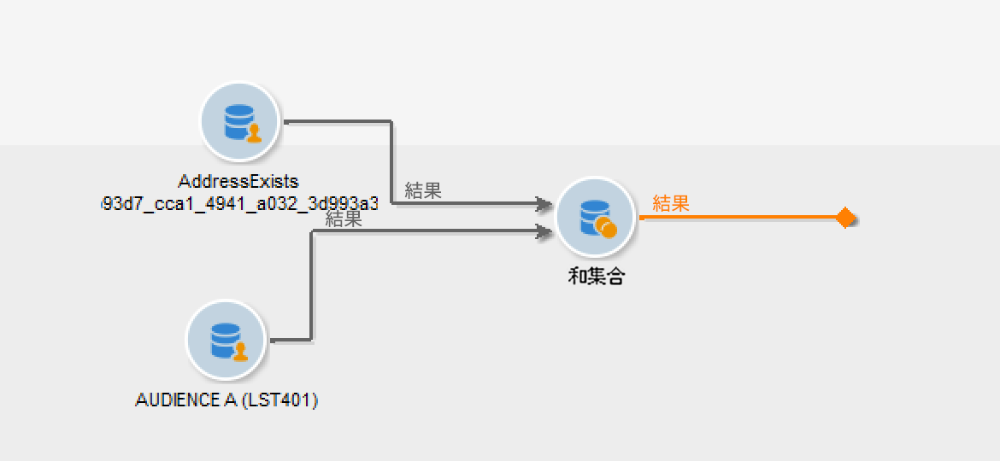

# ガードレールと制限 {#guardrails-limitations}

Campaign クライアントコンソールで作成または変更されたコンポーネントを Campaign web UI で使用する場合、以下に示すガードレールと制限が適用されます。

## ワークフロー {#wf-guardrails-limitations}

### アクティビティ

Web UI でまだサポートされていないワークフローアクティビティは読み取り専用で、互換性のないアクティビティとして表示されます。ワークフローの実行、メッセージの送信、ログの確認などは引き続き実行できます。Web UI とクライアントコンソールの両方で使用できるワークフローアクティビティは編集可能です。

| コンソール | Web UI |
| --- | --- |
| {width="800px" align="left" zoomable="yes"} | {width="800px" align="left" zoomable="yes"} |

Web UI でまだサポートされていないワークフローアクティビティ設定は表示されません。ただし、ワークフローを実行する際には、これらの設定も適用されます。

| コンソール | Web UI |
| --- | --- |
| {width="800px" align="left" zoomable="yes"} | {width="800px" align="left" zoomable="yes"} |

コンソールで、**エンリッチメント**&#x200B;アクティビティは、紐付けとエンリッチメントの両方を実行できます。Web UI では、紐付け機能はまだ使用できません。コンソールで&#x200B;**エンリッチメント**&#x200B;アクティビティの紐付け設定を定義した場合は、互換性のない読み取り専用アクティビティとして web UI に表示されます。

| コンソール | Web UI |
| --- | --- |
| {width="800px" align="left" zoomable="yes"} | {width="800px" align="left" zoomable="yes"} |

### キャンバス

Web UI で新しいワークフローを作成する場合、キャンバスは 1 つのエントリポイントのみをサポートします。ただし、複数のエントリポイントを持つワークフローをコンソールで作成した場合は、それを web UI で開いて編集できます。

| コンソール | Web UI |
| --- | --- |
| {width="800px" align="left" zoomable="yes"} | {width="800px" align="left" zoomable="yes"} |

ループは、web UI ではまだ使用できません。ループを含むワークフローをコンソールで作成した場合は、web UI からアクセスできません。エラーメッセージが表示されます。

| コンソール | Web UI |
| --- | --- |
| {width="800px" align="left" zoomable="yes"} | {width="800px" align="left" zoomable="yes"} |

ノードの配置は、アクティビティが追加または削除されるたびに更新されます。コンソールでワークフローを作成し、web UI を使用して変更し、コンソールで再度開くと、配置に関する軽度の問題が発生する場合があります。これは、ワークフローのプロセスとタスクには影響しません。

| 最初のワークフロー | 位置の変更 |
| --- | --- |
| {width="800px" align="left" zoomable="yes"} | {width="800px" align="left" zoomable="yes"} |

## 定義済みフィルター {#filters-guardrails-limitations}

>[!CONTEXTUALHELP]
>id="acw_predefined_filter_read_only"
>title="このフィルターは読み取り専用です"
>abstract="一部の定義済みフィルターは、そのバージョンの製品のユーザーインターフェイスでは使用できません。これらのフィルターは読み取り専用としてマークされます。クエリモデラーでクエリのグラフィック表現を表示できず、フィルターを編集できない場合でも、フィルターを使用でき、画面の「**属性**」セクションにフィルター条件が表示されます。"

配信のオーディエンスを選択する場合やワークフローでオーディエンスを作成する場合、製品のそのバージョンでは、一部の定義済みフィルターをユーザーインターフェイスで使用できません。これらのフィルターは読み取り専用としてマークされます。

特定のエラーメッセージが表示されます。

{width="70%" align="left"}

クエリモデラーでクエリのグラフィック表現を表示できず、フィルターを編集できない場合でも、フィルターを使用でき、画面の「**属性**」セクションにフィルター条件が表示されます。

{width="70%" align="left"}

また、SQL クエリにアクセスして、正確な設定を確認することもできます。それには、「**コードビュー**」ボタンをクリックします。

{width="70%" align="left"}

「**計算**」ボタンをクリックすると、フィルターの条件に一致する項目の数を確認できます。

{width="70%" align="left"}

「**結果を表示**」ボタンを使用すると、該当する項目が表示されます。

{width="70%" align="left"}

なお、web インターフェイスでフィルターを作成し、サポートされていない属性を使用してコンソールで変更した場合、グラフィック表現は web インターフェイスで使用できなくなるので注意してください。どのような場合でも、フィルターは引き続き使用できます。

サポートされていない属性は次のとおりです。

### サポートされていないデータタイプ {#unsupported-data-type}

クライアントコンソールで使用できる次のデータタイプは、web インターフェイスにフィルターやルールを表示する際にはサポートされません。

* 日時
* 時間
* 期間
* 倍精度浮動小数点数
* 浮動小数点数

### サポートされていないフィルタリング機能 {#unsupported-filtering-capabilities}

クライアントコンソールで複雑な式や関数を使用してフィルターを作成した場合、それを web インターフェイスで編集することはできません。

さらに、次の演算子はサポートされていません。

* 数値タイプ
   * 次に含まれる
   * 次に含まれない

* 文字列タイプ
   * 次より大きい
   * 次より小さい
   * 次より大きいか等しい
   * 次より小さいか等しい
   * 次に類似
   * 次に類似しない

* 日付タイプ
   * 以降
   * 以前
   * 次と等しくない
   * 空である
   * 空でない
   * 次に含まれる
   * 次に含まれない
   * 過去

* 1 対 N のリンク
   * COUNT、SUM、AVG、MIN、MAX
