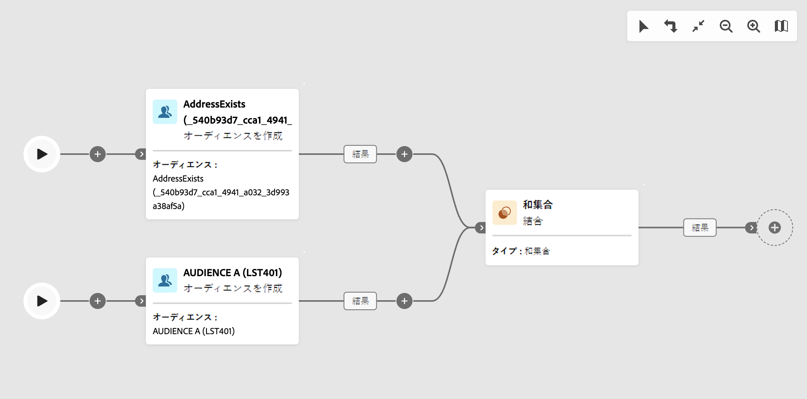

# ワークフローのガードレールと制限 {#guardrails-limitations}

Campaign クライアントコンソールで作成または変更されたワークフローを使用して Campaign Web ユーザーインターフェイスで作業する場合、以下に示すガードレールと制限が適用されます。

このページでは、コンソールと Web ユーザーインターフェイスでワークフローを使用する際の主な考慮事項を特定しますが、2 つのインターフェイス間の潜在的な非互換性がすべて含まれているわけではありません。

## ワークフローアクティビティ {#wkf-activities}

Campaign Web でまだサポートされていないワークフローアクティビティは読み取り専用で、互換性のないアクティビティとして表示されます。 ワークフローの実行、メッセージの送信、ログの確認などは引き続き実行できます。キャンペーン Web とクライアントコンソールの両方で使用可能なワークフローアクティビティは編集可能です。

Campaign Web ユーザーインターフェイスでまだサポートされていないワークフローアクティビティは、読み取り専用で、互換性のないアクティビティとして表示されます。 ワークフローの実行、メッセージの送信、ログの確認などは引き続き実行できます。Campaign Web ユーザーインターフェイスと Campaign クライアントコンソールの両方で使用できるワークフローアクティビティは編集可能です。

| コンソール | Web |
| --- | --- |
| {zoomable=&quot;yes&quot;}{width="800px" align="left" zoomable="yes"} | {zoomable=&quot;yes&quot;}{width="800px" align="left" zoomable="yes"} |

When a **クエリ** または **エンリッチメント** 「 」アクティビティに追加のデータが設定されている場合、コンソールではエンリッチメントデータが Campaign Web で考慮され、アウトバウンドトランジションに渡されますが、編集はできません。

| コンソール | Web |
| --- | --- |
| {zoomable=&quot;yes&quot;}{width="800px" align="left" zoomable="yes"} | {zoomable=&quot;yes&quot;}{width="800px" align="left" zoomable="yes"} |

コンソールで、**エンリッチメント**&#x200B;アクティビティは、紐付けとエンリッチメントの両方を実行できます。を定義済みの場合、クライアントコンソールで、紐付け設定を **エンリッチメント** アクティビティの場合は、 **紐づけ** アクティビティを参照してください。

| コンソール | Web |
| --- | --- |
| {zoomable=&quot;yes&quot;}{width="800px" align="left" zoomable="yes"} | {zoomable=&quot;yes&quot;}{width="800px" align="left" zoomable="yes"} |

## ワークフローキャンバス {#wkf-canvas}

Campaign Web ユーザーインターフェイスで新しいワークフローを作成する場合、キャンバスは 1 つのエントリポイントのみをサポートします。 ただし、複数のエントリポイントを持つワークフローをコンソールで作成した場合は、Campaign Web ユーザーインターフェイスで開いて編集できます。

| コンソール | Web |
| --- | --- |
| {zoomable=&quot;yes&quot;}{width="800px" align="left" zoomable="yes"} | {zoomable=&quot;yes&quot;}{width="800px" align="left" zoomable="yes"} |

ノードの配置は、アクティビティが追加または削除されるたびに更新されます。コンソールでワークフローを作成し、Campaign Web ユーザーインターフェイスを使用して変更し、コンソールで再度開くと、小さな配置に問題が生じる場合があります。 これは、ワークフローのプロセスとタスクには影響しません。

| 最初のワークフロー | 位置の変更 |
| --- | --- |
| {zoomable=&quot;yes&quot;}{width="800px" align="left" zoomable="yes"} | {zoomable=&quot;yes&quot;}{width="800px" align="left" zoomable="yes"} |
