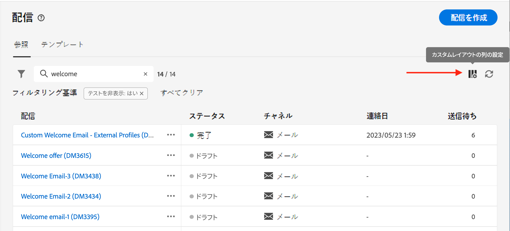
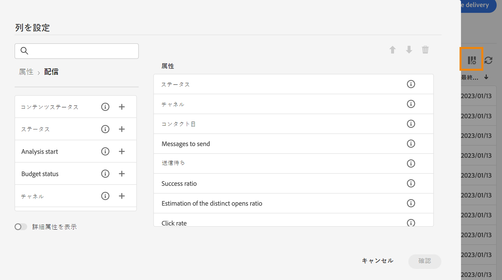
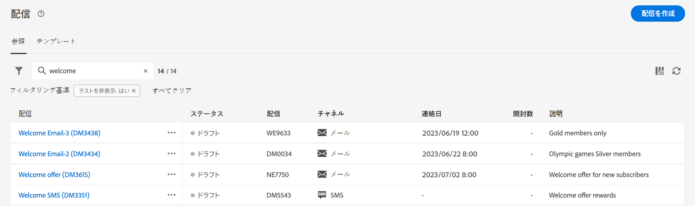
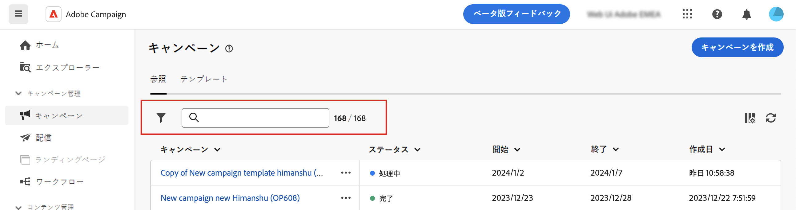
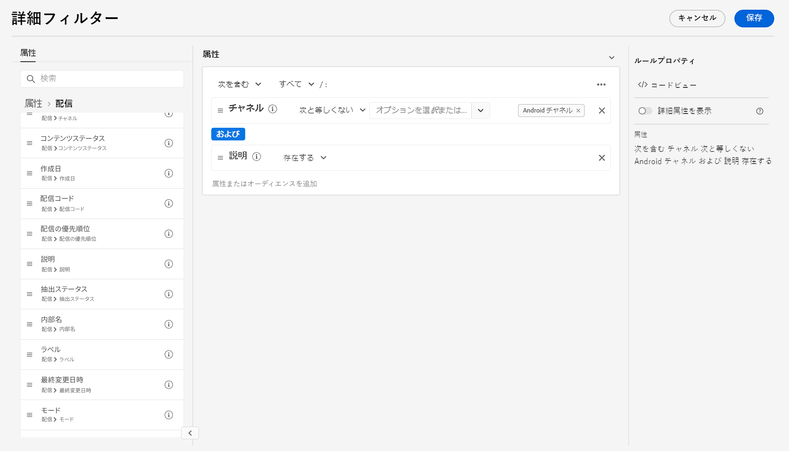

# リストの参照、検索、フィルタリング {#list-screens}

左側のナビゲーションメニューのほとんどのリンクには、オブジェクトのリスト ( **配信** または **キャンペーン**. これらのリスト画面の一部は読み取り専用です。 以下に説明するように、リストの表示をカスタマイズし、これらのリストをフィルタリングできます。

フィルターを削除するには、 **すべてクリア** 」ボタンをクリックします。

## リスト画面のカスタマイズ {#custom-lists}

リストは複数の列で表示されます。 列の設定を変更すると、追加情報を表示できます。これをおこなうには、 **カスタムレイアウトの列を設定する** アイコンをクリックします。

{width="70%" align="left" zoomable="yes"}

内 **列の設定** 画面を表示し、列を追加または削除し、列の表示順を変更します。

例えば、次の設定の場合は、

{width="70%" align="left"}

リストには、次の列が表示されます。

{width="70%" align="left"}

以下を使用： **詳細属性の表示** 切り替えて、現在のリストのすべての属性を表示します。 [詳細情報](#adv-attributes)

## データを並べ替え {#sort-lists}

任意の列見出しをクリックして、リスト内の項目を並べ替えることもできます。 リストがその列で並べ替えられていることを示す（上または下）矢印が表示されます。

数値列または日付列の場合、 **上** 矢印は、リストが昇順で並べ替えられ、 **下** 矢印は降順を示します。 文字列の列または英数字の列の場合、値はアルファベット順に表示されます。

## 組み込みフィルター {#list-built-in-filters}

項目をすばやく見つけるには、検索バーを使用するか、コンテキスト条件に基づいてリストをフィルタリングします。

{width="70%" align="left"}

例えば、ステータス、チャネル、コンタクト日またはフォルダーに関する配信をフィルターできます。 テストを非表示にすることもできます。

## カスタムフィルター{#list-custom-filters}

データに対してカスタムフィルターを作成するには、フィルターの下部まで参照し、 **ルールを追加** 」ボタンをクリックします。

属性をドラッグ&amp;ドロップして、 **詳細フィルター** 画面

{width="70%" align="left"}

以下を使用： **詳細属性の表示** 切り替えて、現在のリストのすべての属性を表示します。 [詳細情報](#adv-attributes)

## 詳細属性を使用 {#adv-attributes}

>[!CONTEXTUALHELP]
>id="acw_attributepicker_advancedfields"
>title="詳細属性を表示"
>abstract="デフォルトでは、最も一般的な属性のみが属性リストに表示されます。 この切り替えを使用して、高度な属性を持つフィルターを作成します。"

属性リストおよびフィルター設定画面には、デフォルトで、最も一般的な属性のみが表示されます。 設定された属性 `advanced` データスキーマの属性は、設定画面で非表示になります。

以下を使用： **詳細属性の表示** 切り替えて、現在のリストで使用可能なすべての属性を表示します。
