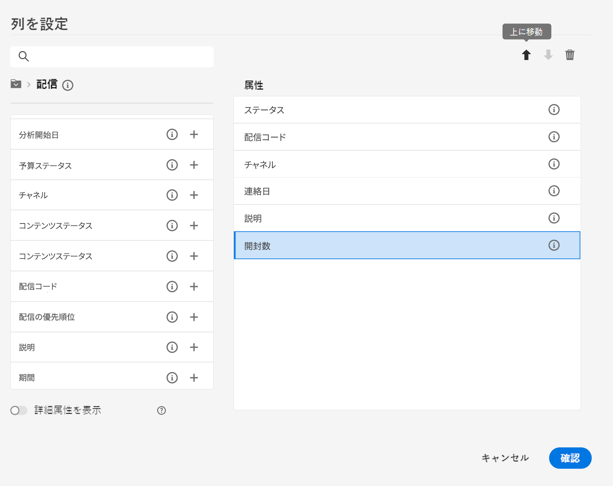
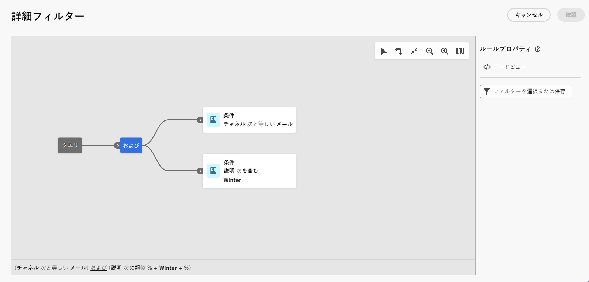

# リストの参照、検索、フィルタリング {#list-screens}

左側のナビゲーションメニューからのリンクのほとんどには、**配信**&#x200B;や&#x200B;**キャンペーン**&#x200B;のリストなど、オブジェクトのリストが表示されます。これらのリスト画面の一部は読み取り専用です。以下で説明するように、リスト表示をカスタマイズし、これらのリストをフィルタリングすることができます。

フィルターを削除するには、「**すべてクリア**」ボタンをクリックします。

## リスト画面のカスタマイズ {#custom-lists}

リストは複数の列で表示されます。列の設定を変更すると、追加情報を表示できます。これを行うには、リストの右上隅にある「**カスタムレイアウトの列を設定**」アイコンをクリックします。

{width="70%" align="left" zoomable="yes"}

**列を設定**&#x200B;画面で、列の追加または削除や表示順序の変更を行うことができます。

例えば、次の設定の場合：

{width="70%" align="left" zoomable="yes"}

リストには、次の列が表示されます。

{width="70%" align="left" zoomable="yes"}

現在のリストですべての属性を表示するには、**詳細属性を表示**&#x200B;切替スイッチを使用します。[詳細情報](#adv-attributes)

## データを並べ替え {#sort-lists}

また、任意の列見出しをクリックすると、リスト内の項目を並べ替えることができます。リストがその列で並べ替えられていることを示す（上または下）矢印が表示されます。

数値列または日付列の場合、**上向き**&#x200B;矢印はリストが昇順、**下向き**&#x200B;矢印は降順で並べ替えられていることを示します。文字列の列または英数字の列の場合、値はアルファベット順に表示されます。

## 組み込みフィルター {#list-built-in-filters}

項目をすばやく見つけるには、検索バーを使用するか、コンテキスト条件に基づいてリストをフィルタリングします。

{width="70%" align="left" zoomable="yes"}

例えば、ステータス、チャネル、連絡日またはフォルダーに基づいて配信をフィルタリングできます。また、テストを非表示にすることもできます。

## カスタムフィルター{#list-custom-filters}

データにカスタムフィルターを作成するには、フィルターの下部まで参照し、「**ルールを追加**」ボタンをクリックします。

属性をドラッグ＆ドロップして、**詳細フィルター**&#x200B;画面でフィルター条件を作成します。

{width="70%" align="left" zoomable="yes"}

現在のリストですべての属性を表示するには、**詳細属性を表示**&#x200B;切替スイッチを使用します。[詳細情報](#adv-attributes)

## 詳細属性を使用 {#adv-attributes}

>[!CONTEXTUALHELP]
>id="acw_attributepicker_advancedfields"
>title="詳細属性を表示"
>abstract="デフォルトでは、最も一般的な属性のみが属性リストに表示されます。この切替スイッチを使用して、詳細属性を備えたフィルターを作成します。"

>[!CONTEXTUALHELP]
>id="acw_rulebuilder_advancedfields"
>title="ルールビルダーの詳細フィールド"
>abstract="詳細フィールドを使用して詳細フィルターを設定します。"

>[!CONTEXTUALHELP]
>id="acw_rulebuilder_properties_advanced"
>title="ルールビルダーの詳細属性"
>abstract="詳細属性を使用して、ルールを定義します。"

デフォルトでは、属性リストおよびフィルター設定画面には、最も一般的な属性のみが表示されます。データスキーマで `advanced` 属性として設定した属性は、設定画面では非表示になります。

現在のリストで使用可能なすべての属性を表示するには、「**詳細属性を表示**」切替スイッチをアクティブ化します。属性リストは即座に更新されます。

{width="70%" align="left" zoomable="yes"}
