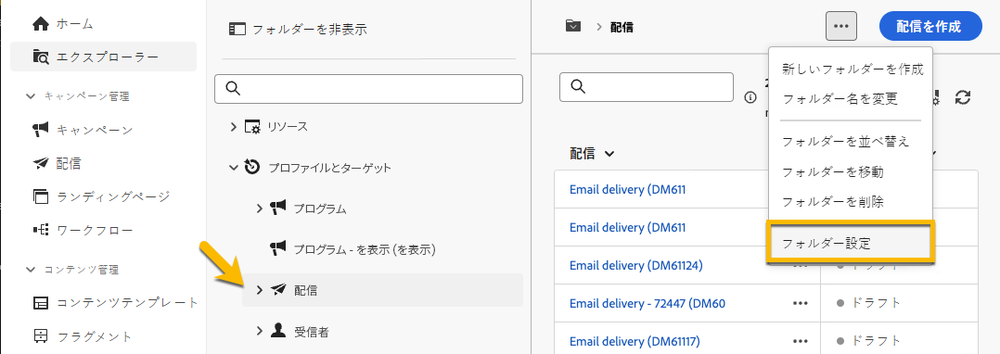
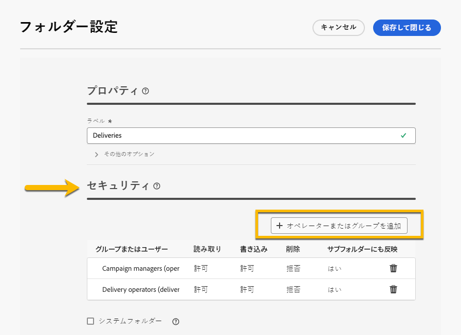
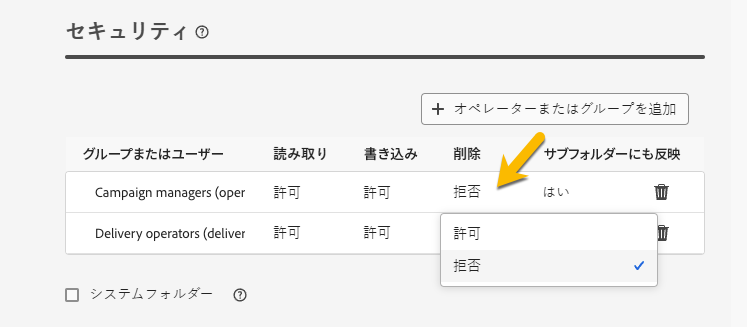

# 権限 {#permissions}

Adobe Campaign の各ユーザーには、アプリケーションで独自の権限と制限があります。ユーザーは、オペレーターグループの一部であり、グループの権限を継承します。

オペレーターは、権限に応じて、以下を行うことができます。

* 特定の機能へのアクセス
* 特定のデータへのアクセス
* 特定のアクション（作成、変更、削除）へのアクセス

Adobe Campaign で権限を設定する手順について詳しくは、[Adobe Campaign v8（コンソール）ドキュメント](https://experienceleague.adobe.com/ja/docs/campaign/campaign-v8/admin/permissions/gs-permissions){target="_blank"}を参照してください。

## フォルダーに対する権限 {#folder-permissions}

権限に応じて、**[!UICONTROL フォルダー設定]**&#x200B;でフォルダーの権限を表示および管理できます。

配信フォルダーの例を以下に示します。

{zoomable="yes"}

**[!UICONTROL フォルダー設定]**&#x200B;の「**[!UICONTROL セキュリティ]**」セクションでは、フォルダーにアクセスできるオペレーターまたはグループを表示および管理（追加または削除）できます。

{zoomable="yes"}

権限を直接クリックして、**[!UICONTROL 許可]**&#x200B;または&#x200B;**[!UICONTROL 拒否]**&#x200B;を変更できます。

{zoomable="yes"}

「**[!UICONTROL 生成]**」オプションが有効になっている場合、フォルダーに定義されているすべての権限がそのすべてのサブフォルダーに適用されます。これらの権限は、サブフォルダーごとにオーバーロードできます。

「**[!UICONTROL システムフォルダー]**」オプションがオンになっている場合、権限に関係なく、すべてのオペレーターにアクセス権が付与されます。

また、[Adobe Campaign コンソールでフォルダーの権限を管理](https://experienceleague.adobe.com/ja/docs/campaign/campaign-v8/admin/permissions/folder-permissions){target="_blank"}することもできます。

Campaign web ユーザーインターフェイスのすべての権限は、Campaign クライアントコンソールの権限と同期されます。
