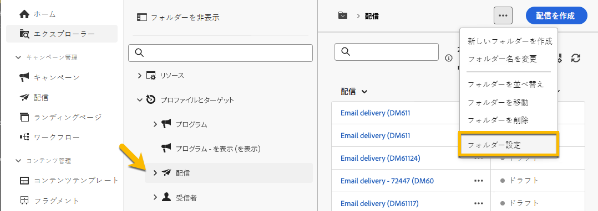
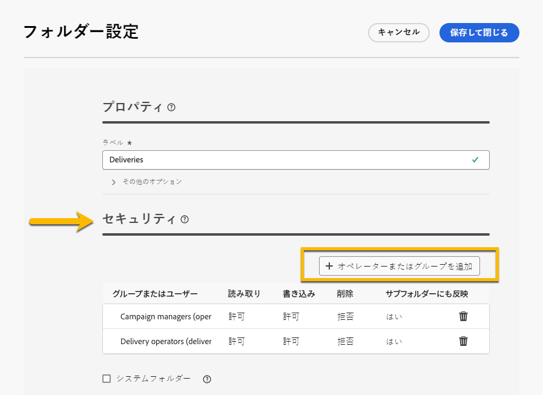
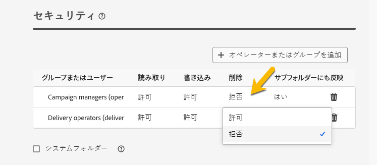

# 権限 {#permissions}

Adobe Campaign の各ユーザーには、アプリケーションで特定の権限と制限があります。 ユーザーは、オペレーターグループに属し、グループの権限を継承できます。

オペレーターは、権限に基づいて、以下を行うことができます。

* 特定の機能へのアクセス
* 特定のデータへのアクセス
* 特定のアクション（作成、変更、削除）へのアクセス

Adobe Campaign で権限を設定する手順について詳しくは、[Adobe Campaign v8（コンソール）ドキュメント](https://experienceleague.adobe.com/ja/docs/campaign/campaign-v8/admin/permissions/gs-permissions){target="_blank"}を参照してください。

## フォルダーに対する権限 {#folder-permissions}

権限に基づいて、**[!UICONTROL フォルダー設定]**&#x200B;でフォルダーに対する権限を表示および管理できます。

配信フォルダーの例を以下に示します。

{zoomable="yes"}

**[!UICONTROL フォルダー設定]**&#x200B;の「**[!UICONTROL セキュリティ]**」セクションでは、フォルダーにアクセスできるオペレーターまたはグループを表示および管理（追加または削除）できます。

{zoomable="yes"}

権限を直接クリックして、**[!UICONTROL 許可]**&#x200B;または&#x200B;**[!UICONTROL 拒否]**&#x200B;を変更できます。

{zoomable="yes"}

>[!NOTE]
>
>オブジェクトに書き込み権限のあるフォルダーが 1 つもなければ、オブジェクトを作成することはできません。
>
>フラグメントを作成するには管理者である必要はありませんが、少なくとも 1 つの「コンテンツビジュアルフラグメント」フォルダーに対する書き込み権限が必要です。 権限がない場合は、ビジュアルフラグメントを作成することはできません。

「**[!UICONTROL 生成]**」オプションが有効になっている場合、フォルダーに定義されているすべての権限がそのすべてのサブフォルダーに適用されます。 これらの権限は、サブフォルダーごとに上書きできます。

「**[!UICONTROL システムフォルダー]**」オプションを選択した場合、権限に関係なく、すべてのオペレーターにアクセス権が付与されます。

これらの権限がフォルダーに対して実行可能なアクションに与える影響について詳しくは、この[節](work-with-folders.md#folder-access-rights)を参照してください。

ネームド権限も、オペレーターが使用できるフォルダーアクションを決定します。 [Campaign v8 ドキュメント](https://experienceleague.adobe.com/docs/campaign/campaign-v8/permissions/manage-permissions.html?lang=ja#use-named-rights){target="_blank"}を参照してください。

Campaign web ユーザーインターフェイスのすべての権限は、Campaign クライアントコンソールの権限と同期されます。