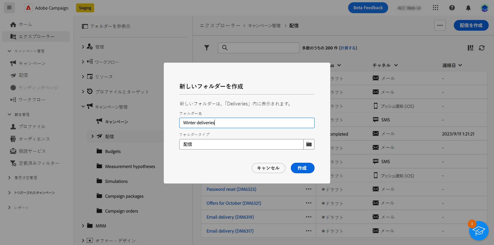

# アクセスと権限 {#access-and-permissions}

>[!CONTEXTUALHELP]
>id="acw_explorer_permissions_create"
>title="権限が必要です"
>abstract="このオブジェクトを作成するには、管理者から権限が付与されている必要があります。"

>[!CONTEXTUALHELP]
>id="acw_audiences_read_only"
>title="このオーディエンスは読み取り専用です"
>abstract="このオーディエンスを編集する権限がありません。必要に応じて、管理者に連絡し、アクセス権の付与を依頼してください。"

>[!CONTEXTUALHELP]
>id="acw_subscription_services_read_only"
>title="このサービスは読み取り専用です"
>abstract="このサービスを編集する権限がありません。必要に応じて、管理者に連絡し、アクセス権の付与を依頼してください。"

>[!CONTEXTUALHELP]
>id="acw_recipients_readonlyprofile"
>title="受信者の読み取り専用プロファイル"
>abstract="このプロファイルを編集する権限がありません。必要に応じて、管理者に連絡し、アクセス権の付与を依頼してください。"

>[!CONTEXTUALHELP]
>id="acw_campaign_read_only"
>title="このキャンペーンは読み取り専用です"
>abstract="このキャンペーンを編集する権限がありません。必要に応じて、管理者に連絡し、アクセス権の付与を依頼してください。"

>[!CONTEXTUALHELP]
>id="acw_deliveries_read_only"
>title="この配信は読み取り専用です"
>abstract="この配信を編集する権限がありません。必要に応じて、管理者に連絡し、アクセス権の付与を依頼してください。"

>[!CONTEXTUALHELP]
>id="acw_wf_read_only"
>title="このワークフローは読み取り専用です"
>abstract="このワークフローを編集する権限がありません。必要に応じて、管理者に連絡し、アクセス権の付与を依頼してください。"

アクセス制御では、配信、受信者、ワークフローなどのメインリストからのオブジェクトやデータへのアクセスを制限できます。また、これらの制限は、**エクスプローラー**&#x200B;のナビゲーションツリーにも適用されます。さらに、ユーザーインターフェイスからオブジェクトを作成、削除、複製、編集する権限が必要です。

アクセス制御は、Campaign クライアントコンソールで管理します。Campaign web のすべての権限は、Campaign クライアントコンソールの権限と同期されます。 ユーザー権限を定義および変更できるのは、Campaign 管理者のみです。権限について詳しくは、[Campaign v8（クライアントコンソール）ドキュメント](https://experienceleague.adobe.com/docs/campaign/campaign-v8/admin/permissions/gs-permissions.html?lang=ja){target="_blank"}を参照してください。

Campaign web ユーザーインターフェイスを参照すると、権限に応じてデータ、オブジェクト、機能にアクセスできます。例えば、フォルダーへのアクセス権限がない場合、そのフォルダーは表示されません。また、権限は、オブジェクトとデータの管理にも影響します。特定のフォルダーに対する書き込み権限がないと、ユーザーインターフェイスに配信が表示されていても、そのフォルダーに配信を作成することはできません。

## 権限を表示 {#view-permissions}

**エクスプローラー**&#x200B;から、各フォルダーの権限を参照できます。これらの権限はクライアントコンソールで設定され、Campaign データへのアクセスを整理および制御するために使用されます。

フォルダーの権限を表示するには、次の手順に従います。

1. **エクスプローラー**&#x200B;の左側のナビゲーションメニューからフォルダーを選択します。
1. 右上隅にある「...」をクリックし、「**フォルダー権限**」を選択します。

   {zoomable="yes"}{width="70%" align="left" zoomable="yes"}

1. 次のように、画面で詳細を確認します。

   {zoomable="yes"}{width="70%" align="left" zoomable="yes"}

   グループまたはオペレーターは、選択したフォルダーに保存されているデータに対する読み取り、書き込み、削除の権限を持つことができます。

   「**生成**」オプションが有効になっている場合、フォルダーに定義されているすべての権限がそのすべてのサブフォルダーに適用されます。これらの権限は、サブフォルダーごとにオーバーロードできます。

   「**システムフォルダー**」オプションが有効になっている場合、権限に関係なく、すべてのオペレーターにアクセス権が付与されます。

フォルダー権限について詳しくは、[Campaign v8（クライアントコンソール）ドキュメント](https://experienceleague.adobe.com/docs/campaign/campaign-v8/admin/permissions/folder-permissions.html?lang=ja){target="_blank"}を参照してください。

## フォルダーの操作 {#folders}

>[!CONTEXTUALHELP]
>id="acw_folder_properties"
>title="フォルダーのプロパティ"
>abstract="フォルダーのプロパティ"

>[!CONTEXTUALHELP]
>id="acw_folder_security"
>title="フォルダーのセキュリティ"
>abstract="フォルダーのセキュリティ"

>[!CONTEXTUALHELP]
>id="acw_folder_restrictions"
>title="フォルダーの制限"
>abstract="フォルダーの制限"

>[!CONTEXTUALHELP]
>id="acw_folder_schedule"
>title="フォルダースケジュール"
>abstract="フォルダースケジュール"

フォルダーを作成、名前変更、並べ替え、移動して、コンポーネントやデータを整理できます。同じメニューからフォルダーを削除することもできます。

>[!CAUTION]
>
>フォルダーを削除すると、そのフォルダーに保存されているすべてのデータも削除されます。

フォルダーを作成するには、次の手順に従います。

1. **エクスプローラー**&#x200B;の左側のナビゲーションメニューからフォルダーを選択します。
1. 右上隅の 3 つのドットをクリックして選択します **新規フォルダーを作成**.
1. フォルダーの名前を入力します。

   {zoomable="yes"}{width="70%" align="left" zoomable="yes"}

1. フォルダータイプを選択します。 デフォルトでは、親フォルダータイプは「配信」が選択されています（この例では）。 フォルダータイプを変更するには、フォルダーアイコンをクリックし、他のタイプを選択します。

   {zoomable="yes"}{width="70%" align="left" zoomable="yes"}

1. 「**作成**」をクリックします。

   フォルダーは、現在のフォルダーのサブフォルダーとして追加されます。その新しいフォルダーを参照して、そのフォルダーに直接コンポーネントを作成します。また、プロパティの「**その他のオプション**」セクションで、任意のフォルダーからコンポーネントを作成し、その新しいフォルダーに保存することもできます。配信の場合は次のようになります。

   {zoomable="yes"}{width="70%" align="left" zoomable="yes"}
