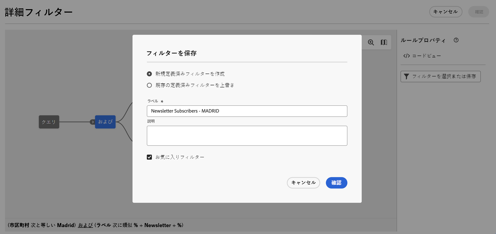
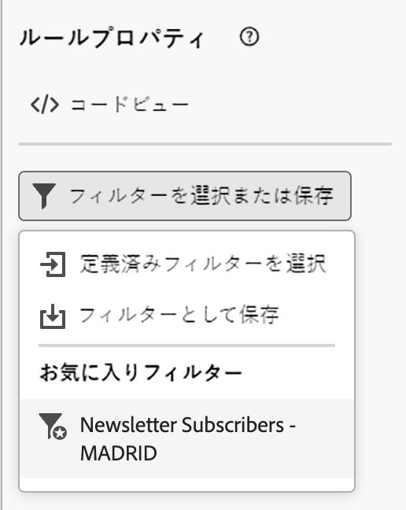

# 定義済みフィルターの操作 {#predefined-filters}

>[!CONTEXTUALHELP]
>id="acw_homepage_learning_card4"
>title="定義済みフィルター管理"
>abstract="Campaign Web ユーザーインターフェイスでは、特定のニーズに合わせて定義済みフィルターを簡単に管理およびカスタマイズできる、使いやすいインターフェイスを提供します。1 回作成し、後で使用するために保存します。"

<!--TO REMOVE BELOW-->
>[!CONTEXTUALHELP]
>id="acw_homepage_card4"
>title="定義済みフィルター管理"
>abstract="Campaign web では、特定のニーズに合わせて定義済みフィルターを簡単に管理およびカスタマイズできる、使いやすいインターフェイスを提供するようになりました。1 回作成し、後で使用するために保存します。"

<!--TO REMOVE ABOVE-->

>[!CONTEXTUALHELP]
>id="acw_predefined-filters-dashboard"
>title="定義済みフィルター"
>abstract="Campaign Web ユーザーインターフェイスでは、特定のニーズに合わせて定義済みフィルターを簡単に管理およびカスタマイズできる、使いやすいインターフェイスを提供します。1 回作成し、後で使用するために保存します。"

定義済みフィルターは、後で使用できるように作成および保存されるカスタムフィルターです。これらは、例えば、データのリストをフィルタリングしたり、配信のオーディエンスを作成したりする場合に、クエリモデラーでの任意のフィルタリング操作でショートカットとして使用できます。

既存の組み込みフィルターを使用して、データの特定のサブセットにアクセスしたり、独自の定義済みフィルターを作成して保存したりできます。

{zoomable=&quot;yes&quot;}{zoomable=&quot;yes&quot;}

## 定義済みフィルターの作成 {#create-predefined-filter}

>[!CONTEXTUALHELP]
>id="acw_predefined-filters-creation"
>title="定義済みフィルターの作成"
>abstract="定義済みフィルターのラベルを入力し、適用するテーブルを選択します。追加のオプションを開いて説明を追加し、このフィルターをお気に入りに設定します。次に、「ルールを作成」ボタンを使用して、フィルター条件を定義します。"

>[!CONTEXTUALHELP]
>id="acw_predefined-filters-rules"
>title="定義済みフィルタールールの作成"
>abstract="カスタムフィルターのフィルター条件を定義するには、「ルールを作成」ボタンをクリックします。"

### クエリモデラーからフィルターを作成 {#create-from-rule-builder}

[クエリモデラー](../query/query-modeler-overview.md)からカスタムフィルターを保存して、後で使用できるようにすることができます。次の手順に従います。

1. クエリモデラーを開き、フィルター条件を定義します。次の例では、マドリードに住み、ニュースレターを購読している受信者をフィルタリングします。
1. 「**フィルターを選択または保存**」ボタンをクリックし、「**フィルターとして保存**」を選択します。

   {zoomable=&quot;yes&quot;}

1. 「**新規フィルターを作成**」を選択して、そのフィルターの名前と説明を入力します。

   {zoomable=&quot;yes&quot;}

   必要に応じて、フィルターをお気に入りに保存できます。詳しくは、[こちら](#fav-filter)を参照してください。

1. 「**確認**」をクリックして変更を保存します。

これで、カスタムフィルターが&#x200B;**定義済みフィルター**&#x200B;リストに表示され、すべての Campaign ユーザーがアクセスできます。

### フィルターリストからフィルターの作成 {#create-filter-from-list}

左側のメニューの&#x200B;**定義済みフィルター**&#x200B;エントリからフィルターを作成できます。手順は次のとおりです。

1. 左側のメニューで&#x200B;**定義済みフィルター**&#x200B;エントリを参照します。
1. 「**フィルターを作成**」ボタンをクリックします。
1. フィルター名を入力し、「**ドキュメントタイプ**」フィールドから適用するスキーマを選択します。デフォルトのスキーマは、`Recipients(nms)` です。

1. フィルターのルールを定義します。例えば、30 歳以上のプロファイルなどです。

   {zoomable=&quot;yes&quot;}

1. 変更内容を保存します。

   {zoomable=&quot;yes&quot;}

フィルターが定義済みフィルターに追加されます。必要に応じて、フィルターをお気に入りに保存できます。詳しくは、[こちら](#fav-filter)を参照してください。

## フィルターをお気に入りとして保存 {#fav-filter}

定義済みフィルターを作成する際に、この定義済みフィルターをお気に入りに表示する場合は「**お気に入りに保存**」オプションを有効にします。

フィルターをお気に入りに保存すると、以下に示すように、フィルター作成リストの「**お気に入りのフィルター**」セクションですべてのユーザーが使用できます。

{zoomable=&quot;yes&quot;}{width="30%" align="left"}

## 定義済みフィルターを使用 {#use-predefined-filter}

定義済みフィルターは、ルールプロパティを定義する際に使用できます。定義済みフィルターにアクセスするには、クエリモデラ―のドロップダウンで「**カスタムフィルターを選択**」オプションを選択します。

その後、現在のコンテキストで使用できる定義済みフィルターの完全なリストにアクセスし、ドロップダウンの「**お気に入りフィルター**」セクションにあるショートカットを使用できます。お気に入りについて詳しくは、[こちらの節](#fav-filter)を参照してください。

例えば、定義済みフィルターからオーディエンスを作成するには、次の手順に従います。

1. 左側のメニューで&#x200B;**オーディエンス**&#x200B;エントリを参照し、オーディエンスリストの左上隅にある「**オーディエンスを作成**」ボタンをクリックします。
1. オーディエンス名を入力し、「**オーディエンスを作成**」ボタンをクリックします。
1. 「**クエリ**」アクティビティを選択して、右側のパネルで「**オーディエンスを作成**」ボタンをクリックします。

   {zoomable=&quot;yes&quot;}

1. 「**フィルターボタンを選択または保存**」から、「**カスタムフィルターを選択**」オプションを選択します。

   {zoomable=&quot;yes&quot;}

1. オーディエンスの作成、選択、確認に使用する定義済みフィルターを参照します。

   {zoomable=&quot;yes&quot;}

1. このフィルターのルールのプロパティを確認し、確定します。

   フィルターが&#x200B;**クエリ**&#x200B;アクティビティでクエリとして使用されるようになります。

   {zoomable=&quot;yes&quot;}

1. 変更を保存し、「**開始**」ボタンをクリックしてオーディエンスを作成し、オーディエンスリストで使用できるようにします。

## 定義済みフィルターの管理 {#manage-predefined-filter}

定義済みフィルターはすべて、左側のナビゲーションメニューの専用のエントリにグループ化されます。

{zoomable=&quot;yes&quot;}

このリストから、上記のとおりに新規フィルターを作成できます。さらに、以下のアクションを実行できます。

* 既存のフィルターを編集し、ルールとプロパティを変更します。
* 定義済みフィルターを複製します。
* 定義済みフィルターを削除します。

また、オーディエンスの作成時にすばやくアクセスできるよう、定義済みフィルターをお気に入りに追加することもできます。詳しくは、[こちら](#fav-filter)を参照してください。

<!--
## Built-in predefined filters {#ootb-predefined-filter}

Campaign comes with a set of predefined filters, built from the client console. These filters can be used to define your audiences, and rules. They must not be modified.
-->
