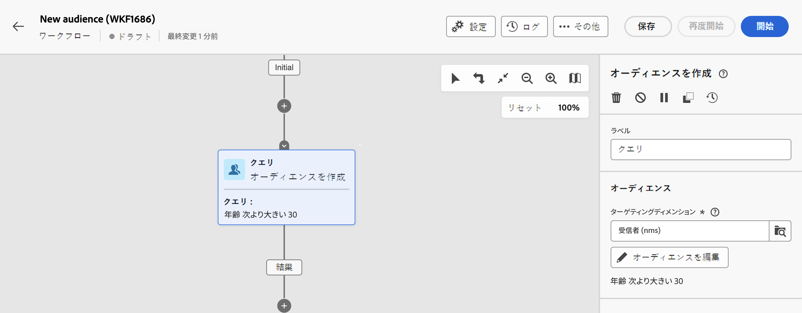

# 定義済みフィルターの操作 {#predefined-filters}

>[!CONTEXTUALHELP]
>id="acw_homepage_learning_card4"
>title="定義済みフィルター管理"
>abstract="Campaign Web ユーザーインターフェイスでは、特定のニーズに合わせて定義済みフィルターを簡単に管理およびカスタマイズできる、使いやすいインターフェイスを提供します。1 回作成し、後で使用するのに保存します。"

>[!CONTEXTUALHELP]
>id="acw_predefined-filters-dashboard"
>title="定義済みフィルター"
>abstract="Campaign Web ユーザーインターフェイスでは、特定のニーズに合わせて定義済みフィルターを簡単に管理およびカスタマイズできる、使いやすいインターフェイスを提供します。1 回作成し、後で使用するのに保存します。"

>[!CONTEXTUALHELP]
>id="acw_delivery_alerting_filter"
>title="アラート基準の作成"
>abstract="顧客管理／定義済みフィルターメニューから独自の配信フィルターを作成できます。"

定義済みフィルターは、後で使用することを目的に作成および保存されるカスタムフィルターです。これらは、クエリモデラーを使用したフィルタリング操作中のショートカットとして機能します。これらは、例えば、データのリストをフィルタリングしたり、配信のオーディエンスを作成したりする際に使用できます。

既存のビルトインのフィルターを使用して、データの特定のサブセットにアクセスしたり、独自の定義済みフィルターを作成して保存したりできます。

{zoomable="yes"}

## 定義済みフィルターの作成 {#create-predefined-filter}

>[!CONTEXTUALHELP]
>id="acw_predefined-filters-creation"
>title="定義済みフィルターの作成"
>abstract="定義済みフィルターのラベルを入力し、適用するテーブルを選択します。追加のオプションを開いて説明を追加し、このフィルターをお気に入りに設定します。次に、「ルールを作成」ボタンを使用して、フィルター条件を定義します。"

>[!CONTEXTUALHELP]
>id="acw_predefined-filters-rules"
>title="定義済みフィルタールールの作成"
>abstract="カスタムフィルターのフィルター条件を定義するには、「ルールを作成」ボタンをクリックします。"

### クエリモデラーからフィルターを作成 {#create-from-rule-builder}

[クエリモデラー](../query/query-modeler-overview.md)からカスタムフィルターを保存して、後で使用できるようにすることができます。次の手順に従います。

1. クエリモデラーを開き、フィルター条件を定義します。次の例では、マドリードに住み、ニュースレターを購読している受信者をフィルタリングします。
1. 「**フィルターを選択または保存**」ボタンをクリックし、「**フィルターとして保存**」を選択します。

   {zoomable="yes"}

1. 「**新規フィルターを作成**」を選択して、そのフィルターの名前と説明を入力します。

   {zoomable="yes"}

   必要に応じて、フィルターをお気に入りに保存できます。詳しくは、[こちら](#fav-filter)を参照してください。

1. 「**確認**」をクリックして変更を保存します。

これで、カスタムフィルターが&#x200B;**定義済みフィルター**&#x200B;リストに表示され、すべての Campaign ユーザーがアクセスできます。

### フィルターリストからフィルターの作成 {#create-filter-from-list}

左側のメニューの&#x200B;**定義済みフィルター**&#x200B;エントリからフィルターを作成します。次の手順に従います。

1. 左側のメニューで&#x200B;**定義済みフィルター**&#x200B;エントリを参照します。
1. 「**フィルターを作成**」ボタンをクリックします。
1. フィルター名を入力し、「**ドキュメントタイプ**」フィールドから適用するスキーマを選択します。デフォルトのスキーマは、`Recipients(nms)` です。

1. フィルターのルールを定義します。例えば、30 歳以上のプロファイルなどです。

   {zoomable="yes"}

1. 変更内容を保存します。

   {zoomable="yes"}

フィルターが定義済みフィルターに追加されます。必要に応じて、フィルターをお気に入りに保存できます。詳しくは、[こちら](#fav-filter)を参照してください。

## フィルターをお気に入りとして保存 {#fav-filter}

定義済みフィルターを作成する際に、この定義済みフィルターをお気に入りに表示するには「**お気に入りに保存**」オプションを有効にします。

フィルターをお気に入りに保存すると、以下に示すように、フィルター作成リストの「**お気に入りのフィルター**」セクションですべてのユーザーが使用できます。

{zoomable="yes"}{width="30%" align="left"}

## 定義済みフィルターを使用 {#use-predefined-filter}

定義済みフィルターは、ルールプロパティを定義する際に使用できます。定義済みフィルターにアクセスするには、クエリモデラーのドロップダウンで「**カスタムフィルターを選択**」オプションを選択します。

現在のコンテキストで使用できる定義済みフィルターの完全なリストにアクセスし、ドロップダウンの「**お気に入りフィルター**」セクションにあるショートカットを使用します。お気に入りについて詳しくは、[こちらの節](#fav-filter)を参照してください。

例えば、定義済みフィルターからオーディエンスを作成するには、次の手順に従います。

1. 左側のメニューで&#x200B;**オーディエンス**&#x200B;エントリを参照し、オーディエンスリストの左上隅にある「**オーディエンスを作成**」ボタンをクリックします。
1. オーディエンス名を入力し、「**オーディエンスを作成**」ボタンをクリックします。
1. 「**クエリ**」アクティビティを選択して、右側のパネルで「**オーディエンスを作成**」ボタンをクリックします。

   {zoomable="yes"}

1. 「**フィルターボタンを選択または保存**」から、「**カスタムフィルターを選択**」オプションを選択します。

   {zoomable="yes"}

1. オーディエンスの作成、選択、確認に使用する定義済みフィルターを参照します。

   {zoomable="yes"}

1. このフィルターのルールのプロパティを確認し、確定します。

   フィルターが&#x200B;**クエリ**&#x200B;アクティビティでクエリとして使用されるようになります。

   {zoomable="yes"}

1. 変更を保存し、「**開始**」ボタンをクリックしてオーディエンスを作成し、オーディエンスリストで使用できるようにします。

## 定義済みフィルターの管理 {#manage-predefined-filter}

定義済みフィルターはすべて、左側のナビゲーションメニューの専用のエントリにグループ化されます。

{zoomable="yes"}

このリストから、上記のとおりに新規フィルターを作成できます。さらに、以下のアクションを実行できます。

* 既存のフィルターを編集し、ルールとプロパティを変更します。
* 定義済みフィルターを複製します。
* 定義済みフィルターを削除します。

また、定義済みフィルターをルールビルダーから直接編集または削除できます。定義済みフィルター選択ウィンドウから、「**その他のアクション**」ボタンを使用します。フィルターを削除または編集できます。ラベルを変更し、説明を追加して、お気に入りとして追加できます。

{zoomable="yes"}

<!--
## Built-in predefined filters {#ootb-predefined-filter}

Campaign comes with a set of predefined filters, built from the client console. These filters can be used to define your audiences, and rules. They must not be modified.
-->