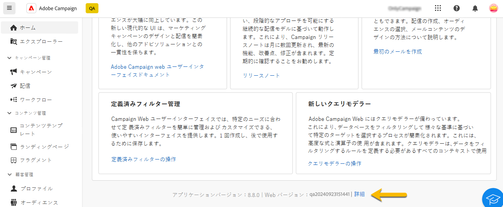
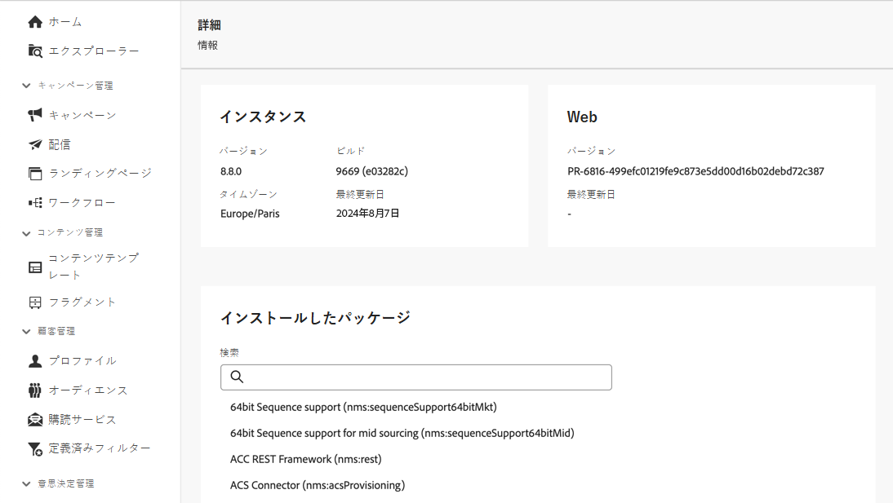

# インターフェイスの確認 {#user-interface}

新しい Adobe Campaign web インターフェイスは、マーケティングキャンペーンのデザインと配信を簡素化する、最新の直感的なユーザーエクスペリエンスを提供します。新しいインターフェイスは、Adobe Experience Cloud のアプリおよびソリューションと統合されています。

Adobe Campaign に接続する方法と、Experience Cloud ナビゲーションの基本については、[この記事](connect-to-campaign.md)を参照してください。

>[!NOTE]
>
>このドキュメントは、製品のユーザーインターフェイスに対する最新の変更を反映するために頻繁に更新されています。ただし、一部のスクリーンショットは、お使いのユーザーインターフェイスと多少異なる場合があります。

## Campaign ホームページ {#user-interface-home}

>[!CONTEXTUALHELP]
>id="acw_homepage_recent"
>title="最近使用したもの"
>abstract="**最近使用したもの**&#x200B;リストには、最近作成および変更した配信へのショートカットが一覧表示されます。このリストには、チャネル、ステータス、所有者、作成日、変更日が表示されます。"

Campaign ホームページでは、主要リソース、指標、コンポーネントをすばやく簡単に参照できます。

ホームページの上部セクションには、製品で使用可能な最新の更新と新機能の詳細が、リリースノートと詳細なドキュメントへのリンクと共に表示されます。機能カードをスクロールするには、左向き矢印を使用します。

{zoomable="yes"}

**主要業績評価指標**&#x200B;の節では、一般的な KPI を通じてプラットフォームの有効性を確認できます。KPI について詳しくは、[このページ](../reporting/kpis.md)を参照してください。

**最近使用したもの**&#x200B;リストには、最近作成および変更した配信へのショートカットが一覧表示されます。このリストには、チャネル、ステータス、所有者、作成日、変更日が表示されます。さらに配信を読み込むには、**詳細を表示**&#x200B;リンクをクリックします。

また、ホームページの「**ラーニング**」セクションから、Adobe Campaign web の主要ヘルプページにアクセスすることができます。

### リンクについて {#user-interface-about}

>[!CONTEXTUALHELP]
>id="acw_about"
>title="ページについて"
>abstract="詳細ページには、Adobe Campaign インスタンスに関する詳細が表示されます。"

>[!CONTEXTUALHELP]
>id="acw_about_instance"
>title="インスタンスについて"
>abstract="「インスタンス」セクションには、バージョンと関連付けられたビルド番号の両方を含む、コンソールクライアントに関する主な情報が表示されます。"

>[!CONTEXTUALHELP]
>id="acw_about_web"
>title="Web について"
>abstract="「Web」セクションには、Campaign web ユーザーインターフェイスのバージョンと、使用可能な場合は最終更新日が表示されます。"

>[!CONTEXTUALHELP]
>id="acw_about_packages"
>title="インストールしたパッケージについて"
>abstract="「インストールしたパッケージ」セクションには、インスタンスに存在するすべてのモジュール、機能、統合が一覧表示されます。"

ページの下部にある&#x200B;**[!UICONTROL 詳細]**&#x200B;リンクには、Adobe Campaign インスタンスに関する詳細が表示されます。これらの詳細は読み取り専用モードです。

{zoomable="yes"}

「**インスタンス**」セクションには、**バージョン**&#x200B;と関連付けられた&#x200B;**ビルド**&#x200B;番号の両方を含む、コンソールクライアントに関する主な情報が表示されます。

* **バージョン**&#x200B;は、使用している公式リリースバージョンを指します。
* **ビルド**&#x200B;は、そのバージョンの特定の反復を指します。

バージョン番号とビルド番号は両方とも、環境内に存在する機能と修正を特定するのに役立つので、トラブルシューティングには重要です。

「**Web**」セクションには、Campaign web ユーザーインターフェイスのバージョンと、使用可能な場合は最終更新日が表示されます。これは、Campaign web ユーザーインターフェイスに対して行われた変更や機能強化を追跡するのに役立ちます。

「**インストールしたパッケージ**」セクションには、インスタンスに存在するすべてのモジュール、機能、統合が一覧表示されます。これらのパッケージでは、Adobe Campaign の機能を拡張し、他のアドビソリューションとの統合や特定のワークフローのサポートなどの特殊なタスクを有効にします。多数のパッケージがある場合は、このセクション内で調査を行って、特定のモジュールがインスタンスにインストールされているかどうかをすばやく確認できます。

{zoomable="yes"}

## 左側のナビゲーションメニュー {#user-interface-left-nav}

左側のリンクを参照すると、Adobe Campaign Web 機能にアクセスできます。いくつかのリンクを選択すると、並べ替えやフィルタリングが可能なオブジェクトのリストが表示されます。また、必要なすべての情報を表示するように列を設定することもできます。[こちら](#list-screens)を参照してください。一部のリスト画面は読み取り専用です。左側のナビゲーションメニューとリストに表示される項目は、ユーザーの権限によって異なります。権限について詳しくは、[この節](permissions.md)を参照してください。

### エクスプローラー {#user-interface-explorer}

>[!CONTEXTUALHELP]
>id="acw_explorer"
>title="エクスプローラー"
>abstract="**エクスプローラー**&#x200B;メニューには、クライアントコンソールのフォルダー階層と同じフォルダー階層を持つすべての Campaign コンポーネントとオブジェクトが表示されます。このメニューから、すべての Campaign v8 コンポーネント、フォルダーおよびスキーマを参照し、関連する権限を確認し、フォルダーとサブフォルダーを作成します。"

**エクスプローラー**&#x200B;メニューには、クライアントコンソールのフォルダー階層と同じフォルダー階層を持つすべての Campaign リソースとオブジェクトが表示されます。すべての Campaign v8 コンポーネント、フォルダーおよびスキーマを参照し、配信、ワークフローおよびキャンペーンを作成します。

**エクスプローラー**&#x200B;に表示される項目は、ユーザー権限によって異なります。また、適切な権限がある場合は、フォルダーやサブフォルダーを追加することもできます。権限について詳しくは、[この節](permissions.md)を参照してください。

必要な情報がすべて表示されるように、列を設定して表示をカスタマイズできます。[こちら](#list-screens)を参照してください。また、フォルダーやサブフォルダーを追加することもできます。詳しくは、[この節](permissions.md#folders)を参照してください。

Campaign エクスプローラー、フォルダー階層およびリソースについて詳しくは、この [Campaign v8（コンソール）ドキュメント](https://experienceleague.adobe.com/docs/campaign/campaign-v8/new/campaign-ui.html?lang=ja#ac-explorer-ui){target="_blank"}を参照してください。

### キャンペーン管理 {#user-interface-campaign-management}

「**キャンペーン管理**」セクションでは、マーケティングキャンペーン、配信およびワークフローにアクセスできます。

* **キャンペーン** - キャンペーンのリストとキャンペーンテンプレートです。デフォルトでは、各キャンペーンの開始日、終了日、作成日、最終変更日、現在のステータス、キャンペーンを作成した Campaign オペレーターの名前を表示できます。ステータス、開始日／終了日、フォルダーでリストをフィルタリングしたり、詳細フィルターを作成して独自のフィルタリング条件を定義したりできます。キャンケーンの詳細については、[この節](../campaigns/gs-campaigns.md)を参照してください。

* **配信** - 配信のリストを閲覧できます。デフォルトでは、配信の状態、最終変更日および主要 KPI を確認できます。リストは、ステータス、連絡日またはチャネルでフィルタリングできます。メール配信をクリックすると、その配信のダッシュボードが開くので、配信の詳細を大まかに確認できます。他のチャネルでの配信は読み取り専用です。配信について詳しくは、[この節](../msg/gs-messages.md)を参照してください。

  「**その他のアクション**」ボタンを使用すると、配信を削除または複製できます。

  {zoomable="yes"}{width="70%" align="left"}[配信を削除または複製するオプションを含む「その他のアクション」ボタンを示すスクリーンショット。]

* **ワークフロー** - この画面では、ワークフローとワークフローテンプレートの完全なリストにアクセスできます。ステータス、最後／次回の実行日を確認し、新しいワークフローまたは新しいワークフローテンプレートを作成できます。他のオブジェクトと同じ条件でリストをフィルタリングできます。さらに、キャンペーンに属するかどうかにかかわらず、ワークフローをフィルタリングできます。ワークフローについて詳しくは、[この節](../workflows/gs-workflows.md)を参照してください。

### コンテンツ管理 {#user-interface-content-management}

「**コンテンツ管理**」セクションでは、コンテンツのテンプレートとフラグメントを表示できます。

* **コンテンツテンプレート** - 設計プロセスを加速し改善するために、スタンドアロンのテンプレートを作成すると、[!DNL Adobe Campaign] 全体でカスタムコンテンツを簡単に再利用できます。メールでのみ使用可能なこの機能により、コンテンツ指向のユーザーはスタンドアロンのテンプレートで操作でき、マーケティングユーザーは自分たちのメールキャンペーン内でテンプレートを再利用して適応させることができます。詳しくは、[こちら](../content/create-email-templates.md)を参照してください。

* **フラグメント** - フラグメントは、キャンペーン全体で 1 つ以上の配信で参照できる再利用可能なコンポーネントです。フラグメントを変更すると、そのフラグメントを使用するすべてのコンテンツが更新されます。[詳しくは、フラグメントの操作方法を参照してください](../content/fragments.md)。

この機能を使用すると、マーケティングユーザーが改善されたデザインプロセスでメールコンテンツを迅速に組み立てるために使用できる複数のカスタムコンテンツブロックを事前に作成できます。

### 顧客管理 {#user-interface-customer-management}

「**顧客管理**」セクションでは、プロファイル、オーディエンスおよび購読を表示できます。これらのリストは読み取り専用です。

* **プロファイル** - プロファイルを作成および管理し、受信者データベースにアクセスします。 デフォルトでは、メールアドレス、名前（名）および名前（姓）が表示されます。プロファイルについて詳しくは、[この節](../audience/about-recipients.md)を参照してください。
* **オーディエンス** - オーディエンスのリストです。デフォルトでは、オーディエンスのタイプ、接触チャネル、作成日、最終変更日およびラベルが表示されます。このリストは接触チャネルでフィルタリングできます。オーディエンスとリストについて詳しくは、[この節](../audience/about-recipients.md)を参照してください。
* **購読サービス** - 購読リストを参照できます。デフォルトでは、購読リストのタイプ、モードおよびラベルが表示されます。購読と購読解除を管理する方法について詳しくは、[Adobe Campaign v8（コンソール）ドキュメント](https://experienceleague.adobe.com/docs/campaign/campaign-v8/campaigns/send/subscriptions.html?lang=ja){target="_blank"}を参照してください。
* **定義済みフィルター** - 定義済みフィルターは、作成および保存して後で使用できるカスタムフィルターです。これらは、例えば、データのリストをフィルタリングしたり、配信のオーディエンスを作成したりする場合に、クエリモデラーでの任意のフィルタリング操作でショートカットとして使用できます。詳しくは、[こちら](predefined-filters.md)を参照してください。

### 意思決定管理 {#decision-management}

>[!CONTEXTUALHELP]
>id="acw_offers_list"
>title="オファー"
>abstract="**インタラクション**&#x200B;モジュールを使用して、コンソールで作成されたオファーとオファーテンプレートのリストを参照します。これらのリストは読み取り専用です。"
>additional-url="https://experienceleague.adobe.com/en/docs/campaign-web/v8/start/offers" text="配信へのオファーの追加"

「**意思決定管理**」セクションでは、オファーとオファーテンプレートを表示できます。これらのリストは読み取り専用です。

* **オファー** - **インタラクション**&#x200B;モジュールを使用して、コンソールで作成されたオファーとオファーテンプレートのリストを参照します。デフォルトでは、オファーのステータス、開始日／終了日および環境が表示されます。このリストは、ステータスや開始日／終了日でフィルタリングできます。オファーテンプレートも使用できます。

メールと SMS でオファーを作成して送信する方法については、[この節](../msg/offers.md)を参照してください。

### レポート {#left-nav-reporting}

* **レポート** - **レポート**&#x200B;エントリでは、Campaign 環境内の各チャネルのトラフィックとエンゲージメント指標の統合された全体的な概要が提供されます。これらのレポートは様々なウィジェットで構成され、それぞれがキャンペーンや配信パフォーマンスに関する明確な観点を提供します。詳しくは、[こちら](../reporting/global-reports.md)を参照してください。

### 管理 {#left-nav-admin}

* **監査記録** - **監査記録**&#x200B;エントリでは、インスタンス内の重要なエンティティに対して行われたすべての変更（通常、インスタンスのスムーズな操作に大きな影響を与える変更）を完全に表示できます。[詳細情報](../reporting/audit-trail.md)。

* **外部アカウント** - Web ユーザーインターフェイスを使用して新しい外部アカウントを作成し、特定のニーズを満たし、シームレスなデータ転送を確実に行います。[詳細情報](../administration/external-account.md)。

* **スキーマ** - カスタムフィールドは、Adobe Campaign コンソールを通じて標準スキーマに追加される追加属性です。[詳細情報](../administration/custom-fields.md)。

<!--* **Delivery Alerting** - Delivery Alerting is an alert management system that enables groups of users to automatically receive email notifications with information on their delivery executions. [Learn more](../msg/delivery-alerting.md).-->

## 詳細情報 {#learn-more}

Campaign 環境で使用可能なリストを参照、検索、フィルタリングする方法については、[このページ](list-filters.md)を参照してください。

<!--CONTEXTUAL HELP TO DISPATCH IN DOCS ONCE FEATURE LIVE-->

>[!CONTEXTUALHELP]
>id="acw_orchestration_notification"
>title="連続配信"
>abstract="連続配信"
