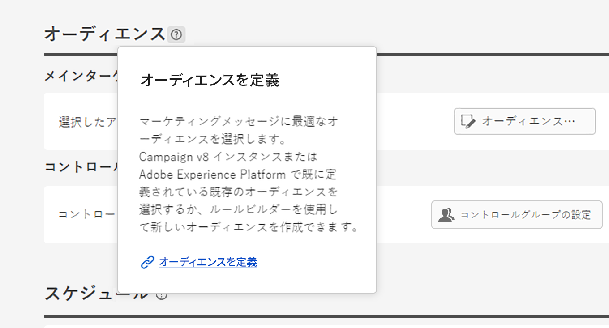
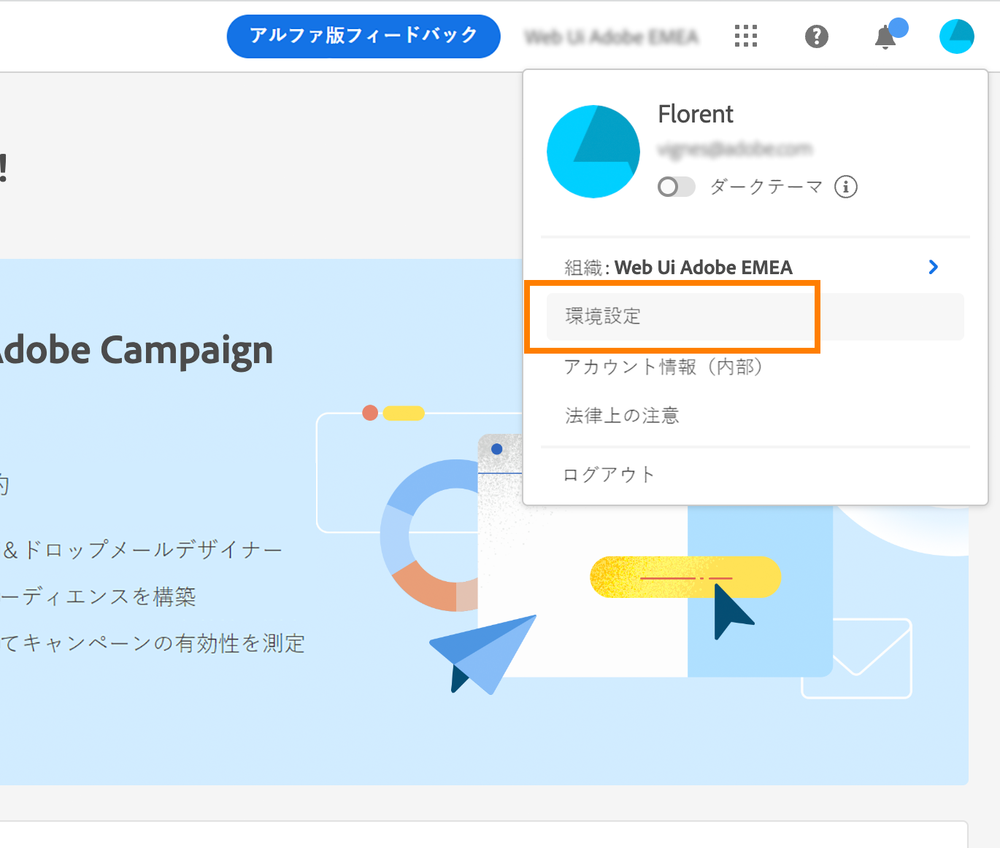
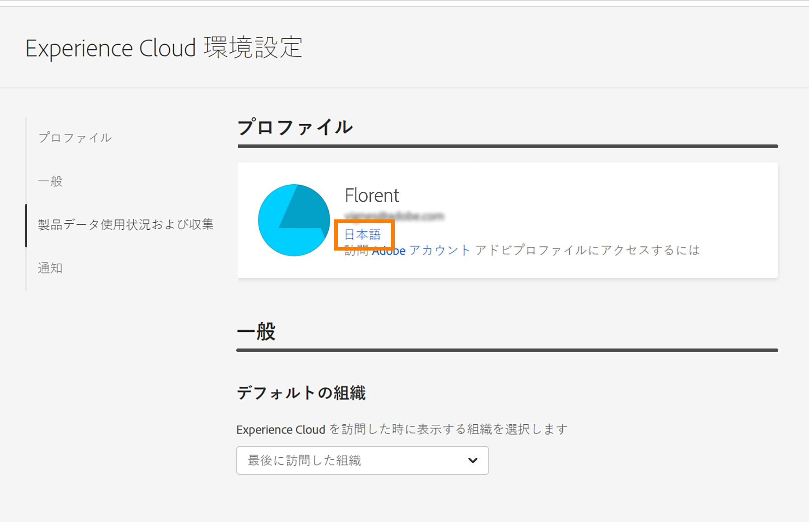
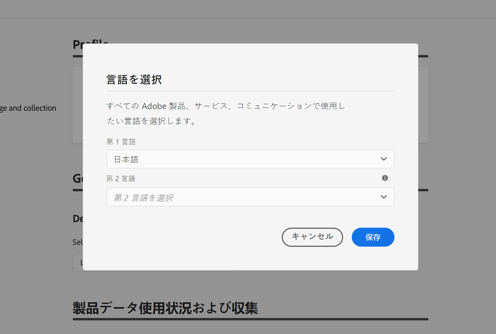

# インターフェイスを確認する {#user-interface}

>[!CONTEXTUALHELP]
>id="acw_homepage_learnmore"
>title="インターフェイスを確認する"
>abstract="新しい Campaign v8 web インターフェイスは、直感的で一貫性のある統合されたユーザーエクスペリエンスを提供します。"

新しい Campaign v8 web インターフェイスは、マーケティングキャンペーンのデザインと配信を簡素化する、最新の直感的なユーザーエクスペリエンスを提供します。この新しいインターフェイスは、Adobe Experience Platform と統合されています。

<!--
Key concepts when browsing the user interface are common with Adobe Experience Platform. Refer to [Adobe Experience Platform documentation](https://experienceleague.adobe.com/docs/experience-platform/landing/platform-ui/ui-guide.html#adobe-experience-platform-ui-guide) for more details.
-->

>[!NOTE]
>
>このドキュメントは、製品のユーザーインターフェイスに対する最新の変更を反映するために頻繁に更新されています。ただし、一部のスクリーンショットは、お使いのユーザーインターフェイスと多少異なる場合があります。

<!--
* console + web interface (overview, why use each of them)
* web UI made up of read-only lists that can be configured, show how to add columns
-->

## 左側のナビゲーションメニュー

左側のリンクを参照すると、Campaign v8 web 機能にアクセスできます。いくつかのリンクを選択すると、並べ替えやフィルタリングが可能なオブジェクトのリストが表示されます。また、必要なすべての情報を表示するように列を設定することもできます。[こちら](#list-screens)を参照してください。メール配信リストを除く、すべてのリスト画面は読み取り専用です。アルファバージョンでは、リスト項目をクリックして編集／表示することはできません。すべてのリストは、今後のバージョンで編集可能になります。左側のナビゲーションメニューに表示される項目は、ユーザー権限によって異なります。

### ホーム

この画面には、主な Campaign v8 web 機能にすばやくアクセスするための主要なリンクやリソースが含まれています。**最近使用したもの**&#x200B;リストには、最近作成および変更した配信へのショートカットが一覧表示されます。このリストには、配信の作成日と変更日およびステータスが表示されます。

<!--
* Banner
* KPIs on email channel (cross-deliveries): open rate, delivery rate, etc
* Recent items
* Learning cards
-->

ホームページの下部のセクションから、Campaign v8 web の主要ヘルプページにアクセスします。

<!--
show global KPIs, recent items + left menu to access features)
CONTROL PANEL not alpha
Global report not alpha
-->

### エクスプローラー

>[!CONTEXTUALHELP]
>id="acw_explorer"
>title="エクスプローラー"
>abstract="**エクスプローラー**&#x200B;メニューには、クライアントコンソールのフォルダー階層と同じフォルダー階層が表示されます。Campaign v8 のすべてのコンポーネント、フォルダーおよびスキーマを参照できます。メール配信リストを除く、すべてのリスト画面は読み取り専用です。"

**エクスプローラー**&#x200B;メニューには、クライアントコンソールのフォルダー階層と同じフォルダー階層が表示されます。Campaign v8 のすべてのコンポーネント、フォルダーおよびスキーマを参照できます。メール配信リストを除く、すべてのリスト画面は読み取り専用です。

エクスプローラーに表示される項目は、ユーザー権限によって異なります。

他のリスト画面と同様に、必要な情報をすべて表示するために、列を設定して表示をパーソナライズすることができます。[こちら](#list-screens)を参照してください。

Campaign エクスプローラーについて詳しくは、この[ドキュメント](https://experienceleague.adobe.com/docs/campaign/campaign-v8/new/ac-ui/campaign-ui.html?lang=ja#ac-explorer-ui){target="_blank"}を参照してください。
<!--
Explorer' menu in web UI to navigate through console content: console navtree second view in addition to the left menu lists with filters. The Explorer gives the real folder hierarchy from the console. Make sure you find your deliveries in sub-folders. All lists can be accessed in read-only. No Create/Edit. You can configure lists (colums). All schema fields, linked tables are available. 

If you need to view your lists of recipients (age, gender), transactions or live transactional messages. To view each/edit -> console.

Navtree view depends on permissions (same as console).
-->

### キャンペーン管理

>[!CONTEXTUALHELP]
>id="acw_campaigns_list"
>title="キャンペーン"
>abstract="これはキャンペーンのリストです。キャンペーンの開始日／終了日／最終変更日やステータスなどの有用な情報を確認できます。リストは、ステータスまたは開始日／終了日でフィルタリングできます。キャンペーンテンプレートも使用できます。これらのリストは読み取り専用です。"

>[!CONTEXTUALHELP]
>id="acw_deliveries_list"
>title="配信"
>abstract="配信のリストを閲覧できます。配信の状態、最終変更日および主要 KPI を確認できます。リストは、状態、コンタクト日またはチャネルでフィルタリングできます。メール配信をクリックすると、その配信のダッシュボードが開きます。その他の項目は読み取り専用です。 配信テンプレートも使用できます。"

* **キャンペーン** - キャンペーンのリストです。デフォルトでは、変更の開始日／終了日／最終更新日およびステータスを表示できます。リストは、ステータスまたは開始日／終了日でフィルタリングできます。キャンペーンテンプレートも使用できます。これらのリストは読み取り専用です。

* **配信** - 配信のリストを閲覧できます。デフォルトでは、配信の状態、最終変更日および主要 KPI を確認できます。リストは、状態、コンタクト日またはチャネルでフィルタリングできます。メール配信をクリックすると、その配信のダッシュボードが開くので、配信の詳細を大まかに確認できます。他のチャネルでの配信は読み取り専用です。配信テンプレートも読み取り専用モードで使用できます。これらは、クライアントコンソールを使用して編集できます。詳しくは、この[ドキュメント](https://experienceleague.adobe.com/docs/campaign/campaign-v8/campaigns/send/create-templates.html?lang=ja){target="_blank"}を参照してください。

   「**その他のアクション**」ボタンを使用すると、配信を削除または複製できます。

   {width="70%" align="left"}

### 顧客管理

>[!CONTEXTUALHELP]
>id="acw_recipients_list"
>title="受信者"
>abstract="受信者データベースにアクセスできます。メールアドレス、名、姓などの有用な情報を確認できます。このリストは読み取り専用です。"

>[!CONTEXTUALHELP]
>id="acw_audiences_list"
>title="オーディエンス"
>abstract="これはオーディエンスのリストです。オーディエンスのタイプ、接触チャネル、作成日／最終変更日およびラベルを確認できます。このリストは接触チャネルでフィルタリングできます。このリストは読み取り専用です。"

>[!CONTEXTUALHELP]
>id="acw_subscriptions_list"
>title="購読リスト"
>abstract="購読リストを閲覧できます。購読リストのタイプ、モードおよびラベルを確認できます。このリストは読み取り専用です。"

>[!CONTEXTUALHELP]
>id="acw_targeting_workflow_list"
>title="ターゲティングワークフロー"
>abstract="キャンペーンワークフローのリストにアクセスします。ワークフローの状態、前回／次の処理日および環境を確認できます。リストは、状態、前回の処理日およびワークフロータイプでフィルタリングできます。ワークフローテンプレートも使用できます。これらのリストは読み取り専用です。"

* **受信者** - 受信者データベースにアクセスできます。デフォルトでは、メールアドレス、名前（名）および名前（姓）が表示されます。このリストは読み取り専用です。
* **オーディエンス** - オーディエンスのリストです。 デフォルトでは、オーディエンスのタイプ、接触チャネル、作成日／最終変更日およびラベルが表示されます。このリストは接触チャネルでフィルタリングできます。このリストは読み取り専用です。
* **購読リスト** - 購読リストを閲覧できます。デフォルトでは、購読リストのタイプ、モードおよびラベルが表示されます。このリストは読み取り専用です。
* **ターゲティングワークフロー** - キャンペーンワークフローのリストにアクセスできます。デフォルトでは、ワークフローの状態、前回／次回の処理日および環境が表示されます。リストは、状態、前回の処理日およびワークフロータイプでフィルタリングできます。ワークフローテンプレートも使用できます。これらのリストは読み取り専用です。

### 意思決定管理

>[!CONTEXTUALHELP]
>id="acw_offers_list"
>title="オファー"
>abstract="インタラクションオファーのリストを閲覧できます。デフォルトでは、オファーのステータス、開始日／終了日および環境が表示されます。リストは、状態や開始日／終了日でフィルタリングできます。オファーテンプレートも使用できます。これらのリストは読み取り専用です。"

* **オファー** - インタラクションオファーのリストを閲覧できます。デフォルトでは、オファーのステータス、開始日／終了日および環境が表示されます。リストは、状態や開始日／終了日でフィルタリングできます。オファーテンプレートも使用できます。これらのリストは読み取り専用です。

## 上部バー

インターフェイスの上部のバーでは、次の操作を行えます。

* アルファテスターとしてのフィードバックの共有
* 組織とインスタンス間の切り替え
* Adobe Experience Cloud アプリケーションの切り替え
* ヘルプページへのアクセス、サポートへの問い合わせ、フィードバックの共有検索フィールドからヘルプ記事およびビデオを検索できます。

{width="70%" align="left"}
<!--
Org / Sub-org switcher to switch between instances. Only one for Alpha. Later: intermerdiate screen with Control Panel (beta). if v8 + ACS with one card per ACS instance. Maybe quickly explain the menu for Alpha?
-->

## リスト画面の設定 {#list-screens}

左側のナビゲーションメニューの複数のリンクには、**配信**&#x200B;または&#x200B;**キャンペーン**&#x200B;など、オブジェクトのリストが表示されます。メール配信リストを除き、すべてのリスト画面は読み取り専用です。

項目をすばやく見つけるには、検索バーを使用するか、コンテキスト条件に基づいてリストをフィルタリングします。

{width="70%" align="left"}

リストは複数の列で表示されます。 列の設定を変更すると、追加情報を表示できます。それには、リストの右上隅にあるアイコンをクリックします。 列の追加または削除や表示順序の変更を行うことができます。

{width="70%" align="left"}

任意の列ヘッダーをクリックすると、リスト内の項目を並べ替えることができます。リストがその列で並べ替えられていることを示す（上または下）矢印が表示されます。数値列または日付列の場合、上向き矢印はリストが昇順で並べ替えられていることを示し、下向き矢印は降順であることを示します。文字列の列または英数字の列の場合、値はアルファベット順に表示されます。

## コンテキストヘルプとオンボーディングガイド

コンテキストヘルプは、インターフェイスで利用できます。使用可能な場合、**？**&#x200B;アイコンをクリックしてヘルプ情報および関連ドキュメントのリンクを表示してください。

{width="70%" align="left"}

また、Campaign v8 web の基本を学ぶうえで役に立つオンボーディングガイドも利用できます。右下隅にあるアイコンをクリックし、利用できるステップバイステップ方式のシナリオの 1 つを選択し、指示に従うだけです。

{width="70%" align="left"}

## サポートしているブラウザー {#browsers}

Campaign v8 Web は、最新バージョンの Google Chrome、Safari および Microsoft Edge で最適に動作するように設計されています。古いバージョンや他のブラウザーでは、特定の機能を使用する際に問題が発生する可能性があります。

## 言語環境設定 {#language-pref}

Campaign v8 Web は現在、次の言語で利用できます。

<table>
<tr>
<td>

英語（米国）- EN-US

フランス語 - FR

ドイツ語 - DE

イタリア語 - IT

</td>
<td>

スペイン語 - ES

ポルトガル語（ブラジル）- PTBR

日本語 - JP

</td>
<td>

韓国語 - KR

簡体字中国語 - CHS

繁体字中国語 - CHT

</td>
</tr>
</table>

デフォルトのインターフェイス言語は、ユーザープロファイルで指定された優先言語によって決まります。

言語を変更するには：

1. 右上のプロファイルアイコンをクリックし、 「**環境設定**」を選択します。

   {width="70%" align="left"}

1. 次に、メールアドレスの下に表示されている言語をクリックします。

   

1. 優先言語を選択し、「**保存**」をクリックします。使用しているコンポーネントが第一希望の言語にローカライズされていない場合に備えて、第二の言語を選択できます。

   

<!--
## Supported browsers {#browsers}

Adobe Campaign interface is designed to work optimally in the latest version of Google Chrome. You might have trouble using certain features on older versions or other browsers.
-->

<!--
######## This part stores the contextualHelp definition for WebUI BETA ###########
######## These blocks should be dispatched in the appropriate pages when available ###########
######## PLEASE DO NOT DELETE ###########
-->

>[!CONTEXTUALHELP]
>id="acw_sms_report_overview"
>title="SMS レポートの概要"
>abstract="未定"

>[!CONTEXTUALHELP]
>id="acw_push_report_overview"
>title="プッシュレポートの概要"
>abstract="未定"

>[!CONTEXTUALHELP]
>id="acw_import_from_a_file"
>title="ファイルからオーディエンスをインポート"
>abstract="未定"

>[!CONTEXTUALHELP]
>id="acw_import_from_a_file_formatting"
>title="形式設定"
>abstract="未定"

>[!CONTEXTUALHELP]
>id="acw_import_from_a_file_columns"
>title="列設定"
>abstract="未定"

>[!CONTEXTUALHELP]
>id="acw_push_notification_template"
>title="プッシュ通知テンプレート"
>abstract="未定"

>[!CONTEXTUALHELP]
>id="acw_campaign_creation_properties"
>title="キャンペーン作成プロパティ"
>abstract="未定"

>[!CONTEXTUALHELP]
>id="acw_campaign_creation_schedule"
>title="キャンペーン作成スケジュール"
>abstract="未定"

>[!CONTEXTUALHELP]
>id="acw_rulebuilder_properties_advanced"
>title="ルールビルダーの詳細属性"
>abstract="未定"

>[!CONTEXTUALHELP]
>id="acw_deliveries_email_metrics_sent"
>title="送信済み指標"
>abstract="未定"

>[!CONTEXTUALHELP]
>id="acw_deliveries_email_metrics_errors"
>title="エラー指標"
>abstract="未定"
