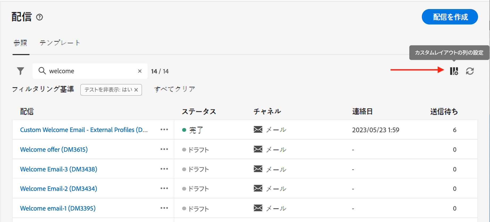

# インターフェイスを確認 {#user-interface}

>[!CONTEXTUALHELP]
>id="acw_homepage_learnmore"
>title="インターフェイスを確認"
>abstract="新しい Campaign v8 Web インターフェイスは、統合され、直感的で一貫性のあるユーザーエクスペリエンスを提供します。"

新しい Campaign v8 web インターフェイスは、マーケティングキャンペーンのデザインと配信を簡素化する、最新の直感的なユーザーエクスペリエンスを提供します。この新しいインターフェイスは、Adobe Experience Platform と統合されています。

>[!NOTE]
>
>このドキュメントは、製品のユーザーインターフェイスに対する最新の変更を反映するために頻繁に更新されています。ただし、一部のスクリーンショットは、お使いのユーザーインターフェイスと多少異なる場合があります。

## 左側のナビゲーションメニュー {#user-interface-left-nav}

左側のリンクを参照すると、Campaign v8 web 機能にアクセスできます。いくつかのリンクを選択すると、並べ替えやフィルタリングが可能なオブジェクトのリストが表示されます。また、必要なすべての情報を表示するように列を設定することもできます。[こちら](#list-screens)を参照してください。メール配信リストを除く、すべてのリスト画面は読み取り専用です。アルファバージョンでは、リスト項目をクリックして編集／表示することはできません。すべてのリストは、今後のバージョンで編集可能になります。左側のナビゲーションメニューに表示される項目は、ユーザー権限によって異なります。

### ホーム {#user-interface-home}

この画面には、主な Campaign v8 web 機能にすばやくアクセスするための主要なリンクやリソースが含まれています。

**最近使用したもの**&#x200B;リストには、最近作成および変更した配信へのショートカットが一覧表示されます。このリストには、チャネル、ステータス、所有者、作成日、変更日が表示されます。

から Campaign v8 Web キーヘルプページにアクセスする **学習** 」セクションに表示されます。

### エクスプローラー {#user-interface-explorer}

>[!CONTEXTUALHELP]
>id="acw_explorer"
>title="エクスプローラー"
>abstract="この **エクスプローラ** メニューには、クライアントコンソールのものと同じフォルダー階層を持つすべての Campaign コンポーネントおよびオブジェクトが表示されます。 すべての Campaign v8 コンポーネント、フォルダーおよびスキーマを参照し、配信、ワークフローおよびキャンペーンを作成します。 その他のリストはすべて読み取り専用です。"

この **エクスプローラ** メニューには、クライアントコンソールのものと同じフォルダー階層を持つすべての Campaign リソースおよびオブジェクトが表示されます。 すべての Campaign v8 コンポーネント、フォルダーおよびスキーマを参照し、配信、ワークフローおよびキャンペーンを作成します。 その他のリストはすべて読み取り専用です。

エクスプローラーに表示される項目は、ユーザー権限によって異なります。

他のリスト画面と同様に、必要な情報をすべて表示するために、列を設定して表示をパーソナライズすることができます。[こちら](#list-screens)を参照してください。

Campaign エクスプローラー、フォルダー階層およびリソースについて詳しくは、この [Campaign v8（コンソール）ドキュメント](https://experienceleague.adobe.com/docs/campaign/campaign-v8/new/campaign-ui.html?lang=ja#ac-explorer-ui){target="_blank"}.

### キャンペーン管理 {#user-interface-campaign-management}

>[!CONTEXTUALHELP]
>id="acw_campaigns_list"
>title="キャンペーン"
>abstract="これはキャンペーンのリストです。キャンペーンの開始日／終了日／最終変更日やステータスなどの有用な情報を確認できます。リストは、ステータスまたは開始日／終了日でフィルタリングできます。「キャンペーンを作成」ボタンをクリックして、新しいキャンペーンを追加します。キャンペーンを選択して、そのコンテンツ、配信および詳細を表示します。「テンプレート」タブを参照して、テンプレートを表示および作成します。"

>[!CONTEXTUALHELP]
>id="acw_deliveries_list"
>title="配信"
>abstract="配信のリストを閲覧できます。ステータス、連絡先、変更日、主要 KPI を確認できます。リストは、状態、コンタクト日またはチャネルでフィルタリングできます。「配信を作成」ボタンをクリックして、新しい配信を追加します。配信を選択して、コンテンツ、オーディエンスおよび詳細を表示します。"

「 CAMPAIGN MANAGEMENT 」セクションでは、マーケティングキャンペーン、配信およびワークフローにアクセスできます。

* **キャンペーン** - キャンペーンのリストとキャンペーンテンプレートです。デフォルトでは、各キャンペーンの開始日／終了日／作成日／最終変更日、現在のステータス、キャンペーンを作成した Campaign オペレーターの名前を表示できます。ステータス、開始日／終了日、フォルダーでリストをフィルタリングしたり、詳細フィルターを作成して独自のフィルタリング条件を定義したりできます。キャンケーンの詳細については、[この節](../campaigns/gs-campaigns.md)を参照してください。

* **配信** - 配信のリストを閲覧できます。デフォルトでは、配信の状態、最終変更日および主要 KPI を確認できます。リストは、状態、コンタクト日またはチャネルでフィルタリングできます。メール配信をクリックすると、その配信のダッシュボードが開くので、配信の詳細を大まかに確認できます。他のチャネルでの配信は読み取り専用です。配信について詳しくは、[この節](../msg/gs-messages.md)を参照してください。

  「**その他のアクション**」ボタンを使用すると、配信を削除または複製できます。

  {width="70%" align="left"}

* **ワークフロー** - この画面では、ワークフローとワークフローテンプレートの完全なリストにアクセスできます。ステータス、最後／次回の実行日を確認し、新しいワークフローまたは新しいワークフローテンプレートを作成できます。他のオブジェクトと同じ条件でリストをフィルタリングできます。さらに、キャンペーンに属するかどうかにかかわらず、ワークフローをフィルタリングできます。ワークフローについて詳しくは、[この節](../workflows/gs-workflows.md)を参照してください。

### 顧客管理 {#user-interface-customer-management}

>[!CONTEXTUALHELP]
>id="acw_recipients_list"
>title="受信者"
>abstract="受信者データベースにアクセスできます。メールアドレス、名、姓などの有用な情報を確認できます。このリストは読み取り専用です。"

>[!CONTEXTUALHELP]
>id="acw_audiences_list"
>title="オーディエンス"
>abstract="これはオーディエンスのリストです。オーディエンスのタイプ、接触チャネル、作成日／最終変更日およびラベルを確認できます。このリストは接触チャネルでフィルタリングできます。このリストは読み取り専用です。"

>[!CONTEXTUALHELP]
>id="acw_subscriptions_list"
>title="購読リスト"
>abstract="購読リストを閲覧できます。購読リストのタイプ、モードおよびラベルを確認できます。このリストは読み取り専用です。"

「顧客管理」セクションで、受信者、オーディエンスおよび購読を表示できます。 これらのリストは読み取り専用です。

* **受信者** - 受信者データベースにアクセスできます。デフォルトでは、メールアドレス、名前（名）および名前（姓）が表示されます。受信者の詳細については、 [Adobe Campaign v8 （コンソール）ドキュメント](https://experienceleague.adobe.com/docs/campaign/campaign-v8/audience/gs-audiences.html){target="_blank"}.
* **オーディエンス** - オーディエンスのリストです。 デフォルトでは、オーディエンスのタイプ、接触チャネル、作成日／最終変更日およびラベルが表示されます。このリストは接触チャネルでフィルタリングできます。オーディエンスとリストについて詳しくは、 [Adobe Campaign v8 （コンソール）ドキュメント](https://experienceleague.adobe.com/docs/campaign/campaign-v8/audience/create-audiences/create-audiences.html){target="_blank"}.
* **購読**  — 購読リストを閲覧します。 デフォルトでは、購読リストのタイプ、モードおよびラベルが表示されます。での購読と購読解除の管理方法を説明します。 [Adobe Campaign v8 （コンソール）ドキュメント](https://experienceleague.adobe.com/docs/campaign/campaign-v8/campaigns/send/subscriptions.html){target="_blank"}.

### 意思決定管理

>[!CONTEXTUALHELP]
>id="acw_offers_list"
>title="オファー"
>abstract="インタラクションオファーのリストを閲覧できます。デフォルトでは、オファーのステータス、開始日／終了日および環境が表示されます。リストは、状態や開始日／終了日でフィルタリングできます。オファーテンプレートも使用できます。これらのリストは読み取り専用です。"

* **オファー** - インタラクションオファーのリストを閲覧できます。デフォルトでは、オファーのステータス、開始日／終了日および環境が表示されます。リストは、状態や開始日／終了日でフィルタリングできます。オファーテンプレートも使用できます。これらのリストは読み取り専用です。

でオファーを管理する方法を説明します。 [Adobe Campaign v8 （コンソール）ドキュメント](https://experienceleague.adobe.com/docs/campaign/campaign-v8/offers/interaction.html?lang=ja){target="_blank"}.

## 上部バー

インターフェイスの上部バーを使用して、次の操作を実行できます。

* アルファテスターとしてのフィードバックの共有
* 組織とインスタンス間の切り替え
* Adobe Experience Cloud アプリケーションの切り替え
* ヘルプページへのアクセス、サポートへの問い合わせ、フィードバックの共有検索フィールドからヘルプ記事およびビデオを検索できます。

{width="70%" align="left"}
<!--
Org / Sub-org switcher to switch between instances. Only one for Alpha. Later: intermerdiate screen with Control Panel (beta). if v8 + ACS with one card per ACS instance. Maybe quickly explain the menu for Alpha?
-->

## リストの参照とフィルター {#list-screens}

左側のナビゲーションメニューのほとんどのリンクには、オブジェクトのリスト ( **配信** または **キャンペーン**. これらのリスト画面の一部は読み取り専用です。 以下に説明するように、リストの表示をカスタマイズし、これらのリストをフィルタリングできます。

フィルターを削除するには、 **すべてクリア** 」ボタンをクリックします。

### リスト画面のカスタマイズ {#custom-lists}

リストは複数の列で表示されます。 列の設定を変更すると、追加情報を表示できます。これをおこなうには、 **カスタムレイアウトの列を設定する** アイコンをクリックします。

{width="70%" align="left"}

内 **列の設定** 画面を表示し、列を追加または削除し、列の表示順を変更します。

例えば、次の設定の場合は、

{width="70%" align="left"}

リストには、次の列が表示されます。

{width="70%" align="left"}

以下を使用： **詳細属性の表示** 切り替えて、現在のリストのすべての属性を表示します。 [詳細情報](#adv-attributes)

### データを並べ替え {#sort-lists}

任意の列見出しをクリックして、リスト内の項目を並べ替えることもできます。 リストがその列で並べ替えられていることを示す（上または下）矢印が表示されます。

数値列または日付列の場合、 **上** 矢印は、リストが昇順で並べ替えられ、 **下** 矢印は降順を示します。 文字列の列または英数字の列の場合、値はアルファベット順に表示されます。

### 組み込みフィルター {#list-built-in-filters}

項目をすばやく見つけるには、検索バーを使用するか、コンテキスト条件に基づいてリストをフィルタリングします。

{width="70%" align="left"}

例えば、ステータス、チャネル、コンタクト日またはフォルダーに関する配信をフィルターできます。 テストを非表示にすることもできます。

### カスタムフィルター{#list-custom-filters}

データに対してカスタムフィルターを作成するには、フィルターの下部まで参照し、 **ルールを追加** 」ボタンをクリックします。

属性をドラッグ&amp;ドロップして、 **詳細フィルター** 画面

{width="70%" align="left"}

以下を使用： **詳細属性の表示** 切り替えて、現在のリストのすべての属性を表示します。 [詳細情報](#adv-attributes)

### 詳細属性を使用 {#adv-attributes}

>[!CONTEXTUALHELP]
>id="acw_attributepicker_advancedfields"
>title="詳細属性を表示"
>abstract="デフォルトでは、最も一般的な属性のみが属性リストに表示されます。 この切り替えを使用して、高度な属性を持つフィルターを作成します。"

属性リストおよびフィルター設定画面には、デフォルトで、最も一般的な属性のみが表示されます。

以下を使用： **詳細属性の表示** 切り替えて、現在のリストで使用可能なすべての属性を表示します。

## コンテキストヘルプ {#contextual-help}

コンテキストヘルプは、インターフェイスで利用できます。使用可能な場合は、 `?` アイコンをクリックして、ヘルプ情報および関連ドキュメントのリンクを表示します。

{width="70%" align="left"}

<!--An on-boarding guide is also available to help you get started with Campaign v8 Web. Click the icon in the bottom right corner, choose one of the available step-by-step scenarios, and simply follow the instructions.

{width="70%" align="left"}-->

## サポートしているブラウザー {#browsers}

Campaign v8 Web は、最新バージョンの Google Chrome、Safari および Microsoft Edge で最適に動作するように設計されています。古いバージョンや他のブラウザーでは、特定の機能を使用する際に問題が発生する可能性があります。

## 言語環境設定 {#language-pref}

Campaign v8 Web は現在、次の言語で利用できます。

<table>
<tr>
<td>

英語（米国）- EN-US

フランス語 - FR

ドイツ語 - DE

イタリア語 - IT

</td>
<td>

スペイン語 - ES

ポルトガル語（ブラジル）- PTBR

日本語 - JP

</td>
<td>

韓国語 - KR

簡体字中国語 - CHS

繁体字中国語 - CHT

</td>
</tr>
</table>

デフォルトのインターフェイス言語は、ユーザープロファイルで指定された優先言語によって決まります。

言語を変更するには：

1. 右上のプロファイルアイコンをクリックし、 「**環境設定**」を選択します。
1. 次に、E メールアドレスの下に表示される言語リンクをクリックします。
1. 優先言語を選択し、「**保存**」をクリックします。使用しているコンポーネントが第一希望の言語にローカライズされていない場合に備えて、第二の言語を選択できます。

<!--
######## This part stores the contextualHelp definition for WebUI BETA ###########
######## These blocks should be dispatched in the appropriate pages when available ###########
######## PLEASE DO NOT DELETE ###########
REFER TO 
https://wiki.corp.adobe.com/pages/viewpage.action?spaceKey=neolane&title=v8+WebUI+Contextual+Help+%3CALPHA%3E-+Official+list
-->

>[!CONTEXTUALHELP]
>id="acw_rulebuilder_advancedfields"
>title="ルールビルダーの詳細フィールド"
>abstract="詳細フィールドを使用して列を設定します。"

>[!CONTEXTUALHELP]
>id="acw_rulebuilder_properties_advanced"
>title="ルールビルダーの詳細属性"
>abstract="詳細属性を使用して、ルールを定義します。"

>[!CONTEXTUALHELP]
>id="acw_deliveries_email_metrics_sent"
>title="送信済み指標"
>abstract="配信されたメールの数です。"

>[!CONTEXTUALHELP]
>id="acw_deliveries_email_metrics_errors"
>title="エラー指標"
>abstract="エラーステータスが含まれるメールの数です。"

>[!CONTEXTUALHELP]
>id="acw_email_preview_option_test_target"
>title="テスト母集団"
>abstract="テスト母集団モードを選択します。"

>[!CONTEXTUALHELP]
>id="acw_email_preview_mode"
>title="プレビューモード"
>abstract="テスト母集団をメインターゲットに含めて、メッセージをプレビューおよびテストします。"

>[!CONTEXTUALHELP]
>id="acw_targetdata_personalization_enrichmentdata"
>title="エンリッチメントデータ"
>abstract="未定"

>[!CONTEXTUALHELP]
>id="acw_targetdata_personalization_dashboard"
>title="パーソナライズ機能"
>abstract="未定"

>[!CONTEXTUALHELP]
>id="acw_campaign_reporting_sending"
>title="送信のレポート"
>abstract="キャンペーンレポートの送信指標を参照してください。"

>[!CONTEXTUALHELP]
>id="acw_campaign_reporting_tracking"
>title="追跡のレポート"
>abstract="キャンペーンレポートについては、トラッキング指標を参照してください。"

>[!CONTEXTUALHELP]
>id="acw_campaign_reporting_deliveries_overview"
>title="概要のレポート"
>abstract="配信の主要指標です。"

>[!CONTEXTUALHELP]
>id="acw_campaign_reporting_deliveries_target"
>title="ターゲット統計のレポート"
>abstract="このセクションには、オーディエンスに応じた特定の指標が表示されます。"

>[!CONTEXTUALHELP]
>id="acw_campaign_reporting_deliveries_selection"
>title="配信の集計レポート"
>abstract="集計データレポートを表示する配信を 2 つ以上選択します。"

>[!CONTEXTUALHELP]
>id="acw_orchestration_deduplication_fields"
>title="重複排除フィールド"
>abstract="未定"

>[!CONTEXTUALHELP]
>id="acw_orchestration_deduplication_settings"
>title="重複排除設定"
>abstract="未定"

>[!CONTEXTUALHELP]
>id="acw_orchestration_deduplication_complement"
>title="重複排除の補集合"
>abstract="未定"

>[!CONTEXTUALHELP]
>id="acw_orchestration_dimension_complement"
>title="ディメンションの補集合"
>abstract="未定"

>[!CONTEXTUALHELP]
>id="acw_push_permission_for_segment"
>title="権限が必要です"
>abstract="セグメントを作成するには、管理者から権限が付与されている必要があります。"

>[!CONTEXTUALHELP]
>id="acw_push_overview_edit"
>title="権限が必要です"
>abstract="セグメントを作成するには、管理者から権限が付与されている必要があります。"

>[!CONTEXTUALHELP]
>id="acw_deliveries_metrics_newquarantines"
>title="新しい強制隔離指標"
>abstract="新しい強制隔離指標です。"

>[!CONTEXTUALHELP]
>id="acw_keyindicators_delivered"
>title="配信済み"
>abstract="配信済み KPI"

>[!CONTEXTUALHELP]
>id="acw_keyindicators_opens"
>title="開封数"
>abstract="KPI を開きます"

>[!CONTEXTUALHELP]
>id="acw_keyindicators_clicks"
>title="クリック数"
>abstract="KPI をクリック"

>[!CONTEXTUALHELP]
>id="acw_keyindicators_unsubscriptions"
>title="購読解除"
>abstract="購読解除 KPI"

>[!CONTEXTUALHELP]
>id="acw_keyindicators_spam"
>title="スパム"
>abstract="スパム KPI"

>[!CONTEXTUALHELP]
>id="acw_keyindicators_errors"
>title="エラー"
>abstract="エラー KPI"
