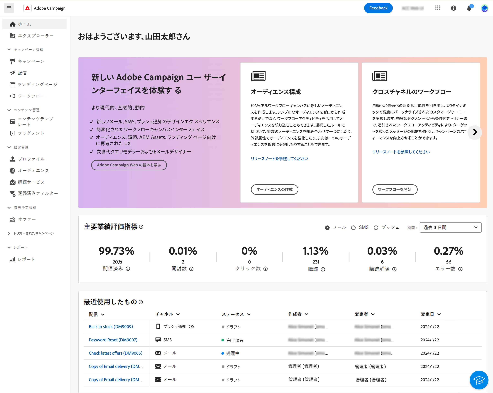

# インターフェイスを確認 {#user-interface}

>[!CONTEXTUALHELP]
>id="acw_homepage_learnmore"
>title="インターフェイスを確認"
>abstract="新しい Campaign v8 web インターフェイスは、直感的で一貫性のある統合されたユーザーエクスペリエンスを提供します。"

新しい Campaign v8 web インターフェイスは、マーケティングキャンペーンのデザインと配信を簡素化する、最新の直感的なユーザーエクスペリエンスを提供します。この新しいインターフェイスは、Adobe Experience Platform と統合されています。

>[!NOTE]
>
>このドキュメントは、製品のユーザーインターフェイスに対する最新の変更を反映するために頻繁に更新されています。ただし、一部のスクリーンショットは、お使いのユーザーインターフェイスと多少異なる場合があります。

## 左側のナビゲーションメニュー {#user-interface-left-nav}

左側のリンクを参照すると、Campaign v8 web 機能にアクセスできます。いくつかのリンクを選択すると、並べ替えやフィルタリングが可能なオブジェクトのリストが表示されます。また、必要なすべての情報を表示するように列を設定することもできます。[こちら](#list-screens)を参照してください。メール配信リストを除く、すべてのリスト画面は読み取り専用です。アルファバージョンでは、リスト項目をクリックして編集／表示することはできません。すべてのリストは、今後のバージョンで編集可能になります。左側のナビゲーションメニューに表示される項目は、ユーザー権限によって異なります。

### ホーム {#user-interface-home}

この画面には、主な Campaign v8 web 機能にすばやくアクセスするための主要なリンクやリソースが含まれています。

**最近使用したもの**&#x200B;リストには、最近作成および変更した配信へのショートカットが一覧表示されます。このリストには、チャネル、ステータス、所有者、作成日、変更日が表示されます。

The **主要業績評価指標** では、一般的な KPI を使用して、プラットフォームの有効性を確認できます。

ホームページの「**ラーニング**」セクションから、Campaign v8 web の主要ヘルプページにアクセスします。

### 主要業績評価指標 {#user-interface-key-indicators}

>[!CONTEXTUALHELP]
>id="acw_keyindicators_spam"
>title="スパム"
>abstract="スパム KPI"

ホームページを参照して、プラットフォームの主要業績評価指標を確認します。 これらの指標は、配信されたメッセージ、開封、クリック、購読解除およびエラー率を示します。

指標は、デフォルトで、過去 7 日間に送信された配信に対して計算されます。 期間は、カードの右上にあるドロップダウンリストから変更できます。 テストプロファイルに送信されるメッセージは除外されます。

表示するチャネルを選択できます。 デフォルトでは、これらの指標は E メールチャネルの指標を反映しています。

#### メッセージ配信済み {#ui-delivered-kpi}

>[!CONTEXTUALHELP]
>id="acw_keyindicators_delivered"
>title="配信済み"
>abstract="この指標は、選択したチャネルに関して、処理が成功したすべてのメッセージの合計と、送信されたメッセージの合計数に対する、成功と共に配信されたメッセージの割合を示します。"

The **配信済み** 指標には、チャネルごとに次の KPI が表示されます。

* 送信されるメッセージの合計数に対する、成功で配信されたメッセージ数の割合。

* 正常に処理されたすべてのメッセージの合計。

Adobe Campaignでは、メッセージを「配信済み」とマークするルールは次のとおりです。

「シードアドレス」フィールドが「いいえ」に等しく、ステータスが「サービスプロバイダーで受信済み」（SMS の場合）、「送信済み」（E メールの場合）、「モバイルで受信済み」（プッシュ通知の場合）に等しいメッセージの数。

#### 合計開封数 {#ui-open-kpi}

>[!CONTEXTUALHELP]
>id="acw_keyindicators_opens"
>title="開封数"
>abstract="この指標は、選択したチャネルに関し、開封されたすべてのメッセージの合計と、正常に配信されたメッセージの合計数に対する、開封されたメッセージの割合を示します。"

The **開封数** 指標には、チャネルごとに次の KPI が表示されます。

* 正常に配信されたメッセージの合計数に対する、開封されたメッセージ数の割合。

* チャネルごとに開封されたすべてのメッセージの合計。

Adobe Campaignは、受信者が電子メールに含まれる画像をダウンロードすると、メッセージが開くことを検出します。 HTML およびマルチパート／オルタナティブの E メールには 0 ピクセルの画像が含まれており、これによって開封されたメッセージを検出できるようになります。テキスト形式のメッセージは画像を含まないので、開封されたかどうかを検出することは不可能です。メッセージの開封数に基づいて計算される値は、画像表示にリンクされる誤差があるので、常に推定値です。

#### クリック率 {#ui-click-kpi}

>[!CONTEXTUALHELP]
>id="acw_keyindicators_clicks"
>title="クリック数"
>abstract="この指標は、選択したチャネルに関して、メッセージ内でクリックされたすべての URL の合計と、正常に配信されたメッセージの合計数に対するクリック率を示します。"

The **クリック数** 指標には、チャネルごとに次の KPI が表示されます。

* 正常に配信されたメッセージの合計数に対する、クリック数の割合。

* 配信で少なくとも 1 回クリックしたユニークユーザーの数。 購読解除リンクおよびミラーページへのリンクは除外されます。

この指標は、統合されたトラッキングテーブル (`nms:trackingStats`) をクリックします。 この集計テーブルは、受信者トラッキングログテーブル (`nms:trackingLogRcp`) と呼ばれ、リアルタイムでは計算されません。 テーブルは、トラッキングログを取得して数分後に生成されます。

#### 購読解除率 {#ui-unsub-kpi}

>[!CONTEXTUALHELP]
>id="acw_keyindicators_unsubscriptions"
>title="購読解除"
>abstract="この指標は、選択したチャネルに関して、サービスからのすべての購読解除の合計と、正常に配信されたメッセージの合計数に対する、購読解除の割合を表示します。"

The **購読解除** 指標には、チャネルごとに次の KPI が表示されます。

* 正常に配信されたメッセージの合計数に対する、購読解除数の割合。

* 購読解除リンクに対するすべてのクリックの合計（URL カテゴリが「オプトアウト」に等しい）。

#### エラー率 {#ui-error-kpi}

>[!CONTEXTUALHELP]
>id="acw_keyindicators_errors"
>title="エラー"
>abstract="配信と自動バウンス処理の間に累積したエラーの合計数。付随している率は、配信されるメッセージ数の割合です。"

The **エラー** 指標には、チャネルごとに次の KPI が表示されます。

* 配信されるメッセージの合計数に対する、エラー数の割合。

* 配信と自動リバウンド処理の間に累積したエラーの合計数。

### エクスプローラー {#user-interface-explorer}

>[!CONTEXTUALHELP]
>id="acw_explorer"
>title="エクスプローラー"
>abstract="**エクスプローラー**&#x200B;メニューには、クライアントコンソールのフォルダー階層と同じフォルダー階層を持つすべての Campaign コンポーネントとオブジェクトが表示されます。すべての Campaign v8 コンポーネント、フォルダーおよびスキーマを参照し、配信、ワークフローおよびキャンペーンを作成します。その他のリストはすべて読み取り専用です。"

**エクスプローラー**&#x200B;メニューには、クライアントコンソールのフォルダー階層と同じフォルダー階層を持つすべての Campaign リソースとオブジェクトが表示されます。すべての Campaign v8 コンポーネント、フォルダーおよびスキーマを参照し、配信、ワークフローおよびキャンペーンを作成します。その他のリストはすべて読み取り専用です。

エクスプローラーに表示される項目は、ユーザー権限によって異なります。

他のリスト画面と同様に、必要な情報をすべて表示するために、列を設定して表示をパーソナライズすることができます。[こちら](#list-screens)を参照してください。

Campaign エクスプローラー、フォルダー階層およびリソースについて詳しくは、この [Campaign v8（コンソール）ドキュメント](https://experienceleague.adobe.com/docs/campaign/campaign-v8/new/campaign-ui.html?lang=ja#ac-explorer-ui){target="_blank"}を参照してください。

### キャンペーン管理 {#user-interface-campaign-management}

>[!CONTEXTUALHELP]
>id="acw_campaigns_list"
>title="キャンペーン"
>abstract="これはキャンペーンのリストです。キャンペーンの開始日／終了日／最終変更日やステータスなどの有用な情報を確認できます。リストは、ステータスまたは開始日／終了日でフィルタリングできます。「キャンペーンを作成」ボタンをクリックして、新しいキャンペーンを追加します。キャンペーンを選択して、そのコンテンツ、配信および詳細を表示します。「テンプレート」タブを参照して、テンプレートを表示および作成します。"

「キャンペーン管理」セクションでは、マーケティングキャンペーン、配信およびワークフローにアクセスできます。

* **キャンペーン** - キャンペーンのリストとキャンペーンテンプレートです。デフォルトでは、各キャンペーンの開始日／終了日／作成日／最終変更日、現在のステータス、キャンペーンを作成した Campaign オペレーターの名前を表示できます。ステータス、開始日／終了日、フォルダーでリストをフィルタリングしたり、詳細フィルターを作成して独自のフィルタリング条件を定義したりできます。キャンケーンの詳細については、[この節](../campaigns/gs-campaigns.md)を参照してください。

* **配信** - 配信のリストを閲覧できます。デフォルトでは、配信の状態、最終変更日および主要 KPI を確認できます。リストは、ステータス、連絡日またはチャネルでフィルタリングできます。メール配信をクリックすると、その配信のダッシュボードが開くので、配信の詳細を大まかに確認できます。他のチャネルでの配信は読み取り専用です。配信について詳しくは、[この節](../msg/gs-messages.md)を参照してください。

  「**その他のアクション**」ボタンを使用すると、配信を削除または複製できます。

  {width="70%" align="left"}

* **ワークフロー** - この画面では、ワークフローとワークフローテンプレートの完全なリストにアクセスできます。ステータス、最後／次回の実行日を確認し、新しいワークフローまたは新しいワークフローテンプレートを作成できます。他のオブジェクトと同じ条件でリストをフィルタリングできます。さらに、キャンペーンに属するかどうかにかかわらず、ワークフローをフィルタリングできます。ワークフローについて詳しくは、[この節](../workflows/gs-workflows.md)を参照してください。

### 顧客管理 {#user-interface-customer-management}

>[!CONTEXTUALHELP]
>id="acw_recipients_list"
>title="受信者"
>abstract="受信者データベースにアクセスできます。メールアドレス、名、姓などの有用な情報を確認できます。このリストは読み取り専用です。"

>[!CONTEXTUALHELP]
>id="acw_audiences_list"
>title="オーディエンス"
>abstract="これはオーディエンスのリストです。オーディエンスのタイプ、接触チャネル、作成日／最終変更日およびラベルを確認できます。このリストは接触チャネルでフィルタリングできます。このリストは読み取り専用です。"

>[!CONTEXTUALHELP]
>id="acw_subscriptions_list"
>title="購読リスト"
>abstract="購読リストを閲覧できます。購読リストのタイプ、モードおよびラベルを確認できます。このリストは読み取り専用です。"

「顧客管理」セクションでは、受信者、オーディエンスおよび購読を表示できます。これらのリストは読み取り専用です。

* **受信者** - 受信者データベースにアクセスできます。デフォルトでは、メールアドレス、名前（名）および名前（姓）が表示されます。受信者について詳しくは、[Adobe Campaign v8（コンソール）ドキュメント](https://experienceleague.adobe.com/docs/campaign/campaign-v8/audience/gs-audiences.html?lang=ja){target="_blank"}を参照してください。
* **オーディエンス** - オーディエンスのリストです。デフォルトでは、オーディエンスのタイプ、接触チャネル、作成日／最終変更日およびラベルが表示されます。このリストは接触チャネルでフィルタリングできます。オーディエンスとリストについて詳しくは、[Adobe Campaign v8（コンソール）ドキュメント](https://experienceleague.adobe.com/docs/campaign/campaign-v8/audience/create-audiences/create-audiences.html?lang=ja){target="_blank"}を参照してください。
* **購読** - 購読リストを閲覧できます。デフォルトでは、購読リストのタイプ、モードおよびラベルが表示されます。購読と購読解除を管理する方法については、[Adobe Campaign v8（コンソール）ドキュメント](https://experienceleague.adobe.com/docs/campaign/campaign-v8/campaigns/send/subscriptions.html?lang=ja){target="_blank"}を参照してください。

### 意思決定管理

>[!CONTEXTUALHELP]
>id="acw_offers_list"
>title="オファー"
>abstract="インタラクションオファーのリストを閲覧できます。デフォルトでは、オファーのステータス、開始日／終了日および環境が表示されます。このリストは、ステータスや開始日／終了日でフィルタリングできます。オファーテンプレートも使用できます。これらのリストは読み取り専用です。"

* **オファー** - インタラクションオファーのリストを閲覧できます。デフォルトでは、オファーのステータス、開始日／終了日および環境が表示されます。このリストは、ステータスや開始日／終了日でフィルタリングできます。オファーテンプレートも使用できます。これらのリストは読み取り専用です。

オファーの管理を作成する方法については、[Adobe Campaign v8（コンソール）ドキュメント](https://experienceleague.adobe.com/docs/campaign/campaign-v8/offers/interaction.html?lang=ja){target="_blank"}を参照してください。

## 上部バー

インターフェイスの上部バーを使用して、次の操作を実行できます。

* アルファテスターとしてのフィードバックの共有
* 組織とインスタンス間の切り替え
* Adobe Experience Cloud アプリケーションの切り替え
* ヘルプページへのアクセス、サポートへの問い合わせ、フィードバックの共有検索フィールドからヘルプ記事およびビデオを検索できます。

{width="50%" align="left"}
<!--
Org / Sub-org switcher to switch between instances. Only one for Alpha. Later: intermerdiate screen with Control Panel (beta). if v8 + ACS with one card per ACS instance. Maybe quickly explain the menu for Alpha?
-->

## コンテキストヘルプ {#contextual-help}

コンテキストヘルプは、インターフェイスで利用できます。使用可能な場合は、「`?`」アイコンをクリックすると、ヘルプ情報や関連ドキュメントのリンクが表示されます。

{width="40%" align="left"}

<!--An on-boarding guide is also available to help you get started with Campaign v8 Web. Click the icon in the bottom right corner, choose one of the available step-by-step scenarios, and simply follow the instructions.

{width="70%" align="left"}-->

## サポートしているブラウザー {#browsers}

Campaign v8 Web は、最新バージョンの Google Chrome、Safari および Microsoft Edge で最適に動作するように設計されています。古いバージョンや他のブラウザーでは、特定の機能を使用する際に問題が発生する可能性があります。

## 言語環境設定 {#language-pref}

Campaign v8 Web は現在、次の言語で利用できます。

<table>
<tr>
<td>

英語（米国）- EN-US

フランス語 - FR

ドイツ語 - DE

イタリア語 - IT

</td>
<td>

スペイン語 - ES

ポルトガル語（ブラジル）- PTBR

日本語 - JP

</td>
<td>

韓国語 - KR

簡体字中国語 - CHS

繁体字中国語 - CHT

</td>
</tr>
</table>

デフォルトのインターフェイス言語は、ユーザープロファイルで指定された優先言語によって決まります。

言語を変更するには：

1. 右上のプロファイルアイコンをクリックし、 「**環境設定**」を選択します。
1. 次に、メールアドレスの下に表示されている言語リンクをクリックします。
1. 優先言語を選択し、「**保存**」をクリックします。使用しているコンポーネントが第一希望の言語にローカライズされていない場合に備えて、第二の言語を選択できます。

## 詳細情報 {#learn-more}

Campaign 環境で使用可能なリストを参照、検索、フィルタリングする方法については、[このページ](list-filters.md)を参照してください。

<!--
######## This part stores the contextualHelp definition for WebUI BETA ###########
######## These blocks should be dispatched in the appropriate pages when available ###########
######## PLEASE DO NOT DELETE ###########
REFER TO 
https://wiki.corp.adobe.com/pages/viewpage.action?spaceKey=neolane&title=v8+WebUI+Contextual+Help+%3CALPHA%3E-+Official+list
-->

>[!CONTEXTUALHELP]
>id="acw_targetdata_personalization_enrichmentdata"
>title="エンリッチメントデータ"
>abstract="未定"

>[!CONTEXTUALHELP]
>id="acw_campaign_reporting_sending"
>title="送信のレポート"
>abstract="キャンペーンレポートの送信指標を参照してください。"

>[!CONTEXTUALHELP]
>id="acw_campaign_reporting_tracking"
>title="追跡のレポート"
>abstract="キャンペーンレポートについては、トラッキング指標を参照してください。"

>[!CONTEXTUALHELP]
>id="acw_campaign_reporting_deliveries_overview"
>title="概要のレポート"
>abstract="配信の主要指標です。"

>[!CONTEXTUALHELP]
>id="acw_campaign_reporting_deliveries_target"
>title="ターゲット統計のレポート"
>abstract="このセクションには、オーディエンスに応じた特定の指標が表示されます。"

>[!CONTEXTUALHELP]
>id="acw_campaign_reporting_deliveries_selection"
>title="配信の集計レポート"
>abstract="集計データレポートを表示する配信を 2 つ以上選択します。"

>[!CONTEXTUALHELP]
>id="acw_orchestration_deduplication_fields"
>title="重複排除フィールド"
>abstract="未定"

>[!CONTEXTUALHELP]
>id="acw_orchestration_deduplication_settings"
>title="重複排除設定"
>abstract="未定"

>[!CONTEXTUALHELP]
>id="acw_orchestration_deduplication_complement"
>title="重複排除の補集合"
>abstract="未定"

>[!CONTEXTUALHELP]
>id="acw_orchestration_dimension_complement"
>title="ディメンションの補集合"
>abstract="未定"

>[!CONTEXTUALHELP]
>id="acw_push_permission_for_segment"
>title="権限が必要です"
>abstract="セグメントを作成するには、管理者から権限が付与されている必要があります。"

>[!CONTEXTUALHELP]
>id="acw_push_overview_edit"
>title="権限が必要です"
>abstract="セグメントを作成するには、管理者から権限が付与されている必要があります。"

>[!CONTEXTUALHELP]
>id="acw_campaign_read_only"
>title="このキャンペーンは読み取り専用です"
>abstract="このキャンペーンを編集する権限がありません。必要に応じて、管理者に連絡し、アクセス権の付与を依頼してください。"

>[!CONTEXTUALHELP]
>id="acw_deliveries_read_only"
>title="この配信は読み取り専用です"
>abstract="この配信を編集する権限がありません。必要に応じて、管理者に連絡し、アクセス権の付与を依頼してください。"

>[!CONTEXTUALHELP]
>id="acw_subscription_services_read_only"
>title="このサービスは読み取り専用です"
>abstract="このサービスを編集する権限がありません。必要に応じて、管理者に連絡し、アクセス権の付与を依頼してください。"

<!-- Workflows-->

>[!CONTEXTUALHELP]
>id="acw_campaign_creation_workflow"
>title="ワークフローリスト"
>abstract="キャンペーンで使用可能なワークフローのリストです。「ワークフローを作成」ボタンを使用して、キャンペーンにワークフローを追加します。"

>[!CONTEXTUALHELP]
>id="acw_orchestration_saveaudience_outbound"
>title="オーディエンス保存用のアウトバウンドトランジション"
>abstract="tbc"

>[!CONTEXTUALHELP]
>id="acw_orchestration_saveaudience_activity"
>title="オーディエンスの保存"
>abstract="このアクティビティを使用して、ワークフローオーディエンスを保存します。"

>[!CONTEXTUALHELP]
>id="acw_wf_read_only"
>title="このワークフローは読み取り専用です"
>abstract="このワークフローを編集する権限がありません。必要に応じて、管理者に連絡し、アクセス権の付与を依頼してください。"

>[!CONTEXTUALHELP]
>id="acw_wf_read_only_canvas"
>title="このワークフローは読み取り専用です"
>abstract="キャンバスがサポートされていないか、キャンバスに互換性がないので、このワークフローを編集できません。"

<!-- delivery template settings-->

>[!CONTEXTUALHELP]
>id="acw_delivery_template_settings_tracking_validity"
>title="有効期間"
>abstract="このオプションは、URL に対してトラッキングがアクティブになっている期間を定義します。"

>[!CONTEXTUALHELP]
>id="acw_delivery_template_settings_delivery_duration"
>title="配信期間"
>abstract="「配信期間」フィールドには、グローバルで行う配信再試行の期限を入力できます。Adobe Campaign は、開始日にメッセージの送信を開始した後、エラーのみを返すメッセージについて、設定された定期的な再試行を、有効期限日に達するまで実行します。"

>[!CONTEXTUALHELP]
>id="acw_delivery_template_settings_resources_validity"
>title="リソースの有効期間"
>abstract="「有効期限」フィールドは、ミラーページや画像などのアップロードされたリソースに使用されます。これらのリソースは限られた時間のみ有効です。制限に達すると、リソースは使用できなくなります。"

>[!CONTEXTUALHELP]
>id="acw_delivery_template_settings_approval"
>title="承認モード"
>abstract="様々なプロセスを完全に監視および制御するために、配信の各手順は承認の対象となることがあります。"

>[!CONTEXTUALHELP]
>id="acw_delivery_template_settings_retries"
>title="再試行の最大数"
>abstract="一時的なエラーが原因でメッセージ送信が失敗した場合は、配信期間が終了するまで再試行されます。"

>[!CONTEXTUALHELP]
>id="acw_delivery_template_settings_recipient_importance"
>title="受信者の重要度"
>abstract="受信者の重要度は、処理能力タイポロジルールを超過した場合に維持する受信者を決定するために使用される式です。"

>[!CONTEXTUALHELP]
>id="acw_delivery_template_settings_delivery_weight"
>title="配信の重み付け"
>abstract="配信に重みを付けることで、頻度管理のフレームワーク内で最も優先順位の高い配信を指定できます。最も大きな重みを付けられたメッセージが、最優先されます。"

>[!CONTEXTUALHELP]
>id="acw_delivery_template_settings_typology"
>title="タイポロジ"
>abstract="タイポロジでは、配信の送信を制御、フィルタリングおよび監視できます。"

>[!CONTEXTUALHELP]
>id="acw_reporting_email_exportation"
>title="輸出"
>abstract="選択したページのみを書き出すことができます。"

