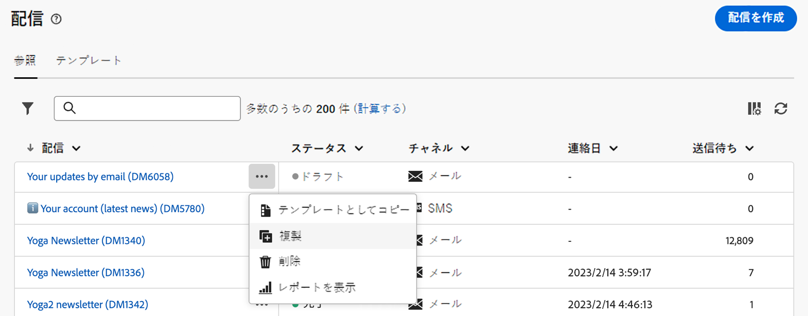
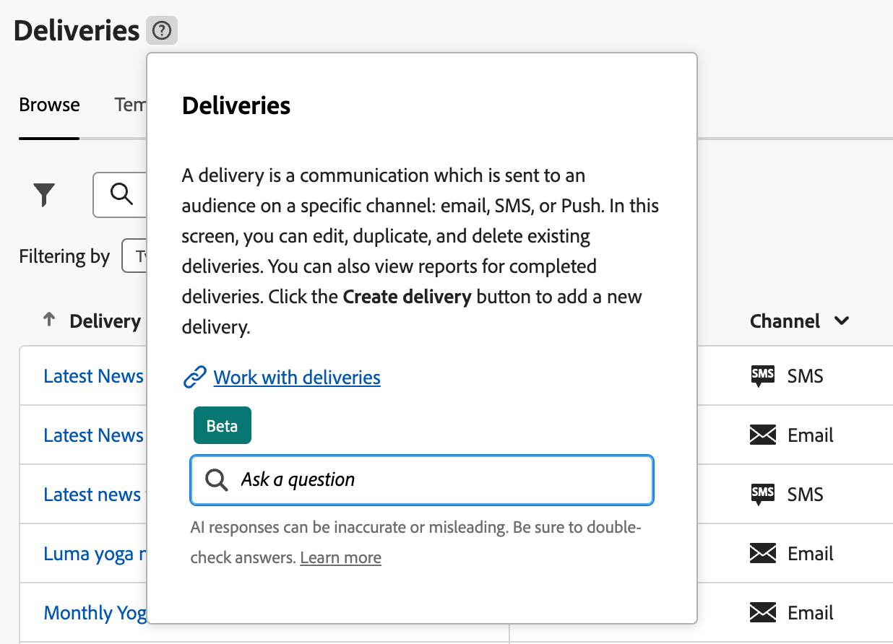

# インターフェイスの確認 {#user-interface}

新しい Adobe Campaign Web インターフェイスは、マーケティングキャンペーンのデザインと配信を簡素化する、最新の直感的なユーザーエクスペリエンスを提供します。この新しいインターフェイスは、Adobe Experience Cloud のアプリおよびソリューションと統合されています。

Adobe Campaign に接続する方法と、Experience Cloud ナビゲーションの基本については、[この記事](connect-to-campaign.md)を参照してください。

>[!NOTE]
>
>このドキュメントは、製品のユーザーインターフェイスに対する最新の変更を反映するために頻繁に更新されています。ただし、一部のスクリーンショットは、お使いのユーザーインターフェイスと多少異なる場合があります。

## Campaign ホームページ {#user-interface-home}

>[!CONTEXTUALHELP]
>id="acw_homepage_recent"
>title="最近使用したもの"
>abstract="**最近使用したもの**&#x200B;リストには、最近作成および変更した配信へのショートカットが一覧表示されます。このリストには、チャネル、ステータス、所有者、作成日、変更日が表示されます。"

Campaign ホームページでは、主要リソース、指標、コンポーネントをすばやく簡単に参照できます。

ホームページの上部セクションには、製品で使用可能な最新の更新と新機能の詳細が、リリースノートと詳細なドキュメントへのリンクと共に表示されます。機能カードをスクロールするには、左向き矢印を使用します。

{zoomable=&quot;yes&quot;}

**主要業績評価指標**&#x200B;では、一般的な KPI を通じてプラットフォームの有効性を確認できます。KPI について詳しくは、[このページ](../reporting/kpis.md)を参照してください。

**最近使用したもの**&#x200B;リストには、最近作成および変更した配信へのショートカットが一覧表示されます。このリストには、チャネル、ステータス、所有者、作成日、変更日が表示されます。さらに配信を読み込むには、**詳細を表示**&#x200B;リンクをクリックします。

また、ホームページの「**ラーニング**」セクションから、Adobe Campaign Web の主要ヘルプページにアクセスすることができます。

## 左側のナビゲーションメニュー {#user-interface-left-nav}

左側のリンクを参照すると、Adobe Campaign Web 機能にアクセスできます。いくつかのリンクを選択すると、並べ替えやフィルタリングが可能なオブジェクトのリストが表示されます。また、必要なすべての情報を表示するように列を設定することもできます。[こちら](#list-screens)を参照してください。一部のリスト画面は読み取り専用です。左側のナビゲーションメニューとリストに表示される項目は、ユーザーの権限によって異なります。権限について詳しくは、[この節](permissions.md)を参照してください。

### エクスプローラー {#user-interface-explorer}

>[!CONTEXTUALHELP]
>id="acw_explorer"
>title="エクスプローラー"
>abstract="**エクスプローラー**&#x200B;メニューには、クライアントコンソールのフォルダー階層と同じフォルダー階層を持つすべての Campaign コンポーネントとオブジェクトが表示されます。このメニューから、すべての Campaign v8 コンポーネント、フォルダーおよびスキーマを参照し、関連する権限を確認し、フォルダーとサブフォルダーを作成します。"

**エクスプローラー**&#x200B;メニューには、クライアントコンソールのフォルダー階層と同じフォルダー階層を持つすべての Campaign リソースとオブジェクトが表示されます。すべての Campaign v8 コンポーネント、フォルダーおよびスキーマを参照し、配信、ワークフローおよびキャンペーンを作成します。

**エクスプローラー**&#x200B;に表示される項目は、ユーザー権限によって異なります。また、適切な権限がある場合は、フォルダーやサブフォルダーを追加することもできます。権限について詳しくは、[この節](permissions.md)を参照してください。

必要な情報がすべて表示されるように、列を設定して表示をカスタマイズできます。[こちら](#list-screens)を参照してください。また、フォルダーやサブフォルダーを追加することもできます。詳しくは、[この節](permissions.md#folders)を参照してください。

Campaign エクスプローラー、フォルダー階層およびリソースについて詳しくは、この [Campaign v8（コンソール）ドキュメント](https://experienceleague.adobe.com/docs/campaign/campaign-v8/new/campaign-ui.html?lang=ja#ac-explorer-ui){target="_blank"}を参照してください。

### キャンペーン管理 {#user-interface-campaign-management}

「キャンペーン管理」セクションでは、マーケティングキャンペーン、配信およびワークフローにアクセスできます。

* **キャンペーン** - キャンペーンのリストとキャンペーンテンプレートです。デフォルトでは、各キャンペーンの開始日／終了日／作成日／最終変更日、現在のステータス、キャンペーンを作成した Campaign オペレーターの名前を表示できます。ステータス、開始日／終了日、フォルダーでリストをフィルタリングしたり、詳細フィルターを作成して独自のフィルタリング条件を定義したりできます。キャンケーンの詳細については、[この節](../campaigns/gs-campaigns.md)を参照してください。

* **配信** - 配信のリストを閲覧できます。デフォルトでは、配信の状態、最終変更日および主要 KPI を確認できます。リストは、ステータス、連絡日またはチャネルでフィルタリングできます。メール配信をクリックすると、その配信のダッシュボードが開くので、配信の詳細を大まかに確認できます。他のチャネルでの配信は読み取り専用です。配信について詳しくは、[この節](../msg/gs-messages.md)を参照してください。

  「**その他のアクション**」ボタンを使用すると、配信を削除または複製できます。

  {zoomable=&quot;yes&quot;}{width="70%" align="left"}

* **ワークフロー** - この画面では、ワークフローとワークフローテンプレートの完全なリストにアクセスできます。ステータス、最後／次回の実行日を確認し、新しいワークフローまたは新しいワークフローテンプレートを作成できます。他のオブジェクトと同じ条件でリストをフィルタリングできます。さらに、キャンペーンに属するかどうかにかかわらず、ワークフローをフィルタリングできます。ワークフローについて詳しくは、[この節](../workflows/gs-workflows.md)を参照してください。

### コンテンツ管理 {#user-interface-content-management}

「コンテンツ管理」セクションでは、コンテンツのテンプレートとフラグメントを表示できます。

* **コンテンツテンプレート** - 設計プロセスを加速し改善するために、スタンドアロンのテンプレートを作成すると、[!DNL Adobe Campaign] 全体でカスタムコンテンツを簡単に再利用できます。メールでのみ使用可能なこの機能により、コンテンツ指向のユーザーはスタンドアロンのテンプレートで操作でき、マーケティングユーザーは自分たちのメールキャンペーン内でテンプレートを再利用して適応させることができます。詳しくは、[こちら](../email/create-email-templates.md)を参照してください。

<!--
* **Fragments** -
-->

### 顧客管理 {#user-interface-customer-management}

「顧客管理」セクションでは、プロファイル、オーディエンスおよび購読を表示できます。これらのリストは読み取り専用です。

* **プロファイル** - プロファイルを作成および管理し、受信者データベースにアクセスします。 デフォルトでは、メールアドレス、名前（名）および名前（姓）が表示されます。プロファイルについて詳しくは、[この節](../audience/about-recipients.md)を参照してください。
* **オーディエンス** - オーディエンスのリストです。デフォルトでは、オーディエンスのタイプ、接触チャネル、作成日／最終変更日およびラベルが表示されます。このリストは接触チャネルでフィルタリングできます。オーディエンスとリストについて詳しくは、[この節](../audience/about-recipients.md)を参照してください。
* **購読サービス** - 購読リストを参照できます。デフォルトでは、購読リストのタイプ、モードおよびラベルが表示されます。購読と購読解除を管理する方法については、[Adobe Campaign v8（コンソール）ドキュメント](https://experienceleague.adobe.com/docs/campaign/campaign-v8/campaigns/send/subscriptions.html?lang=ja){target="_blank"}を参照してください。
* **定義済みフィルター** - 定義済みフィルターは、後で使用できるように作成および保存されるカスタムフィルターです。これらは、例えば、データのリストをフィルタリングしたり、配信のオーディエンスを作成したりする場合に、クエリモデラーでの任意のフィルタリング操作でショートカットとして使用できます。詳しくは、[このセクション](predefined-filters.md)を参照してください。

### 意思決定管理 {#decision-management}

>[!CONTEXTUALHELP]
>id="acw_offers_list"
>title="オファー"
>abstract="**インタラクション**&#x200B;モジュールを使用して、コンソールで作成されたオファーとオファーテンプレートのリストを参照します。これらのリストは読み取り専用です。"
>additional-url="https://experienceleague.adobe.com/docs/campaign-web/v8/msg/offers.html?lang=ja" text="配信へのオファーの追加"

「意思決定管理」セクションで、オファーとオファーテンプレートを表示できます。これらのリストは読み取り専用です。

* **オファー** - **インタラクション**&#x200B;モジュールを使用して、コンソールで作成されたオファーとオファーテンプレートのリストを参照します。デフォルトでは、オファーのステータス、開始日／終了日および環境が表示されます。このリストは、ステータスや開始日／終了日でフィルタリングできます。オファーテンプレートも使用できます。

メールと SMS でオファーを作成して送信する方法については、[この節](../msg/offers.md)を参照してください。

### レポート {#left-nav-reporting}

* **レポート** - **レポート**&#x200B;エントリでは、Campaign 環境内の各チャネルのトラフィックとエンゲージメント指標の統合された全体的な概要が提供されます。これらのレポートは様々なウィジェットで構成され、それぞれがキャンペーンや配信パフォーマンスに関する明確な観点を提供します。詳しくは、[こちら](../reporting/global-reports.md)を参照してください。

## コンテキストヘルプ {#user-interface-help}

コンテキストヘルプは、インターフェイスで利用できます。使用可能な場合は、「`?`」アイコンをクリックすると、ヘルプ情報や関連ドキュメントのリンクが表示されます。

{zoomable=&quot;yes&quot;}{width="40%" align="left"}

現在、新しい Campaign web ユーザーインターフェイス内のベータ版としてリリースされている、コンテキストヘルプに組み込まれた **AI を活用したナレッジアシスタント**&#x200B;は、膨大なドキュメントリポジトリを簡単に検索して、必要な正確な情報を即座に特定できるので、ドキュメントの検索と操作方法に関する質問への回答に大変革をもたらします。

Campaign 生成 AI の機能により、このアシスタントでユーザーのエクスペリエンスが変革され、情報の検索と問題解決を簡単に行うことができます。複雑なタスクでガイダンスを求めている場合でも、膨大なドキュメントから必要な情報を探している場合でも、AI を活用したアドビのナレッジアシスタントは究極のコンパニオンとなり、あらゆるインタラクションにおいて比類のない効率性と正確さを提供します。

詳しくは、[こちら](using-ai.md)を参照してください。

## 詳細情報 {#learn-more}

Campaign 環境で使用可能なリストを参照、検索、フィルタリングする方法については、[このページ](list-filters.md)を参照してください。

<!--
######## This part stores the contextualHelp definition for WebUI BETA ###########
######## These blocks should be dispatched in the appropriate pages when available ###########
######## PLEASE DO NOT DELETE ###########
REFER TO 
https://wiki.corp.adobe.com/pages/viewpage.action?spaceKey=neolane&title=v8+WebUI+Contextual+Help+%3CALPHA%3E-+Official+list
-->

>[!CONTEXTUALHELP]
>id="acw_push_permission_for_segment"
>title="権限が必要です"
>abstract="セグメントを作成するには、管理者から権限が付与されている必要があります。"

>[!CONTEXTUALHELP]
>id="acw_push_overview_edit"
>title="権限が必要です"
>abstract="セグメントを作成するには、管理者から権限が付与されている必要があります。"

<!-- delivery template settings-->

>[!CONTEXTUALHELP]
>id="acw_global_reporting_sending"
>title="グローバルレポートの送信"
>abstract="トラッキングレポート指標は、この画面に表示されます"

>[!CONTEXTUALHELP]
>id="acw_global_reporting_tracking"
>title="グローバルレポートのトラッキング"
>abstract="トラッキングレポート指標は、この画面に表示されます"

<!-- FOR BETA (alignment) -->
<!--https://wiki.corp.adobe.com/display/neolane/v8+WebUI+Contextual+Help+%3CBETA%3E-+Official+list-->

<!-- FOR GA -->
<!-- Aligned with https://wiki.corp.adobe.com/display/neolane/v8+WebUI+Contextual+Help+%3CGA%3E-+Official+list -->

>[!CONTEXTUALHELP]
>id="acw_recipients_creation_list"
>title="受信者の作成"
>abstract="受信者の作成"

>[!CONTEXTUALHELP]
>id="acw_recipients_creation_cardoverview"
>title="受信者のカードの概要"
>abstract="受信者のカードの概要"

>[!CONTEXTUALHELP]
>id="acw_recipients_creation_touchpoints"
>title="受信者のタッチポイント"
>abstract="受信者のタッチポイント"

>[!CONTEXTUALHELP]
>id="acw_recipients_subscription_selection"
>title="受信者の購読の選択"
>abstract="受信者の購読の選択"

>[!CONTEXTUALHELP]
>id="acw_recipients_offers_eligible_list"
>title="受信者の実施要件を満たすオファーのリスト"
>abstract="受信者の実施要件を満たすオファーのリスト"

>[!CONTEXTUALHELP]
>id="acw_recipients_offers_preview_proposition"
>title="受信者のオファーのプレビュー"
>abstract="受信者のオファーのプレビュー"

>[!CONTEXTUALHELP]
>id="acw_fragments_menu"
>title="フラグメント"
>abstract="フラグメント"

>[!CONTEXTUALHELP]
>id="acw_fragments_save"
>title="フラグメントの保存"
>abstract="フラグメントの保存"

>[!CONTEXTUALHELP]
>id="acw_fragments_create"
>title="フラグメントの作成"
>abstract="フラグメントの作成"

>[!CONTEXTUALHELP]
>id="acw_fragments_properties"
>title="フラグメントのプロパティ"
>abstract="フラグメントのプロパティ"

>[!CONTEXTUALHELP]
>id="acw_fragments_type"
>title="フラグメントの種類"
>abstract="フラグメントの種類"

>[!CONTEXTUALHELP]
>id="acw_fragments_list"
>title="フラグメントリスト"
>abstract="フラグメントリスト"

>[!CONTEXTUALHELP]
>id="acw_fragments_details"
>title="フラグメントの詳細"
>abstract="フラグメントの詳細"

>[!CONTEXTUALHELP]
>id="acw_conditionalcontent_savefilter"
>title="条件付きコンテンツ保存フィルター"
>abstract="条件付きコンテンツ保存フィルター"

>[!CONTEXTUALHELP]
>id="acw_conditionalcontent_selectfilter"
>title="条件付きコンテンツ選択フィルター"
>abstract="条件付きコンテンツ選択フィルター"

>[!CONTEXTUALHELP]
>id="acw_conditionalcontent_subjectline"
>title="件名行の条件付きコンテンツ"
>abstract="件名行の条件付きコンテンツ"

>[!CONTEXTUALHELP]
>id="acw_conditionalcontent_subjectlinecondition"
>title="条件付きコンテンツの件名条件"
>abstract="条件付きコンテンツの件名条件"

>[!CONTEXTUALHELP]
>id="acw_deliveries_simulate_testprofiles"
>title="テストプロファイルをシミュレート"
>abstract="テストプロファイルをシミュレート"

<!--ML: not visible in UI-->

>[!CONTEXTUALHELP]
>id="acw_deliveries_simulate_profiles_selection"
>title="テストプロファイルの選択をシミュレート"
>abstract="テストプロファイルの選択をシミュレート"

<!-- ML: beta wiki page - not visible in UI-->

>[!CONTEXTUALHELP]
>id="acw_deliveries_simulate_send_testprofiles"
>title="テストプロファイルの送信をシミュレート"
>abstract="テストプロファイルの送信をシミュレート"

<!-- ML: beta wiki page - not visible in UI-->

>[!CONTEXTUALHELP]
>id="acw_deliveries_simulate_email_log"
>title="メールログをシミュレート"
>abstract="メールログをシミュレート"

<!-- ML: beta wiki page - not visible in UI-->

<!-- FOR POST-GA -->

<!--
Deprecated IDs - to remove in GA: -->

>[!CONTEXTUALHELP]
>id="acw_attributepicker_advancedfields"
>title="詳細属性を表示"
>abstract="デフォルトでは、最も一般的な属性のみが属性リストに表示されます。ルールビルダーの左側のパレットにある現在のリストで使用可能なすべての属性（ノード、グループ、1-1 リンク、1-N リンクなど）を表示するには、「**詳細属性を表示**」切替スイッチをアクティブ化します。"

>[!CONTEXTUALHELP]
>id="acw_rulebuilder_advancedfields"
>title="ルールビルダーの詳細フィールド"
>abstract="デフォルトでは、最も一般的な属性のみが属性リストに表示されます。ルールビルダーの左側のパレットにある現在のリストで使用可能なすべての属性（ノード、グループ、1-1 リンク、1-N リンクなど）を表示するには、「**詳細属性を表示**」切替スイッチをアクティブ化します。"

>[!CONTEXTUALHELP]
>id="acw_rulebuilder_properties_advanced"
>title="ルールビルダーの詳細属性"
>abstract="デフォルトでは、最も一般的な属性のみが属性リストに表示されます。ルールビルダーの左側のパレットにある現在のリストで使用可能なすべての属性（ノード、グループ、1-1 リンク、1-N リンクなど）を表示するには、「**詳細属性を表示**」切替スイッチをアクティブ化します。"

>[!CONTEXTUALHELP]
>id="acw_contenttemplate_readonlymode"
>title="このテンプレートは読み取り専用です"
>abstract="このテンプレートを編集する権限がありません。 必要に応じて、管理者に連絡し、アクセス権の付与を依頼してください。"

<!-- Subscription activity-->

>[!CONTEXTUALHELP]
>id="acw_subscriptions_defaultlp"
>title="デフォルトのランディングページ"
>abstract="このサブスクリプションサービスに関連付けられているデフォルトのランディングページを選択します。"

>[!CONTEXTUALHELP]
>id="acw_orchestration_subscription"
>title="購読サービスアクティビティ"
>abstract="Adobe Campaign を使用すると、ニュースレターなどのサービスの作成と監視を行ったり、これらのサービスの購読または購読解除を確認したりできます。購読はメールおよび SMS 配信のみが対象となります。"

>[!CONTEXTUALHELP]
>id="acw_orchestration_subscription_general"
>title="購読サービスのパラメーター"
>abstract="購読サービスの設定を選択して確定します。"

>[!CONTEXTUALHELP]
>id="acw_orchestration_subscription_outboundtransition"
>title="購読サービスのアウトバウンドトランジション"
>abstract="切り替え **アウトバウンドトランジションを生成** 「 」オプションを使用して、「 」アクティビティの後にトランジションを追加します。"

<!--Update file-->

>[!CONTEXTUALHELP]
>id="acw_orchestration_updatedata"
>title="データを更新"
>abstract="**データを更新**&#x200B;アクティビティでは、データベースのフィールドを一括で更新します。"

>[!CONTEXTUALHELP]
>id="acw_orchestration_updatedata_operationtype"
>title="データの更新方法を選択"
>abstract="The **操作のタイプ** 「 」フィールドでは、データベース内のデータに対して実行するプロセスを選択できます。 データを追加または更新する最初のオプションを選択します（既に追加されている場合）。 また、データの追加、データの更新、データの削除のみを行うこともできます。 を選択します。 **コレクションの更新と結合** 重複をリンクするプライマリレコードを選択し、それらの重複を安全に削除します。"

>[!CONTEXTUALHELP]
>id="acw_orchestration_updatedata_recordid"
>title="レコード識別"
>abstract="データベース内のレコードを識別する方法を指定します。データが既存のターゲティングディメンションに関連する場合は、 **ターゲティングディメンションの使用** オプションを選択し、更新するターゲティングディメンションとフィールドを選択します。 または、1 つ以上のカスタムリンクを指定して、データベース内のデータを識別するか、紐付けキーを直接使用します。"

>[!CONTEXTUALHELP]
>id="acw_orchestration_updatedata_fieldsupdate"
>title="更新するフィールドを選択"
>abstract="更新および紐付け設定するフィールドを選択します。 以下を使用すると、 **自動マッピング** 更新するフィールドを自動的に識別するオプション。"

>[!CONTEXTUALHELP]
>id="acw_orchestration_updatedata_advancedoptions"
>title="データを更新するための高度なオプション"
>abstract="The **詳細オプション** 「 」セクションでは、データと重複を管理するための追加設定を指定できます。"

>[!CONTEXTUALHELP]
>id="acw_orchestration_updatedata_outboundtransition"
>title="アウトバウンドトランジションを生成"
>abstract="切り替え **アウトバウンドトランジションを生成** オプションを使用して、 **データを更新** アクティビティ。 通常は、更新によってターゲティングワークフローの終了が示されるので、このオプションはデフォルトでは有効化されません。"

>[!CONTEXTUALHELP]
>id="acw_orchestration_updatedata_outboundtransition_rejects"
>title="却下に対するアウトバウンドトランジションを生成します。"
>abstract="切り替え **却下に対するアウトバウンドトランジションを生成** 更新後に正しく処理されなかったレコードを含むアウトバウンドトランジションを追加するオプション（例：重複レコードがある場合）。 通常は、更新によってターゲティングワークフローの終了が示されるので、このオプションはデフォルトでは有効化されません。"

<!--External Signal End-->

>[!CONTEXTUALHELP]
>id="acw_orchestration_externalsignal"
>title="外部シグナル"
>abstract="The **外部シグナル** 「 」アクティビティを使用すると、トリガー内の一連のタスクを API または別のワークフローから実行できます。"

>[!CONTEXTUALHELP]
>id="acw_orchestration_externalsignal_parameters"
>title="外部信号パラメーター"
>abstract="外部信号パラメーター"

>[!CONTEXTUALHELP]
>id="acw_orchestration_end_trigger"
>title="トリガーの終了"
>abstract="トリガーの終了"

<!--JavaScript-->

>[!CONTEXTUALHELP]
>id="acw_orchestration_javascript"
>title="JavaScript コード"
>abstract="The **JavaScript コード** 「 」アクティビティは、ワークフローのコンテキスト内で JavaScript コードを実行します。"

>[!CONTEXTUALHELP]
>id="acw_orchestration_javascript_snippet"
>title="JavaScript スニペット"
>abstract="実行するコードを設定します。"
>additional-url="https://experienceleague.adobe.com/en/docs/campaign/campaign-v8/developer/api" text="詳しくは、 Campaign v8 （コンソール）ドキュメントを参照してください。"

>[!CONTEXTUALHELP]
>id="acw_orchestration_javascript_execution"
>title="JavaScript の実行"
>abstract="デフォルトでは、実行フェーズは 1 時間を超えることはできません。 この遅延の後、エラーメッセージが表示されてプロセスが中止され、アクティビティの実行が失敗します。 切り替え **次の時間後に実行を停止** オプションを使用してカスタムの遅延を定義します。 この制限を無視するには、値を 0 に設定します。"

>[!CONTEXTUALHELP]
>id="acw_orchestration_javascript_transition"
>title="エラーを処理"
>abstract="切り替え **エラーを処理** エラーを含むアウトバウンドトランジションを追加するオプション。"

<!--ExtractFile-->

>[!CONTEXTUALHELP]
>id="acw_orchestration_extractfile"
>title="ファイルを抽出"
>abstract="ファイルを抽出アクティビティ"

>[!CONTEXTUALHELP]
>id="acw_orchestration_extractfile_file"
>title="抽出するファイル"
>abstract="抽出するファイルを選択します。"

>[!CONTEXTUALHELP]
>id="acw_orchestration_extractfile_destinationformat"
>title="宛先のフォーマット"
>abstract="形式を選択します。"

>[!CONTEXTUALHELP]
>id="acw_orchestration_extractfile_postprocessing"
>title="後処理"
>abstract="後処理ステップの定義"

>[!CONTEXTUALHELP]
>id="acw_orchestration_extractfile_outbound"
>title="アウトバウンドトランジション"
>abstract="切り替え **アウトバウンドトランジションを生成** 現在のアクティビティの後にアウトバウンドトランジションを追加するオプション。"

>[!CONTEXTUALHELP]
>id="acw_orchestration_extractfile_error"
>title="エラーを処理"
>abstract="切り替え **エラーを処理** エラーを含むアウトバウンドトランジションを追加するオプション。"

<!-- Workflow settings -->

>[!CONTEXTUALHELP]
>id="acw_workflow_settings_initscript"
>title="初期化スクリプト"
>abstract="初期化スクリプト"

>[!CONTEXTUALHELP]
>id="acw_workflow_settings_execution_properties"
>title="実行プロパティ"
>abstract="実行プロパティ"

>[!CONTEXTUALHELP]
>id="acw_workflow_settings_execution_error"
>title="実行エラー"
>abstract="実行エラー"

>[!CONTEXTUALHELP]
>id="acw_workflow_settings_execution_initscript"
>title="実行初期化スクリプト"
>abstract="実行初期化スクリプト"
