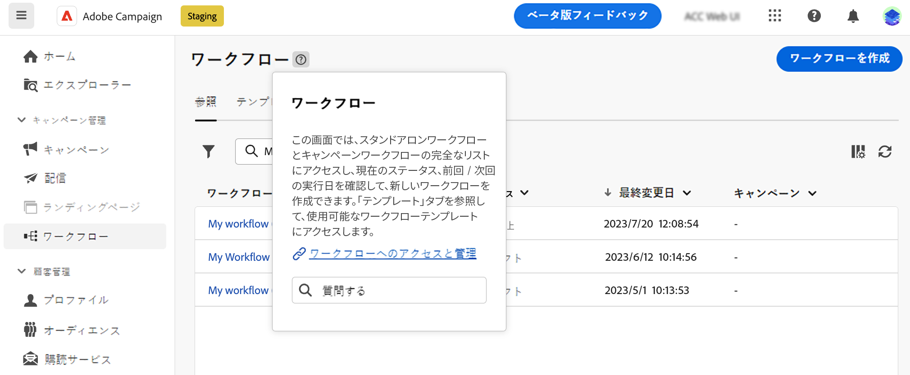

# AI を利用したナレッジアシスタントの使用 {#using-ai}

製品コンテキストヘルプボックスで AI を利用した Knowkedge Assistant を利用して、製品ドキュメントと現在の製品コンテキストに基づいて、AI で生成された迅速な回答を得ます。

>[!AVAILABILITY]
>
>この機能は、10 月初旬に提供される予定です。

The **Gen AI を備えた知識アシスタント** コンテキストヘルプ内に組み込まれ、膨大なドキュメントリポジトリを簡単に切り替え、必要な正確な情報を即座に特定し、ドキュメントの検索とハウツー質問への回答に革新的に対応します。

このアシスタントは、Campaign Gen AI の機能のおかげで、エクスペリエンスを変え、情報の取得や問題解決を簡単におこなえます。 複雑なタスクでのガイダンスを求める場合でも、広範なドキュメントをナビゲートする場合でも、Gen AI を備えた Knowledge Assistant は究極のコンパニオンであり、あらゆる操作で卓越した効率と正確性を提供します。

{width="70%" align="left"}

<!--
## Consent {#consent-ai}

Campaign knowledge assistant embeeded in the contextual help boxes uses AI. Your use of this capability constitutes consent that the information you provide in your session will be collected, used, disclosed, and retained by Adobe in accordance with the terms of Adobe's Customer Feedback Program. Please do not provide any personal information about yourself or other parties (including your name or contact information) in the knowledge assistant.

## Privacy {#privacy-ai}

Your data is encrypted and private following our standard data protection practices. Learn more about [Adobe Privacy Policies](https://www.adobe.com/privacy/policy.html){target="_blank"}.

The knowledge assistant AI capability does not use your data to train our models. We do not allow any partners or 3rd parties to use your data for training their models or any other purpose.

For information specific to Adobe AI policies in Experience Cloud apps and solutions, refer to [this page](https://business.adobe.com/products/sensei/adobe-sensei.html){target="_blank"}.
-->

## 回答 {#answers-ai}

回答は不正確になったり、誤解を招く可能性があります。 その結果、Adobeのナレッジアシスタントは誤った情報を出力する場合があります。 すべてのヘルプボックスでリンクされている製品ドキュメントを必ず確認してください。

人工知能と機械学習モデルが時間の経過と共に改善され、特定の使用例に対応できるようになります。 Campaign AI を利用したナレッジアシスタントは、今後数か月以内に改善を続けます。 ぜひご利用ください????ボタンを読むたびに、当社のエンジニアに対する不適切な応答にフラグを付けます。

## 推奨事項  {#recommendations-ai}

AI を利用したナレッジアシスタントで質問する場合、現在の製品コンテキスト（現在のキャンペーン画面や現在のヘルプボックスの内容）が考慮されます。

AI を利用したナレッジアシスタントを最大限に活用するには、次の点についてアドバイスします。

* できるだけ正確で具体的に記述し、曖昧さを避けます。 答えは、より正確で役に立つものになります。
* AI を利用したナレッジアシスタントが正しい情報を見つけるのを支援するには、できるだけ多くの詳細を学習しようとしています。
* より良い回答を得るために、質問を修正および調整します。 回答が正確でない場合や役に立たない場合は、別の方法を試し、より良い結果を得るためのコンテキストを追加してください。
* 中立的なトーンで適切な用語を使用します。
* 回答を評価し、フィードバックを提供して、エンジニアが経験から学び、結果を改善できるようにします。

